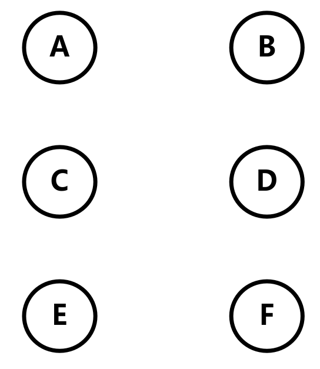
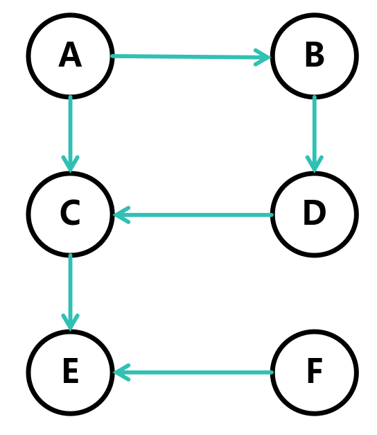
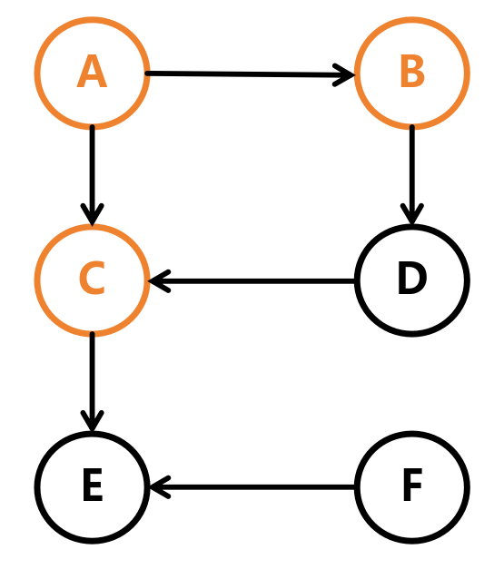
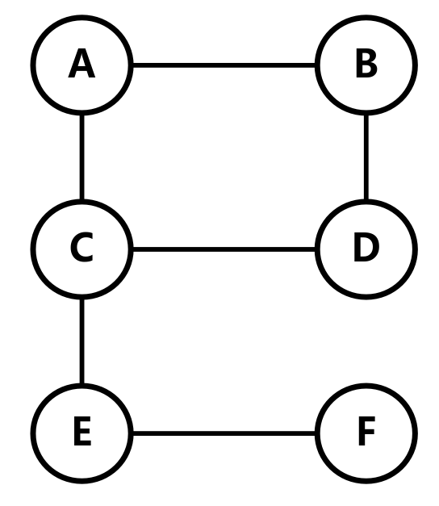
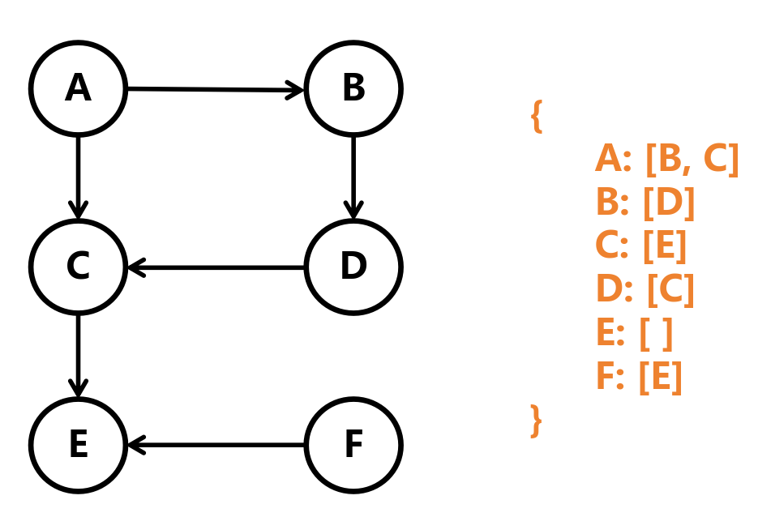
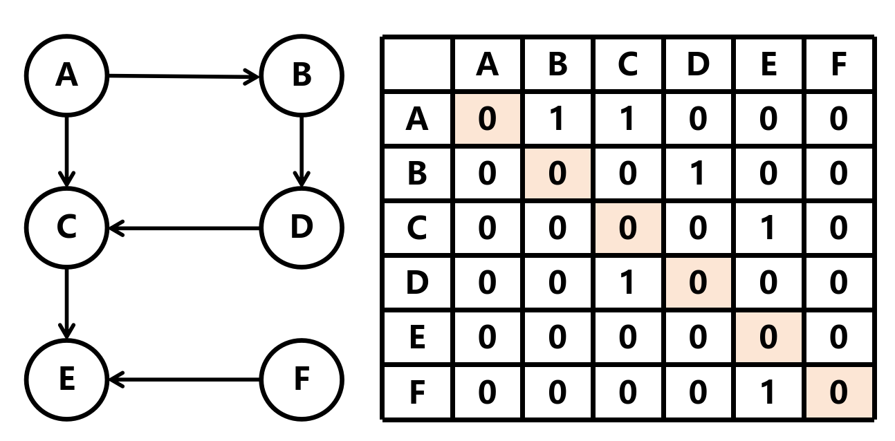

# 图

图是一种非线性数据结构，由节点和边组成

- 节点 (Node) —— 图中的基本单位，通常用圆圈表示

- 边 (Edge) —— 图中连接节点的线，表示节点之间的关系，通常用线表示

- 邻接 (Adjacency) —— 两个节点之间有边相连，就称它们是邻接的

## 图的分类

图有两种分类 —— 有向图和无向图

- 有向图 (Directed Graph) —— 边有方向，通常用箭头表示

- 无向图 (Undirected Graph) —— 边没有方向，通常用直线表示

两者的区别在于**有向图的边有方向，无向图的边没有方向**，这意味着在有向图中，从一个节点到另一个节点的边是**单向**的，而在无向图中，从一个节点到另一个节点的边是**双向**的

例如图中的 `B` 节点，在有向图中，只能向 `D` 节点走

而在无向图中，可以向 `D` 节点走，也可以向 `A` 节点走

## 图的表示

图的表示有两种方式 —— 邻接矩阵和邻接表

- 邻接表 (Adjacency List) —— 邻接表是一种数组，数组的每个元素是一个链表，链表的每个节点表示一个节点，节点的值表示节点的编号

例如图中的 `B` 节点，它的邻接表是 `[D]`，表示从 `B` 节点可以到达 `D` 节点

- 邻接矩阵 (Adjacency Matrix) —— 邻接矩阵是一个二维数组，数组的每个元素表示两个节点之间的关系，如果两个节点之间有边相连，那么数组的元素为 `1`，否则为 `0`
   - **如果是同个节点，那么此处的值为 `0`**

