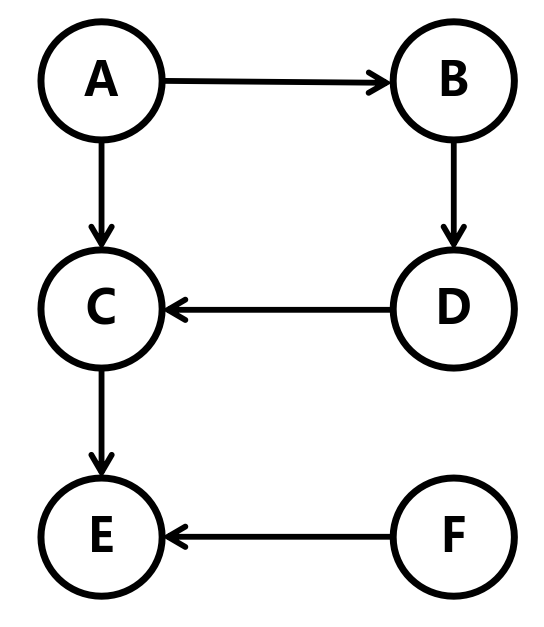
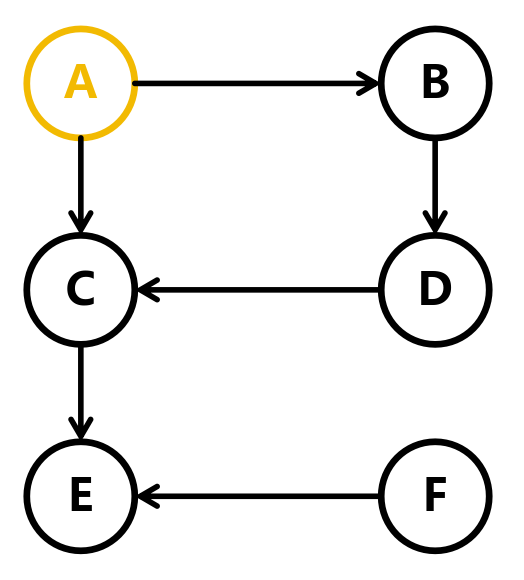
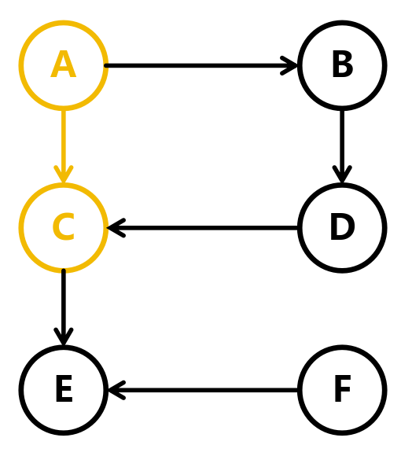
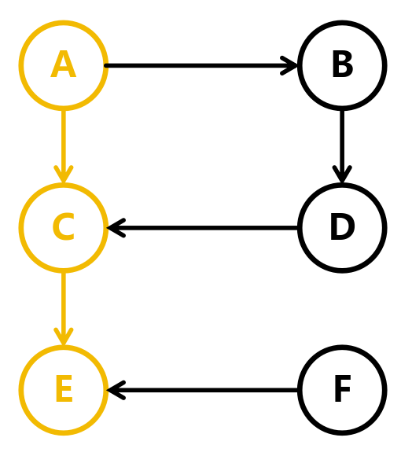
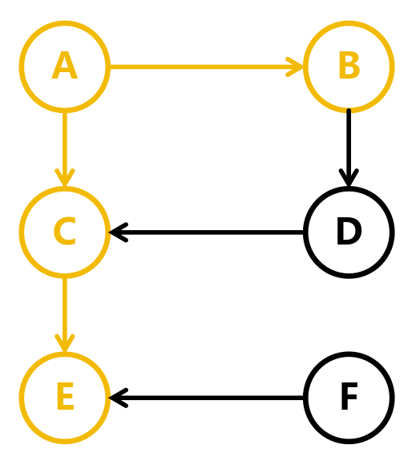
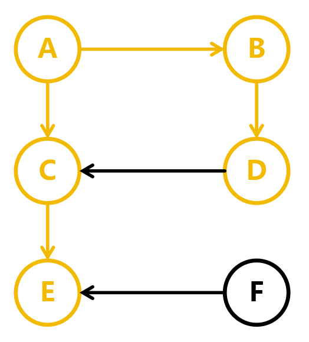

# 深度优先遍历

## 简介

深度优先遍历是一种用于遍历或搜索树或图的算法。在这个算法中，算法从一个根节点开始，然后探索尽可能深的分支，直到到达树的底部，然后回溯到上一个分支并继续探索。这个过程一直持续到遍历完整个树或图

## 步骤

以下面的图为例



由于图不存在根节点，所以我们可以从任何一个节点开始遍历。这里我们从节点 `A` 开始遍历



由于 `A` 有两个相邻的节点 `B` 和 `C`，这里我们选择 `C` 作为下一个节点



从 `C` 开始往下，直到不能再往后遍历



由于 `E` 没有相邻的节点，所以我们回到 `B` 节点



从 `B` 开始往下，直到不能再往后遍历



由于 `D`的相邻节点都已经被遍历过了，所以结束遍历

可以发现，`F` 节点并没有被遍历过，这是因为 `F` 节点是一个孤立的节点，没有相邻的节点

## 实现

由于每个节点都是先进后出，所以我们可以使用**栈**来实现深度优先遍历

```c
typedef struct Node {
    char data;
    struct Node *next;
} Node; // 使用领接表来表示图

void dfs(Node *root);
```

### 设置栈

```c
void dfs(Node *root)
{
    Node *stack[100]; // 栈
    int size = 0; // 栈的大小
}
```

### 将根节点入栈

将根节点入栈，用于后续的遍历

```c
void dfs(Node *root)
{
    Node *stack[100]; // 栈
    int size = 0; // 栈的大小

    stack[size++] = root; // 将根节点入栈
}
```

### 遍历

直到栈为空

```c
void dfs(Node *root)
{
    Node *stack[100]; // 栈
    int size = 0; // 栈的大小

    stack[size++] = root; // 将根节点入栈

    while (size > 0) {    } // 直到栈为空
}
```

### 取出栈顶元素

```c
void dfs(Node *root)
{
    Node *stack[100]; // 栈
    int size = 0; // 栈的大小

    stack[size++] = root; // 将根节点入栈

    while (size > 0) // 直到栈为空
    {
        Node *node = stack[--size]; // 取出栈顶元素
        printf("%c ", node->data); // 打印节点的数据
    }
    printf("\n");
}
```

### 遍历节点的相邻节点

这里要反转一下，因为栈是先进后出，所以我们需要将相邻节点入栈，这样才能保证先遍历到的节点先出栈

```c
void dfs(Node *root)
{
    Node *stack[100]; // 栈
    int size = 0; // 栈的大小

    stack[size++] = root; // 将根节点入栈

    while (size > 0) // 直到栈为空
    {
        Node *node = stack[--size]; // 取出栈顶元素
        printf("%c ", node->data); // 打印节点的数据

        Node *temp[100]; // 临时栈
        int count = 0; // 临时栈的大小

        for (Node *next = node->next; next!= NULL; next = next->next) // 遍历节点的相邻节点
        {
            temp[count++] = next; // 将相邻节点入栈
        }

        for (int i = count - 1; i >= 0; i--) // 反转临时栈
        {
            stack[size++] = temp[i];
        }
    }
    printf("\n");
}
```

### 去除重复的节点

可能会出现重复的节点，那可以使用标记来解决

```c
typedef struct Node {
    char data;
    struct Node *next;
    bool visited; // 是否被访问过
} Node; // 使用领接表来表示图
```

```c
void dfs(Node *root)
{
    Node *stack[100]; // 栈
    int size = 0; // 栈的大小

    stack[size++] = root; // 将根节点入栈

    while (size > 0) // 直到栈为空
    {
        Node *node = stack[--size]; // 取出栈顶元素

        if (node->visited) continue; // 如果已经被访问过，跳过
        node->visited = true; // 标记为已访问 

        printf("%c ", node->data); // 打印节点的数据

        Node *temp[100]; // 临时栈
        int count = 0; // 临时栈的大小

        for (Node *next = node->next; next!= NULL; next = next->next) // 遍历节点的相邻节点
        {
            temp[count++] = next; // 将相邻节点入栈
        }

        for (int i = count - 1; i >= 0; i--) // 反转临时栈
        {
            stack[size++] = temp[i];
        }
    }
    printf("\n");
}
```