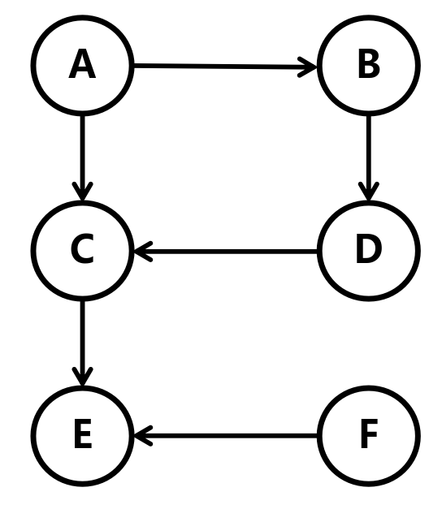

# 广度优先遍历

## 简介

广度优先遍历（Breadth-First Search，BFS）是一种图形遍历算法，用于在图或树中按照层次顺序访问节点。它从起始节点开始，逐层遍历，直到所有节点都被访问为止

## 算法步骤

以这个图为例



这里从 `A` 节点开始遍历


由于 `A` 节点的相邻节点是 `B` 和 `C`，所以依次遍历 `B` 和 `C`


由于 `B` 节点的相邻节点是 `D`, `C` 节点的相邻节点是 `E`，所以依次遍历 `D` 和 `E`


## 代码实现

由于每个节点的都是先进先出，所以这里使用队列来实现广度优先遍历

```c
typedef struct Edge { // 边
    int target; // 目标顶点索引
    struct Edge *next; // 下一个边
} Edge;

typedef struct Node { // 节点
    int data; // 节点的值
    bool visited; // 节点是否被访问过
    struct Edge *edges; // 节点的边
} Node;

void bfs(Node *root);
```

### 设置队列

```c
void bfs(Node *root)
{
    Node *queue[100]; // 队列
    int size = 0; // 队列的大小
}
```

### 将根节点入队

```c
void bfs(Node *root)
{
    Node *queue[100]; // 队列
    int size = 0; // 队列的大小

    queue[size++] = root; // 将根节点入队
}
```

### 遍历

直到队列为空

```c
void bfs(Node *root)
{
    Node *queue[100]; // 队列
    int size = 0; // 队列的大小

    queue[size++] = root; // 将根节点入队

    while (size > 0) {    } // 直到队列为空
}
```

### 取出队头元素

```c
void bfs(Node *root)
{
    Node *queue[100]; // 队列
    int size = 0; // 队列的大小

    queue[size++] = root; // 将根节点入队

    while (size > 0) // 直到队列为空
    {
        Node *node = queue[0]; // 取出队头元素
        size--; // 队列大小减一

        printf("%c ", node->data); // 打印节点的数据

        for (int i = 0; i < size; i++) queue[i] = queue[i + 1]; // 队列左移
    }
    printf("\n");
}
```

### 遍历节点的相邻节点

```c
void bfs(Node *root)
{
    Node *queue[100]; // 队列
    int size = 0; // 队列的大小

    queue[size++] = root; // 将根节点入队

    while (size > 0) // 直到队列为空
    {
        Node *node = queue[0]; // 取出队头元素
        size--; // 队列大小减一

        printf("%c ", node->data); // 打印节点的数据

        for (int i = 0; i < size; i++) queue[i] = queue[i + 1]; // 队列左移

        for (Edge *edge = node->edges; edge != NULL; edge = edge->next) // 遍历节点的相邻节点
        {
            Node *next = &graph[edge->target]; // 相邻节点
            queue[size++] = next; // 将相邻节点入队
        }
    }
    printf("\n");
}
```

### 去除重复的节点

可能会出现重复的节点，那可以使用标记来解决

```c
void bfs(Node *root)
{
    Node *queue[100]; // 队列
    int size = 0; // 队列的大小

    queue[size++] = root; // 将根节点入队

    while (size > 0) // 直到队列为空
    {
        Node *node = queue[0]; // 取出队头元素
        size--; // 队列大小减一

        printf("%c ", node->data); // 打印节点的数据

        for (int i = 0; i < size; i++) queue[i] = queue[i + 1]; // 队列左移

        for (Edge *edge = node->edges; edge != NULL; edge = edge->next) // 遍历节点的相邻节点
        {
            Node *target = &graph[edge->target]; // 相邻节点
            if (!target->visited) // 如果相邻节点没有被访问过
            {
                target->visited = true; // 标记相邻节点为已访问
                queue[size++] = target; // 将相邻节点入队
            }
        }
    }
    printf("\n");
}
```

## 优化

由于每次都需要将队列左移，所以可以使用两个指针来实现队列

```c
void bfs(Node *root)
{
    Node *queue[100]; // 队列
    int front = 0; // 队列的头
    int rear = 0; // 队列的尾

    queue[rear++] = root; // 将根节点入队

    while (rear > front) // 直到队列为空
    {
        Node *node = queue[front++]; // 取出队头元素

        printf("%c ", node->data); // 打印节点的数据

        for (Edge *edge = node->edges; edge != NULL; edge = edge->next) // 遍历节点的相邻节点
        {
            Node *target = &graph[edge->target]; // 相邻节点
            if (!target->visited) // 如果相邻节点没有被访问过
            {
                target->visited = true; // 标记相邻节点为已访问
                queue[rear++] = target; // 将相邻节点入队
            }
        }
    }
    printf("\n");
}
```