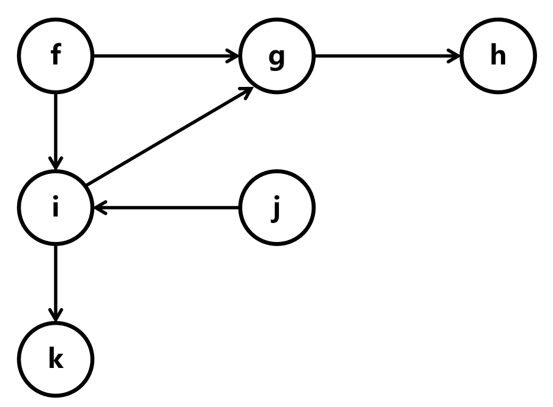
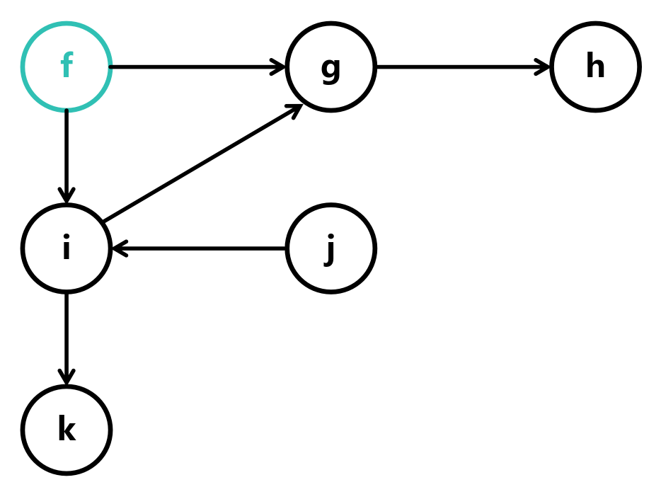
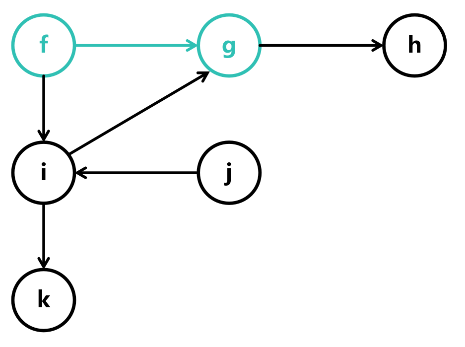
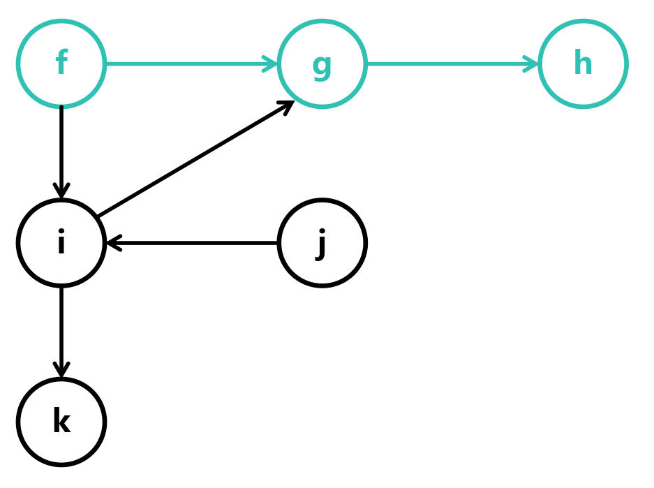
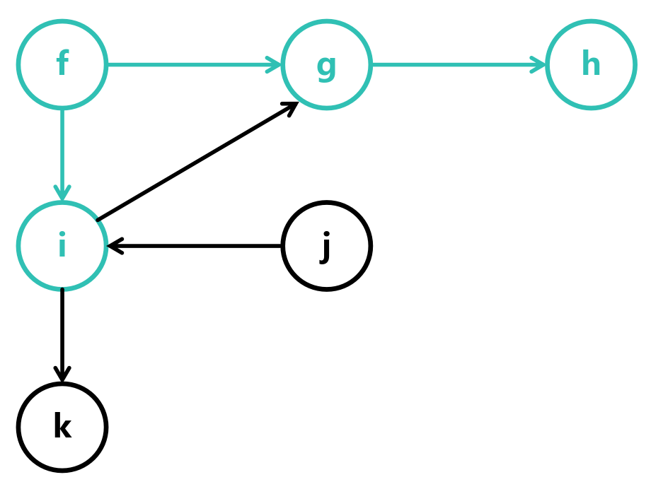
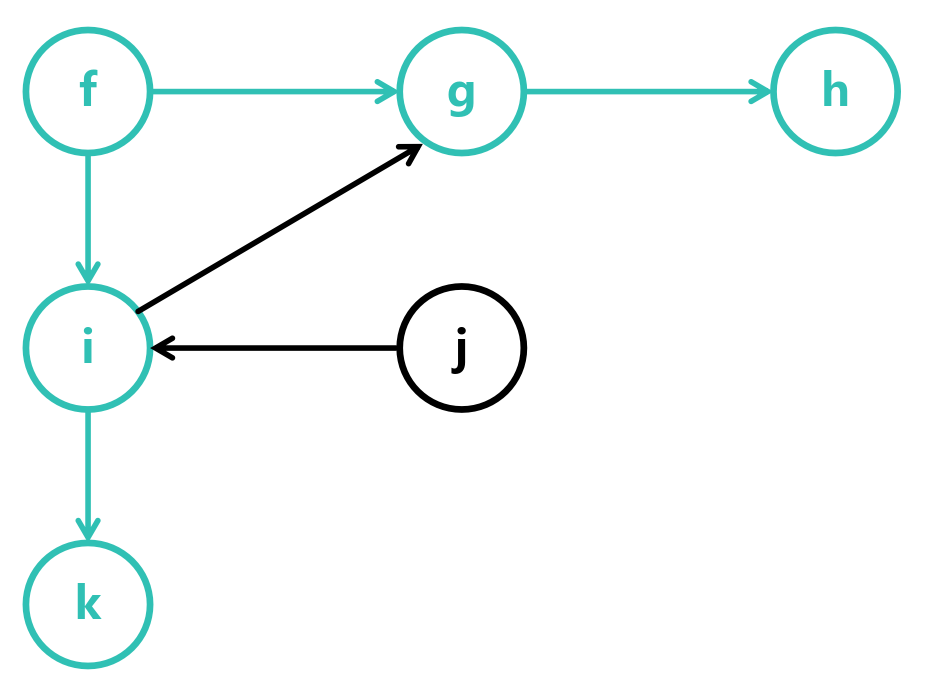

# 查找图中路径是否存在

## 题目描述

给定一个有向图，图中有 n 个节点，编号为 0 到 n-1，以及 m 条边，每条边都有一个起点和一个终点。请设计一个算法，判断给定的起点和终点是否存在一条路径

条件:

- 图中不存在环

## 算法步骤

假设现在有这样一个图

```
{
    f: [g, i],
    g: [h],
    h: [],
    i: [g, k],
    j: [i],
    k: [ ]
}
```



我们可以用深度优先搜索（DFS）或者广度优先搜索（BFS）来查找路径

**这里只展示DFS的算法步骤**

假设我们要查找 `f` 到 `k` 的路径是否存在

这里选择 `f` 作为起点



由于 `f` 到 `g` 存在一条路径，所以遍历到 `g`



由于 `g` 到 `h` 存在一条路径，所以遍历到 `h`



由于 `h` 之后没有节点，所以重新回到 `f`

由于 `f` 到 `i` 存在一条路径，所以遍历到 `i`



由于 `i` 到 `g` 存在一条路径，但 `g` 已经遍历过，所以跳过


由于 `i` 到 `k` 存在一条路径，所以遍历到 `k`



由于已经遍历到 `k`，所以路径存在，算法结束

## 实现

```c
typedef struct Edge {
    int target;
    struct Edge* next;
} Edge;

typedef struct Node {
    char data;
    bool visited;
    struct Edge *edges;
} Node;

bool has_path(Node *start, Node *end);
```

- `start` —— 起点
- `end` —— 终点

### 如果 `start` 到 `end` 相同

如果 `start` 到 `end` 相同，那么路径存在

```c
bool has_path(Node *start, Node *end)
{
    if (start == end) return true; // 相同节点
}
```

### 设置栈

设置一个栈，用于深度优先搜索

```c
bool has_path(Node *start, Node *end)
{
    if (start == end) return true; // 相同节点

    Node *stack[100]; // 栈
    int size = 0; // 栈大小
}
```

### 将 `start` 入栈

将 `start` 入栈，意味着我们从 `start` 开始搜索

```c
bool has_path(Node *start, Node *end)
{
    if (start == end) return true; // 相同节点

    Node *stack[100]; // 栈
    int size = 0; // 栈大小

    stack[size++] = start; // 将 start 入栈
}
```

### 遍历栈

遍历栈，直到栈为空

```c
bool has_path(Node *start, Node *end)
{
    if (start == end) return true; // 相同节点

    Node *stack[100]; // 栈
    int size = 0; // 栈大小

    stack[size++] = start; // 将 start 入栈

    while (size > 0) // 遍历栈
    {
        Node *node = stack[--size]; // 取出栈顶元素
    }
}
```

### 遍历节点的边

```c
bool has_path(Node *start, Node *end)
{
    if (start == end) return true; // 相同节点

    Node *stack[100]; // 栈
    int size = 0; // 栈大小

    stack[size++] = start; // 将 start 入栈

    while (size > 0) // 遍历栈
    {
        Node *node = stack[--size]; // 取出栈顶元素

        for (Edge *edge = node->edges; edge != NULL; edge = edge->next) // 遍历节点的边
        {
            Node *target = &start[edge->target]; // 目标节点
        }
    }
}
```

### 如果找到目标节点

如果找到目标节点，那么路径存在

```c
bool has_path(Node *start, Node *end)
{
    if (start == end) return true; // 相同节点

    Node *stack[100]; // 栈
    int size = 0; // 栈大小

    stack[size++] = start; // 将 start 入栈

    while (size > 0) // 遍历栈
    {
        Node *node = stack[--size]; // 取出栈顶元素

        for (Edge *edge = node->edges; edge != NULL; edge = edge->next) // 遍历节点的边
        {
            Node *target = &start[edge->target]; // 目标节点

            if (target == end) return true; // 找到目标节点
        }
    }
    return false; // 未找到目标节点
}
```

### 如果目标节点未被访问

如果目标节点未被访问，那么将其入栈

```c
bool has_path(Node *start, Node *end)
{
    if (start == end) return true; // 相同节点

    Node *stack[100]; // 栈
    int size = 0; // 栈大小

    stack[size++] = start; // 将 start 入栈

    while (size > 0) // 遍历栈
    {
        Node *node = stack[--size]; // 取出栈顶元素

        for (Edge *edge = node->edges; edge != NULL; edge = edge->next) // 遍历节点的边
        {
            Node *target = &start[edge->target]; // 目标节点

            if (target == end) return true; // 找到目标节点

            if (!target->visited) // 如果目标节点未被访问
            {
                target->visited = true; // 标记为已访问
                stack[size++] = target; // 将目标节点入栈
            }
        }
    }
    return false; // 未找到目标节点
}
```