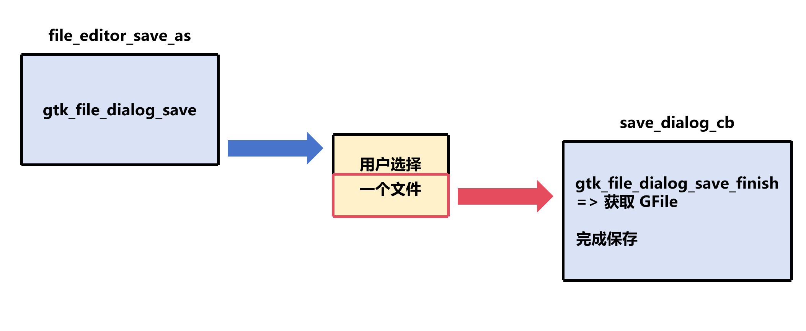

# 完善FileEditor类

此章将完善上一章的FileEditor类，使其具备基本的文件编辑功能

## 拆分 `FileEditor.h`

为了更好地管理代码，我们将 `FileEditor.h` 拆分为 `FileEditor.h` 和 `FileEditor.c` 两个文件

- `FileEditor.h` 包含 `FileEditor` 类声明，以及相关的回调函数声明
- `FileEditor.c` 包含 `FileEditor` 类实现，以及相关的回调函数实现

`FileEditor.h` 内容如下：

```c
// FileEditor.h

#ifndef FILE_EDITOR_H
#define FILE_EDITOR_H

#include <gtk/gtk.h>

G_BEGIN_DECLS

#define FILE_TYPE_EDITOR file_editor_get_type()

G_DECLARE_FINAL_TYPE(FileEditor, file_editor, FILE, EDITOR, GtkTextView)

enum ResponseType {
    RESPONSE_SUCCESS,
    RESPONSE_CANCEL,
    RESPONSE_ERROR
};

GFile *file_editor_get_file(FileEditor *self);

void file_editor_open(FileEditor *self, GtkWindows *window);

void file_editor_save(FileEditor *self);

void file_editor_save_as(FileEditor *self);

GtkWidget *file_editor_new_with_file(GFile *file);

GtkWidget *file_editor_new();

G_END_DECLS

#endif /* FILE_EDITOR_H */
```

- `file_editor_get_file` 函数用于获取当前编辑的文件
- `file_editor_open` 函数用于打开指定文件
- `file_editor_save` 函数用于保存当前文件
- `file_editor_save_as` 函数用于另存为新文件
- 这里有两个构造函数
    - `file_editor_new_with_file` 函数用于创建带有指定文件的 `FileEditor` 实例
    - `file_editor_new` 函数用于创建空白的 `FileEditor` 实例

## 实现 `FileEditor` 类

### 构造函数

```c
// FileEditor.c

GtkWidget *file_editor_new_with_file(GFile *file)
{
    g_return_val_if_fail(G_IS_FILE(file), NULL);

    GtkWidget *self;
    GtkTextBuffer *buffer;
    char *contents; // 文件内容
    gsize length; // 文件大小

    if (!g_file_load_contents(file, NULL, &contents, &length, NULL, NULL)) return NULL; // 读取文件内容，如果失败则返回 NULL

    self = file_editor_new(); // 创建 FileEditor 实例
    buffer = gtk_text_view_get_buffer(GTK_TEXT_VIEW(self)); // 获取 GtkTextBuffer 实例
    gtk_text_buffer_set_text(buffer, contents, length); // 设置 GtkTextBuffer 内容
    FILE_EDITOR(self)->file = g_file_dup(file); // 保存文件路径
    gtk_text_buffer_set_modified(buffer, FALSE); // 设置 GtkTextBuffer 修改状态为未修改
    g_free(contents); // 释放内存

    return self;
}
```

- `g_return_val_if_fail` 宏用于检查参数是否有效，如果无效则返回指定值
- `g_file_dup` 函数用于复制 GFile 实例
- `gtk_text_buffer_set_modified` 函数用于设置 GtkTextBuffer 修改状态，一般用于保存文件时判断是否需要保存

```c
// FileEditor.c

GtkWidget *file_editor_new()
{
    return GTK_WIDGET(g_object_new(FILE_TYPE_EDITOR, "wrap-mode", GTK_WRAP_WORD_CHAR, NULL));
}
```

- `g_object_new` 函数用于创建 `FileEditor` 实例
    - 参数包括类的类型、属性列表和 NULL (属性列表的结束标记)，`FileEditor` 的 `"wrap-mode"` 属性的默认值为 `GTK_WRAP_WORD_CHAR`

### 保存和另存为

#### `save_file` 函数

此函数用于保存当前文件

```c
// FileEditor.c

static gboolean save_file(GFile *file, GtkTextBuffer *buffer, GtkWindow *window)
{
    GtkTextIter start;
    GtkTextIter end;
    char *contents;
    gboolean result;
    GtkAlertDialog *dialog;
    GError *error = NULL;

    gtk_text_buffer_get_bounds(buffer, &start, &end); // 获取 GtkTextBuffer 内容的开始和结束位置
    contents = gtk_text_buffer_get_text(buffer, &start, &end, FALSE); // 获取 GtkTextBuffer 内容
    result = g_file_replace_contents(file, contents, strlen(contents), NULL, TRUE, G_FILE_CREATE_NONE, NULL, NULL, &error); // 保存文件内容

    if (result) gtk_text_buffer_set_modified(buffer, FALSE); // 设置 GtkTextBuffer 修改状态为未修改
    else
    {
        dialog = gtk_alert_dialog_new("%s", error->message);
        gtk_alert_dialog_show(dialog, window);
        g_object_unref(dialog);
        g_error_free(error);
    }
    g_free(contents);

    return result;
}
```

- `g_file_replace_contents` 函数用于保存文件内容，参数如下
   - `GFile *file`：要保存的文件
   - `const char *contents`：要保存的文件内容
   - `gsize length`：文件内容的长度
   - `const char *etag`：文件 ETag，用于版本控制，通常为 `NULL`
   - `gboolean make_backup`：是否创建备份，如果为 `FALSE` 则覆盖原文件，如果为 `TRUE` 则创建备份文件
   - `GFileCreateFlags flags`：文件创建标志，通常为 `G_FILE_CREATE_NONE`
   - `char **new_etag`：新文件的 ETag，用于版本控制，通常为 `NULL`
   - `GCancellable* cancellable`：可取消的操作，如果设置了此参数，则此操作可以被其他线程取消，通常为 `NULL`
   - `GError **error`：错误信息，如果发生错误，则设置此参数

- `gtk_alert_dialog_new` 函数用于创建警告对话框，参数为警告信息
- `gtk_alert_dialog_show` 函数用于显示警告对话框

#### `save_dialog_cb` 函数

此函数用于 `file_editor_save_as` 函数的回调函数。它会显示文件选择对话框，用户输入文件名，然后点击“保存”按钮，或者直接点击“取消”按钮。然后，回调函数会将结果返回

```c
static void save_dialog_cb(GObject *source_object, GAsyncResult *res, gpointer data)
{
    GtkFileDialog *dialog = GTK_FILE_DIALOG (source_object);
    FileEditor *self = FILE_EDITOR(data);
    GtkTextBuffer *buffer = gtk_text_view_get_buffer(GTK_TEXT_VIEW(self));
    GFile *file;
    GtkWidget*window = gtk_widget_get_ancestor(GTK_WIDGET(self), GTK_TYPE_WINDOW);
    GError *error = NULL;
    GtkAlertDialog *alert_dialog;

    if (((file = gtk_file_dialog_save_finish (dialog, res, &error)) != NULL) && save_file(file, buffer, GTK_WINDOW (window)))
    {
        if (!(G_IS_FILE(self->file) && g_file_equal(file, self->file)))
        {
            if (G_IS_FILE(self->file)) g_object_unref(self->file);

            self->file = file;
            g_signal_emit(self, signals[CHANGE_FILE], 0); // 上一章的自定义信号
        }
    }
    if (error)
    {
        alert_dialog = gtk_alert_dialog_new("%s", error->message);
        gtk_alert_dialog_show(alert_dialog, GTK_WINDOW(window));
        g_object_unref(alert_dialog);
        g_error_free(error);
    }
}
```

- `save_dialog_cb` 函数参数如下
   - `GObject *source_object`：启动操作的 `GObject` 实例。实际上，显示给用户的是 `GtkFileDialog` 实例。但是，回调函数定义为 `AsyncReadyCallback`，这是一个异步操作的通用回调函数。因此，其类型是 `GObject`，稍后您需要将其转换为 `GtkFileDialog`
        - 有关 `AsyncReadyCallback` 类型的详细信息，请参阅 [GTK4文档](https://docs.gtk.org/gio/callback.AsyncReadyCallback.html)
   - `GAsyncResult *res`：异步结果
   - `gpointer data`：`FileEditor` 实例

- `gtk_dialog_save_finish` 函数用于获取用户选择的文件，参数如下
   - `GtkFileDialog *dialog`：文件选择对话框
   - `GAsyncResult *res`：异步结果
   - `GError **error`：错误信息，如果发生错误，则设置此参数

#### `file_editor_save` 函数

此函数用于保存当前文件，如果文件不存在，调用 `file_editor_save_as` 函数

```c
// FileEditor.c

void file_editor_save(FileEditor *self)
{
    g_return_if_fail(FILE_EDITOR(self));

    GtkTextBuffer *buffer = gtk_text_view_get_buffer(GTK_TEXT_VIEW(self));
    GtkWidget *window = gtk_widget_get_ancestor(GTK_WIDGET(self), GTK_TYPE_WINDOW);

    if (!gtk_text_buffer_get_modified(buffer)) return; // 如果文件未修改，则直接返回
    else if (self->file == NULL) file_editor_save_as(self); // 如果文件不存在，则调用另存为
    else save_file(self->file, buffer, GTK_WINDOW(window)); // 保存文件
}
```

- `file_editor_save_as` 函数用于另存为新文件

#### `file_editor_save_as` 函数

此函数用于另存为新文件

```c
void file_editor_save_as(FileEditor *self)
{
    g_return_if_fail(FILE_EDITOR(self));

    GtkWidget *window = gtk_widget_get_ancestor(GTK_WIDGET(self), GTK_TYPE_WINDOW);
    GtkTextBuffer *buffer = gtk_text_view_get_buffer(GTK_TEXT_VIEW(self));
    GtkFileDialog *dialog = gtk_file_dialog_new();
    
    gtk_file_dialog_save(dialog, GTK_WINDOW(window), NULL, save_dialog_cb, self); // 显示文件选择对话框，并设置回调函数
}
```

- `gtk_file_dialog_new` 函数用于创建文件选择对话框
- `gtk_file_dialog_save` 函数用于显示文件选择对话框，参数如下
   - `GtkFileDialog *dialog`：文件选择对话框
   - `GtkWindow *parent`：父窗口
   - `GCancellable *cancellable`：可取消的操作，如果设置了此参数，则此操作可以被其他线程取消，通常为 `NULL`
   - `GAsyncReadyCallback callback`：回调函数，用于处理异步结果
   - `gpointer user_data`：用户数据，将作为回调函数的第二个参数

此函数**只显示文件选择对话框**，并不会实际保存文件，而是回调函数 `save_dialog_cb` 负责保存文件



### 打开文件

#### `open_dialog_cb` 函数

此函数用于 `file_editor_open` 函数的回调函数。它会显示文件选择对话框，用户选择或输入文件名，然后点击“打开”按钮，或者直接点击“取消”按钮。然后，回调函数会将结果返回

```c
static void open_dialog_cb(GObject *source_object, GAsyncResult *res, gpointer data)
{
    GtkFileDialog *dialog = GTK_FILE_DIALOG (source_object);
    FileEditor *self = FILE_EDITOR(data);
    GtkTextBuffer *buffer = gtk_text_view_get_buffer(GTK_TEXT_VIEW(self));
    GtkWidget *window = gtk_widget_get_ancestor(GTK_WIDGET(self), GTK_TYPE_WINDOW);
    GFile *file;
    char *contents;
    gsize length;
    gboolean is_file_changed;
    GtkAlertDialog *alert_dialog;
    GError *error = NULL;

    if ((file = gtk_file_dialog_open_finish (dialog, res, &error)) != NULL && g_file_load_contents(file, NULL, &contents, &length, NULL, &error))
    {
        gtk_text_buffer_set_text(buffer, contents, length); // 设置 GtkTextBuffer 内容
        g_free (contents);
        gtk_text_buffer_set_modified(buffer, FALSE); // 设置 GtkTextBuffer 修改状态为未修改
        is_file_changed = (G_IS_FILE(self->file) && g_file_equal(file, self->file)) ? FALSE : TRUE; // 判断文件是否改变
        if (G_IS_FILE(self->file)) g_object_unref(self->file); // 释放旧文件
        if (is_file_changed) g_signal_emit(self, signals[CHANGE_FILE], 0); // 上一章的自定义信号
    }
    else
    {
        if (error->code == GTK_DIALOG_ERROR_DISMISSED) // 用户点击取消按钮
        {
            g_signal_emit(self, signals[OPEN_RESPONSE], 0, RESPONSE_CANCEL); // 上一章的自定义信号
        }
        else
        {
            alert_dialog = gtk_alert_dialog_new("%s", error->message);
            gtk_alert_dialog_show(alert_dialog, GTK_WINDOW(window));
            g_object_unref(alert_dialog);
            g_signal_emit(self, signals[OPEN_RESPONSE], 0, RESPONSE_ERROR); // 上一章的自定义信号
        }
        g_clear_error(&error);
    }
}
```

- `GTK_DIALOG_ERROR_DISMISSED` 是一个 `GError` 代码，表示用户点击了“取消”按钮
- `gtk_file_dialog_open_finish` 函数用于获取用户选择的文件，如果成功，返回 `GFile` 实例，否则返回 `NULL`

#### `file_editor_open` 函数

此函数用于打开指定文件

```c
void file_editor_open(FileEditor *self, GtkWindow *window)
{
    g_return_if_fail(FILE_EDITOR(self));

    g_return_if_fail(GTK_IS_WINDOW(window) || window == NULL);
    
    GtkFileDialog *dialog = gtk_file_dialog_new();
    gtk_file_dialog_open(dialog, window, NULL, open_dialog_cb, self); // 显示文件选择对话框，并设置回调函数
    g_object_unref(dialog);
}
```

此函数与 `file_editor_save_as` 函数类似，只显示文件选择对话框，并使用回调函数 `open_dialog_cb`

### 获取 `GFile` 实例

只需要从 `FileEditor` 实例中获取 `GFile` 实例

```c
GFile *file_editor_get_file(FileEditor *self)
{
    g_return_val_if_fail(FILE_EDITOR(self), NULL);

    if (G_IS_FILE(self->file)) return g_file_dup(self->file);
    else return NULL;
}
```