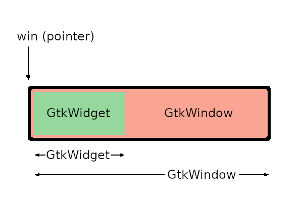
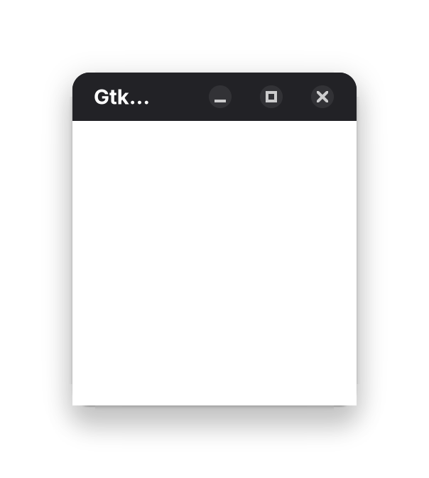
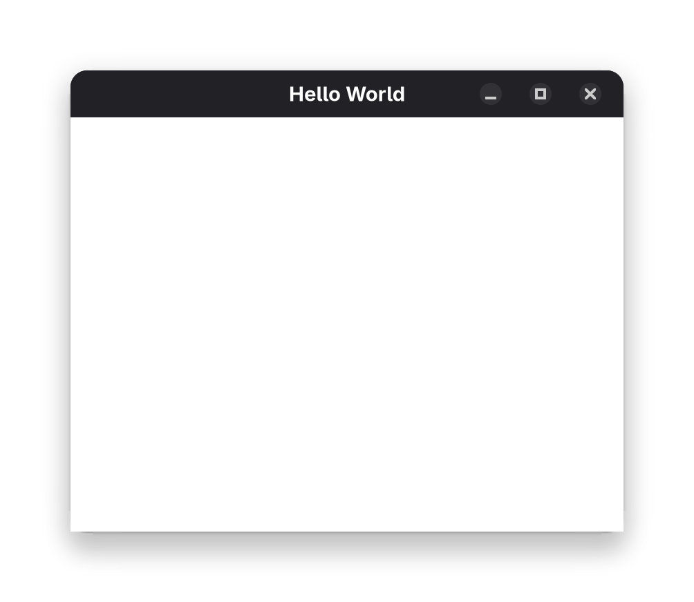

# GtkWindow

Gtk 是一个GUI 库，它提供了许多控件，包括窗口、按钮、标签、文本框等

现在我们要添加一个窗口，窗口的基本结构如下

1. 创建一个 GtkWindow 对象
2. 连接到 `GtkApplication` 对象，使窗口可以接收消息
3. 显示窗口

## 创建 GtkWindow

### 创建一个 GtkWindow 对象

- 使用 `GtkWidget` 作为父对象
- 使用 `gtk_window_new()` 函数创建窗口对象

```c
static void activate(GtkApplication* app, gpointer user_data) // 信号回调函数
{
    GtkWidget *window; // 窗口对象
    window = gtk_window_new(); // 创建窗口对象
}
```

函数 `gtk_window_new()` 定义如下

```c
GtkWidget* gtk_window_new(void);
```

这个函数的返回值**是 `GtkWidget`，不是 `GtkWindow`**，但是它确实**创建了一个 `GtkWindow`** 对象，这是因为 `GtkWindow` 是 `GtkWidget` 的子类

#### Widget

Widget 是 Gtk 库中一个抽象的概念，它**包含了所有GUI元素，包括窗口、按钮、标签、文本框等**

**GtkWidget 是所有 GUI 对象派生的基础对象**

```
parent <-----> child
GtkWidget -- GtkWindow
```
GtkWindow 在其对象的顶部包含 GtkWidget



### 连接到 GtkApplication 对象

- 使用 `gtk_window_set_application()` 函数连接到 `GtkApplication` 对象

```c
static void activate(GtkApplication* app, gpointer user_data) // 信号回调函数
{
    GtkWidget *window; // 窗口对象
    window = gtk_window_new(); // 创建窗口对象

    gtk_window_set_application(GTK_WINDOW(window), GTK_APPLICATION(app)); // 连接到 GtkApplication 对象
}
```

如果**要将 `window` 当成 `GtkWindow` 对象使用，则必须将其转换为 `GtkWindow` 对象**

虽说可以使用 `（GtkWindow *)window` 强制转换，但是不建议这么做，推荐使用 `GTK_WINDOW` 宏进行转换

`GtkApplication` 会持续运行，直到相关窗口被销毁。如果您没有关联 `GtkWindow` 和 `GtkApplication`，`GtkApplication` 会立即销毁自身。由于没有窗口连接到 `GtkApplication`，`GtkApplication` 无需等待任何时间。`GtkApplication` 销毁自身时，`GtkWindow` 也会被销毁

### 显示窗口

- 使用 `gtk_window_present()` 函数显示窗口

```c
static void activate(GtkApplication* app, gpointer user_data) // 信号回调函数
{
    GtkWidget *window; // 窗口对象
    window = gtk_window_new(); // 创建窗口对象
    
    gtk_window_set_application(GTK_WINDOW(window), GTK_APPLICATION(app)); // 连接到 GtkApplication 对象

    gtk_window_present(GTK_WINDOW(window)); // 显示窗口
}
```

GTK 4 将窗口小部件的默认可见性更改为开启，因此每个窗口小部件无需将其更改为开启。但是，有一个例外。顶层窗口 (Top Level Window) 在创建时是不可见的。因此，您需要使用上面的函数来显示该窗口

您可以使用 `gtk_widget_set_visible (win, true)` 代替 `gtk_window_present` 来显示窗口。但两者的行为不同

假设屏幕上有两个窗口 `win1` 和 `win2`，并且 `win1` 位于 `win2` 之后。这两个窗口都是可见的。函数 `gtk_widget_set_visible (win1, true)` 不执行任何操作，因为 `win1` 已经可见。因此，`win1` 仍然位于 `win2` 之后。另一个函数 `gtk_window_present (win1)` 将 `win1` 移动到窗口堆栈的顶部。因此，如果您想显示该窗口，应该使用 `gtk_window_present`

自 GTK 4.10 起，gtk_widget_show 和 gtk_widget_hide 这两个函数已弃用。您应该使用 gtk_widget_set_visible 代替

### 运行

```bash
gcc -o main main.c `pkg-config --cflags --libs gtk4`
./main
```



# GtkApplicationWindow

`GtkApplicationWindow` 是 `GtkWindow` 的子类，它提供了一些额外的功能，可以更好地与 GtkApplication 配合使用。**推荐使用 `GtkApplicationWindow` 作为应用程序的顶层窗口，而不是 `GtkWindow`**

## 创建 GtkApplicationWindow

### 创建一个 GtkApplicationWindow 对象

- 使用 `GtkWidget` 作为父对象
- 使用 `gtk_application_window_new()` 函数创建窗口对象

```c
static void activate(GtkApplication* app, gpointer user_data) // 信号回调函数
{
    GtkWidget *window; // 窗口对象
    window = gtk_application_window_new(GTK_APPLICATION(app)); // 创建窗口对象
}
```

当你使用 `GtkApplicationWindow` 时，你**必须给定一个 `GtkApplication` 对象**，以便它可以接收消息，并**自动连接这两个对象**，所以不再需要调用 `gtk_window_set_application()` 函数

### 显示窗口

`GtkApplicationWindow` 提供了一些额外的功能，例如修改标题、设置图标、设置默认尺寸、设置默认位置等。这些功能都可以通过 `GtkApplicationWindow` 的属性来设置

- 使用 `gtk_window_set_title()` 函数设置标题
- 使用 `gtk_window_set_default_size()` 函数设置默认尺寸
- ...

```c
static void activate(GtkApplication* app, gpointer user_data) // 信号回调函数
{
    GtkWidget *window; // 窗口对象
    window = gtk_application_window_new(GTK_APPLICATION(app)); // 创建窗口对象

    gtk_window_set_title(GTK_WINDOW(window), "Hello World"); // 设置标题
    gtk_window_set_default_size(GTK_WINDOW(window), 400, 300); // 设置默认尺寸

    gtk_window_present(GTK_WINDOW(window)); // 显示窗口
}
```

