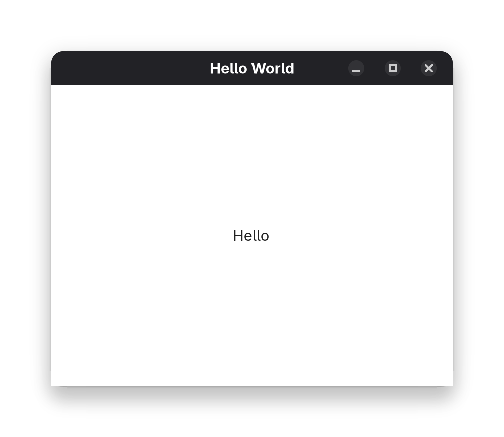
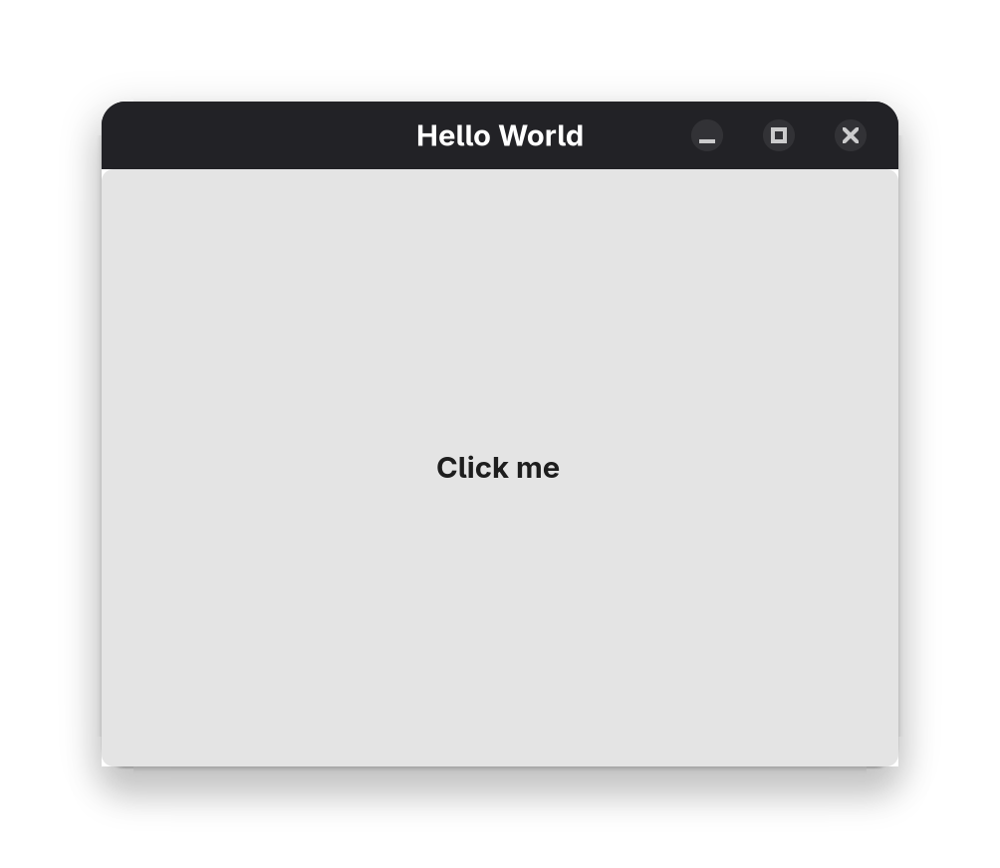
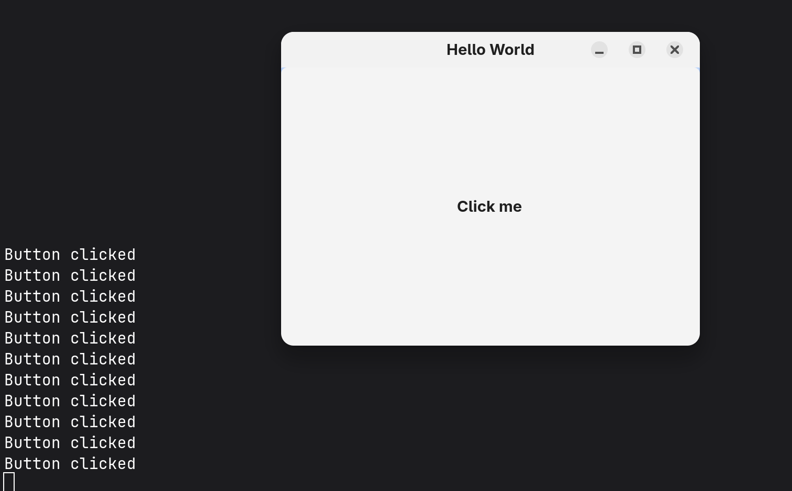
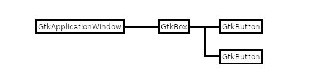
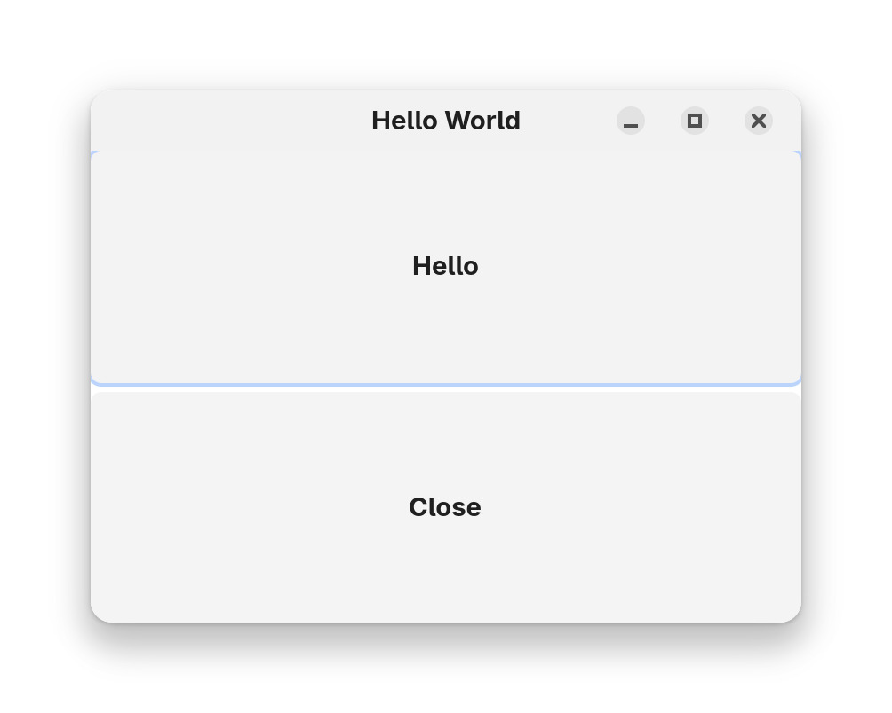

# Widgets-1

本章介绍 `GtkLabel`、`GtkButton` 和 `GtkBox` 基本的控件

# GtkLabel

`GtkLabel` 是一个在窗口中显示文本的控件

## 创建一个 GtkLabel

使用 `gtk_label_new()` 函数创建 `GtkLabel` 控件

```c
GtkWidget *label = gtk_label_new("Hello");
```

- `Hello` 是 `GtkLabel` 控件显示的文本

## 将GtkLabel合并到窗口中

使用 `gtk_window_set_child()` 函数将 `GtkLabel` 控件合并到窗口中

```c
GtkWidget *label = gtk_label_new("Hello");

gtk_window_set_child(GTK_WINDOW(window), label); // 将label控件合并到窗口中
```



函数 `gtk_window_set_child(GTK_WINDOW (window), label)` 将标签 `label` 设置为窗口 `window` 的子窗口部件

**注意: 子窗口部件不同于子对象。对象之间有父子关系，窗口部件之间也有父子关系。但这两种关系完全不同**。在程序 `Widget1.c` 中，`label` 是 `window` 的子窗口部件。**子窗口部件在屏幕上始终位于其父窗口部件中**。查看窗口在屏幕上的显示方式。应用程序窗口包含标签

窗口 `window` 没有任何父窗口。我们将这样的窗口称为顶级窗口。一个应用程序可以拥有多个顶级窗口

# GtkButton

`GtkButton` 是一个可以响应用户操作的控件

它会显示一个按钮，当用户点击该按钮时，会触发一个信号，我们可以连接到该信号，并在响应信号时执行一些操作

## 创建一个 GtkButton

使用 `gtk_button_new()` 函数创建 `GtkButton` 控件

```c
GtkWidget *button = gtk_button_new(); // 创建按钮对象
```

## 设置按钮的文本

使用 `gtk_button_new_with_label()` 函数设置按钮的文本

```c
GtkWidget *button = gtk_button_new_with_label("Click me"); // 设置按钮的文本
```

## 将 GtkButton 合并到窗口中

使用 `gtk_window_set_child()` 函数将 `GtkButton` 控件合并到窗口中

```c
GtkWidget *button = gtk_button_new_with_label("Click me");

gtk_window_set_child(GTK_WINDOW(window), button); // 将button控件合并到窗口中
```



但是，按钮并没有响应任何事件。我们需要连接信号，当用户点击按钮时，触发信号，并执行一些操作

## 连接信号

### 设计信号函数

我们需要定义一个信号函数，当按钮被点击时，该函数会被调用

这里以 `button_clicked()` 函数为例

```c
static void button_clicked(GtkButton *button)
{
    g_print("Button clicked\n");
}
```

- `button` 是 `GtkButton` 控件的实例
- `g_print()` 函数用于输出信息到控制台

### 连接信号

使用 `g_signal_connect()` 函数连接信号

```c
GtkWidget *button = gtk_button_new_with_label("Click me");

gtk_window_set_child(GTK_WINDOW(window), button); // 将button控件合并到窗口中

g_signal_connect(button, "clicked", G_CALLBACK(button_clicked), NULL); // 连接信号
```

- `clicked` 是 `GtkButton` 控件的 `clicked` 信号



首先，我们创建了一个按钮 `button`，并将其合并到窗口 `window` 中。然后，我们使用 `g_signal_connect()` 函数连接信号

但是使用 `g_print()` 太LOW了😄，我们需要在信号函数中执行其他操作，例如关闭窗口

```c
static void button_clicked(GtkButton *button, GtkWindow *window)
{
    gtk_widget_destroy(GTK_WIDGET(window)); // 关闭窗口
}
```

```c
static void activate(GtkApplication* app, gpointer user_data)
{
    ...
    g_signal_connect(button, "clicked", G_CALLBACK(button_clicked), window); // 连接信号
}
```

可以看到，`g_signal_connect()` 函数的最后一个参数是 `window`，而不是 `NULL`。因为这个参数表示的是“传递给处理程序的数据”，在这里就是窗口对象。当按钮被点击时，`button_clicked()` 函数会被调用，并传入 `window` 对象作为参数

# GtkBox

`GtkWindow` 和 `GtkApplicationWindow` 都只允许一个子窗口部件，如果想添加多个子窗口部件，就需要使用**容器控件**

`GtkBox` 是其中之一，它可以用来将多个子窗口部件排列在一起

下面的过程显示了在窗口中添加两个按钮的方法

- 创建 `GtkApplicationWindow` 对象
- 创建 `GtkBox` 对象
- 将 `GtkBox` 对象添加到 `GtkApplicationWindow` 对象中
- 创建两个 `GtkButton` 对象
- 将两个 `GtkButton` 对象添加到 `GtkBox` 对象中




## 创建 GtkBox

使用 `gtk_box_new()` 函数创建 `GtkBox` 控件

```c
GtkWidget *box = gtk_box_new(GTK_ORIENTATION_VERTICAL, 5); // 创建垂直方向的 GtkBox
gtk_box_set_homogeneous(GTK_BOX(box), TRUE); // 设置 GtkBox 控件的子控件是否等宽
```

- `GTK_ORIENTATION_VERTICAL` 表示 `GtkBox` 控件是垂直方向的
   - `GTK_ORIENTATION_HORIZONTAL` 表示 `GtkBox` 控件是水平方向的

- `5` 表示 `GtkBox` 控件之间的间距，单位为像素

## 将 GtkBox 合并到窗口中

使用 `gtk_window_set_child()` 函数将 `GtkBox` 控件合并到窗口中

```c
GtkWidget *box = gtk_box_new(GTK_ORIENTATION_VERTICAL, 5); // 创建垂直方向的 GtkBox
gtk_box_set_homogeneous(GTK_BOX(box), TRUE); // 设置 GtkBox 控件的子控件是否等宽

gtk_window_set_child(GTK_WINDOW(window), box); // 将box控件合并到窗口中
```

## 创建 GtkButton

使用 `gtk_button_new_with_label()` 函数创建两个 `GtkButton` 控件

```c
GtkWidget *button1 = gtk_button_new_with_label("Hello");
GtkWidget *button2 = gtk_button_new_with_label("Close");
```


### 设置属性

```c
static void clicked_button1(GtkButton *button)
{
    const char *s;
    s = gtk_button_get_label(button);
    
    if (strcmp(s, "Hello") == 0)
    {
        gtk_button_set_label(button, "Goodbye");
    }
    else
    {
        gtk_button_set_label(button, "Hello");
    }
}

static void clicked_button2(GtkButton *button, GtkWindow *window)
{
    gtk_window_destroy(GTK_WINDOW(window)); // 关闭窗口
}
```

```c
g_signal_connect(button1, "clicked", G_CALLBACK(clicked_button1), NULL); // 连接信号
g_signal_connect(button2, "clicked", G_CALLBACK(clicked_button2), window); // 连接信号
```

## 将 GtkButton 添加到 GtkBox

使用 `gtk_box_append()` 函数将 `GtkButton` 控件添加到 `GtkBox` 控件中

```c
gtk_box_append(GTK_BOX(box), button1); // 将button1添加到box中
gtk_box_append(GTK_BOX(box), button2); // 将button2添加到box中
```

