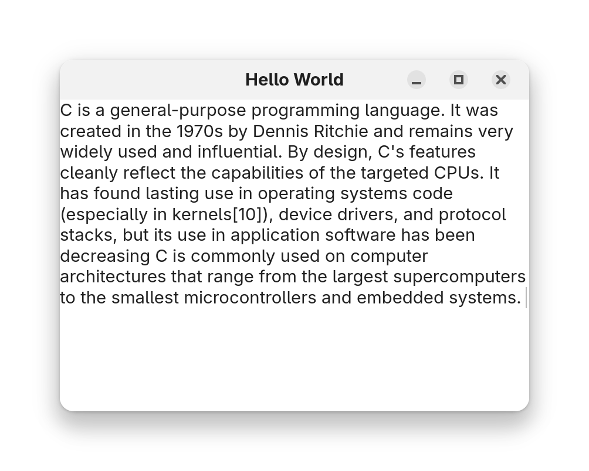

# Widgets-2

本章介绍 `GtkTextView`、`GtkTextBuffer` 和 `GtkScrolledWindow` 等控件的用法

# GtkTextView 和 GtkTextBuffer

`GtkTextView` 是一个多行文本编辑器，可以用来显示和编辑多行文本

`GtkTextBuffer` 是一个文本缓冲区，用来存储和管理文本，并提供对文本的各种操作，比如插入、删除、查找等

## 创建 GtkTextView 和 GtkTextBuffer

```c
GtkWidget *text_view = gtk_text_view_new();
GtkTextBuffer *buffer = gtk_text_view_get_buffer(GTK_TEXT_VIEW(text_view));
```

可以看到，当 `GtkTextView` 被创建时，它会自动创建一个 `GtkTextBuffer` 并与之绑定

## 设置要编辑的文本内容

使用 `gtk_text_buffer_set_text()` 可以设置 `GtkTextBuffer` 的文本内容

```c
gchar *text = "C is a general-purpose programming language. It was created in the 1970s by Dennis Ritchie and remains very widely used and influential. By design, C's features cleanly reflect the capabilities of the targeted CPUs. It has found lasting use in operating systems code (especially in kernels[10]), device drivers, and protocol stacks, but its use in application software has been decreasing C is commonly used on computer architectures that range from the largest supercomputers to the smallest microcontrollers and embedded systems. ";
```

```c
gtk_text_buffer_set_text(buffer, text, -1); // 设置文本内容
gtk_text_view_set_wrap_mode(GTK_TEXT_VIEW(text_view), GTK_WRAP_WORD); // 设置换行模式
```

- `gtk_text_buffer_set_text()` 是用来设置 `GtkTextBuffer` 的文本内容的函数
    - 第一个参数是 `GtkTextBuffer` 指针
    - 第二个参数是要设置的文本内容
    - 第三个参数是文本长度，如果是 -1，则表示文本长度是由第二个参数的长度决定
    
- `gtk_text_view_set_wrap_mode()` 是用来设置 `GtkTextView` 的换行模式的函数
    - 第一个参数是 `GtkTextView` 指针
    - 第二个参数是 `GtkWrapMode` 类型，可以是 `GTK_WRAP_NONE`、`GTK_WRAP_CHAR`、`GTK_WRAP_WORD`、`GTK_WRAP_WORD_CHAR` 中的一个，详情请参考[官方文档](https://docs.gtk.org/gtk4/enum.WrapMode.html)
       - `GTK_WRAP_NONE` 表示不换行
       - `GTK_WRAP_CHAR` 表示按字符换行
       - `GTK_WRAP_WORD` 表示按单词换行
       - `GTK_WRAP_WORD_CHAR` 表示按单词或字符换行


## 运行



这时也可以修改文本内容，并看到 `GtkTextView` 自动更新显示


但是此时有个问题，如果文本内容过长，`GtkTextView` 可能会自动改变窗口大小，也可能无法显示全部内容


这时需要使用 `GtkScrolledWindow` 来实现滚动显示

# GtkScrolledWindow

`GtkScrolledWindow` 是一个滚动窗口，可以用来实现 `GtkTextView` 等控件的滚动显示

## 创建 GtkScrolledWindow

```c
GtkWidget *scrolled_window = gtk_scrolled_window_new(); // 创建 GtkScrolledWindow 实例
gtk_window_set_child(GTK_WINDOW(window), scrolled_window); // 设置窗口的子控件
```

## 将 GtkTextView 添加到 GtkScrolledWindow

使用 `gtk_scrolled_window_set_child()` 可以将 `GtkTextView` 添加到 `GtkScrolledWindow`

```c
gtk_scrolled_window_set_child(GTK_SCROLLED_WINDOW(scrolled_window), text_view); // 将 GtkTextView 添加到 GtkScrolledWindow
```

## 运行

此时 `GtkTextView` 就可以实现滚动显示了


