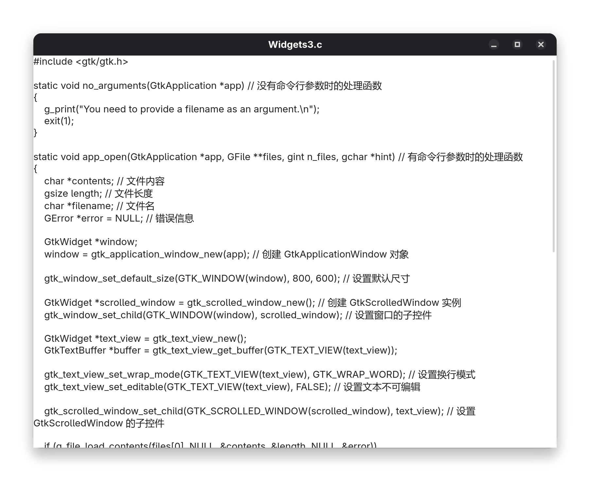
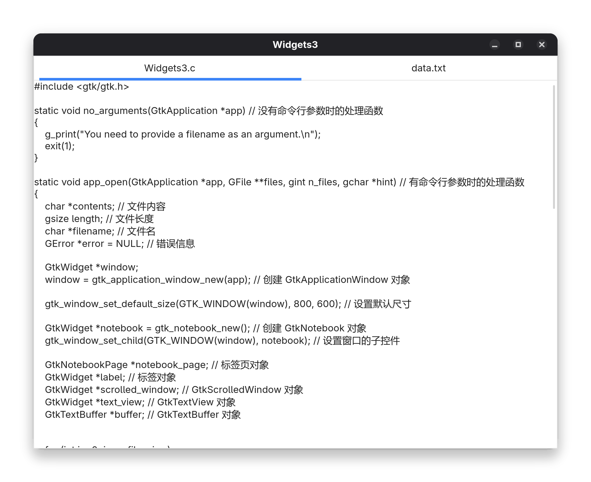
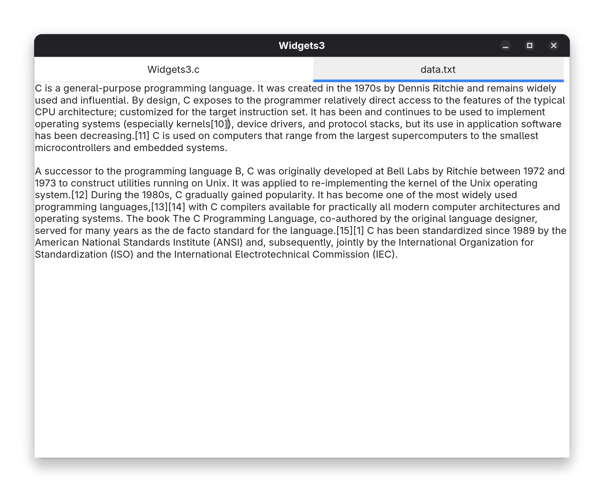

# Widgets-3

## G_APPLICATION_HANDLES_OPEN

在 [Widgets-2](https://github.com/EricLin0509/C/tree/main/应用API/GTK4/4.Widgets-2) 中，我们编写了个简单的的文本编辑器

现在我们希望它能打开文件

最简单的办法是使用命令行参数

```bash
./text_editor file_to_open.txt
```

但是，我们需要告诉 `GtkApplication` 如何处理命令行参数，这个在 [GIO API Reference](https://docs.gtk.org/gio/class.Application.html)有详细说明

在创建 GtkApplication 时，我们需要设置一个 `GApplicationFlags`

```c
GtkApplication *gtk_application_new (const gchar *application_id, GApplicationFlags flags);
```

其中，第二个参数 flags 是一个 `GApplicationFlags` 类型的枚举值，它可以是以下值：

- `G_APPLICATION_FLAGS_NONE`：默认值，表示不使用任何特殊功能 (已弃用)
- `G_APPLICATION_FLAGS_DEFAULT_FLAGS`：默认值，表示使用所有功能
- `G_APPLICATION_FLAGS_HANDLES_OPEN`：表示通过命令行参数打开文件
- `G_APPLICATION_REPLACE`：表示应用程序可以被其他应用程序替换
- ......

详情请参考 [GApplicationFlags](https://docs.gtk.org/gio/flags.ApplicationFlags.html)

目前我们使用了 `G_APPLICATION_FLAGS_DEFAULT_FLAGS`，它不允许处理命令行参数，如果输入参数，程序会报错

```
GLib-GIO-CRITICAL **: 00:01:51.217: This application can not open files.
```

` G_APPLICATION_HANDLES_OPEN` 可以处理命令行参数，但是**只能输入文件名**

```c
GtkApplication *app; // GtkApplication 对象
app = gtk_application_new("org.gtk.example", G_APPLICATION_FLAGS_HANDLES_OPEN); // 创建 GtkApplication 对象
```

### 打开信号

在使用 `G_APPLICATION_HANDLES_OPEN` 后，有两种信号可以使用

- 激活信号 (activate)：当**没有命令行参数**时调用
- 打开信号 (open)：当**有命令行参数**时调用

打开信号的定义如下：

```c
void open (
  GApplication* self,
  gpointer files,
  gint n_files,
  gchar* hint,
  gpointer user_data
);
```

- `self`：`GtkApplication` 对象
- `files`：文件名数组
- `n_files`：文件名数组的长度
- `hint`：文件名提示 (通常可以忽略)
- `user_data`：用户数据

## 示例：设计一个文件查看器

我们设计一个简单的文件查看器，它可以打开文件并显示内容

```c
static void no_arguments(GtkApplication *app) // 没有命令行参数时的处理函数
{
    g_print("You need to provide a filename as an argument.\n");
    exit(1);
}

static void app_open(GtkApplication *app, GFile **files, gint n_files, gchar *hint) // 有命令行参数时的处理函数
{
    char *contents; // 文件内容
    gsize length; // 文件长度
    char *filename; // 文件名
    GError *error = NULL; // 错误信息

    GtkWidget *window;
    window = gtk_application_window_new(app); // 创建 GtkApplicationWindow 对象

    gtk_window_set_default_size(GTK_WINDOW(window), 800, 600); // 设置默认尺寸

    GtkWidget *scrolled_window = gtk_scrolled_window_new(); // 创建 GtkScrolledWindow 实例
    gtk_window_set_child(GTK_WINDOW(window), scrolled_window); // 设置窗口的子控件

    GtkWidget *text_view = gtk_text_view_new();
    GtkTextBuffer *buffer = gtk_text_view_get_buffer(GTK_TEXT_VIEW(text_view));
    
    gtk_text_view_set_wrap_mode(GTK_TEXT_VIEW(text_view), GTK_WRAP_WORD); // 设置换行模式

    gtk_scrolled_window_set_child(GTK_SCROLLED_WINDOW(scrolled_window), text_view); // 设置 GtkScrolledWindow 的子控件

    if (g_file_load_contents(files[0], NULL, &contents, &length, NULL, &error))
    {
        gtk_text_buffer_set_text(buffer, contents, length); // 设置文本内容
        g_free(contents); // 释放内存
        if ((filename = g_file_get_basename(files[0])))
        {
            gtk_window_set_title(GTK_WINDOW(window), filename); // 设置窗口标题
            g_free(filename); // 释放内存
        }
        gtk_window_present(GTK_WINDOW(window)); // 显示窗口
    }
    else
    {
        g_printerr("Error loading file: %s\n", error->message);
        g_error_free(error);
        gtk_window_destroy(GTK_WINDOW(window)); // 销毁窗口
    }
}
```

在 `main` 函数中，我们创建 `GtkApplication` 对象并设置 `G_APPLICATION_FLAGS_HANDLES_OPEN` 标志

```c
GtkApplication *app; // GtkApplication 对象
    
app = gtk_application_new("org.gtk.example", G_APPLICATION_HANDLES_OPEN); // 创建 GtkApplication 对象

g_signal_connect(app, "activate", G_CALLBACK(no_arguments), NULL); // 当没有命令行参数时，调用 no_arguments 函数
g_signal_connect(app, "open", G_CALLBACK(app_open), NULL); // 当有命令行参数时，调用 app_open 函数
```



### 实现细节

在 `no_arguments` 函数中，我们打印提示信息并退出程序

这个程序最主要的功能在 `app_open` 函数中，它打开文件并显示内容

- 创建 `GtkApplicationWindow`、`GtkScrolledWindow`、`GtkTextView`、`GtkTextBuffer` 对象并连接起来
- 设置换行模式
- 将文本内容设置为不可编辑
- 读取文件内容并添加到 `GtkTextBuffer` 中
- 如果文件无法打开，打印错误信息并退出程序

其实现如下：

```c
if (g_file_load_contents(files[0], NULL, &contents, &length, NULL, &error))
{
    gtk_text_buffer_set_text(buffer, contents, length); // 设置文本内容
    g_free(contents); // 释放内存
    if ((filename = g_file_get_basename(files[0])))
    {
       gtk_window_set_title(GTK_WINDOW(window), filename); // 设置窗口标题
       g_free(filename); // 释放内存
    }
    gtk_window_present(GTK_WINDOW(window)); // 显示窗口
}
else
{
    g_printerr("Error loading file: %s\n", error->message);
    g_error_free(error);
    gtk_window_destroy(GTK_WINDOW(window)); // 销毁窗口
}
```

`g_file_load_contents` 函数会将文件内容加载到临时缓冲区中，**它会自动分配内存**并设置 `contents` 指针指向该缓冲区。同时，文本长度 `length` 也会被自动设置。

如果文件打开成功，返回 `TRUE`；否则返回 `FALSE`

详情请参考 [g_file_load_contents](https://docs.gtk.org/gio/method.File.load_contents.html)

如果文件打开打开失败，会设置变量 `error` 指向一个新建的 `GError` 结构体。调用者会获得该 `GError` 结构体所有权

`GError` 结构体的原型是

```c
struct GError {
    GQuark domain;
    int code;
    char *message;
};
```

其中 `message` 成员是最常用的，它包含了错误信息

`g_error_free` 函数用于释放 `GError` 结构体，参考 [GError](https://docs.gtk.org/glib/struct.Error.html)

最后，释放 `error` 指针并销毁窗口

## GtkNotebook

GtkNotebook 是一个多标签页容器，它可以用来显示多个页面，每个页面可以包含多个控件

我们可以用它来实现文件查看器的多个标签页功能

```c
static void app_open(GtkApplication *app, GFile **files, gint n_files, gchar *hint) // 有命令行参数时的处理函数
{
    char *contents; // 文件内容
    gsize length; // 文件长度
    char *filename; // 文件名
    GError *error = NULL; // 错误信息

    GtkWidget *window;
    window = gtk_application_window_new(app); // 创建 GtkApplicationWindow 对象

    gtk_window_set_default_size(GTK_WINDOW(window), 800, 600); // 设置默认尺寸

    GtkWidget *notebook = gtk_notebook_new(); // 创建 GtkNotebook 对象
    gtk_window_set_child(GTK_WINDOW(window), notebook); // 设置窗口的子控件

    GtkNotebookPage *notebook_page; // 标签页对象
    GtkWidget *label; // 标签对象
    GtkWidget *scrolled_window; // GtkScrolledWindow 对象
    GtkWidget *text_view; // GtkTextView 对象
    GtkTextBuffer *buffer; // GtkTextBuffer 对象

    
    for (int i = 0; i < n_files; i++)
    {
        if (g_file_load_contents (files[i], NULL, &contents, &length, NULL, &error))
        {
            scrolled_window = gtk_scrolled_window_new(); // 创建 GtkScrolledWindow 对象
            text_view = gtk_text_view_new(); // 创建 GtkTextView 对象
            buffer = gtk_text_view_get_buffer(GTK_TEXT_VIEW(text_view)); // 获取 GtkTextBuffer 对象
            gtk_text_view_set_wrap_mode(GTK_TEXT_VIEW(text_view), GTK_WRAP_WORD); // 设置换行模式
            gtk_text_view_set_editable(GTK_TEXT_VIEW(text_view), FALSE); // 设置文本不可编辑
            gtk_scrolled_window_set_child(GTK_SCROLLED_WINDOW(scrolled_window), text_view); // 设置 GtkScrolledWindow 的子控件
            gtk_text_buffer_set_text(buffer, contents, length); // 设置文本内容

            gtk_scrolled_window_set_child(GTK_SCROLLED_WINDOW(scrolled_window), text_view); // 设置 GtkScrolledWindow 的子控件
            g_free(contents); // 释放内存

            if ((filename = g_file_get_basename(files[i])))
            {
                label = gtk_label_new(filename); // 创建 GtkLabel 对象
                g_free(filename); // 释放内存
            }
            else label = gtk_label_new("Untitled"); // 未命名文件

            gtk_notebook_append_page(GTK_NOTEBOOK(notebook), scrolled_window, label); // 添加标签页
            notebook_page = gtk_notebook_get_page(GTK_NOTEBOOK(notebook), scrolled_window); // 获取标签页对象
            g_object_set(notebook_page, "tab-expand", TRUE, NULL); // 设置标签页可扩展
        }
        else
        {
            g_printerr("Error loading file: %s\n", error->message);
            g_error_free(error);
        }
    }
    if (gtk_notebook_get_n_pages(GTK_NOTEBOOK(notebook)) > 0) // 如果有标签页，显示窗口
    {
        gtk_window_present(GTK_WINDOW(window)); // 显示窗口
    }
    else // 如果没有标签页，销毁窗口
    {
        gtk_window_destroy(GTK_WINDOW(window));
    }
}
```

 


```c
gtk_notebook_append_page(GTK_NOTEBOOK(notebook), scrolled_window, label); // 添加标签页
notebook_page = gtk_notebook_get_page(GTK_NOTEBOOK(notebook), scrolled_window); // 获取标签页对象
g_object_set(notebook_page, "tab-expand", TRUE, NULL); // 设置标签页可扩展
```

将 GtkSrcollWindow 添加到 GtkNotebook 中，并使用 `label` 作为标签

于此同时，GtkNotebookPage 对象会自动创建，使用 `gtk_notebook_get_page` 函数可以获取到它

由于 GtkNotebookPage 对象有 `tab-expand` 属性，我们可以设置标签页可扩展，这样标签页可以自动调整大小以适应内容

使用 `g_object_set` 函数是一种通用的方式来设置对象属性，详情请参考 [GObject](https://docs.gtk.org/gobject/method.Object.set.html)