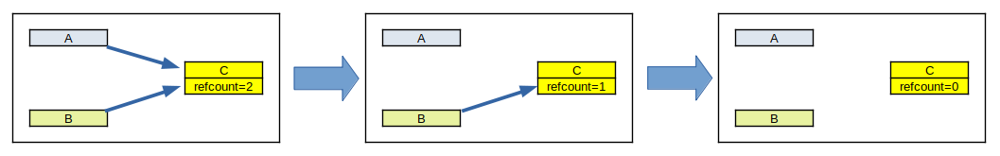
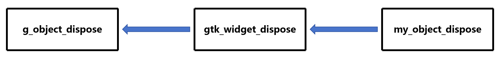

# 自定义GObject

通常情况下，GObject 是由 GType 系统管理的，但有时我们需要自定义 GObject，比如创建新的 GObject 类型，或者为已有的 GObject 类型添加新的属性或方法

## 实现

### 设计头文件

头文件用于声明自定义的 GObject 类型，使得其他代码可以引用它

这里以自定义一个名为 `MyObject` 的 GObject 类型为例，头文件`myobject.h`如下：

```c
// myobject.h

#ifndef MYOBJECT_H
#define MYOBJECT_H

#include <gtk/gtk.h>

G_BEGIN_DECLS

// 自定义的 GObject 类型
#define MY_TYPE_OBJECT my_object_get_type()
G_DECLARE_FINAL_TYPE(MyObject, my_object, MY, OBJECT, GtkWidget)


// 方法声明
GtkWidget *my_object_new(void);

G_END_DECLS

#endif
```

- `G_BEGIN_DECLS` 和 `G_END_DECLS` 只对 C++ 编译器起作用，用于声明 C 语言符号
- `#define MY_TYPE_OBJECT my_object_get_type()` 定义了一个宏，用于获取 `MyObject` 类型的 GType
   - 其中 `MyObject` 分为两个部分
        - `MY` 是一个前缀，用于避免与其他项目的类型名冲突
        - `OBJECT` 是自定义的类型名
    - `my_object_get_type()` 函数用于获取 `MyObject` 类型的 GType，虽说 `G_DECLARE_FINAL_TYPE` 已经定义了 `my_object_get_type()` 函数，但还是建议自己实现一个函数，以便于理解 GType 的机制
    
- `G_DECLARE_FINAL_TYPE` 用于声明 `MyObject` 类型，并设置不可继承
   - 使用 `G_DECLARE_DERIVABLE_TYPE` 可用于声明可继承的 GObject 类型
   - 第一个参数是自定义的类型名
   - 第二个参数是小写前缀
       - 用于生成类型相关函数的前缀，如 `my_object` 会生成：
          - `my_object_get_type()` 函数  
          - `MY_IS_OBJECT()` 类型检查宏 
          - `MY_OBJECT()` 类型转换宏 
   - 第三个参数是命名空间缩写
       - 项目/库的大写命名空间缩写，避免类型名冲突，如 `MY` 会参与构建：
           - `MY_TYPE_OBJECT` 类型宏  
           - `MY_IS_OBJECT()` 检查宏
   - 第四个参数是类型大写形式
       - 类型名的大写形式，与命名空间共同构建标识符，如 `OBJECT` 会生成：
           - `MY_TYPE_OBJECT` (完整类型宏) 
           - `MY_OBJECT(obj)` (类型转换宏) 
   - 第五个参数是父类型，这里是 `GtkWidget`

- `my_object_new()` 函数用于创建 `MyObject` 类型的实例

### 创建实例结构

**如果你的自定义类使用 `G_DECLARE_FINAL_TYPE` 声明，则需要创建实例结构，并在结构中包含父类型的所有字段**

```c
// myobject.c

#include "myobject.h"

struct _MyObject {
    GtkWidget parent_instance;
    // 可添加其他字段
};
```

**注意：命名规则是将自定义类型名，且必须加上 `_` 前缀，并加上父类型的成员变量**

### 定义类的类型

使用 `G_DEFINE_TYPE` 宏定义类的类型，并在结构中包含父类型的所有字段

```c
// myobject.c

G_DEFINE_TYPE(MyObject, my_object, GTK_TYPE_WIDGET)
```

- 第一、二个参数分别是自定义类型名和小写前缀
- 第三个参数是**父类型的 GType**

### 实现方法

在自定义 GObject 中，你必须实现两个方法：

- `init` 方法，用于初始化实例
- `class_init` 方法，用于注册方法和信号

```c
// myobject.c

static void my_object_init(MyObject *self) {
    // 初始化实例
}

static void my_object_class_init(MyObjectClass *class) {
    // 注册方法和信号
}
```

还有 `new` 方法，用于创建实例

```c
// myobject.c

GtkWidget *my_object_new(void) {
    return g_object_new(MY_TYPE_OBJECT, NULL);
}
```

### 调用 `MyObject`


```c
// main.c

static void activate(GtkApplication *app, gpointer user_data) {
    GtkWidget *obj;

    obj = my_object_new();
}

#include "myobject.h"

int main(int argc, char *argv[]) {
    GtkApplication *app;
    int status;

    app = gtk_application_new("org.example.myapp", G_APPLICATION_DEFAULT_FLAGS);

    g_signal_connect(app, "activate", G_CALLBACK(activate), NULL);

    status = g_application_run(G_APPLICATION(app), argc, argv);

    g_object_unref(app);

    return status;
}
```

### 销毁实例

每个从 GObject 派生的对象都有一个引用计数。如果对象 A 引用了对象 B，则 A 会在 A 中保留一个指向 B 的指针，同时使用函数 g_object_ref(B) 将 B 的引用计数加一。如果 A 不再需要 B，则 A 会丢弃指向 B 的指针（通常将指针赋值为 NULL），并使用函数 g_object_unref(B) 将 B 的引用计数减一

如果两个对象 A 和 B 都引用了 C，则 C 的引用计数为 2。如果 A 不再需要 C，则 A 会丢弃指向 C 的指针，并将 C 中的引用计数减一。此时 C 的引用计数为 1。同理，如果 B 不再需要 C，则 B 会丢弃指向 C 的指针，并将 C 中的引用计数减一。此时，没有任何对象引用 C，C 的引用计数为 0。这意味着 C 不再有用。然后 C 会自行析构，最终分配给 C 的内存会被释放



所以，我们可以通过假设 `MyObject` 的引用计数为0，那么就开始销毁 `MyObject` 实例

销毁过程分为两个阶段：释放 (dispose) 和最终确定 (finalize)

- 释放：释放对其他实例的所有引用
- 最终确定：完成所有必要的清理工作，如释放内存、关闭文件、释放资源等

首先需要设计一个 `dispose` 方法，用于释放对其他实例的引用

```c
// myobject.c

static void my_object_dispose(GObject *gobject)
{
    MyObject *self = MY_OBJECT(gobject);

    // 释放对其他实例的引用
    // g_clear_object(&self->other_object); // 由于 `MyObject` 除了 `parent_instance` 字段 (继承父类) 外，没有其他字段引用其他实例，所以不需要调用 `g_clear_object`

    G_OBJECT_CLASS(my_object_parent_class)->dispose(gobject); // 调用父类的 `dispose` 方法
}
```

- `G_OBJECT_CLASS(my_object_parent_class)->dispose(gobject);` 这行代码是调用父类的 `dispose` 方法，他会以链式反应的方式调用所有父类的 `dispose` 方法，直到 `GObject` 类



然后需要在 `class_init` 方法中注册 `dispose` 方法

```c
// myobject.c

static void my_object_class_init(MyObjectClass *class)
{
    GObjectClass *gobject_class = G_OBJECT_CLASS(class); // 获取父类

    // 注册 `dispose` 方法
    gobject_class->dispose = my_object_dispose;
}
```

- `GObjectClass *gobject_class = G_OBJECT_CLASS(class);` 获取父类的 `GObjectClass` 结构体

接着，需要实现 `finalize` 方法，用于完成所有必要的清理工作

```c
// myobject.c

static void my_object_finalize(GObject *gobject)
{
    G_OBJECT_CLASS(my_object_parent_class)->finalize(gobject); // 调用父类的 `finalize` 方法
}
```

- `G_OBJECT_CLASS(my_object_parent_class)->finalize(gobject);` 跟上面一样，以链式反应的方式调用所有父类的 `finalize` 方法，直到 `GObject` 类

最后，需要在 `class_init` 方法中注册 `finalize` 方法

```c
static void my_object_class_init(MyObjectClass *class)
{
    GObjectClass *gobject_class = G_OBJECT_CLASS(class); // 获取父类

    // 注册 `dispose` 方法
    gobject_class->dispose = my_object_dispose;

    // 注册 `finalize` 方法
    gobject_class->finalize = my_object_finalize;
}
```

至此，自定义的 `MyObject` 类型就完成了