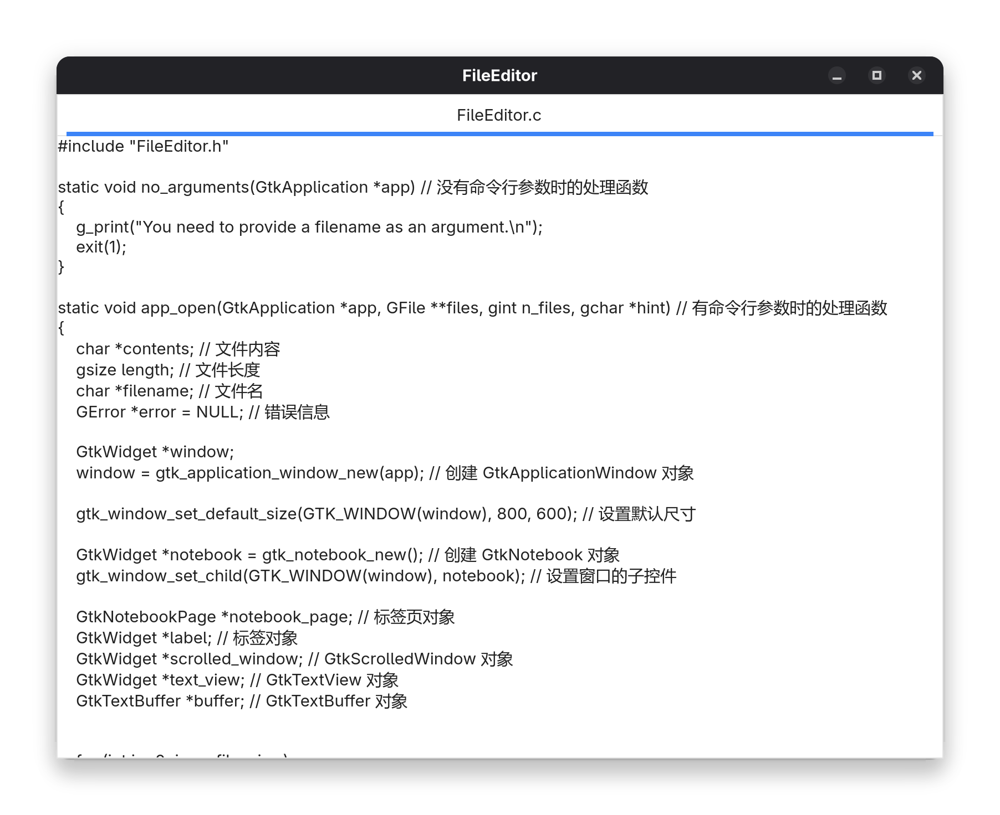

# 自定义类实战

在上一章节中，我们已经了解了如何使用 GObject 库来创建自定义类。本章节将介绍如何使用 GObject 库来实现一些常见的控件，并展示如何使用自定义类来实现一些复杂的功能

## 示例：文件编辑器

在 [Widgets-3](../6.Widgets-3/README.md) 章节中，我们实现了一个基本的文件查看器

现在我们将继续实现一个文件编辑器


由于 GtkTextView 控件提供了编辑文本的功能，因此我们不需要自己实现编辑功能

我们只需要添加两个功能

- 指向 GFile 实例的指针
- 保存文件函数

一共有多种方式来保存这些指针

- 使用全局变量
- 自定义一个 GtkTextView 子类，并在子类中保存 GFile 实例的指针

使用全局变量的方式比较简单，只需要定义足够大小的数组，然后将指针存入数组中即可

```c
GFile *files[10];
```

但是这样有两个问题

- 如果用户打开的文件超过数组的大小，会导致数组越界
- 这样会使得代码的可读性变差

因此，我们使用自定义子类是比较好的选择

### 自定义子类

我们定义一个名为 `FileEditor` 的类，继承自 GtkTextView。在构造函数中，我们保存 GFile 实例的指针

```c
// FileEditor.h

#ifndef FILE_EDITOR_H
#define FILE_EDITOR_H

#include <gtk/gtk.h>

G_BEGIN_DECLS

#define FILE_TYPE_EDITOR file_editor_get_type()

G_DECLARE_FINAL_TYPE(FileEditor, file_editor, FILE, EDITOR, GtkTextView)

struct _FileEditor {
    GtkTextView parent_instance;
    GFile *file;
};

G_DEFINE_FINAL_TYPE(FileEditor, file_editor, GTK_TYPE_TEXT_VIEW);

static void file_editor_init(FileEditor *self) {    }
static void file_editor_class_init(FileEditorClass *class) {    }

GtkWidget *file_editor_new()
{
    return GTK_WIDGET(g_object_new(FILE_TYPE_EDITOR, NULL));
}

void file_editor_set_file(FileEditor *self, GFile *file) // 设置 GFile 实例的指针
{
    self->file = file;
}

GFile *file_editor_get_file(FileEditor *self) // 获取 GFile 实例的指针
{
    return self->file;
}

G_END_DECLS

#endif /* FILE_EDITOR_H */
```

### 关闭请求信号

假设你正在使用这个编辑器。首先，你使用参数运行编辑器。参数是文件名。编辑器读取文件并显示包含文件文本的窗口。然后你编辑文本。编辑完成后，点击窗口的关闭按钮退出编辑器。编辑器会在窗口关闭前更新文件

GtkWindow 会在点击关闭按钮时发送关闭请求信号 (`close-request`)，我们连接这个信号并使用 `before_close` 信号处理函数处理关闭请求

在 `app_open` 函数中，我们创建 `FileEditor` 实例、设置 GFile 实例的指针，并连接到 `close-request` 信号

```c
text_view = file_editor_new(); // 创建 FileEditor 实例
buffer = gtk_text_view_get_buffer(GTK_TEXT_VIEW(text_view));
file_editor_set_file(FILE_EDITOR(text_view), g_file_dup(file)); // 设置 GFile 实例的指针
gtk_text_buffer_set_text(buffer, contents, length); // 设置文本内容
```

```c
if (gtk_notebook_get_n_pages(GTK_NOTEBOOK(notebook)) > 0) // 如果有标签页，显示窗口
{
    g_signal_connect(window, "close-request", G_CALLBACK(before_close), notebook); // 当窗口关闭时，调用 before_close 函数
    gtk_window_present(GTK_WINDOW(window)); // 显示窗口
}
else // 如果没有标签页，销毁窗口
{
    gtk_window_destroy(GTK_WINDOW(window));
}
```

`close-request` 的返回值是 `gboolean`，当值为 `True` 时则停止为该信号调用其他处理程序

```c
static gboolean before_close(GtkWindow *window, GtkWidget *notebook)
{
    GtkWidget *scrolled_window;
    GtkWidget *text_view;
    GFile *file;
    char *pathname;
    GtkTextBuffer *buffer;
    GtkTextIter start;
    GtkTextIter end;
    char *contents;
    unsigned int page_num;
    GError *error = NULL;

    page_num = gtk_notebook_get_n_pages(GTK_NOTEBOOK(notebook)); // 获取标签页的数量

    for (int i = 0; i < page_num; i++)
    {
        scrolled_window = gtk_notebook_get_nth_page(GTK_NOTEBOOK(notebook), i);
        text_view = gtk_scrolled_window_get_child(GTK_SCROLLED_WINDOW(scrolled_window));
        file = file_editor_get_file(FILE_EDITOR(text_view)); // 获取 GFile 实例的指针
        buffer = gtk_text_view_get_buffer(GTK_TEXT_VIEW(text_view));
        gtk_text_buffer_get_bounds(buffer, &start, &end);
        contents = gtk_text_buffer_get_text(buffer, &start, &end, FALSE); // 获取文本内容

        if (!g_file_replace_contents(file, contents, strlen(contents), NULL, TRUE, G_FILE_CREATE_NONE, NULL, NULL, &error))
        {
            g_printerr("Error writing to file: %s\n", error->message);
            g_clear_error(&error);
        }
        g_free(contents);
        g_object_unref(file);
    }
    return FALSE; // 不关闭窗口
}
```



现在，我们有了一个简单的文件编辑器，可以用来编辑文件

但我们需要更多的功能，如打开、保存、另存为、更换字体等，这些功能将在下一章介绍