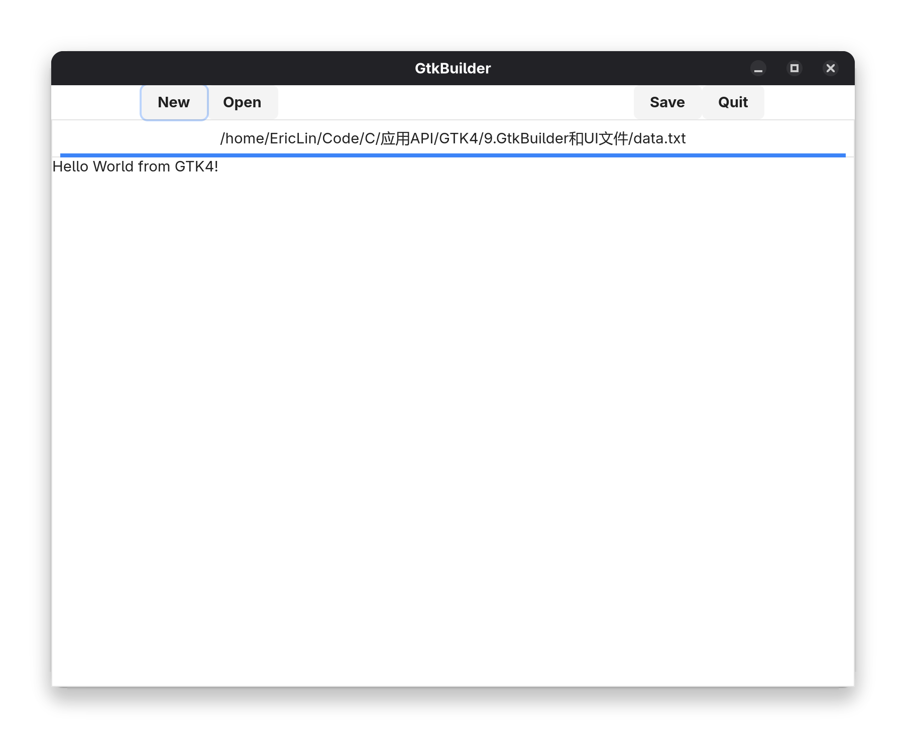

# GtkBuilder和UI文件

我们在上个章节中设计了个简单的文本编辑器，但还不完善

我们要添加 `新建`、`打开`、`保存`、`退出` 按钮

## 创建按钮

代码如下

```c
static void app_open(GtkApplication *app, GFile **files, gint n_files, gchar *hint) // 有命令行参数时的处理函数
{
    char *contents; // 文件内容
    gsize length; // 文件长度
    char *filename; // 文件名
    GError *error = NULL; // 错误信息

    GtkWidget *window;
    window = gtk_application_window_new(app); // 创建 GtkApplicationWindow 对象

    gtk_window_set_default_size(GTK_WINDOW(window), 800, 600); // 设置默认尺寸

    GtkWidget *box_main = gtk_box_new(GTK_ORIENTATION_VERTICAL, 0); // 创建主 GtkBox 对象
    gtk_window_set_child(GTK_WINDOW(window), box_main); // 设置窗口的子控件

    GtkWidget *box_for_buttons = gtk_box_new(GTK_ORIENTATION_HORIZONTAL, 0); // 创建按钮 GtkBox 对象
    gtk_box_append(GTK_BOX(box_main), box_for_buttons); // 添加到主 GtkBox 对象

    GtkWidget *dummy1 = gtk_label_new(NULL); // 创建占位符 GtkLabel 对象
    gtk_label_set_width_chars(GTK_LABEL(dummy1), 10); // 设置占位符宽度
    GtkWidget *dummy2 = gtk_label_new(NULL); // 创建占位符 GtkLabel 对象
    gtk_widget_set_hexpand(dummy2, TRUE); // 设置占位符可扩展
    GtkWidget *dummy3 = gtk_label_new(NULL); // 创建占位符 GtkLabel 对象
    gtk_label_set_width_chars(GTK_LABEL(dummy3), 10); // 设置占位符宽度

    GtkWidget *button_new = gtk_button_new_with_label("New"); // 创建 "新建" 按钮
    GtkWidget *button_open = gtk_button_new_with_label("Open"); // 创建 "打开" 按钮
    GtkWidget *button_save = gtk_button_new_with_label("Save"); // 创建 "保存" 按钮
    GtkWidget *button_quit = gtk_button_new_with_label("Quit"); // 创建 "退出" 按钮

    /*依次添加占位符和按钮到按钮 GtkBox 对象*/

    gtk_box_append(GTK_BOX(box_for_buttons), dummy1);
    gtk_box_append(GTK_BOX(box_for_buttons), button_new);
    gtk_box_append(GTK_BOX(box_for_buttons), button_open);
    gtk_box_append(GTK_BOX(box_for_buttons), dummy2);
    gtk_box_append(GTK_BOX(box_for_buttons), button_save);
    gtk_box_append(GTK_BOX(box_for_buttons), button_quit);
    gtk_box_append(GTK_BOX(box_for_buttons), dummy3);

    GtkWidget *notebook = gtk_notebook_new(); // 创建 GtkNotebook 对象
    gtk_widget_set_hexpand(notebook, TRUE); // 设置 GtkNotebook 可扩展
    gtk_widget_set_vexpand(notebook, TRUE); // 设置 GtkNotebook 可扩展
    gtk_box_append(GTK_BOX(box_main), notebook); // 添加到主 GtkBox 对象

    GtkNotebookPage *notebook_page; // 标签页对象
    GtkWidget *label; // 标签对象
    GtkWidget *scrolled_window; // GtkScrolledWindow 对象
    GtkWidget *text_view; // GtkTextView 对象
    GtkTextBuffer *buffer; // GtkTextBuffer 对象

    
    for (int i = 0; i < n_files; i++)
    {
        if (g_file_load_contents (files[i], NULL, &contents, &length, NULL, &error))
        {
            scrolled_window = gtk_scrolled_window_new(); // 创建 GtkScrolledWindow 对象
            text_view = file_editor_new(); // 创建 GtkTextView 对象
            buffer = gtk_text_view_get_buffer(GTK_TEXT_VIEW(text_view)); // 获取 GtkTextBuffer 对象
            gtk_text_view_set_wrap_mode(GTK_TEXT_VIEW(text_view), GTK_WRAP_WORD); // 设置换行模式
            gtk_scrolled_window_set_child(GTK_SCROLLED_WINDOW(scrolled_window), text_view); // 设置 GtkScrolledWindow 的子控件

            file_editor_set_file(FILE_EDITOR(text_view), g_file_dup(files[i])); // 设置文件路径
            gtk_text_buffer_set_text(buffer, contents, length); // 设置文本内容

            gtk_scrolled_window_set_child(GTK_SCROLLED_WINDOW(scrolled_window), text_view); // 设置 GtkScrolledWindow 的子控件
            g_free(contents); // 释放内存

            filename = g_file_get_path(files[i]); // 获取文件名
            label = gtk_label_new(filename); // 创建标签对象

            gtk_notebook_append_page(GTK_NOTEBOOK(notebook), scrolled_window, label); // 添加标签页
            notebook_page = gtk_notebook_get_page(GTK_NOTEBOOK(notebook), scrolled_window); // 获取标签页对象
            g_object_set(notebook_page, "tab-expand", TRUE, NULL); // 设置标签页可扩展
        }
        else
        {
            g_printerr("Error loading file: %s\n", error->message);
            g_error_free(error);
        }
    }
    if (gtk_notebook_get_n_pages(GTK_NOTEBOOK(notebook)) > 0) // 如果有标签页，显示窗口
    {
        g_signal_connect(window, "close-request", G_CALLBACK(before_close), notebook); // 当窗口关闭时，调用 before_close 函数
        gtk_window_present(GTK_WINDOW(window)); // 显示窗口
    }
    else // 如果没有标签页，销毁窗口
    {
        gtk_window_destroy(GTK_WINDOW(window));
    }
}
```



但是这样有一个问题，我们需要很多行代码来创建 Gtk 组件，这使得代码不易维护

为解决这个问题，我们可以使用 UI 文件来定义 Gtk 组件，然后使用 GtkBuilder 来加载 UI 文件

## 创建 UI 文件

UI 文件是一个 XML 文件，它定义了 Gtk 组件的属性，比如按钮的文本、位置、尺寸等

我们在项目根目录下创建一个名为 `editor.ui` 的文件，内容如下

```xml
<?xml version="1.0" encoding="UTF-8"?>
<interface>
  <object class="GtkApplicationWindow" id="window">
    <property name="title">Text Editor</property>
    <property name="default-width">800</property>
    <property name="default-height">600</property>
    <child>
      <object class="GtkBox" id="box_main">
        <property name="orientation">GTK_ORIENTATION_VERTICAL</property>
        <child>
          <object class="GtkBox" id="box_for_buttons">
            <property name="orientation">GTK_ORIENTATION_HORIZONTAL</property>
            <child>
              <object class="GtkLabel" id="dummy1">
                <property name="width-chars">10</property>
              </object>
            </child>
            <child>
              <object class="GtkButton" id="button_new">
                <property name="label">New</property>
              </object>
            </child>
            <child>
              <object class="GtkButton" id="button_open">
                <property name="label">Open</property>
              </object>
            </child>
            <child>
              <object class="GtkLabel" id="dummy2">
                <property name="hexpand">TRUE</property>
              </object>
            </child>
            <child>
              <object class="GtkButton" id="button_save">
                <property name="label">Save</property>
              </object>
            </child>
            <child>
              <object class="GtkButton" id="button_quit">
                <property name="label">Quit</property>
              </object>
            </child>
            <child>
              <object class="GtkLabel" id="dummy3">
                <property name="width-chars">10</property>
              </object>
            </child>
          </object>
        </child>
        <child>
          <object class="GtkNotebook" id="notebook">
            <property name="hexpand">TRUE</property>
            <property name="vexpand">TRUE</property>
          </object>
        </child>
      </object>
    </child>
  </object>
</interface>
```

- `<interface>` 标签定义了 UI 文件的根元素
- `<object>` 标签定义了 Gtk 组件，`class` 属性指定了组件的类型，`id` 属性指定了组件的 ID
- `<property>` 标签定义了组件的属性，比如 `label` 属性指定了按钮的文本，`width-chars` 属性指定了标签的宽度
- `<child>` 标签定义了组件的子元素，可以有多个 `<child>` 标签

## 使用 GtkBuilder 加载 UI 文件

使用 `gtk_builder_new_from_file` 函数可以加载 UI 文件，并返回一个 GtkBuilder 对象

```c
GtkBuilder *builder;
builder = gtk_builder_new_from_file("editor.ui");
```

### 获取组件

使用 `gtk_builder_get_object` 函数可以获取 UI 文件中定义的组件，并返回一个 GtkWidget 对象

```c
GtkWidget *window;
window = gtk_builder_get_object(builder, "window");
GtkWidget *notebook;
notebook = gtk_builder_get_object(builder, "notebook");
```

### 将窗口与应用程序关联

由于我们把 `window` 组件设置在了 UI 文件中，所以我们需要使用 `gtk_window_set_application` 函数将窗口与应用程序关联起来

```c
gtk_window_set_application(GTK_WINDOW(window), app);
```

### 最终代码

```c
static void app_open(GtkApplication *app, GFile **files, gint n_files, gchar *hint) // 有命令行参数时的处理函数
{
    char *contents; // 文件内容
    gsize length; // 文件长度
    char *filename; // 文件名
    GError *error = NULL; // 错误信息

    GtkWidget *window;
    GtkWidget *notebook;
    GtkNotebookPage *notebook_page; // 标签页对象
    GtkWidget *label; // 标签对象
    GtkWidget *scrolled_window; // GtkScrolledWindow 对象
    GtkWidget *text_view; // GtkTextView 对象
    GtkTextBuffer *buffer; // GtkTextBuffer 对象

    GtkBuilder *builder; // GtkBuilder 对象
    builder = gtk_builder_new_from_file("editor.ui"); // 从 UI 文件中加载布局

    window = GTK_WIDGET(gtk_builder_get_object(builder, "window")); // 获取窗口对象
    gtk_window_set_application(GTK_WINDOW(window), app); // 关联应用程序

    notebook = GTK_WIDGET(gtk_builder_get_object(builder, "notebook")); // 获取标签页对象

    g_object_unref(builder); // 释放 GtkBuilder 对象

    
    for (int i = 0; i < n_files; i++)
    {
        if (g_file_load_contents (files[i], NULL, &contents, &length, NULL, &error))
        {
            scrolled_window = gtk_scrolled_window_new(); // 创建 GtkScrolledWindow 对象
            text_view = file_editor_new(); // 创建 GtkTextView 对象
            buffer = gtk_text_view_get_buffer(GTK_TEXT_VIEW(text_view)); // 获取 GtkTextBuffer 对象
            gtk_text_view_set_wrap_mode(GTK_TEXT_VIEW(text_view), GTK_WRAP_WORD); // 设置换行模式
            gtk_scrolled_window_set_child(GTK_SCROLLED_WINDOW(scrolled_window), text_view); // 设置 GtkScrolledWindow 的子控件

            file_editor_set_file(FILE_EDITOR(text_view), g_file_dup(files[i])); // 设置文件路径
            gtk_text_buffer_set_text(buffer, contents, length); // 设置文本内容

            gtk_scrolled_window_set_child(GTK_SCROLLED_WINDOW(scrolled_window), text_view); // 设置 GtkScrolledWindow 的子控件
            g_free(contents); // 释放内存

            filename = g_file_get_path(files[i]); // 获取文件名
            label = gtk_label_new(filename); // 创建标签对象

            gtk_notebook_append_page(GTK_NOTEBOOK(notebook), scrolled_window, label); // 添加标签页
            notebook_page = gtk_notebook_get_page(GTK_NOTEBOOK(notebook), scrolled_window); // 获取标签页对象
            g_object_set(notebook_page, "tab-expand", TRUE, NULL); // 设置标签页可扩展
        }
        else
        {
            g_printerr("Error loading file: %s\n", error->message);
            g_error_free(error);
        }
    }
    if (gtk_notebook_get_n_pages(GTK_NOTEBOOK(notebook)) > 0) // 如果有标签页，显示窗口
    {
        g_signal_connect(window, "close-request", G_CALLBACK(before_close), notebook); // 当窗口关闭时，调用 before_close 函数
        gtk_window_present(GTK_WINDOW(window)); // 显示窗口
    }
    else // 如果没有标签页，销毁窗口
    {
        gtk_window_destroy(GTK_WINDOW(window));
    }
}
```

可以看到，使用 UI 文件可以使代码更简洁，而且可以方便地修改布局

### 使用用户界面字符串 (**不推荐**)

GtkBuilder 也可以使用用户界面字符串，但是不推荐

```c
char *ui_string;
ui_string = 
"<interface>"
    "<object class='GtkApplicationWindow' id='window'>"
    "<property name='title'>Text Editor</property>"
    "<property name='default-width'>800</property>"
    "<property name='default-height'>600</property>"
......
......

"</interface>";

GtkBuilder *builder;
builder = gtk_builder_new_from_string(ui_string, -1);
```

这种方式不利于代码的维护

## Gresources

Gresource 与字符串类似。但 Gresource 是压缩的二进制数据，而不是文本数据。Gresource 有一个编译器，可以将 UI 文件编译成 Gresource。它不仅可以编译文本文件，还可以编译二进制文件，例如图像、声音等。编译完成后，它会将它们打包成一个 Gresource 对象，并保存到一个文件中

需要一个 xml 文件来描述 Gresource，比如 `editor.gresource.xml`，内容如下

```xml
<?xml version="1.0" encoding="UTF-8"?>
<gresources>
  <gresource prefix="/org/example/text_editor">
    <file>editor.ui</file>
  </gresource>
</gresources>
```

- `<gresources>` 标签可以包含多个 `<gresource>` 标签
- `<gresource>` 标签定义了 Gresource 的根元素
    - `prefix` 属性指定了资源的前缀，它会在程序中用作资源的唯一标识符
- `<file>` 标签定义了资源的文件路径，它可以是相对路径，也可以是绝对路径

### 编译 Gresource

需要使用 `glib-compile-resources` 命令来编译 Gresource

```bash
glib-compile-resources --help
Usage:
  glib-compile-resources [OPTION..] FILE

Compile a resource specification into a resource file.
Resource specification files have the extension .gresource.xml,
and the resource file have the extension called .gresource.

Help Options:
  -h, --help                   Show help options

Application Options:
  --version                    Show program version and exit
  --target=FILE                Name of the output file
  --sourcedir=DIRECTORY        The directories to load files referenced in FILE from (default: current directory)
  --generate                   Generate output in the format selected for by the target filename extension
  --generate-header            Generate source header
  --generate-source            Generate source code used to link in the resource file into your code
  --generate-dependencies      Generate dependency list
  --dependency-file=FILE       Name of the dependency file to generate
  --generate-phony-targets     Include phony targets in the generated dependency file
  --manual-register            Don't automatically create and register resource
  --internal                   Don't export functions; declare them G_GNUC_INTERNAL
  --external-data              Don't embed resource data in the C file; assume it's linked externally instead
  --c-name                     C identifier name used for the generated source code
  -C, --compiler               The target C compiler (default: the CC environment variable)
```

编译命令如下

```bash
glib-compile-resources editor.gresource.xml target=resources.c --generate-source
```

此时会生成一个名为 `resources.c` 的文件，它包含了 Gresource 的数据，可以直接包含到程序中

### 引用 Gresource

修改 `GtkBuilder.c` 代码

使用 `gtk_builder_new_from_resource` 函数可以加载 Gresource 中的 UI 文件，并返回一个 GtkBuilder 对象

```c
#include "resources.c"
......
......

GtkBuilder *builder;
builder = gtk_builder_new_from_resource("/org/example/text_editor/editor.ui");
```


通常，使用 Gresource 在C语言中会比使用 UI 文件更加方便，如果使用的是 Ruby，则使用 UI 文件更加方便
