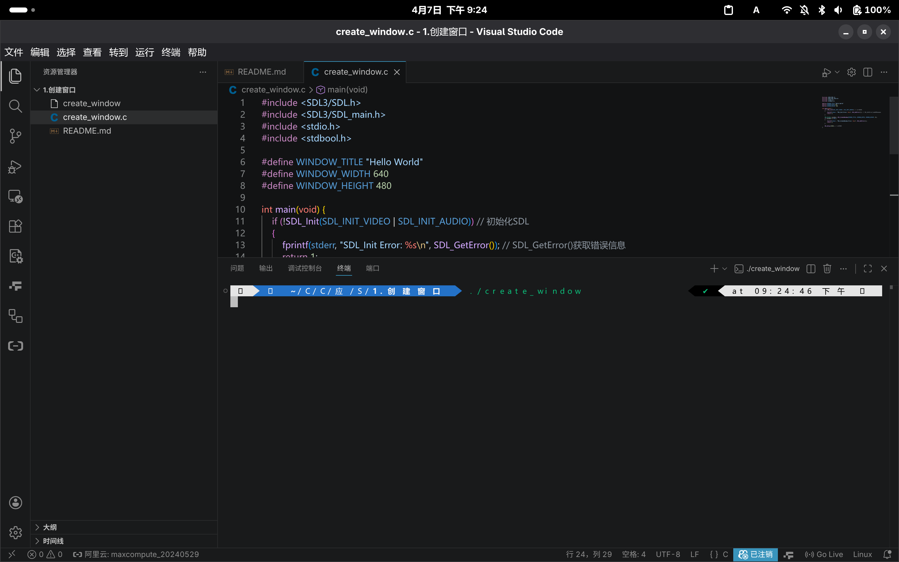
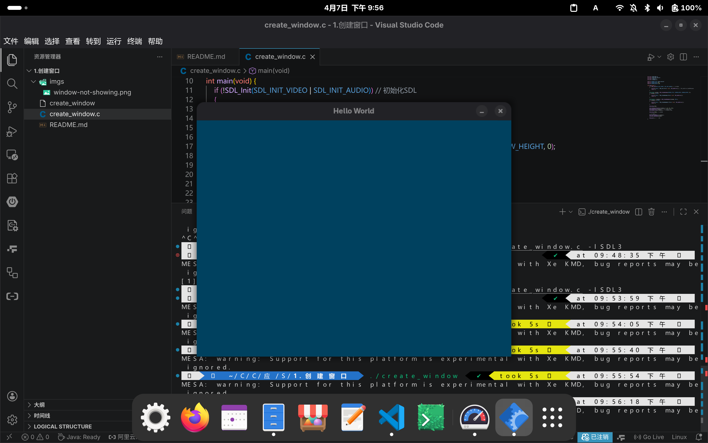

# 创建窗口

此教程将介绍如何使用 SDL3 库创建窗口

## 代码

### 导入 SDL3 库

引入 `SDL3/SDL.h` 头文件来导入 SDL3 库

```c
#include <SDL3/SDL.h>
```

但根据 SDL3 官方文档，推荐同时引入 `SDL3/SDL_main.h` 头文件

```c
#include <SDL3/SDL.h>
#include <SDL3/SDL_main.h>
```

### 初始化 SDL3

使用 `SDL_Init()` 函数初始化 SDL3

```c
bool SDL_Init(SDL_InitFlags flags);
```

- `SDL_InitFlags` 是一个枚举类型，用于指定 SDL3 要初始化的模块
    - 此参数**不可以**为 0
    - 详细信息请参考 [Wiki](https://wiki.libsdl.org/SDL3/SDL_Init#remarks)

```c
SDL_Init(SDL_INIT_VIDEO);
```

> 可以使用 `SDL_GetError()` 函数获取错误信息

### 创建窗口

使用 `SDL_CreateWindow()` 函数创建窗口

```c
SDL_Window *SDL_CreateWindow(const char *title, int w, int h, SDL_WindowFlags flags);
```

- `title`: 窗口标题
- `w`: 窗口宽度
- `h`: 窗口高度
- `flags`: 窗口属性
    - 此参数可以为 0
    - 详细信息请参考 [Wiki](https://wiki.libsdl.org/SDL3/SDL_CreateWindow#remarks)

```c
#define WINDOW_TITLE "Hello World"
#define WINDOW_WIDTH 640
#define WINDOW_HEIGHT 480

SDL_Window *window = SDL_CreateWindow(WINDOW_TITLE, WINDOW_WIDTH, WINDOW_HEIGHT, 0);
```

此时，窗口可以创建，但无法正常显示



这是因为我们没有创建渲染器

### 创建渲染器

使用 `SDL_CreateRenderer()` 函数创建渲染器

```c
SDL_Renderer *SDL_CreateRenderer(SDL_Window *window, const char *name);
```

- `window`: 窗口实例
- `name`: 渲染器名称
    - 可以为 NULL，表示使用默认渲染器
    - 详细信息请参考 [Wiki](https://wiki.libsdl.org/SDL3/SDL_CreateRenderer#remarks)

```c
SDL_Renderer *renderer = SDL_CreateRenderer(window, NULL);
```

### 设置背景颜色

使用 `SDL_SetRenderDrawColor()` 函数设置背景颜色

```c
int SDL_SetRenderDrawColor(SDL_Renderer *renderer, Uint8 r, Uint8 g, Uint8 b, Uint8 a);
```

- `renderer`: 渲染器实例
- `r`: 红色分量
- `g`: 绿色分量
- `b`: 蓝色分量
- `a`: 透明度
    - 0 表示完全透明
    - 255 表示完全不透明

```c
SDL_SetRenderDrawColor(renderer, 0, 65, 95, 255);
```

### 清空渲染器内容

我们每次渲染新内容都需要先清空渲染器内容

使用 `SDL_RenderClear()` 函数清空渲染器内容

```c
SDL_RenderClear(renderer);
```

### 显示渲染器内容

使用 `SDL_RenderPresent()` 函数显示渲染器内容

```c
bool SDL_RenderPresent(SDL_Renderer *renderer);
```

- `renderer`: 渲染器实例

```c
SDL_RenderPresent(renderer);
```

此时，窗口应该可以正常显示



### 销毁窗口和渲染器

使用 `SDL_DestroyWindow()` 和 `SDL_DestroyRenderer()` 函数分别销毁窗口和渲染器

```c
void SDL_DestroyWindow(SDL_Window *window);
```

- `window`: 窗口实例

```c
void SDL_DestroyRenderer(SDL_Renderer *renderer);
```

- `renderer`: 渲染器实例

```c
SDL_DestroyRenderer(renderer);
SDL_DestroyWindow(window);
```

### 退出 SDL3

使用 `SDL_Quit()` 函数退出 SDL3

```c
void SDL_Quit(void);
```

```c
SDL_Quit();
```
