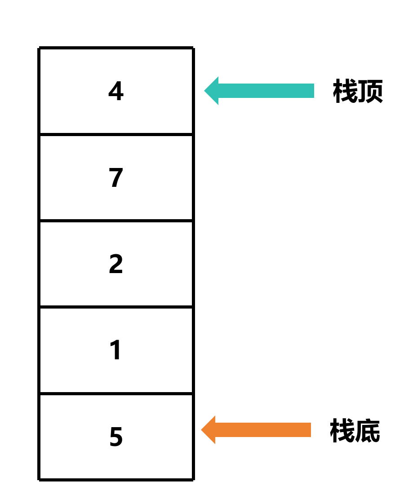
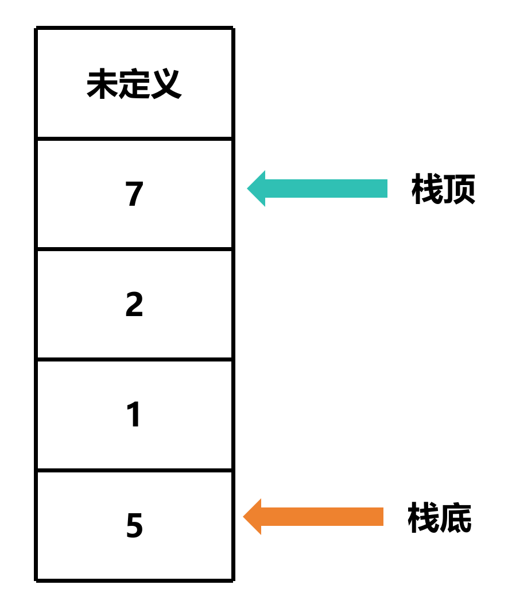
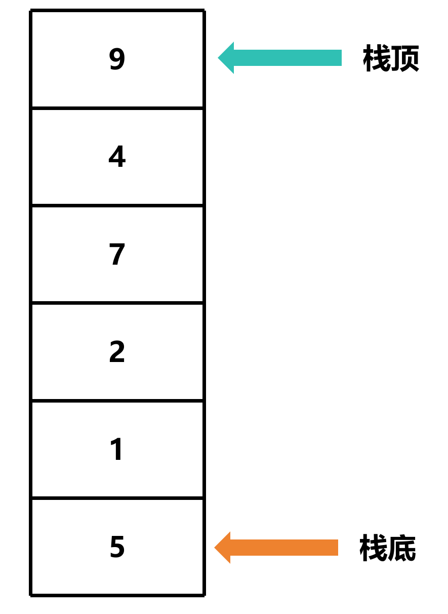

# 栈简介

## 基本概念

栈是一种特殊的线性表，其只允许在固定的一端进行插入和删除元素操作。进行数据插入和删除操作的一端称为栈顶，另一端称为栈底。栈中的数据元素遵守**后进先出LIFO** (Last In First Out) 的原则

- 压栈 (Push)：栈的**插入操作**叫做进栈/压栈/入栈，入数据在栈顶

- 出栈 (Pop)：栈的**删除操作**叫做出栈，出数据也在栈顶

## 图解

### 栈的结构




### 出栈



### 入栈



## 栈的操作

- 检查栈是否为空
- 检查栈是否已满
- 入栈
- 出栈
- 获取栈顶元素

## 代码示例

### 定义栈

```c
typedef struct Stack
{
    int *collection;
    int capacity;
    int size;
} Stack;
```

- `collection` —— 栈的元素集合
- `capacity` —— 栈的容量
- `size` —— 栈的目前大小

### 创建栈

```c
Stack *create_stack(int capacity)
```

#### 检查栈的容量

```c
Stack *create_stack(int capacity)
{
    if (capacity <= 0)
    {
        return NULL;
    }
}
```

#### 分配内存

```c
Stack *create_stack(int capacity)
{
    if (capacity <= 0)
    {
        perror("capacity must be greater than 0");
        return NULL;
    }
    Stack *stack = malloc(sizeof(Stack));
    if (stack == NULL)
    {
        perror("malloc");
        return NULL;
    }
}
```

#### 设置栈的集合大小

```c
Stack *create_stack(int capacity)
{
    if (capacity <= 0)
    {
        perror("capacity must be greater than 0");
        return NULL;
    }
    Stack *stack = malloc(sizeof(Stack));
    if (stack == NULL)
    {
        perror("malloc stack");
        return NULL;
    }

    stack->collection = malloc(sizeof(int) * capacity);
    if (stack->collection == NULL)
    {
        perror("malloc collection");
        free(stack); // 释放已经分配的内存
        return NULL;
    }
}
```

#### 设置栈的容量

```c
Stack *create_stack(int capacity)
{
    if (capacity <= 0)
    {
        perror("capacity must be greater than 0");
        return NULL;
    }
    Stack *stack = malloc(sizeof(Stack));
    if (stack == NULL)
    {
        perror("malloc stack");
        return NULL;
    }

    stack->collection = malloc(sizeof(int) * capacity);
    if (stack->collection == NULL)
    {
        perror("malloc collection");
        free(stack); // 释放已经分配的内存
        return NULL;
    }

    stack->capacity = capacity;
    stack->size = 0;
    return stack;
}
```

### 检查栈是否为空

```c
bool is_empty(Stack *stack)
```

#### 检查栈的大小并返回结果

```c
bool is_empty(Stack *stack)
{
    return stack->size == 0;
}
```

### 检查栈是否已满

```c
bool is_full(Stack *stack)
```

#### 检查栈的大小并返回结果

```c
bool is_full(Stack *stack)
{
    return stack->size == stack->capacity;
}
```

### 入栈

```c
bool push(Stack *stack, int element)
```

#### 检查栈是否已满

```c
bool push(Stack *stack, int element)
{
    if (is_full(stack))
    {
        return false; // 栈已满
    }

    return true; // 入栈成功
}
```

#### 将元素添加到栈顶

```c
bool push(Stack *stack, int element)
{
    if (is_full(stack))
    {
        return false; // 栈已满
    }

    stack->collection[stack->size] = element;
    stack->size++; // 栈的大小加 1

    return true; // 入栈成功
}
```

### 出栈

```c
bool pop(Stack *stack, int *element)
```

#### 检查栈是否为空

```c
bool pop(Stack *stack, int *element)
{
    if (is_empty(stack))
    {
        return false; // 栈为空
    }

    return true; // 出栈成功
}
```

#### 屏蔽栈顶元素

因为栈通过索引来访问元素，我们可以不删除原来的元素，而是修改索引来出栈

```c
bool pop(Stack *stack, int *element)
{
    if (is_empty(stack))
    {
        return false; // 栈为空
    }

    stack->size--; // 栈的大小减 1
    *element = stack->collection[stack->size];

    return true; // 出栈成功
}
```

### 获取栈顶元素

```c
bool peek(Stack *stack, int *element)
```

#### 检查栈是否为空

```c
bool peek(Stack *stack, int *element)
{
    if (is_empty(stack))
    {
        return false; // 栈为空
    }

    return true; // 栈不为空
}
```

#### 获取栈顶元素

```c
bool peek(Stack *stack, int *element)
{
    if (is_empty(stack))
    {
        return false; // 栈为空
    }

    *element = stack->collection[stack->size - 1];

    return true; // 栈不为空
}
```

- `size - 1` —— 栈顶元素的索引

### 销毁栈

```c
void destroy_stack(Stack *stack)
```

#### 释放栈的集合

```c
void destroy_stack(Stack *stack)
{
    free(stack->collection);
}
```

#### 释放栈

```c
void destroy_stack(Stack *stack)
{
    free(stack->collection);
    free(stack);
}
```