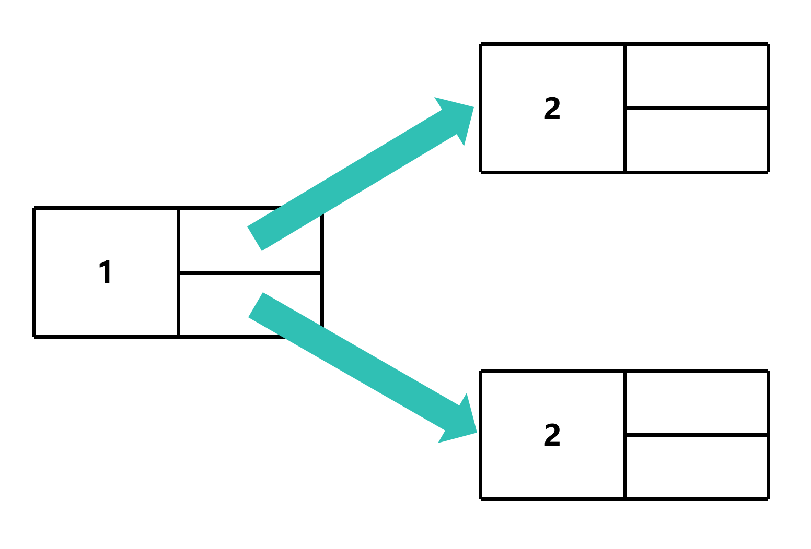

# 树的基本概念

## 先看一下链表


链表里每一个节点都有**一个数据域和一个指针域**，指针域指向下一个节点

现在假设每个节点里有**两个指针域，分别指向两个不同的节点**



这就是一个树，树的节点有两个指针域，分别指向两个不同的节点

## 树的基本概念

树是一种数据结构，它是由**n（n>=1）个有限节点组成一个具有层次关系的集合**

## 代码实现

### 定义节点

这里以二叉树 (Binary Tree) 为例
```c
typedef struct TreeNode
{
    int val;
    struct TreeNode *left; // 左指针
    struct TreeNode *right; // 右指针
} TreeNode;
```

### 创建根节点

```c
int main(int argc, const char *argv[]) {
    // 创建根节点
    TreeNode *root = malloc(sizeof(TreeNode));
    root->val = 1;
    root->left = NULL;
    root->right = NULL;
    return 0;
}
```

### 创建子节点

```c
int main(int argc, const char *argv[]) {
    // 创建根节点
    TreeNode *root = malloc(sizeof(TreeNode));
    root->val = 1;
    root->left = malloc(sizeof(TreeNode)); // 左子节点
    root->right = malloc(sizeof(TreeNode)); // 右子节点

    root->left->val = 2;
    root->right->val = 3;
    root->left->left = NULL;
    root->left->right = NULL;
    return 0;
}
```

但是这样写代码太麻烦了，我们可以封装一个函数来创建节点

### 封装函数

```c
TreeNode *new_node(int val)
{
    TreeNode *node = malloc(sizeof(TreeNode));
    node->val = val;
    node->left = NULL;
    node->right = NULL;
    return node;
}
```

```c
int main(int argc, const char *argv[]) {
    // 创建根节点
    TreeNode *root = new_node(1);
    root->val = 1;
    root->left = new_node(2); // 左子节点
    root->right = new_node(3); // 右子节点
    return 0;
}
```

### 访问节点

```c
int main(int argc, const char *argv[]) {
    // 创建根节点
    TreeNode *root = new_node(1);
    root->val = 1;
    root->left = new_node(2); // 左子节点
    root->right = new_node(3); // 右子节点

    // 访问节点
    printf("根节点的值：%d\n", root->val);
    printf("左子节点的值：%d\n", root->left->val);
    printf("右子节点的值：%d\n", root->right->val);
    return 0;
}
```

[源代码](树简介.c)

## 用处

- 数据库索引
- 文件系统
- 人工智能
- 编译器
