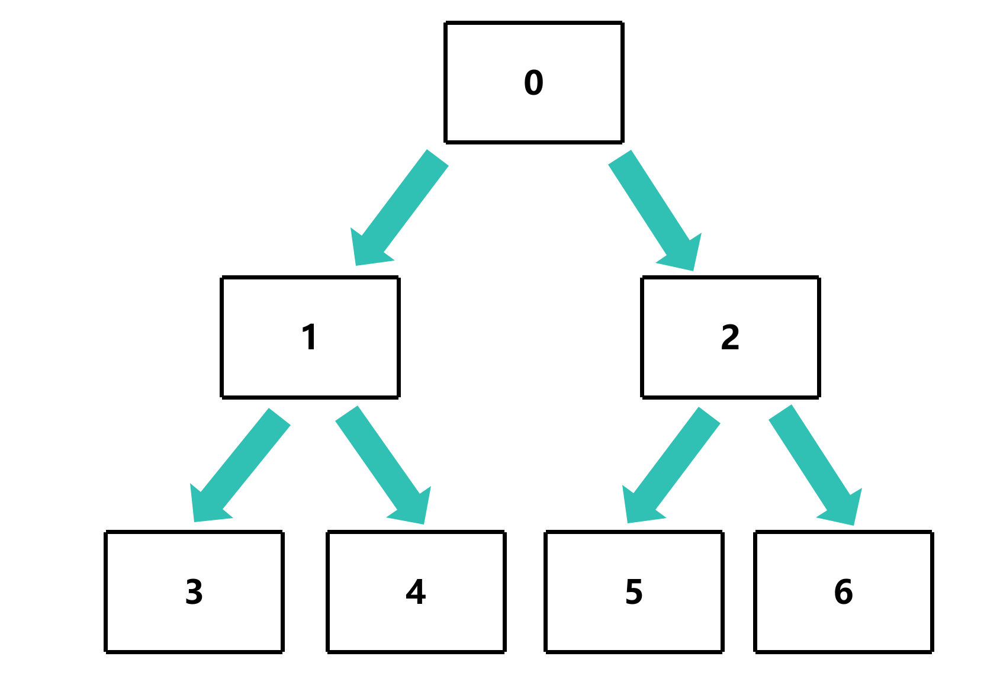
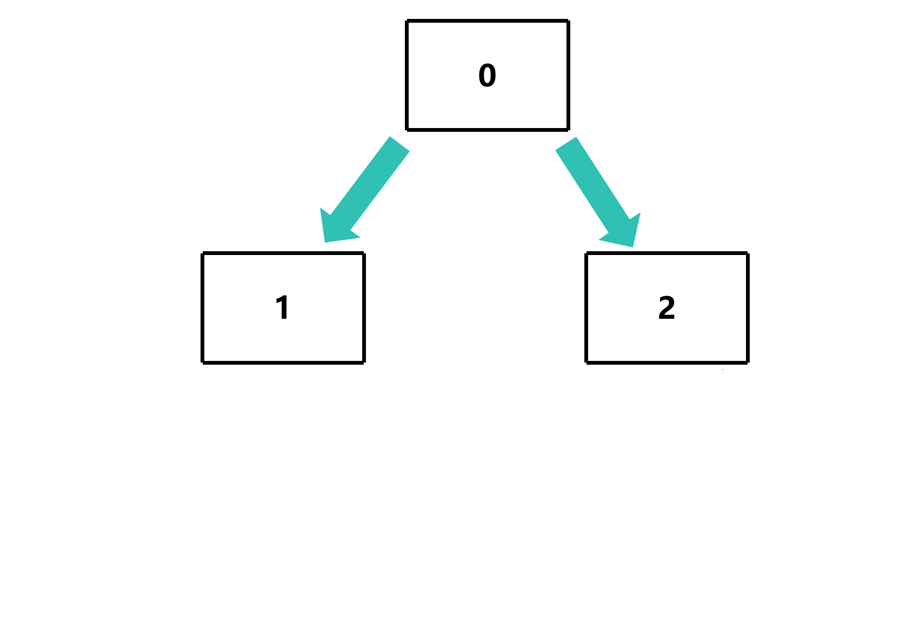
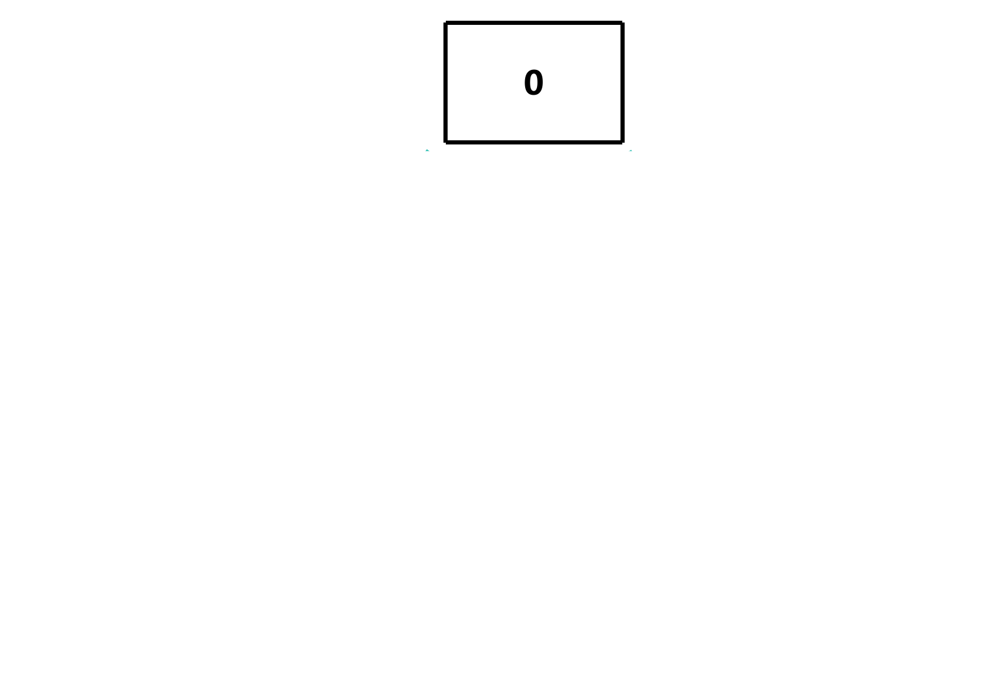
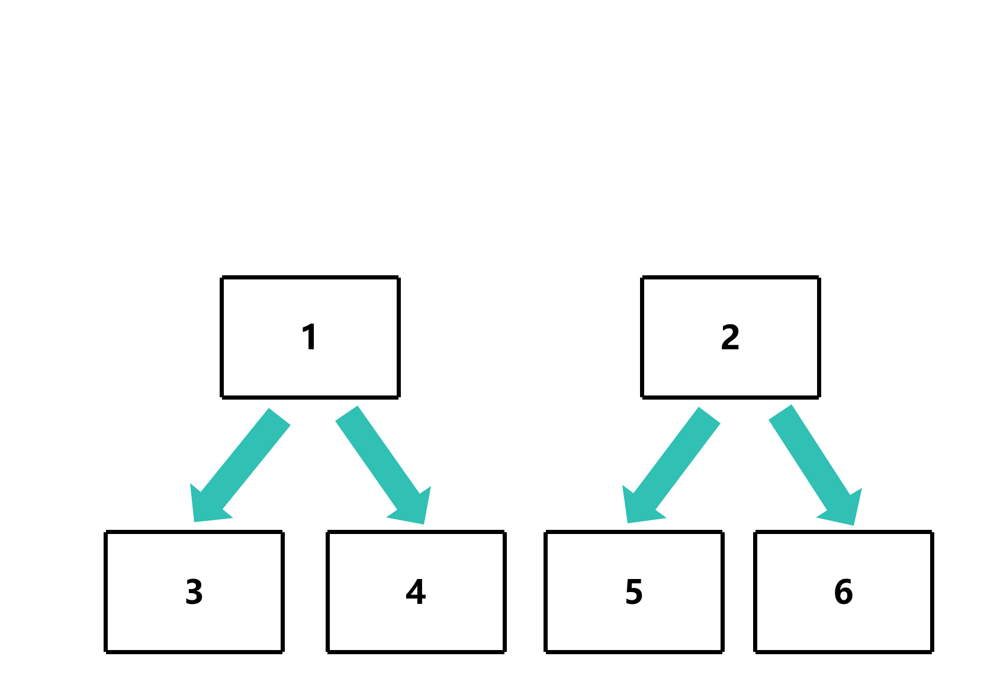
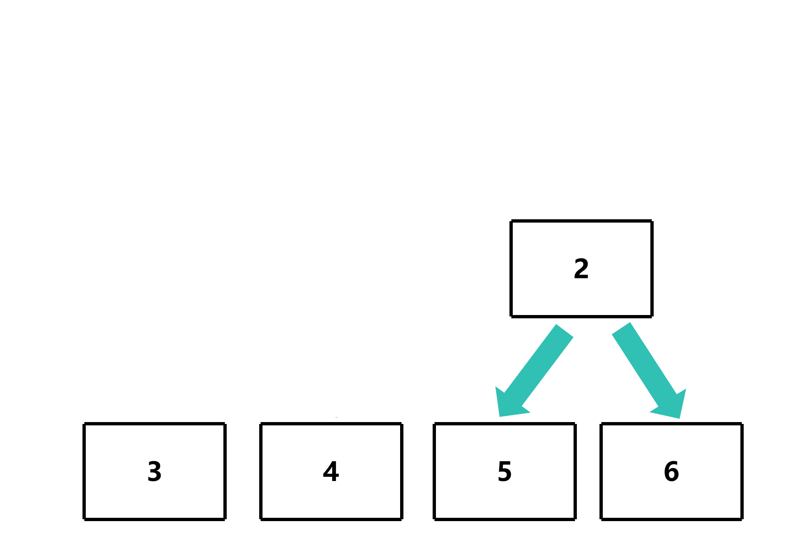
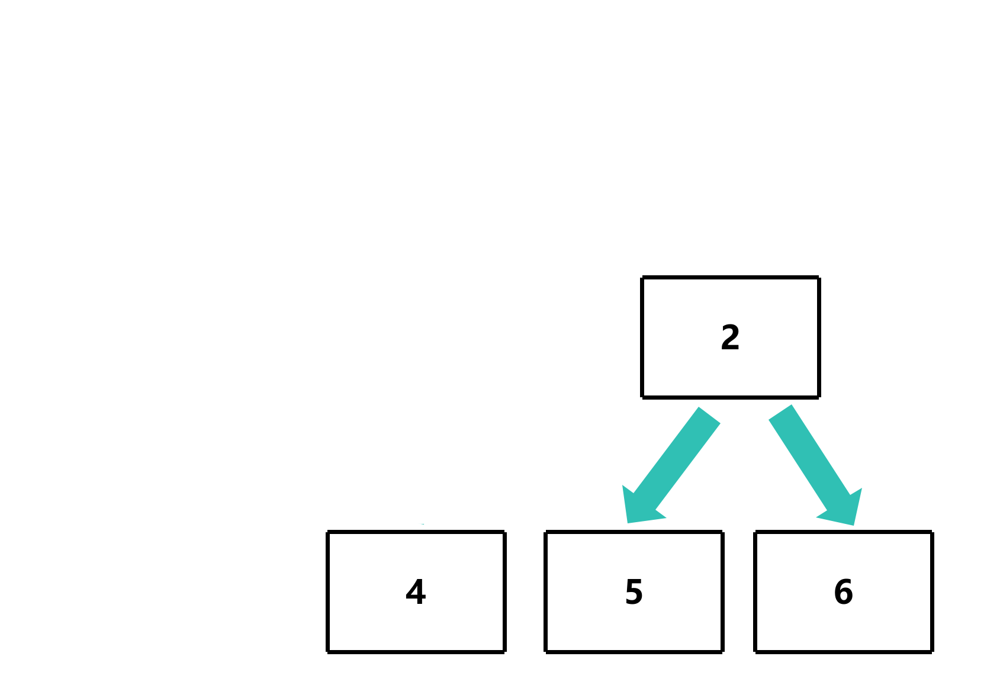
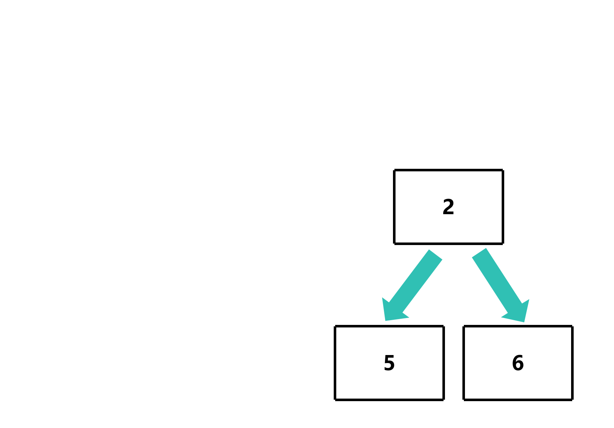
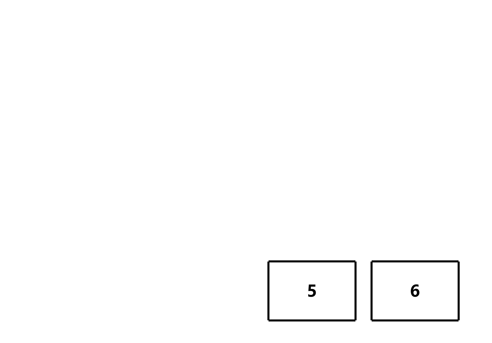

# 释放二叉树

## 做法

- 可以通过**类似**广度优先搜索的方式，**逐层释放**二叉树节点





- 可以通过**类似**深度优先搜索的方式，**递归释放**二叉树节点








## 代码实现

## 广度优先搜索

[广度优先搜索](../广度优先搜索/README.md)

```c
void free_binary_tree_bfs(TreeNode *root)
{
    TreeNode *queue[100];
    size_t queue_num = 0;

    queue[queue_num++] = root; // 将根节点入队

    while (queue_num > 0)
    {
        TreeNode *curr = queue[0];

        if (curr->left != NULL)
        {
            queue[queue_num++] = curr->left; // 将左子节点入队
        }
        if (curr->right != NULL)
        {
            queue[queue_num++] = curr->right; // 将右子节点入队
        }
    }
}
```

### 向队列中添加所有节点

```c
void free_binary_tree_bfs(TreeNode *root)
{
    TreeNode *queue[100];
    size_t queue_num = 0;

    queue[queue_num++] = root; // 将根节点入队

    int i = 0;
    while (i < queue_num)
    {
        TreeNode *curr = queue[i]; // 添加当前节点
        i++;

        if (curr->left != NULL)
        {
            queue[queue_num++] = curr->left; // 将左子节点入队
        }
        if (curr->right != NULL)
        {
            queue[queue_num++] = curr->right; // 将右子节点入队
        }
    }
}
```

### 遍历队列并释放节点

```c
void free_binary_tree_bfs(TreeNode *root)
{
    TreeNode *queue[100];
    size_t queue_num = 0;

    queue[queue_num++] = root; // 将根节点入队

    int i = 0;
    while (i < queue_num)
    {
        TreeNode *curr = queue[i]; // 添加当前节点
        i++;

        if (curr->left != NULL)
        {
            queue[queue_num++] = curr->left; // 将左子节点入队
        }
        if (curr->right != NULL)
        {
            queue[queue_num++] = curr->right; // 将右子节点入队
        }
    }

    for (int j = queue_num - 1; j >= 0; j--)
    {
        free(queue[j]);
    }
}
```

### 测试

```c
TreeNode *root = new_node(0);
root->left = new_node(1);
root->right = new_node(2);
root->left->left = new_node(3);
root->left->right = new_node(4);
root->right->left = new_node(5);
root->right->right = new_node(6);
```

使用 `valgrind` 检测内存泄漏

```bash
gcc -o free_binary_tree_bfs free_binary_tree_bfs.c
valgrind ./free_binary_tree_bfs
==60224== Memcheck, a memory error detector
==60224== Copyright (C) 2002-2024, and GNU GPL'd, by Julian Seward et al.
==60224== Using Valgrind-3.24.0 and LibVEX; rerun with -h for copyright info
==60224== Command: ./_______________
==60224== 
==60224== 
==60224== HEAP SUMMARY:
==60224==     in use at exit: 0 bytes in 0 blocks
==60224==   total heap usage: 7 allocs, 7 frees, 168 bytes allocated
==60224== 
==60224== All heap blocks were freed -- no leaks are possible
==60224== 
==60224== For lists of detected and suppressed errors, rerun with: -s
==60224== ERROR SUMMARY: 0 errors from 0 contexts (suppressed: 0 from 0)
```

可以看到所有节点都被释放了，没有内存泄漏

优点：
- 可以释放任意形状的二叉树
- 容易想到

缺点：
- 空间复杂度高，需要额外的队列空间
- 如果树的深度很深，可能会导致队列溢出

## 深度优先搜索

[深度优先搜索](../深度优先搜索/README.md)

```c
void free_binary_tree_dfs(TreeNode *root)
{
    TreeNode *stack[100]; // 创建栈
    size_t stack_num = 0; // 栈的大小

    stack[stack_num++] = root; // 将根节点入栈

    while (stack_num > 0)
    {
        TreeNode *curr = stack[--stack_num]; // 前面的节点先出栈

        if (curr->right != NULL)
        {
            stack[stack_num++] = curr->right; // 将右子节点入栈
        }
        if (curr->left != NULL)
        {
            stack[stack_num++] = curr->left; // 将左子节点入栈
        }
    }
}
```

### 释放节点

```c
void free_binary_tree_dfs(TreeNode *root)
{
    TreeNode *stack[100]; // 创建栈
    size_t stack_num = 0; // 栈的大小

    stack[stack_num++] = root; // 将根节点入栈

    while (stack_num > 0)
    {
        TreeNode *curr = stack[--stack_num]; // 前面的节点先出栈

        if (curr->right != NULL)
        {
            stack[stack_num++] = curr->right; // 将右子节点入栈
        }
        if (curr->left != NULL)
        {
            stack[stack_num++] = curr->left; // 将左子节点入栈
        }
        free(curr);
    }
}
```

### 测试

```bash
gcc -o free_binary_tree_dfs free_binary_tree_dfs.c
valgrind./free_binary_tree_dfs
==60224== Memcheck, a memory error detector
==60224== Copyright (C) 2002-2024, and GNU GPL'd, by Julian Seward et al.
==60224== Using Valgrind-3.24.0 and LibVEX; rerun with -h for copyright info
==60224== Command: ./_______________
==60224== 
==60224== 
==60224== HEAP SUMMARY:
==60224==     in use at exit: 0 bytes in 0 blocks
==60224==   total heap usage: 7 allocs, 7 frees, 168 bytes allocated
==60224== 
==60224== All heap blocks were freed -- no leaks are possible
==60224== 
==60224== For lists of detected and suppressed errors, rerun with: -s
==60224== ERROR SUMMARY: 0 errors from 0 contexts (suppressed: 0 from 0)
```

可以看到所有节点都被释放了，没有内存泄漏

优点:
- 空间复杂度低，只需要较少的栈空间
- 如果树的深度很深，不会导致栈溢出

缺点:
- 如果树的广度很深，可能会导致栈溢出

## 递归 (不推荐)

如果树的深度很深，可能会导致栈溢出

```c
void free_binary_tree_recursive(TreeNode *node);
```

### 递归遍历所有节点

```c
void free_binary_tree_recursive(TreeNode *node)
{
    if (node->left != NULL)
    {
        free_binary_tree_recursive(node->left);
    }
    if (node->right != NULL)
    {
        free_binary_tree_recursive(node->right);
    }
}
```

### 释放节点

```c
void free_binary_tree_recursive(TreeNode *node)
{
    if (node->left != NULL)
    {
        free_binary_tree_recursive(node->left);
    }
    if (node->right != NULL)
    {
        free_binary_tree_recursive(node->right);
    }
    free(node);
}
```