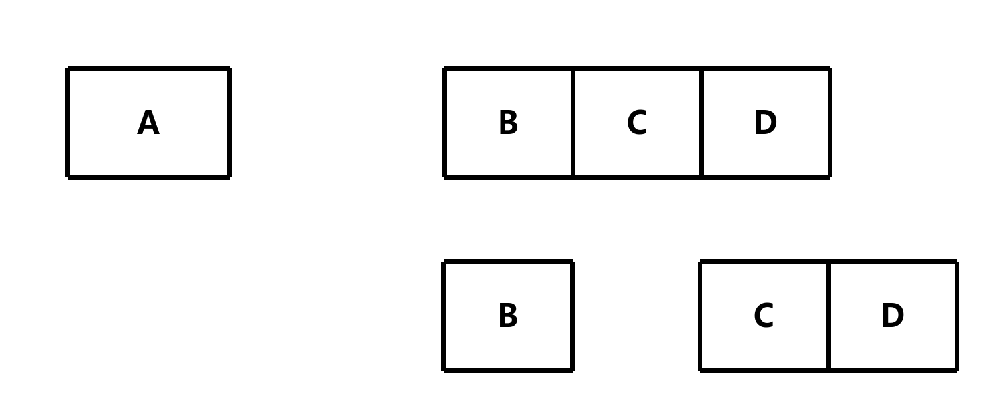
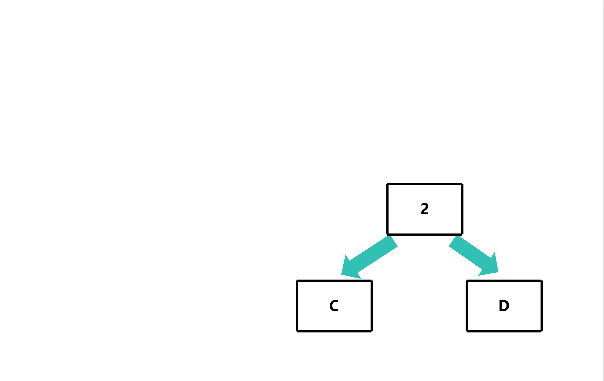

# 哈夫曼树

## 简介

### 哈夫曼编码

1951年，哈夫曼(Huffman)在麻省理工学院(MIT)攻读博士学位时，提出了一种编码方法，该方法完全依据字符出现概率来构造异字头的平均长度最短的码字，有时称之为最佳编码，一般就叫做Huffman编码(有时也称为霍夫曼编码)

#### 要求

- 一个字符对应一个二进制编码
- 压缩必须是无损的
- 独特的解码

### 哈夫曼树

给定n个权值作为n个叶子结点，构造一棵二叉树，若该树的带权路径长度(wpl)达到最小，称这样的二叉树为最优二叉树，也称为哈夫曼树(Huffman Tree)。哈夫曼树是带权路径长度最短的树，权值较大的结点离根较近

- 权值：该节点的权值，即该节点的出现频率

#### 原理

假设有一个数据源和一个接收端，数据源将数据传输给接收端

假设现在有A、B、C、D四个字符，且每个权值如下：

| 字符 | 权值 |
| :----: | :----: |
| A    | 0.25 |
| B    | 0.25 |
| C    | 0.25 |
| D    | 0.25 |

那么接收端收到数据后，该怎么决定那是什么字符呢？

那么接收端可以判断**是否为A或者B**

- 如果**是为A或者B**，那么接收端继续判断**是否是A**
    - 是A，那么接收端就知道了是A
    - 不是A，那么接收端就知道了是B

- 如果**不是为A或者B**，那么接收端继续判断**是否是C**
    - 是C，那么接收端就知道了是C
    - 不是C，那么接收端就知道了是D

然后，将是的结果变成1，不是的结果变成0，就可以得到一个二进制编码

| 字符 | 编码 |
| :----: | :----: |
| A    | 11   |
| B    | 10   |
| C    | 01   |
| D    | 00   |

但这是所有字符的权值都是一样的，那么如果权值不一样呢？

假设现在有A、B、C、D四个字符，且每个权值如下：

| 字符 | 权值 |
| :----: | :----: |
| A    | 0.5 |
| B    | 0.25 |
| C    | 0.125 |
| D    | 0.125 |

那么接收端收到数据后，该怎么决定那是什么字符呢？

首先，先**升序排序**权值，然后进行拆分**使得两边的权值尽可能接近**，然后继续拆分，直到拆分到不能拆分为止

此处拆分成 `A` 和 `BCD` ，然后 `BCD` 再拆分成 `B` 和 `CD`，然后 `CD` 再拆分成 `C` 和 `D`

然后，将每次拆分变成问题，即是否为A，是否为B，是否为C，然后将是的结果变成1，不是的结果变成0，就可以得到一个二进制编码

| 字符 | 编码 |
| :----: | :----: |
| A    | 1   |
| B    | 01   |
| C    | 001   |
| D    | 000   |

这样，就可以得到一个二进制编码，且权值越大的字符，编码越短

但是，一般不会使用权值，**而是使用频率**，因为频率越高，权值越大，所以可以使用频率来代替权值

## 实现

这里以 `A` 、 `B` 、 `C` 、 `D` 四个字符为例，且每个频率如下：

| 字符 | 频率 |
| :----: | :----: |
| A    | 5 |
| B    | 2 |
| C    | 1 |
| D    | 1 |

首先，先**升序排序**频率，然后取出两个**频率最小的**，即 `C`、`D`

然后，将两个频率最小的**合并**成一个节点，且节点的权值为两个节点的权值之和

然后，将合并后的节点**插入**到原来的节点中，然后**升序排序**频率，然后取出两个**频率最小的**，即 `B`、`CD`

继续上面的操作，直到所有的节点都被合并成一个节点，即根节点

