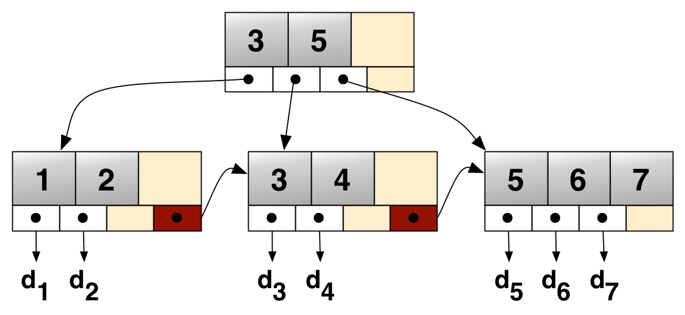

# B+树

B+树是一种平衡的多叉树，它是一种索引组织结构，能够在O(log n)时间内完成对数据的检索、插入和删除操作



## 应用

1. 数据库索引：B+树可以作为数据库索引结构，能够快速定位数据记录的物理位置
2. 文件系统：B+树可以作为文件系统的索引结构，能够快速定位文件数据所在的磁盘块
3. 内存索引：B+树可以作为内存索引结构，能够快速定位数据记录的物理位置

## 实现

### 1. 节点设计

1. 每个节点包含多个关键字，每个关键字都对应一个数据记录
2. 每个节点最多可以有 `关键字数量 + 1` 个子节点
3. 除根节点外，每个节点至少有 `m / 2` 个子节点，其中 `m` 为节点的最大子节点数
4. 只有叶子节点才存储数据，其他节点只存储索引
5. 叶子节点的关键字从小到大排列，内部节点的关键字从左到右排列
6. 每个叶子节点使用指针连接左右兄弟节点，方便快速遍历兄弟节点而**不需要回溯到父节点**

```c
#define MAX_KEY_NUM 4
#define MIN_KEY_NUM (MAX_KEY_NUM / 2)

typedef struct BPlusTreeNode {
    int keys[MAX_KEY_NUM + 1]; // 这里的额外的 1 是保留位，分裂前会有 `MAX_KEY_NUM+1` 个键值
    struct BPlusTreeNode *child[MAX_KEY_NUM+2]; // 子节点指针数组应该有 `keys_num+1` 个，但分裂前会有 `MAX_KEY_NUM+2` 个指针，因此多分配一个位置
    int keys_num;
    bool is_leaf; // 是否是叶子节点，只有叶子节点才可以存数据
    struct BPlusTreeNode *parent;

    /* 存储左右兄弟节点指针 (类似于双向链表)，用于快速遍历兄弟节点 */
    struct BPlusTreeNode *left_sibling; // 左兄弟节点
    struct BPlusTreeNode *right_sibling; // 右兄弟节点
} BPlusTreeNode;
```

- 这里 `keys` 和 `child` 需要额外的保留位，用于处理节点溢出的情况

### 2. 创建节点

```c
BPlusTreeNode* create_node(bool is_leaf)
{
    BPlusTreeNode* node = (BPlusTreeNode*)malloc(sizeof(BPlusTreeNode));
    node->keys_num = 0;
    node->is_leaf = is_leaf;
    node->parent = NULL;
    node->left_sibling = NULL;
    node->right_sibling = NULL;
    
    for (int i = 0; i <= MAX_KEY_NUM; i++)
    {
        node->child[i] = NULL;
    }
    
    return node;
}
```

### 3. 插入节点

- 插入操作要实现这三个步骤
    - 找到合适的叶子节点
    - 尝试将关键字插入到该节点
    - 如果节点溢出，则分裂节点

```c
BPlusTreeNode* bplus_tree_insert(BPlusTreeNode* root, int key);
```

1. 当树为空时，创建一个根节点，并将关键字插入到根节点

```c
BPlusTreeNode* bplus_tree_insert(BPlusTreeNode* root, int key)
{
    // 如果树为空，创建根节点（叶子节点）
    if (root == NULL)
    {
        root = create_node(true);
        insert_into_leaf(root, key);
        return root;
    }
}
```

2. 找到合适的叶子节点，并检查是否已经拥有相同的关键字 (可选)

```c
BPlusTreeNode* find_leaf_node(BPlusTreeNode* root, int key)
{
    BPlusTreeNode* current = root;
    
    while (!current->is_leaf) // 遍历内部节点
    {
        int i = 0;
        while (i < current->keys_num && key >= current->keys[i]) // 遍历当前节点
        {
            if (key < current->keys[i]) // 关键字比当前节点的关键字小，则选择当前关键字的子节点
            {
                break;
            }
            i++;
        }
        current = current->child[i]; // 选择子节点
    }
    
    return current;
}

BPlusTreeNode* bplus_tree_insert(BPlusTreeNode* root, int key)
{
    // 找到应该插入的叶子节点
    BPlusTreeNode* leaf = find_leaf_node(root, key);

    // 检查键值是否已存在
    for (int i = 0; i < leaf->keys_num; i++)
    {
        if (leaf->keys[i] == key)
        {
            printf("Key %d already exists in the tree.\n", key);
            return root;
        }
    }
}
```

3. 尝试插入关键字

```c
void insert_into_leaf(BPlusTreeNode* leaf, int key)
{
    int pos = find_insert_position(leaf, key);
    
    // 将键值向后移动，腾出位置
    for (int i = leaf->keys_num; i > pos; i--)
    {
        leaf->keys[i] = leaf->keys[i-1];
    }
    
    // 插入新键值
    leaf->keys[pos] = key;
    leaf->keys_num++;
}

BPlusTreeNode* bplus_tree_insert(BPlusTreeNode* root, int key)
{
    // 插入到叶子节点
    insert_into_leaf(leaf, key);
}
```

- 这里使用尝试插入的方式，因为可能会出现节点溢出 (Node Overflow，即节点的关键字数量超过最大值)，此时需要分裂节点

### 4. 分裂节点

- 这里叶子节点和内部节点的分裂方式不同

#### 1. 叶子节点分裂

```c
BPlusTreeNode* split_leaf_node(BPlusTreeNode* leaf, int* promoted_key);
```

- `leaf`: 要分裂的叶子节点
- `promoted_key`: 分裂后的关键字，即原节点的中间位置的关键字

1. 找到分裂点 (即节点的中间位置)，用于将原节点分裂成两个节点，左边的节点包含左半部分关键字，右边的节点包含右半部分关键字

```c
BPlusTreeNode* split_leaf_node(BPlusTreeNode* leaf, int* promoted_key)
{
    // 创建新的叶子节点
    BPlusTreeNode* new_leaf = create_node(true);
    
    // 确定分裂点（中间位置）
    int split_point = (leaf->keys_num + 1) / 2;
}
```

2. 将**原节点的右半部分关键字**移到新节点

```c
BPlusTreeNode* split_leaf_node(BPlusTreeNode* leaf, int* promoted_key)
{
    // 将一半键值移到新节点
    int new_index = 0;
    for (int i = split_point; i < leaf->keys_num; i++)
    {
        new_leaf->keys[new_index++] = leaf->keys[i];
    }
}
```

3. 更新原节点和新节点

- 需要更新 `节点键值数量` 、`兄弟指针` 和 `父节点`

```c
BPlusTreeNode* split_leaf_node(BPlusTreeNode* leaf, int* promoted_key)
{
    // 更新节点键值数量
    new_leaf->keys_num = leaf->keys_num - split_point;
    leaf->keys_num = split_point;
    
    // 提升的键值是new_leaf的第一个键值
    *promoted_key = new_leaf->keys[0];
    
    // 更新兄弟指针
    new_leaf->right_sibling = leaf->right_sibling;
    new_leaf->left_sibling = leaf;
    
    if (leaf->right_sibling != NULL)
    {
        leaf->right_sibling->left_sibling = new_leaf;
    }
    
    leaf->right_sibling = new_leaf;
    
    // 新节点与父节点相同
    new_leaf->parent = leaf->parent;
    
    return new_leaf;
}
```

- 这里保存的是原节点的中间位置的关键字，用于之后更新父节点
- 更新 `兄弟指针` 的方式类似于双向链表
    1. 将原节点的右兄弟节点的左指针指向新节点
    2. 将节点的左兄弟节点的右指针指向原节点

#### 2. 内部节点分裂

```c
BPlusTreeNode* split_internal_node(BPlusTreeNode* internal, int* promoted_key);
```

- `internal`: 要分裂的内部节点
- `promoted_key`: 分裂后的关键字，即原节点的中间位置的关键字

1. 找到分裂点 (即节点的中间位置)，用于将原节点分裂成两个节点，左边的节点包含左半部分关键字，右边的节点包含右半部分关键字

```c
BPlusTreeNode* split_internal_node(BPlusTreeNode* internal, int* promoted_key)
{
    // 创建新的内部节点
    BPlusTreeNode* new_internal = create_node(false);
    
    // 确定分裂点
    int split_point = internal->keys_num / 2;
}
```

2. 保存要提升的键值

- 这里保存的是原节点的中间位置的关键字，用于之后更新父节点

```c
BPlusTreeNode* split_internal_node(BPlusTreeNode* internal, int* promoted_key)
{
    // 保存要提升的键值
    *promoted_key = internal->keys[split_point];
}
```

3. 将**原节点的右半部分关键字和子节点** (不只有关键字，还有子节点) 移到新节点

```c
BPlusTreeNode* split_internal_node(BPlusTreeNode* internal, int* promoted_key)
{
    // 复制一半键值到新节点
    int new_index = 0;
    for (int i = split_point + 1; i < internal->keys_num; i++)
    {
        new_internal->keys[new_index++] = internal->keys[i];
    }
    
    // 复制子指针到新节点
    int child_index = 0;
    for (int i = split_point + 1; i <= internal->keys_num; i++)
    {
        new_internal->child[child_index++] = internal->child[i];
        if (internal->child[i] != NULL) // 如果子节点不为空，则更新父节点
        {
            internal->child[i]->parent = new_internal;
        }
    }
}
```

4. 更新原节点和新节点

- 需要更新 `节点键值数量` 和 `父节点`

```c
BPlusTreeNode* split_internal_node(BPlusTreeNode* internal, int* promoted_key)
{
    // 更新节点键值数量
    new_internal->keys_num = internal->keys_num - split_point - 1;
    internal->keys_num = split_point;
    
    // 新节点与父节点相同
    new_internal->parent = internal->parent;
}
```

### 5. 完善插入操作

1. 如果节点没有溢出，直接返回

```c
BPlusTreeNode* bplus_tree_insert(BPlusTreeNode* root, int key)
{
    // 如果叶子节点没有溢出，直接返回
    if (leaf->keys_num <= MAX_KEY_NUM)
    {
        return root;
    }
}
```

2. 如果节点溢出，则分裂节点

```c
BPlusTreeNode* bplus_tree_insert(BPlusTreeNode* root, int key)
{
    // 叶子节点溢出，需要分裂
    BPlusTreeNode* current = leaf;
    int promoted_key;
    BPlusTreeNode* new_child = NULL;

    while (current->keys_num > MAX_KEY_NUM) // 使用循环，处理所有需要分裂的节点
    {
        if (current->is_leaf)
        {
            new_child = split_leaf_node(current, &promoted_key);
        }
        else
        {
            new_child = split_internal_node(current, &promoted_key);
        }
    }
}
```

3. 处理键值提升的情况

- 如果当前节点是根节点，创建新的根节点

```c
BPlusTreeNode* bplus_tree_insert(BPlusTreeNode* root, int key)
{
    // 叶子节点溢出，需要分裂
    BPlusTreeNode* current = leaf;
    int promoted_key;
    BPlusTreeNode* new_child = NULL;

    while (current->keys_num > MAX_KEY_NUM) // 使用循环，处理所有需要分裂的节点
    {
        if (current->is_leaf)
        {
            new_child = split_leaf_node(current, &promoted_key);
        }
        else
        {
            new_child = split_internal_node(current, &promoted_key);
        }

        // 如果当前节点是根节点，创建新的根节点
        if (current->parent == NULL)
        {
            BPlusTreeNode* new_root = create_node(false);
            new_root->keys[0] = promoted_key;
            new_root->keys_num = 1;
            new_root->child[0] = current;
            new_root->child[1] = new_child;
            
            current->parent = new_root;
            new_child->parent = new_root;
            
            root = new_root;
            break;
        }
    }
}
```

- 如果当前节点不是根节点，则将提升的键值插入到父节点

```c
void insert_into_internal(BPlusTreeNode* node, int key, BPlusTreeNode* right_child)
{
    int pos = find_insert_position(node, key);
    
    // 移动键值为新键值腾出空间
    for (int i = node->keys_num; i > pos; i--)
    {
        node->keys[i] = node->keys[i-1];
    }
    
    // 移动子指针
    for (int i = node->keys_num + 1; i > pos + 1; i--)
    {
        node->child[i] = node->child[i-1];
    }
    
    // 插入新键值和子指针
    node->keys[pos] = key;
    node->child[pos + 1] = right_child;
    node->keys_num++;
    
    if (right_child != NULL)
    {
        right_child->parent = node;
    }
}
```

```c
BPlusTreeNode* bplus_tree_insert(BPlusTreeNode* root, int key)
{
    // 叶子节点溢出，需要分裂
    BPlusTreeNode* current = leaf;
    int promoted_key;
    BPlusTreeNode* new_child = NULL;

    while (current->keys_num > MAX_KEY_NUM) // 使用循环，处理所有需要分裂的节点
    {
        if (current->is_leaf)
        {
            new_child = split_leaf_node(current, &promoted_key);
        }
        else
        {
            new_child = split_internal_node(current, &promoted_key);
        }

        // 如果当前节点是根节点，创建新的根节点
        if (current->parent == NULL)
        {
            BPlusTreeNode* new_root = create_node(false);
            new_root->keys[0] = promoted_key;
            new_root->keys_num = 1;
            new_root->child[0] = current;
            new_root->child[1] = new_child;
            
            current->parent = new_root;
            new_child->parent = new_root;
            
            root = new_root;
            break;
        }
        else
        {
            // 否则，将提升的键值插入到父节点
            insert_into_internal(current->parent, promoted_key, new_child);
            current = current->parent;
        }
    }

    return root;
}
```