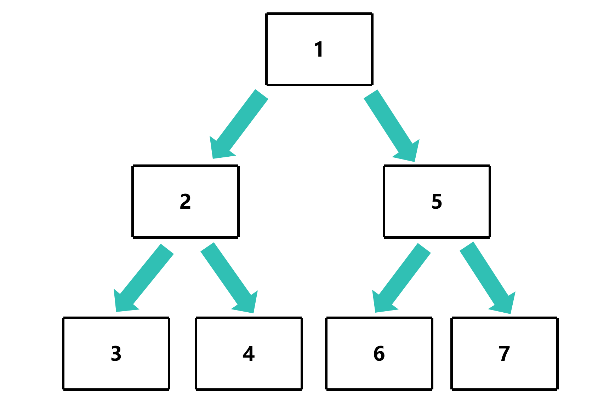
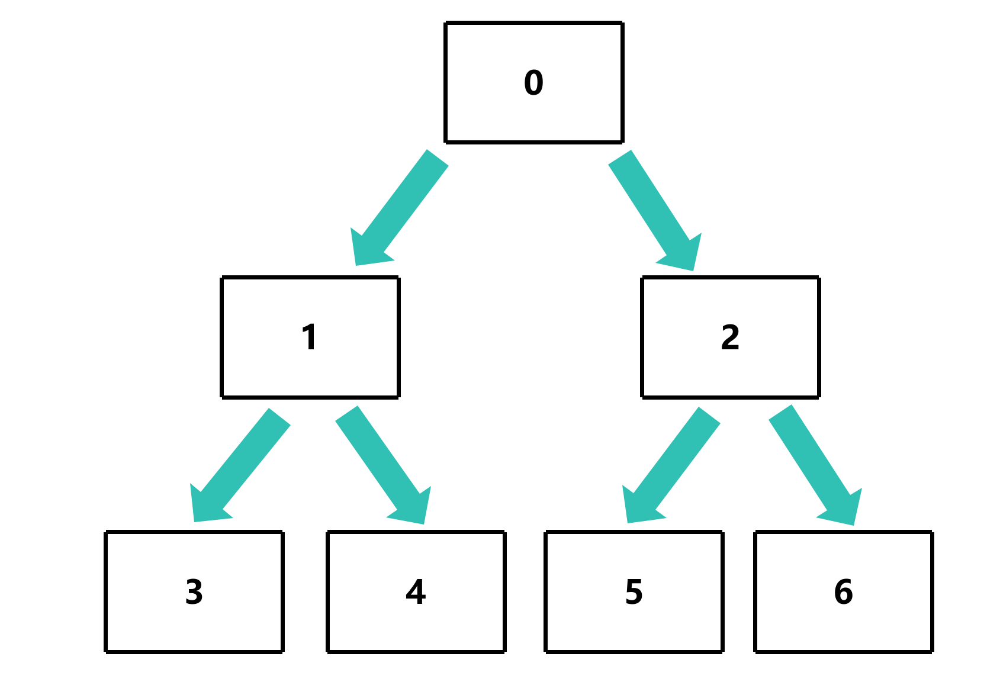

# 深度优先搜索

## 定义

深度优先搜索（Depth First Search，DFS）是一种用于遍历或搜索树或图的算法。沿着树的深度遍历树的节点，尽可能深的搜索树的分支。当节点v的所在边都己被探寻过或者在搜寻时结点不满足条件，搜索将回溯到发现节点v的那条边的起始节点。整个进程反复进行直到所有节点都被访问为止。**属于盲目搜索**

## 图解

**图中节点的数字代表访问的顺序**



## 代码实现

```c
void print_depth_first_search(TreeNode *root)
```
- root: 根节点

### 创建栈

使用栈用于一个一个访问节点

```c
void print_depth_first_search(TreeNode *root)
{
    TreeNode *stack[100]; // 创建栈
    size_t stack_num = 0; // 栈的大小
}
```

### 将栈的初始值设置为根节点

```c
void print_depth_first_search(TreeNode *root)
{
    TreeNode *stack[100]; // 创建栈
    size_t stack_num = 0; // 栈的大小

    stack[stack_num++] = root; // 将根节点入栈
}
```

### 循环遍历节点

```c
void print_depth_first_search(TreeNode *root)
{
    TreeNode *stack[100]; // 创建栈
    size_t stack_num = 0; // 栈的大小

    stack[stack_num++] = root; // 将根节点入栈

    while (stack_num > 0)
    {
        TreeNode *curr = stack[--stack_num]; // 出栈
    }
}
```

### 访问节点

```c
void print_depth_first_search(TreeNode *root)
{
    TreeNode *stack[100]; // 创建栈
    size_t stack_num = 0; // 栈的大小

    stack[stack_num++] = root; // 将根节点入栈

    while (stack_num > 0)
    {
        TreeNode *curr = stack[--stack_num]; // 前面的节点先出栈

        printf("节点的值：%d\n", curr->val); // 访问节点
    }
}
```

### 向栈中添加子节点

通过判断子节点是否为 `NULL` 来判断是否有子节点

```c
void print_depth_first_search(TreeNode *root)
{
    TreeNode *stack[100]; // 创建栈
    size_t stack_num = 0; // 栈的大小

    stack[stack_num++] = root; // 将根节点入栈

    while (stack_num > 0)
    {
        TreeNode *curr = stack[--stack_num]; // 前面的节点先出栈

        printf("%d ", curr->val); // 访问节点

        if (curr->right != NULL)
        {
            stack[stack_num++] = curr->right; // 将右子节点入栈
        }
        if (curr->left != NULL)
        {
            stack[stack_num++] = curr->left; // 将左子节点入栈
        }
    }
    printf("\n");
}
```

[源代码](深度优先搜索.c)

### 测试

```c
TreeNode *root = new_node(0);
root->left = new_node(1);
root->right = new_node(2);
root->left->left = new_node(3);
root->left->right = new_node(4);
root->right->left = new_node(5);
root->right->right = new_node(6);
```



```bash
gcc -o dfs dfs.c
./dfs
0 1 3 4 2 5 6
```

可以看到，深度优先搜索是先访问根节点，然后访问左子节点，最后访问右子节点