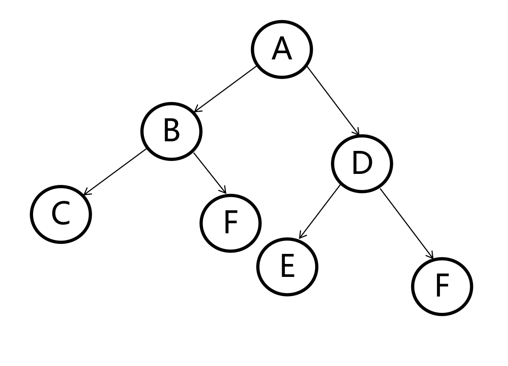

# 树、二叉树与森林之间的关系

- 树是n（n>=0）个结点的有限集
  - 有且仅有一个特定的称为根的结点
  - 当n>1时，其余结点可分为m（m>0）个互不相交的有限集，其中每个集合本身又是一个树，并且称为根的子树

- 二叉树是**树的一种特殊形式**
  - 每个结点最多有两个子树
  - 左子树和右子树是有顺序的
  - 即使某结点只有一棵子树，也要区分它是左子树还是右子树
  - 如果所有的子树都有左右子树，并且次序不能任意颠倒，那么这个二叉树就是**完全二叉树**

- 森林是**m（m>=0）棵互不相交的树的集合**
 - 对树中每个结点而言，其**子树的集合即为森林**

## 相互转换

首先需要了解两个概念

- **兄弟** —— 同一层的结点互称兄弟

 - 在此图中，B、C、D互为兄弟

- **孩子** —— 某结点的子树的根结点称为该结点的孩子
 - **左孩子** —— 某结点的左子树的根结点称为该结点的左孩子
 - **右孩子** —— 某结点的右子树的根结点称为该结点的右孩子

- 在此图中，C是B的孩子，A是B的孩子

### 树转换为二叉树

1. 树的根结点作为二叉树的根结点
2. 所有的左孩子都作为二叉树的左子树
3. 右兄弟节点作为二叉树的右子树，**并断开与父节点的关系**

### 森林转换为二叉树

1. 将森林中的每棵树中的兄弟节点连接，只**保留最左边的兄弟节点与父节点的关系**
2. 连接森林中的每棵树的根节点

### 二叉树转换为森林

1. 断开所有右子树
2. 所有的左孩子连接到根节点

