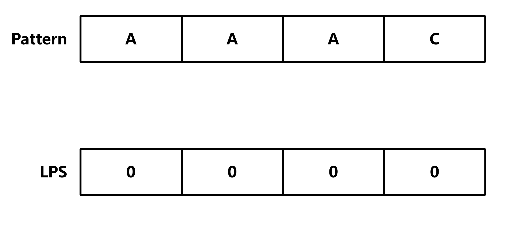
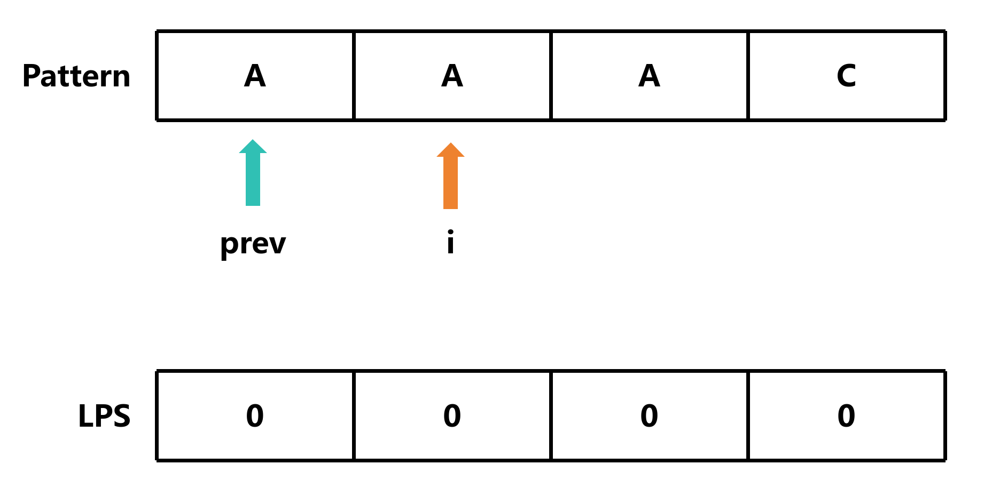
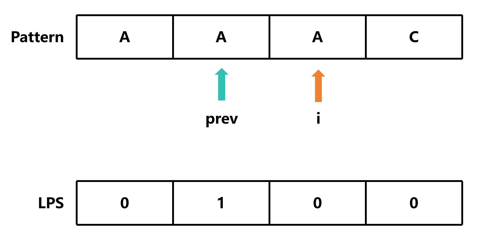
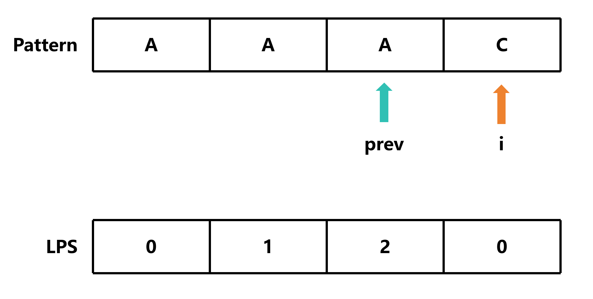
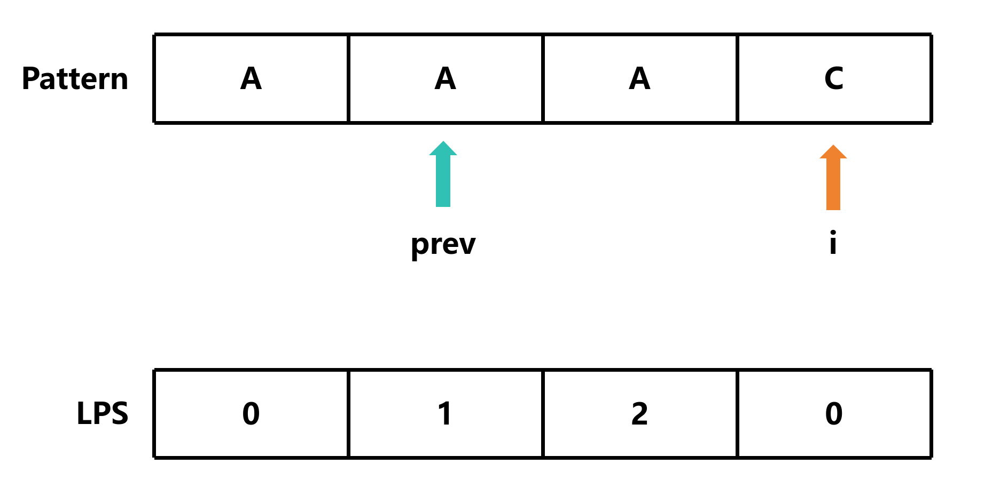
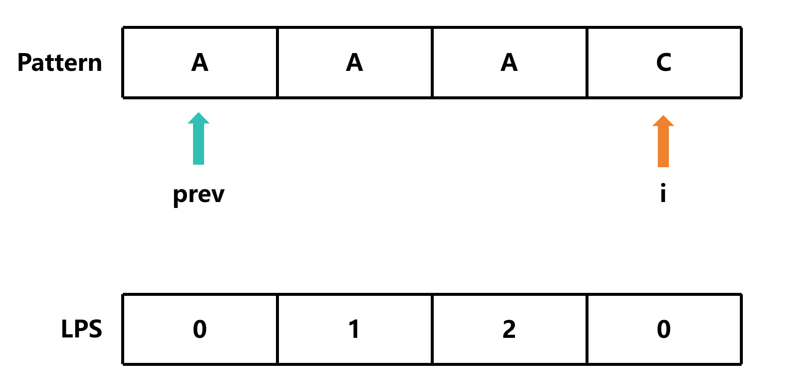
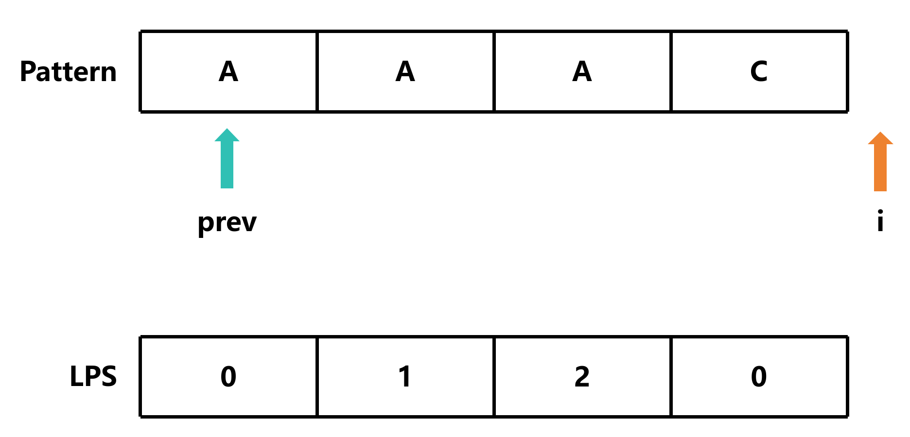

# KMP算法

## 定义

KMP (Knuth-Morris-Pratt) 算法是一种改进的字符串匹配算法，由 D.E.Knuth，J.H.Morris 和 V.R.Pratt 三人于 1977 年联合发表，故取这 3 人的姓氏命名此算法

**在了解KMP算法之前，我们先了解一下什么是最长公共前后缀**

假设字符串为`ababab`，那么它的最长公共前后缀为`abab`

在KMP算法中，我们需要计算出每个子串的最长公共前后缀，然后根据最长公共前后缀来移动指针，从而避免了重复计算

## 计算最长公共前后缀

### 准备工作

- 一个数组`LPS`，用来存储每个子串的最长公共前后缀的长度
- 一个指针`prev`，用来记录当前位置的最长公共前后缀的长度
- 一个指针`i`，用来遍历字符串

### 算法步骤

#### 初始化

- len —— 模式串的长度
- `pattern` —— 模式串，即我们要在str中查找的子串

```c
int *longestCommonPrefix(char *pattern, int len)
{
    int *LPS = calloc(len, sizeof(int));
    int prev = 0;
    int i = 1;
}
```

但是，假如传入的pattern长度为1，那么我们就不需要计算最长公共前后缀了，直接返回0即可

```c
int *longestCommonPrefix(char *pattern, int len)
{
    int *LPS = calloc(len, sizeof(int));
    int prev = 0;
    int i = 1;

    if (len == 1) return LPS;
}
```

#### 遍历字符串

**遍历字符串，从第二个字符开始**

```c
int *longestCommonPrefix(char *pattern, int len)
{
    int *LPS = calloc(len, sizeof(int));
    int prev = 0;
    int i = 1;

    if (len == 1) return LPS;

    while (i < len)
    {
        // TODO
    }
    return LPS;
}
```

#### 比较 `pattern[i]` 和 `pattern[prev]`

如果 `pattern[i] == pattern[prev]`，那么我们就可以将 `prev` 加 1，然后将 `LPS[i]` 赋值为 `prev`

```c
int *longestCommonPrefix(char *pattern, int len)
{
    int *LPS = calloc(len, sizeof(int));
    int prev = 0;
    int i = 1;

    if (len == 1) return LPS;

    while (i < len)
    {
        if (pattern[i] == pattern[prev])
        {
            LPS[i] = prev + 1;
            prev++;
            i++;
        }
    }
    return LPS;
}
```

如果 `pattern[i] != pattern[prev]`，那么我们就需要将 `prev` 赋值为 `LPS[prev - 1]`，然后再次比较 `pattern[i]` 和 `pattern[prev]`

```c
int *longestCommonPrefix(char *pattern, int len)
{
    int *LPS = calloc(len, sizeof(int));
    int prev = 0;
    int i = 1;

    if (len == 1) return LPS;

    while (i < len)
    {
        if (pattern[i] == pattern[prev])
        {
            LPS[i] = prev + 1;
            prev++;
            i++;
        }
        else
        {
            prev = LPS[prev - 1];
        }
    }
    return LPS;
}
```

如果 `prev == 0`，那么我们就需要将 `LPS[i]` 赋值为 0，然后将 `i` 加 1

```c
int *longestCommonPrefix(char *pattern, int len)
{
    int *LPS = calloc(len, sizeof(int));
    int prev = 0;
    int i = 1;

    if (len == 1) return LPS;

    while (i < len)
    {
        if (pattern[i] == pattern[prev])
        {
            LPS[i] = prev + 1;
            prev++;
            i++;
        }
        else if (prev == 0)
        {
            LPS[i] = 0;
            i++;
        }
        else
        {
            prev = LPS[prev - 1];
        }
    }
    return LPS;
}
```

### 原理

这里以 `AAAC` 为例

由于刚开始的时候，子串的长度为1，所以我们不需要计算最长公共前后缀，即`LPS[0]`为0



然后我们开始遍历字符串，从第二个字符开始



由于 `pattern[1] == pattern[0]`，所以我们将 `prev` 加 1，然后将 `LPS[1]` 赋值为 `prev`



然后我们开始遍历字符串，从第二个字符开始

由于 `pattern[1] == pattern[0]`，所以我们将 `prev` 加 1，然后将 `LPS[1]` 赋值为 `prev`



由于 `pattern[3] != pattern[2]`，所以我们就需要将 `prev` 赋值为 `LPS[prev - 1]`，然后再次比较 `pattern[i]` 和 `pattern[prev]`



由于 `pattern[3]!= pattern[1]`，所以我们就需要将 `prev` 赋值为 `LPS[prev - 1]`，然后再次比较 `pattern[i]` 和 `pattern[prev]`



由于 `prev == 0`，所以我们就需要将 `LPS[i]` 赋值为 0，然后将 `i` 加 1



#### 为什么这样是可行的？

因为我们**已经知道了前面一个子串的最长公共前后缀为1**，**说明前面的元素是相同的**


所以我们只需要**判断当前元素是否与前面的元素相同**，如果相同，那么我们就可以将 `prev` 加 1，然后将 `LPS[i]` 赋值为 `prev`


如果不同，那么我们就需要将 `prev` 赋值为 `LPS[prev - 1]`，然后再次比较 `pattern[i]` 和 `pattern[prev]`，直到 `prev == 0`

如果 `prev == 0`，那么我们就需要将 `LPS[i]` 赋值为 0，然后将 `i` 加 1

这样可以避免重复计算

## 实现KMP算法

### 准备工作

- 一个指针`i`，用来遍历字符串
- 一个指针`j`，用来遍历模式串
- 一个数组`LPS`，用来存储每个子串的最长公共前后缀的长度 (**通过前面的步骤计算**)

### 算法步骤

#### 初始化

- `str` —— 字符串，即我们要在其中查找的子串
- `pattern` —— 模式串，即我们要在str中查找的子串

```c
int KMP(char *str, char *pattern)
{
    int str_len = strlen(str);
    int pattern_len = strlen(pattern);
    int i = 0;
    int j = 0;
    int *LPS = longestCommonPrefix(pattern, pattern_len);
}
```

#### 遍历字符串

**遍历字符串，从第一个字符开始**

```c
int KMP(char *str, char *pattern)
{
    int str_len = strlen(str);
    int pattern_len = strlen(pattern);
    int i = 0;
    int j = 0;
    int *LPS = longestCommonPrefix(pattern, pattern_len);

    while (i < str_len)
    {
        // TODO
    }
}
```

#### 比较 `str[i]` 和 `pattern[j]`

比较 `str[i]` 和 `pattern[j]` 用于**判断当前字符是否匹配，即决定是否移动指针**

如果 `str[i] == pattern[j]`，那么我们就需要将 `i` 和 `j` 都加 1

```c
int KMP(char *str, char *pattern)
{
    int str_len = strlen(str);
    int pattern_len = strlen(pattern);
    int i = 0;
    int j = 0;
    int *LPS = longestCommonPrefix(pattern, pattern_len);

    while (i < str_len)
    {
        if (str[i] == pattern[j])
        {
            i++;
            j++;
        }
    }
}
```

如果 `str[i] != pattern[j]`，那么我们就需要将 `j` 赋值为 `LPS[j - 1]`，然后再次比较 `str[i]` 和 `pattern[j]`

```c
int KMP(char *str, char *pattern)
{
    int str_len = strlen(str);
    int pattern_len = strlen(pattern);
    int i = 0;
    int j = 0;
    int *LPS = longestCommonPrefix(pattern, pattern_len);

    while (i < str_len)
    {
        if (str[i] == pattern[j])
        {
            i++;
            j++;
        }
        else
        {
            j = LPS[j - 1];
        }
    }
}
```

但是，假如 `j == 0`，意味着我们**已经遍历完了模式串，但是还没有找到匹配的子串**，所以我们需要将 `i` 加 1

```c
int KMP(char *str, char *pattern)
{
    int str_len = strlen(str);
    int pattern_len = strlen(pattern);
    int i = 0;
    int j = 0;
    int *LPS = longestCommonPrefix(pattern, pattern_len);

    while (i < str_len)
    {
        if (str[i] == pattern[j])
        {
            i++;
            j++;
        }
        else
        {
            if (j == 0)
            {
                i++;
            }
            else
            {
                j = LPS[j - 1];
            }
        }
    }
}
```

#### 判断是否匹配

如果 `j == pattern_len`，那么模式串已经匹配完毕，我们可以返回匹配的起始位置，即 `i - j`

```c
int KMP(char *str, char *pattern)
{
    int str_len = strlen(str);
    int pattern_len = strlen(pattern);
    int i = 0;
    int j = 0;
    int *LPS = longestCommonPrefix(pattern, pattern_len);

    while (i < str_len)
    {
        if (str[i] == pattern[j])
        {
            i++;
            j++;
        }
        else
        {
            if (j == 0)
            {
                i++;
            }
            else
            {
                j = LPS[j - 1];
            }
        }

        if (j == pattern_len)
        {
            free(LPS);
            return i - j;
        }
    }
    free(LPS);
    return -1;
}
```

[源代码](KMP.c)

## 总结

KMP算法的核心在于计算最长公共前后缀，然后**根据最长公共前后缀来移动指针，跳过已经匹配的子串**，从而避免了重复计算