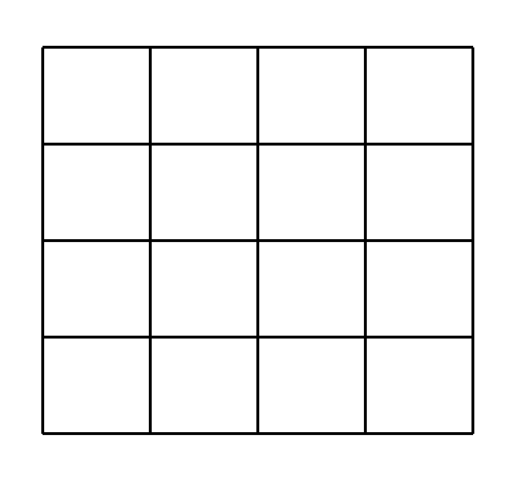
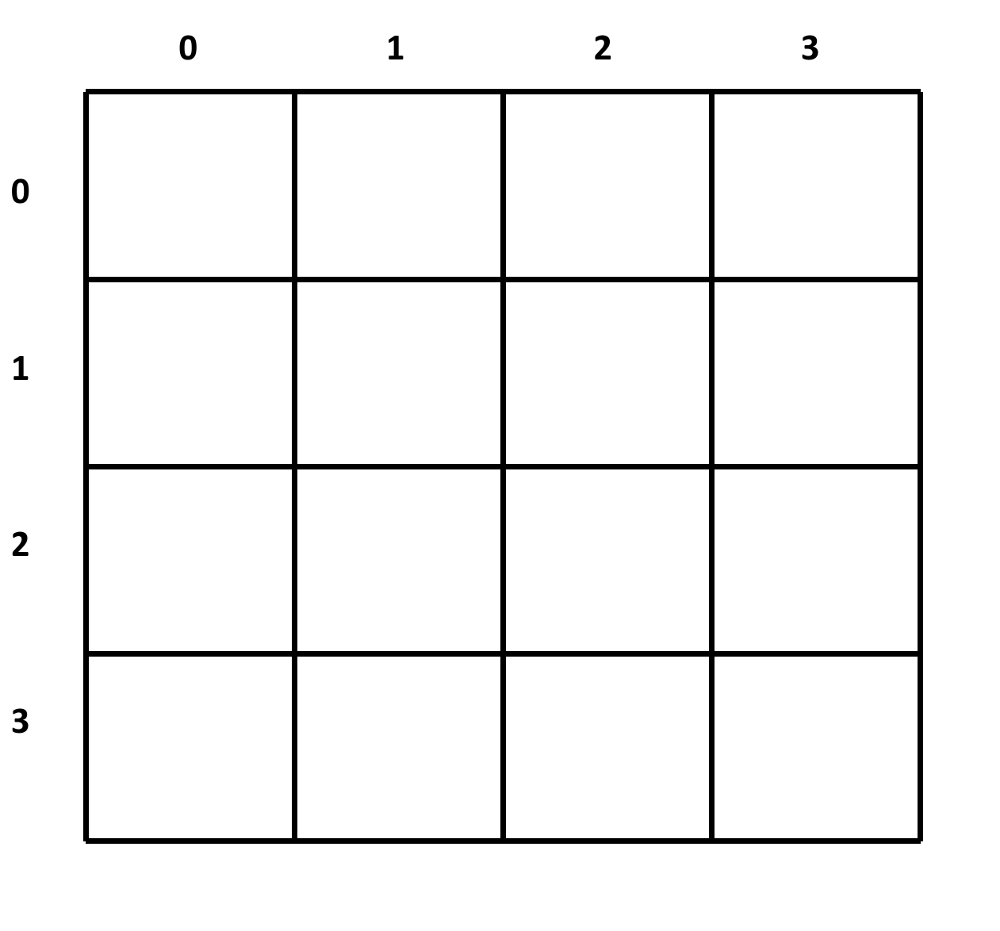
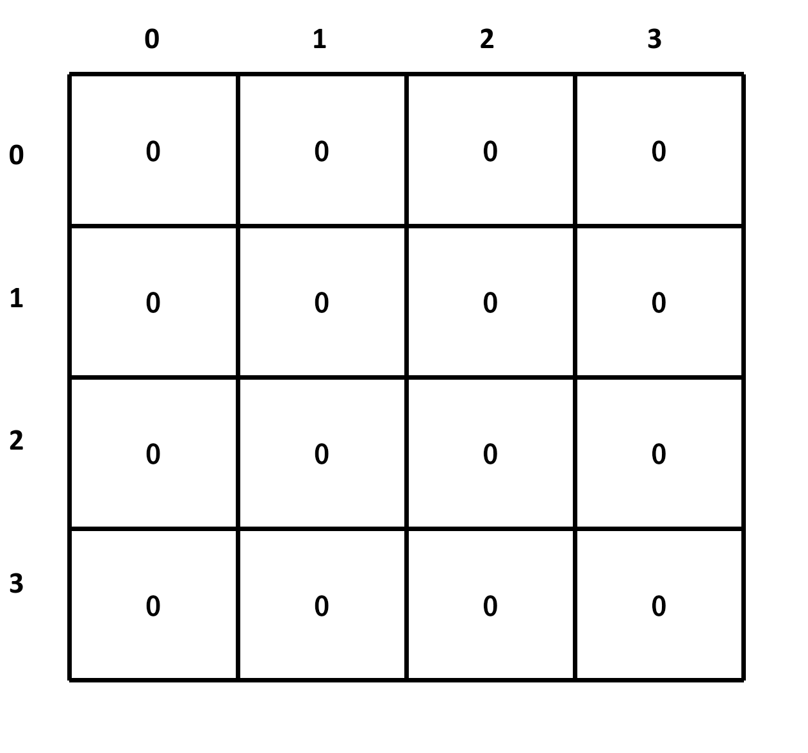
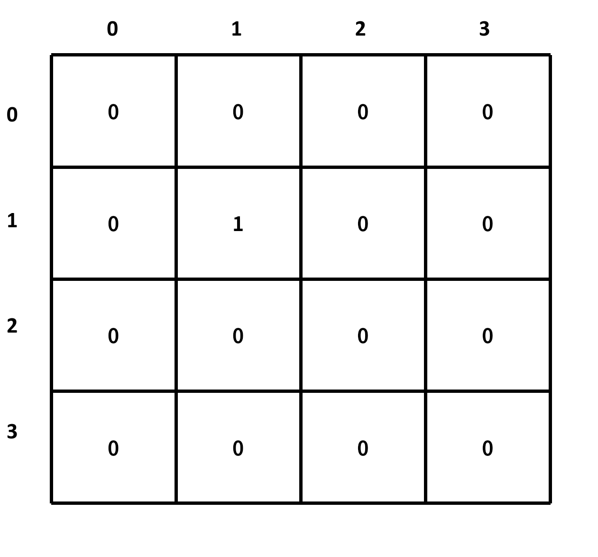
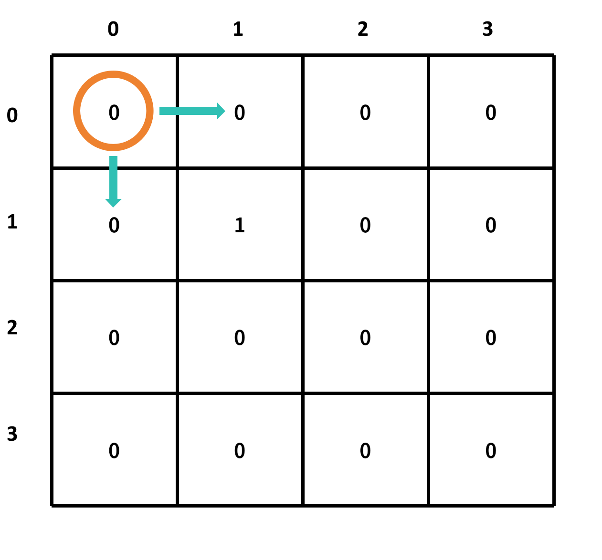
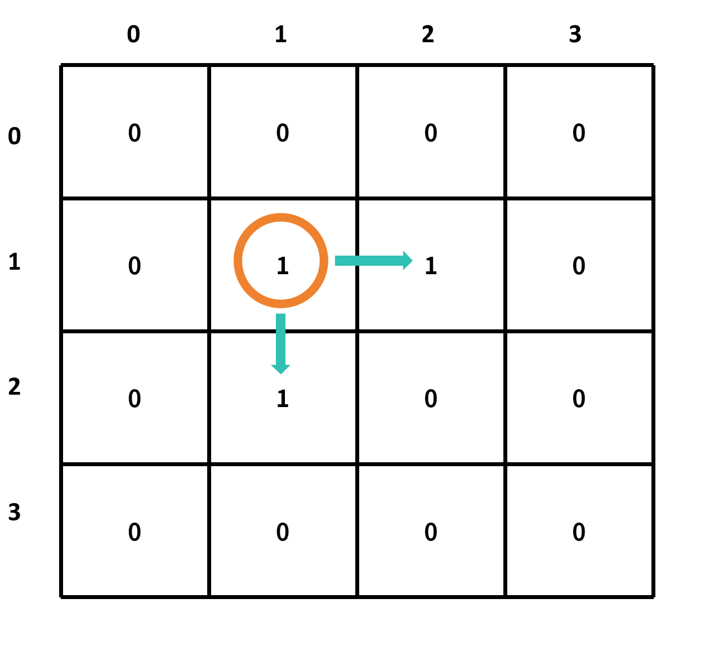
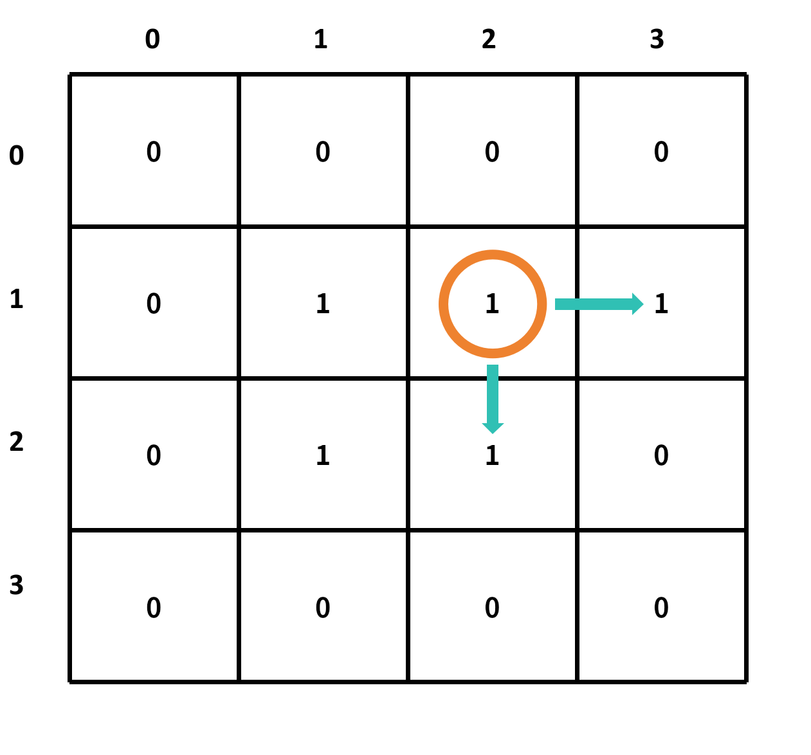
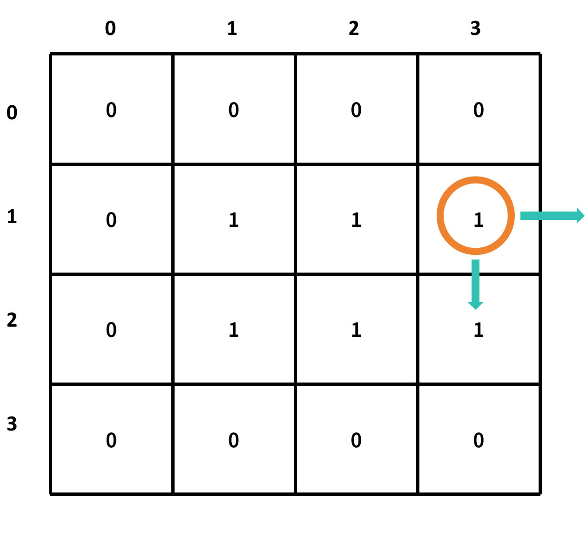
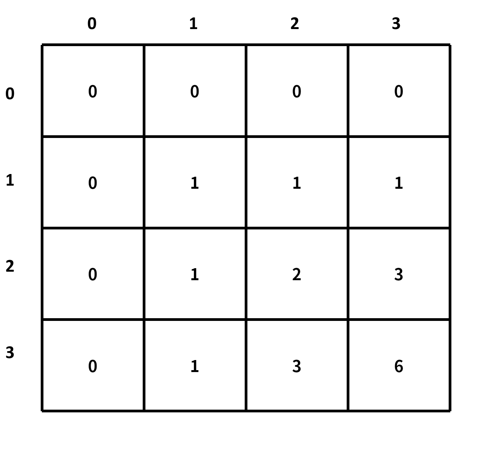

# gridTraveler

## 题目描述

假设你正在一个 m x n 的网格中，你只能向下或向右移动一步。你从网格的左上角开始，你的目的地是网格的右下角。请你计算出从起点到终点的不同路径数

示例:

gridTraveler(1, 1) => 1
gridTraveler(2, 3) => 3
gridTraveler(3, 2) => 3
gridTraveler(3, 3) => 6

## 解题思路

这里以 `gridTraveler(3, 3)` 为例

我们可以先画一个 4 x 4 ((m + 1) x (n + 1)) 的网格



设置索引从0开始，从左上角开始，到右下角结束



由于这是一道计数题，那么最好将每个格子全部初始化为 0



**现在需要设置初始条件，也就是我们的边界条件，由于 `gridTraveler(1, 1)` 只有一种走法，那么我们将 `gridTraveler(1, 1)` 初始化为 1**



我们开始遍历，从左上角开始，到右下角结束，遍历的过程中，每个格子的值等于它左边格子的值加上它上边格子的值






**注意：如果只碰到一侧的边界，那么它的值等于它的另一侧的值**



最后返回右下角的值，即 grid[3][3]的值



```c
size_t gridTraveler(size_t m, size_t n)
{
    size_t grid[m + 1][n + 1]; // 创建一个 m+1 x n+1 的二维数组
    memset(grid, 0, sizeof(grid)); // 将数组初始化为 0
    grid[1][1] = 1; // 初始条件，左上角只有一种走法
    for (size_t i = 1; i <= m; i++) // 遍历行
    {
        for (size_t j = 1; j <= n; j++) // 遍历列
        {
            size_t current = grid[i][j]; // 当前格子的值
            if (j + 1 <= n) // 如果没有碰到右侧边界
            {
                grid[i][j + 1] += current; // 右侧格子的值加上当前格子的值
            }
            if (i + 1 <= m) // 如果没有碰到下侧边界
            {
                grid[i + 1][j] += current; // 下侧格子的值加上当前格子的值
            }
        }
    }
    return grid[m][n]; // 返回右下角的值
}
```

此时的时间复杂度为 O(mn)，空间复杂度为 O(mn)