# canSum

## 题目描述

给定一个整数数组和一个目标值，判断数组中是否存在两个数的和等于目标值

示例:

canSum(7, [5, 3, 4, 7]) -> True
canSum(7, [2, 4]) -> False
canSum(8, [2, 3, 5]) -> True
canSum(300, [7, 14]) -> False

## 解题思路

**这里以canSum(7, [5, 3, 4])为例**

首先确定表格的大小和存储的内容

**由于我们要判断是否存在两个数的和等于目标值**，所以表格的大小为目标值+1

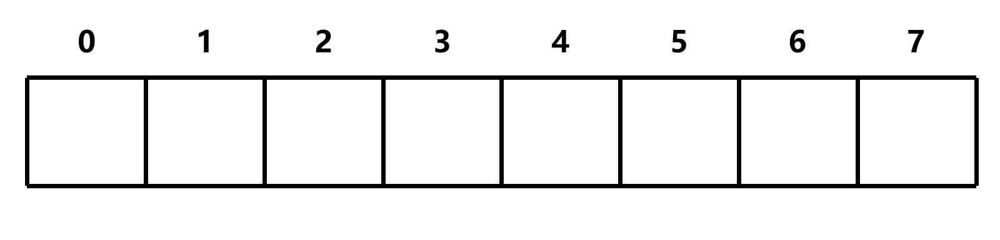

**由于我们要返回一个布尔值**，所以表格的初始值为布尔值，这里我们将表格的初始值都设为False

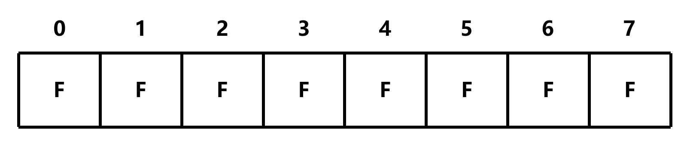

接下来设置种子，即边界条件

由于 `canSum(0, [...])` 无论如何都可以得到0，所以表格的第0列都为True

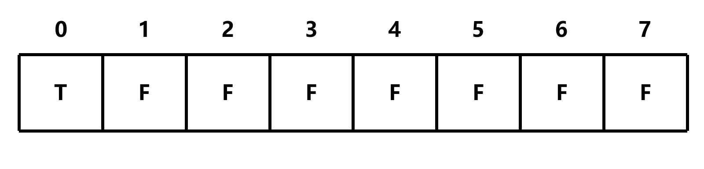

然后遍历数组，将传入的数组中的元素作为偏移量

由于数组包含5，那么可以 0+5=5，所以表格的第5个元素为True

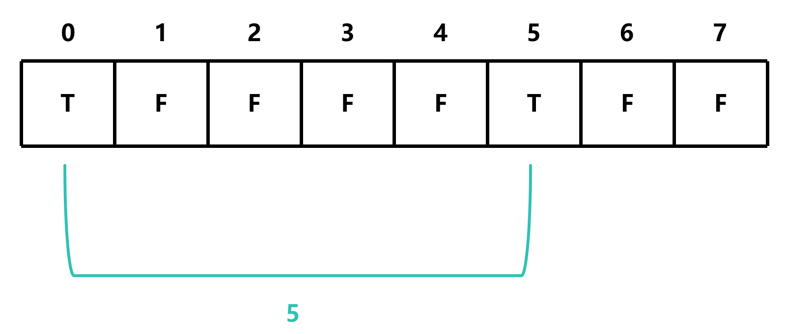

同样的，由于数组包含3、4，那么可以 0+3=3，0+4=4，所以表格的第3个元素和第4个元素为True

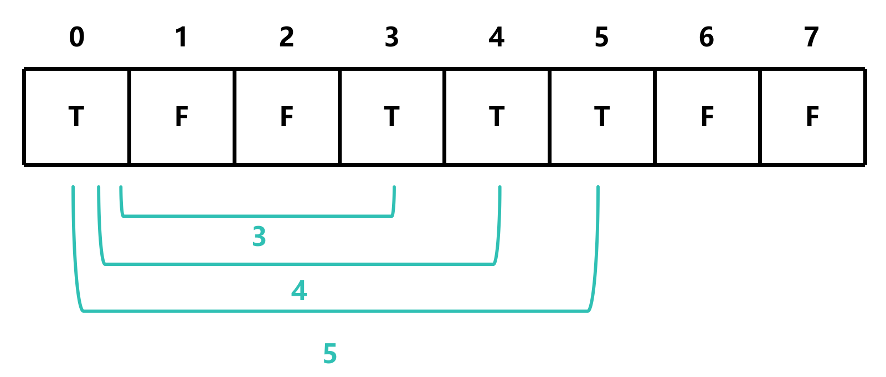

然后，将指针向后移一位

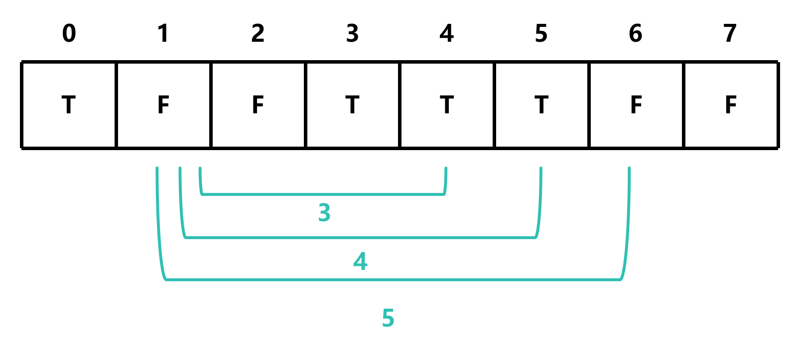

由于1的位置为False，所以指针继续向后移，然后重复上面的步骤

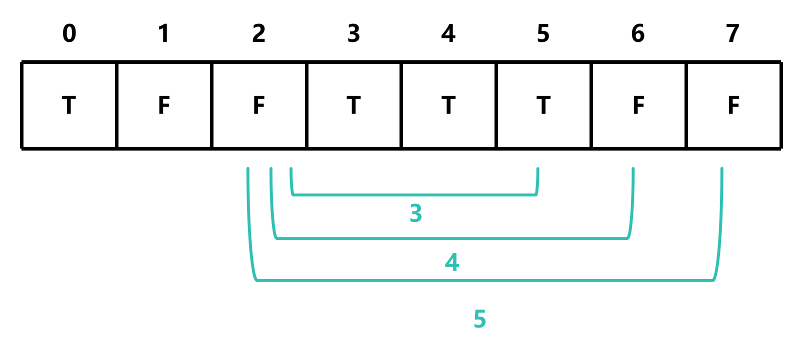

如果指针加上偏移量等于或大于表格的长度，那么舍弃该偏移量

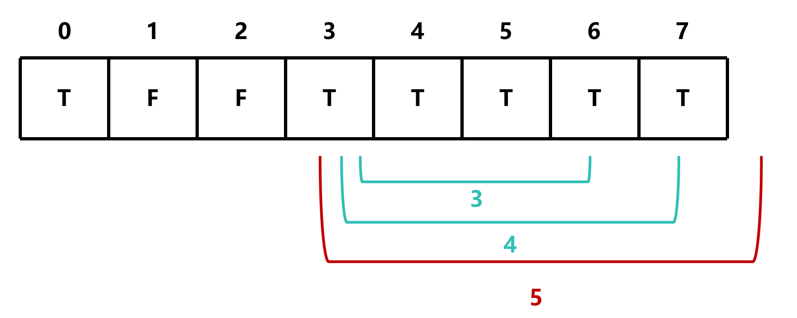
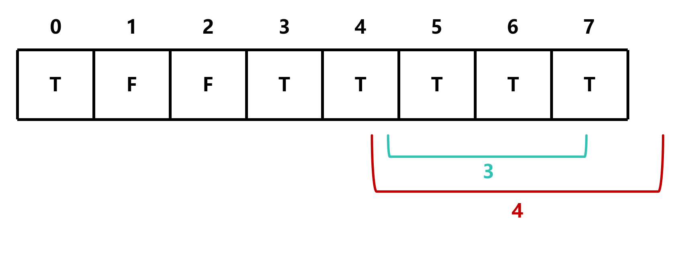
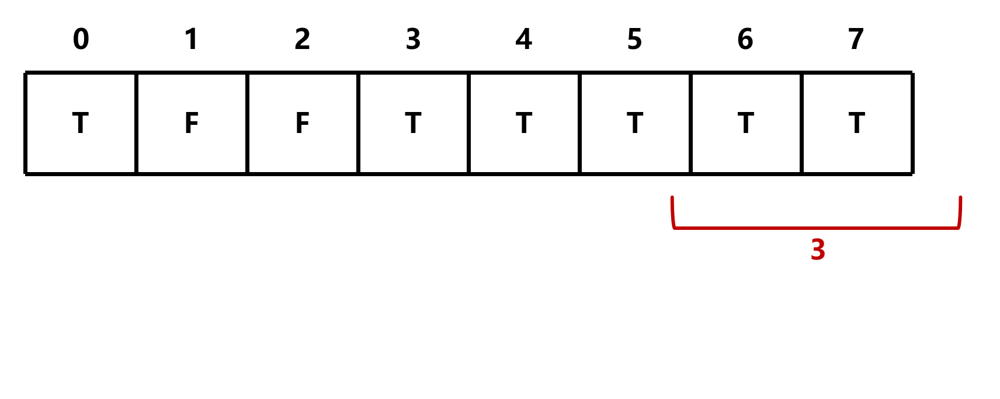

继续遍历数组，直到最后一个元素

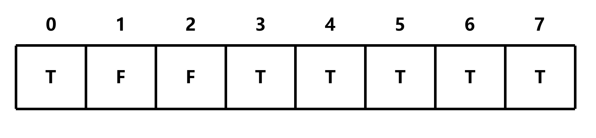

最后返回表格的最后一个元素，即canSum(7, [5, 3, 4])的结果，为True

```c
bool canSum(int target, int *nums, int numsSize)
{
    bool table[target + 1]; // 创建一个大小为target+1的布尔数组
    memset(table, false, sizeof(table)); // 将数组初始化为false
    table[0] = true; // 边界条件，canSum(0, [...]) 为 true

    for (int i = 0; i <= target; i++)
    {
        if (table[i] == false) continue; // 如果当前位置为false，跳过

        for (int j = 0; j < numsSize; j++) // 遍历数组中的每个元素，作为偏移量
        {
            if (i + nums[j] > target) continue; // 如果偏移量加上当前位置大于目标值，跳过
            
            table[i + nums[j]] = true; // 将偏移量加上当前位置的位置设置为true
        }
    }
    return table[target]; // 返回目标值的位置，即canSum(target, [...])的结果
}
```

此时的时间复杂度为O(mn)，空间复杂度为O(m)