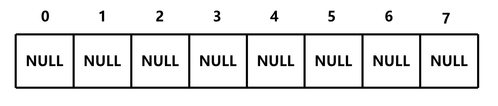
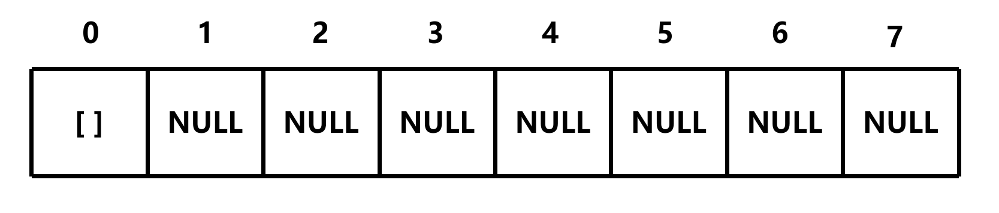
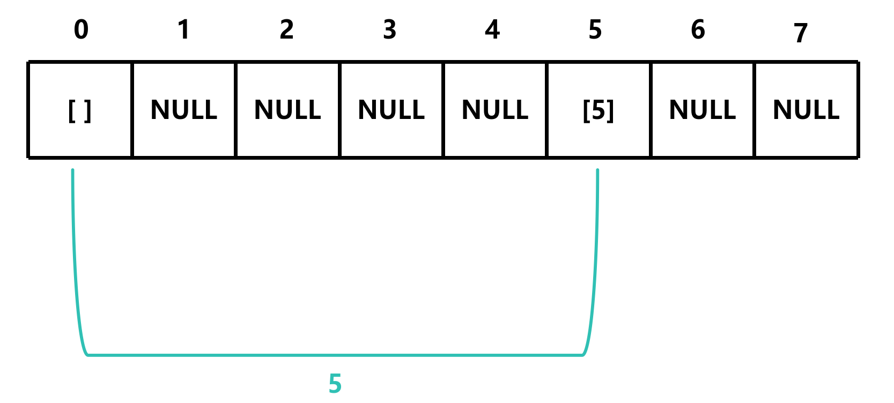
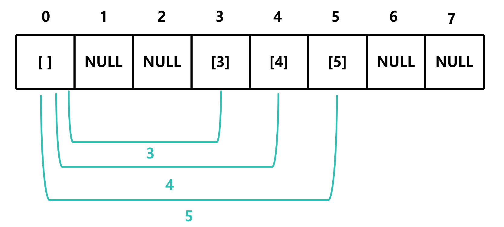
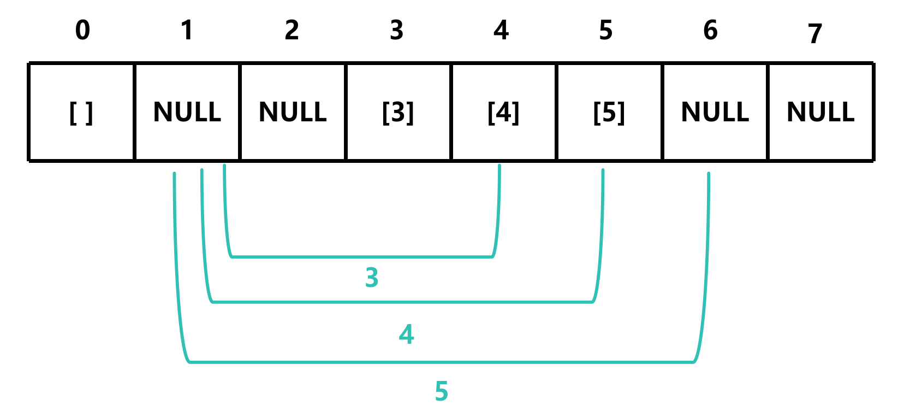
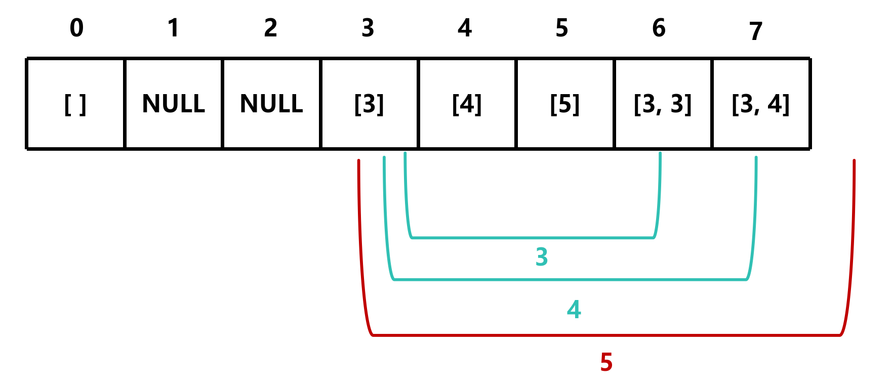
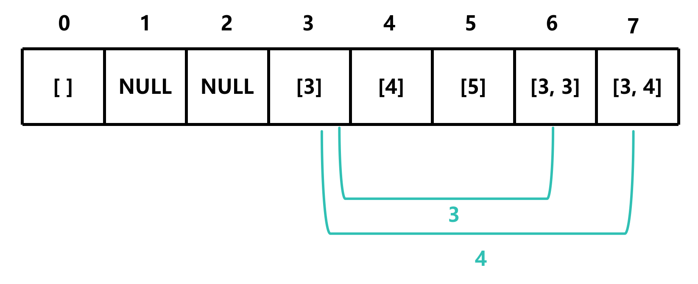

# howSum

## 题目描述

给定一个数组和一个目标数，求数组中是否存在一个子数组，使得子数组的和等于目标数，如果存在，返回这个子数组，否则返回空数组

条件: 

- 如果存在多个答案，你可以返回其中一个

示例:

- howSum(7, [5, 3, 4, 7]) -> [4, 3]
- howSum(8, [2, 3, 5]) -> [2, 2, 2, 2]
- howSum(7, [2, 4]) -> NULL

## 解题思路

**这里以 `howSum(7, [5, 3, 4])` 为例**

首先初始化一个基于 `target` 的数组，其长度为 `target + 1`


由于此题是返回数组，所以我们需要将数组中的元素全部初始化为 `NULL`



由于 `howSum(0, [...])` 无论给定什么数组，都是返回一个空数组，所以我们需要将 `table[0]` 初始化为一个空数组



然后遍历数组，将给定的数组中的元素作为偏移量

由于数组包含5，那么可以 0+5=5，所以 `table[5]` 的值为 `[5]`



同样的，由于数组包含3、4，那么可以 0+3=3，0+4=4，所以 `table[3]` 和 `table[4]` 的值为 `[3]` 和 `[4]`



然后，将指针向后移一位

由于1的位置为 `NULL`，所以指针继续向后移，然后重复上面的步骤



如果指针加上偏移量等于或大于表格的长度，那么舍弃该偏移量




同时，终止循环，返回 `table[target]`，即 `[3, 4]`

```c
int *howSum(int target, int *nums, int numsSize)
{
    int *table[target + 1]; // 创建一个基于 target 的数组
    
    for (int i = 0; i <= target; i++)
    {
        table[i] = NULL;
    }

    // 初始化 table[0] 为一个空数组，第一个元素记录数组大小
    table[0] = malloc(sizeof(int)); 
    table[0][0] = 0;

    for (int i = 0; i <= target; i++)
    {
        if (table[i] != NULL) // 如果 table[i] 不为 NULL，说明找到了一个组合
        {
            int size = table[i][0]; // 获取 table[i] 的大小
            int newSize = size + 1; // 增加一个元素

            for (int j = 0; j < numsSize; j++)
            {
                int sum = i + nums[j];
                if (sum <= target) // 如果 sum 小于等于 target
                {
                    table[sum] = malloc((newSize + 1) * sizeof(int)); // 分配新的内存，多一个位置存大小
                    table[sum][0] = newSize; // 更新 table[sum] 的大小
                    memcpy(table[sum] + 1, table[i] + 1, size * sizeof(int)); // 复制 table[i] 的内容到 table[sum]
                    table[sum][size + 1] = nums[j]; // 将 nums[j] 加入到 table[sum] 的末尾

                    if (sum == target) // 如果 sum 等于 target，说明找到了一个组合
                    {
                        return table[sum]; // 返回 table[sum]
                    }
                }
            }
        }
    }
    return table[target]; // 返回 table[target]
}
```

**注意：`table[target][0]` 记录的是数组的大小，从 `table[target][1]` 开始记录的是数组的内容**

此时，我们的空间复杂度为 O(m<sup>2</sup>n)，时间复杂度为 O(m<sup>2</sup>n)