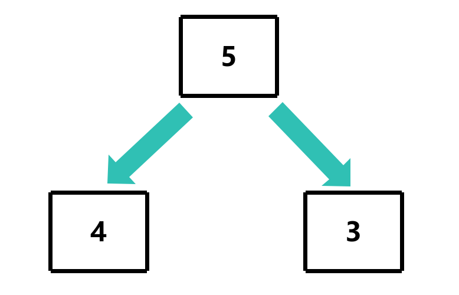
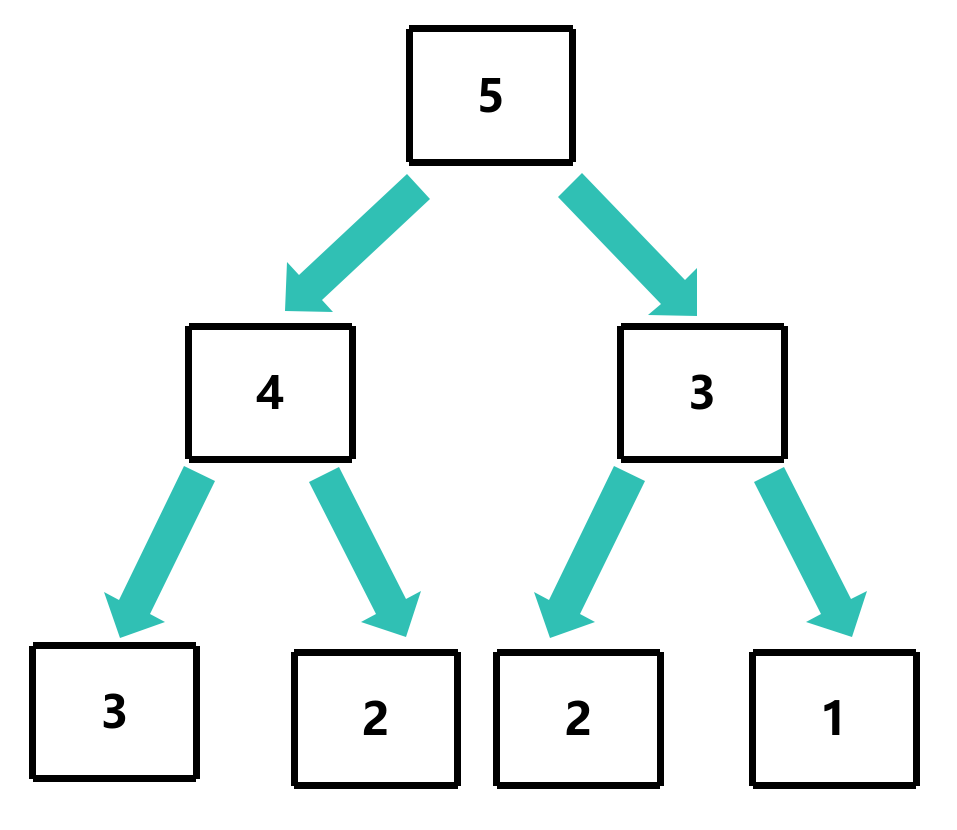
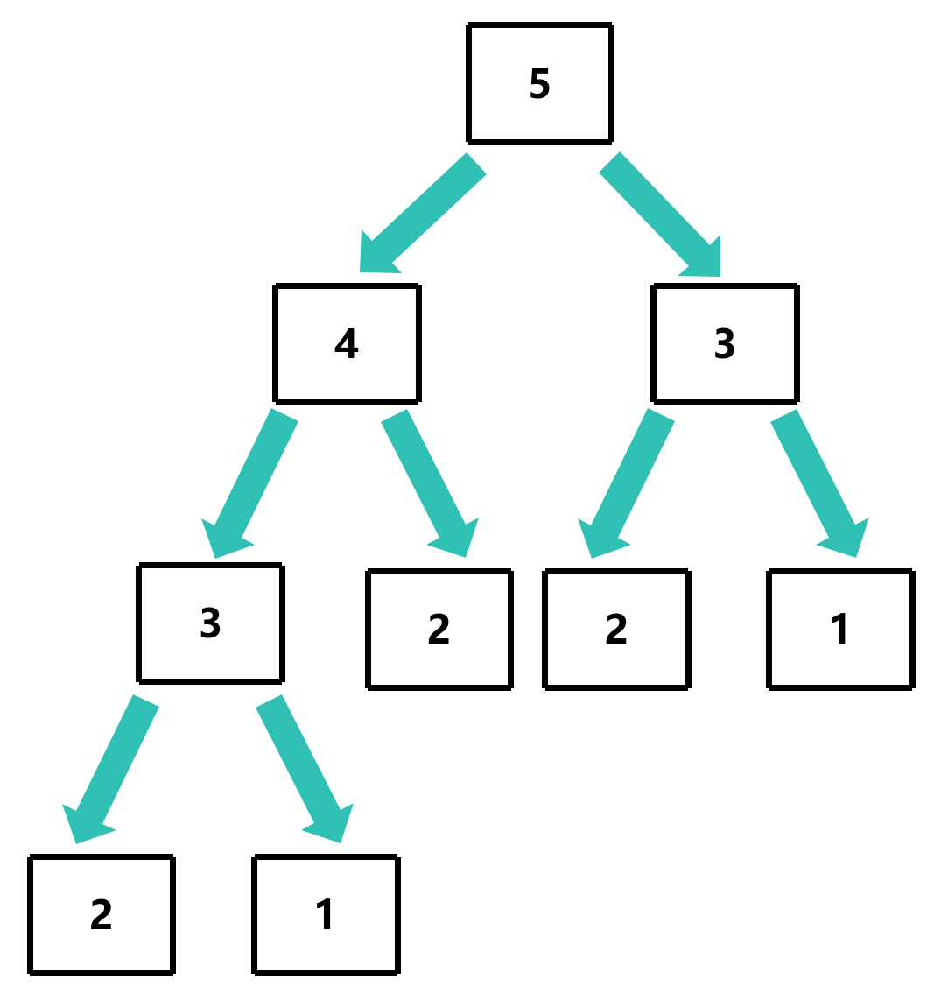
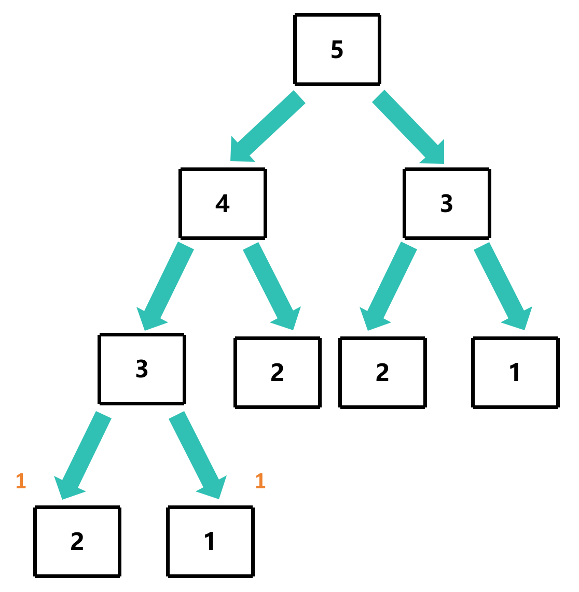
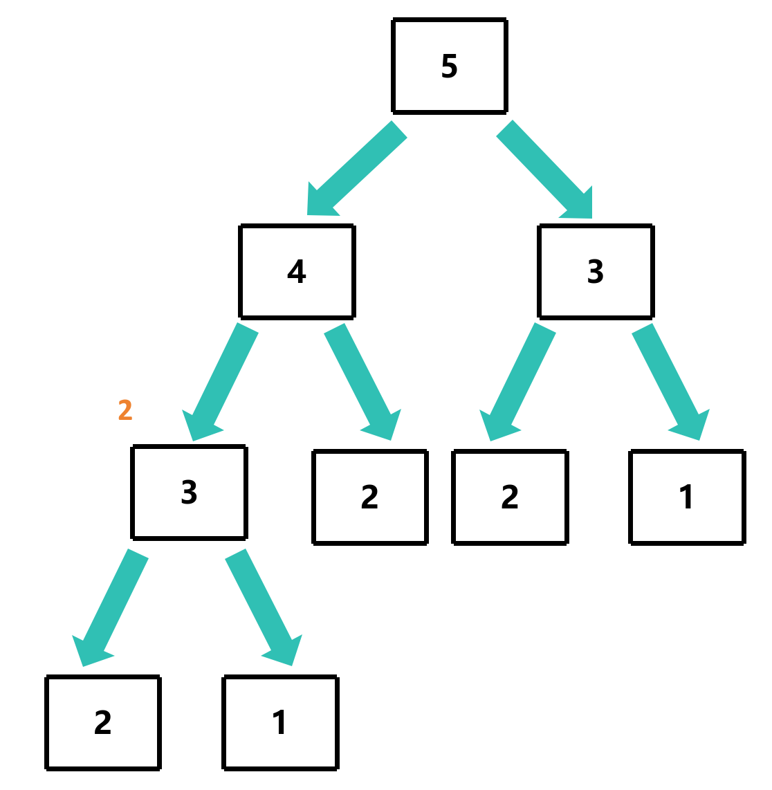
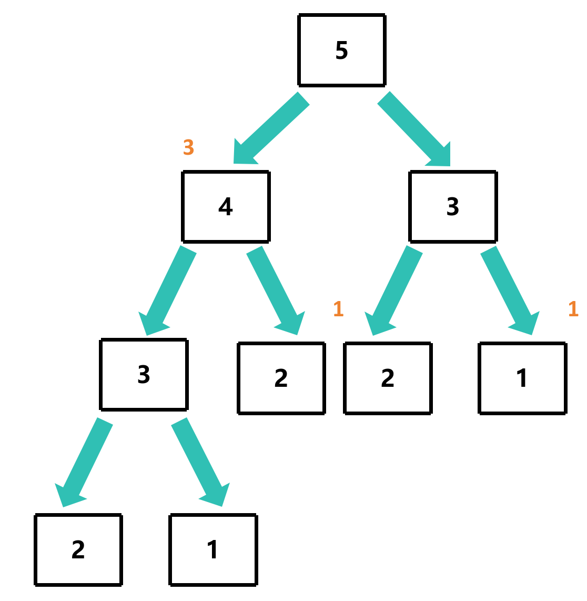
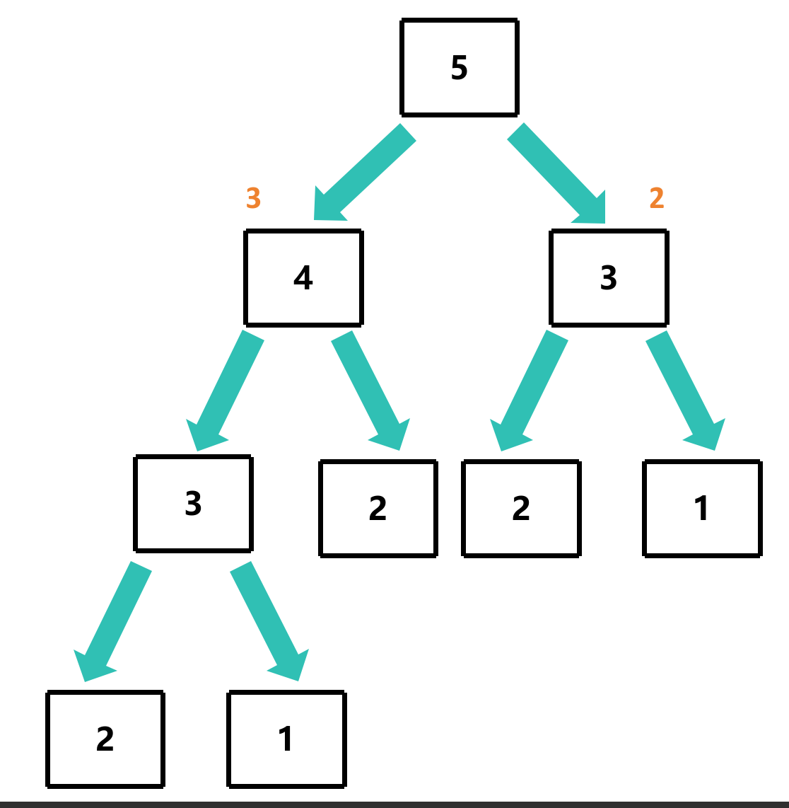
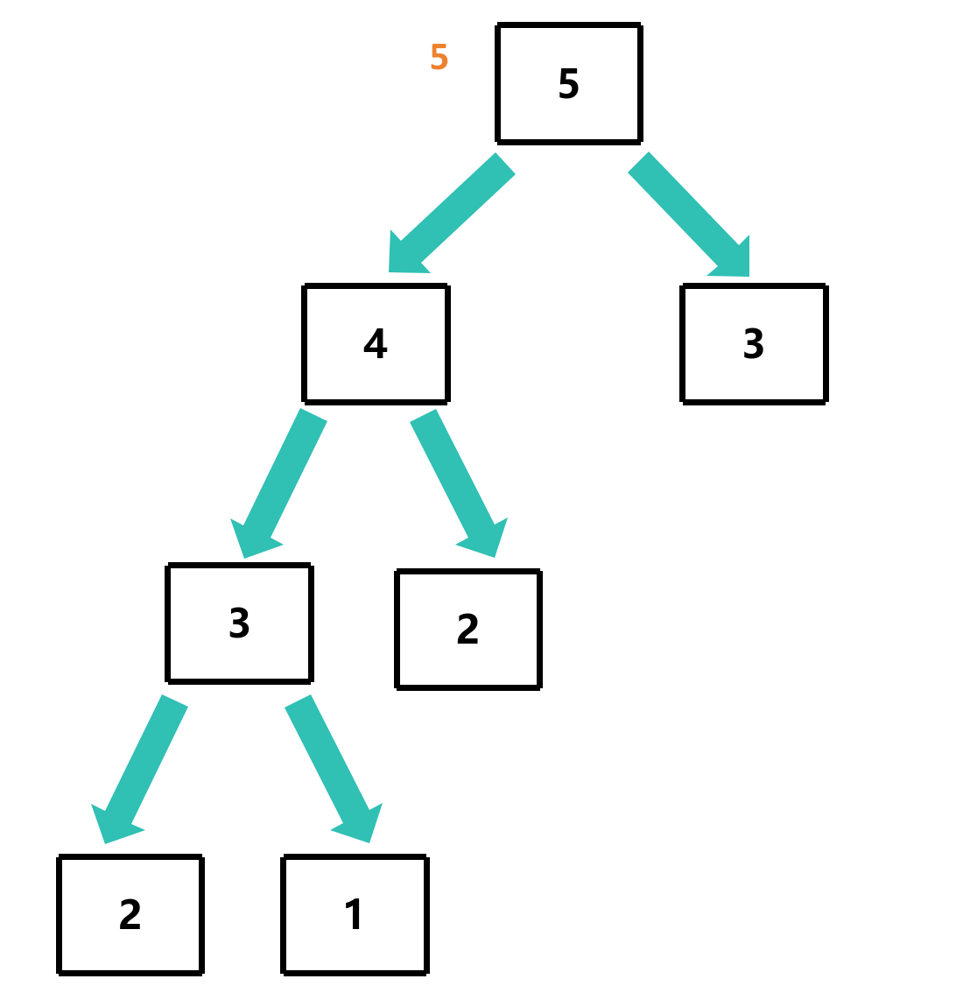

# 斐波那契数列

## 题目描述

要求输入一个整数n，请你输出斐波那契数列的第n项

例如 `fib(6)` 输出 `8`

## 使用递归的方式来求解

```c
int fib(int n)
{
    if (n <= 2) return 1;
    return fib(n-1) + fib(n-2);
}
```

但是如果传入的n比较大的话，那么递归的次数会非常多，可能会导致栈溢出，而且效率也不高

### 图解

这里以 `fib(5)` 为例

 `5` 大于 `2` ，所以会执行 `return fib(4) + fib(3)`


`4` 和 `3` 都大于 `2` ，所以会执行 `return fib(3) + fib(2)`


`3` 和 `2` 都大于 `2` ，所以会执行 `return fib(2) + fib(1)`


`2` 和 `1` 都小于等于 `2` ，所以会执行 `return 1`

可以看到，这个过程图像是一个二叉树

## 分析过程图

当递归到 `fib(1)` 和 `fib(2)` 的时候，都会返回 `1` 到 `fib(3)`


那么 `fib(3)` 的值就是 `fib(2) + fib(1)` ，也就是 `1 + 1` ，也就是 `2`


`fib(3)` 和 `fib(2)` 分别返回 `2` 和 `1` 到 `fib(4)`


`fib(4)` 的值就是 `fib(3) + fib(2)` ，也就是 `2 + 1` ，也就是 `3`


`fib(4)` 和 `fib(3)` 分别返回 `3` 和 `2` 到 `fib(5)`，**但右侧的 `fib(3)` 需要重新计算**



`fib(5)` 的值就是 `fib(4) + fib(3)` ，也就是 `3 + 2` ，也就是 `5`


可以看到，这个过程中，出现了重复计算的情况，时间复杂度是O(2^n)

## 使用动态规划的方式来求解

前面可知，我们即使已经知道了 `fib(3)` 的值，但是我们还是需要重新计算 `fib(3)` 的值，这是因为我们不知道 `fib(3)` 的值是否已经被计算过了

那我们可以把 `fib(3)` 的值保存下来，下次再需要计算 `fib(3)` 的值的时候，就不需要重新计算了

**这就是动态规划的思想之一：记忆化**

```c
int fib_memo(int n, int *memo)
{
    if (n <= 2) return 1;
    if (memo[n] != 0) return memo[n]; 
    memo[n] = fib_memo(n-1, memo) + fib_memo(n-2, memo); // 记忆化
}

int fib(int n)
{
    int memo[n+1]; // 用于保存计算结果
    memset(memo, 0, sizeof(int) * (n+1));
    return fib_memo(n, memo);
}
```

此时，当我们需要重新计算 `fib(3)` 的值的时候，就不需要重新计算了，直接返回 `memo[3]` 的值即可

此时，时间复杂度是O(n)，空间复杂度是O(n)

