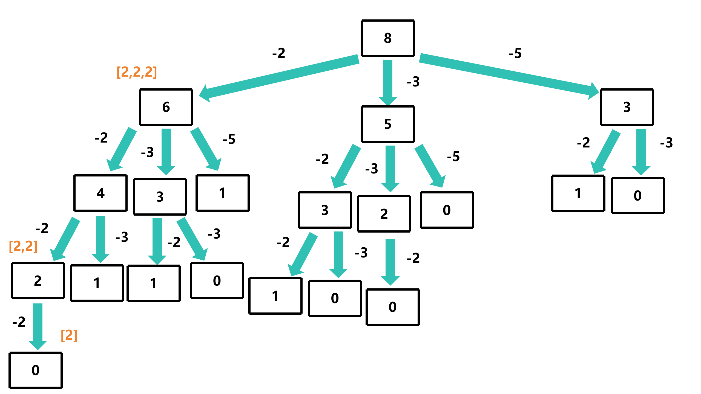
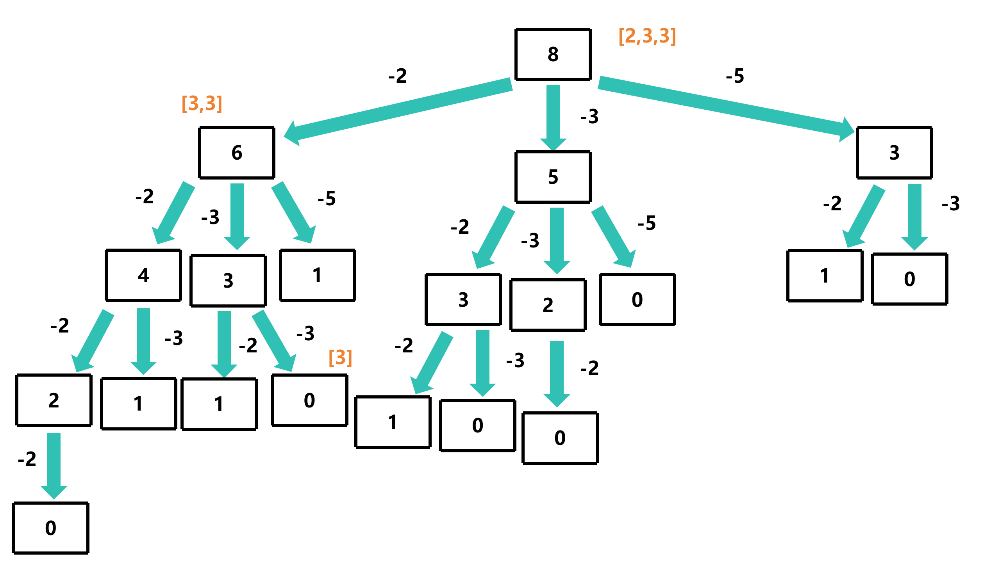
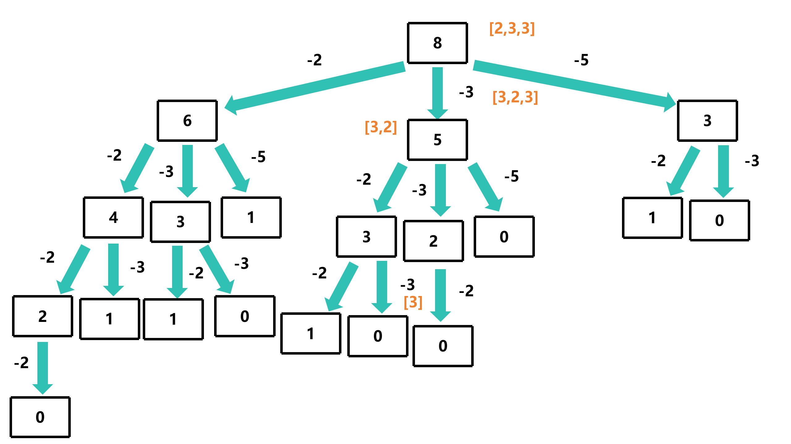
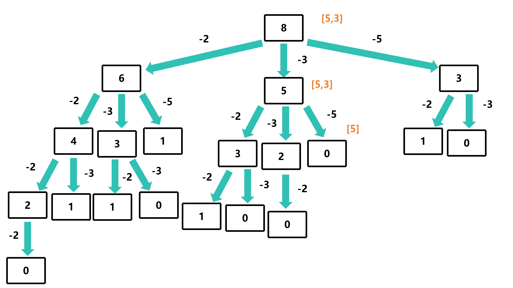

# bestSum

## 题目描述

给定一个整数数组和一个目标值，找出数组中所有和为目标值的子数组，返回其中和最小的子数组

条件: 
- 数组中元素非负
- 数组中元素可以重复使用
- 数组中元素个数不限
- 数组中元素顺序不限

示例: 
- bestSum(7, [5, 3, 4, 7]) => [7]
- bestSum(8, [2, 3, 5]) => [3, 5]
- bestSum(8, [1, 4, 5]) => [4, 4]

## 解题思路

每次递归时，从数组中取出一个元素，然后递归调用函数，传入目标值减去取出元素的值和数组，返回值为数组，然后将取出元素添加到返回值中，返回给上一层递归，每次递归时，比较数组的长度，返回长度最小的数组







这里以bestSum(8, [2, 3, 5])为例

```c
int* bestSum(int target, int* nums, int numsSize, int* returnSize)
{
    int minSize = INT_MAX; // 最小的结果数组大小
    int *minResult = NULL; // 最小的结果数组
    
    if(target == 0) // 目标值为0，返回空数组
    {
        *returnSize = 0; // 返回空数组的大小
        return malloc(0); // 返回空数组
    }
    if(target < 0) // 目标值小于0，返回空指针
    {
        *returnSize = 0; // 返回空数组的大小
        return NULL; // 返回空指针
    }

    for(int i = 0; i < numsSize; i++)
    {
        int remainder = target - nums[i];
        int remainderSize = 0; // 余数的结果数组大小
        int *remainderResult = bestSum(remainder, nums, numsSize, &remainderSize);
        if(remainderResult != NULL)
        {
            int *combination = malloc((remainderSize + 1) * sizeof(int)); // 分配内存
            memcpy(combination, remainderResult, remainderSize * sizeof(int)); // 复制结果数组
            combination[remainderSize] = nums[i]; // 将当前数字加入结果数组
            if(remainderSize + 1 < minSize)
            {
                minSize = remainderSize + 1;
                minResult = combination;
            }
        }
    }

    *returnSize = minSize;
    return minResult;
}
```

此时的时间复杂度为O(n<sup>m</sup>)，空间复杂度为O(m)

## 过程图分析
这里以bestSum(8, [2, 3, 5])为例


可以看到，所有 `3` 的分支都是相同的

那么我们可以使用记忆化的方式来优化这个问题

## 使用动态规划实现

`memo[1024]`、`memo_size[1024]` 表示记忆化数组，`memo[1024]` 表示数组，`memo_size[1024]` 表示数组的大小

```c
int *memo[1024]; // 记忆化数组
int memo_size[1024]; // 记忆化数组的大小

int* bestSum(int target, int* nums, int numsSize, int* returnSize)
{
    int minSize = INT_MAX; // 最小的结果数组大小
    int *minResult = NULL; // 最小的结果数组
    
    if (memo[target] != NULL) // 如果已经计算过，直接返回
    {
        *returnSize = memo_size[target]; // 返回结果数组的大小
        return memo[target]; // 返回结果数组
    }

    if(target == 0) // 目标值为0，返回空数组
    {
        *returnSize = 0; // 返回空数组的大小
        return malloc(0); // 返回空数组
    }
    if(target < 0) // 目标值小于0，返回空指针
    {
        *returnSize = 0; // 返回空数组的大小
        return NULL; // 返回空指针
    }

    for(int i = 0; i < numsSize; i++)
    {
        int remainder = target - nums[i];
        int remainderSize = 0; // 余数的结果数组大小
        int *remainderResult = bestSum(remainder, nums, numsSize, &remainderSize); // 递归调用bestSum函数
        if(remainderResult != NULL)
        {
            int *combination = malloc((remainderSize + 1) * sizeof(int)); // 结果数组的排列组合
            memcpy(combination, remainderResult, remainderSize * sizeof(int)); // 复制结果数组
            combination[remainderSize] = nums[i]; // 将当前数字加入结果数组
            if(remainderSize + 1 < minSize)
            {
                minSize = remainderSize + 1;
                minResult = combination;
            }
        }
    }
    memo[target] = minResult; // 将结果数组存入记忆化数组
    memo_size[target] = minSize; // 将结果数组的大小存入记忆化数组
    *returnSize = minSize; // 返回结果数组的大小
    return minResult; // 返回结果数组
}
```

此时的时间复杂度为O(n<sup>m</sup>)，空间复杂度为O(m)