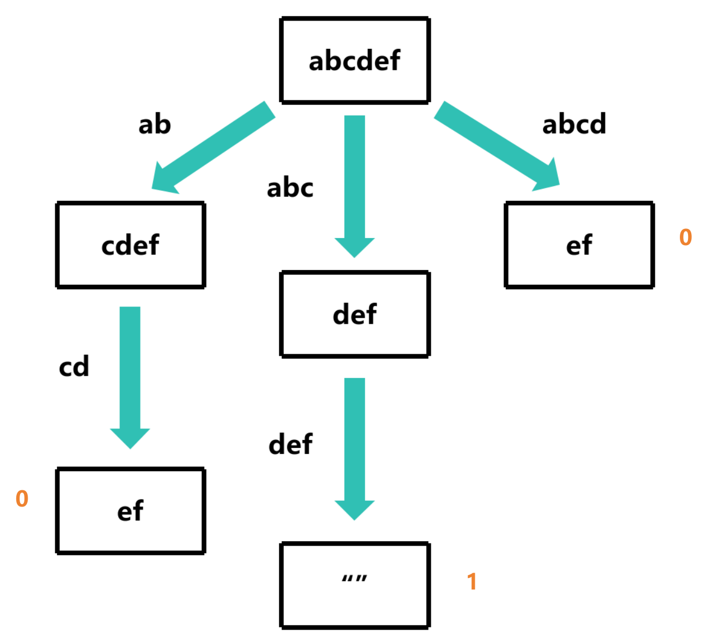
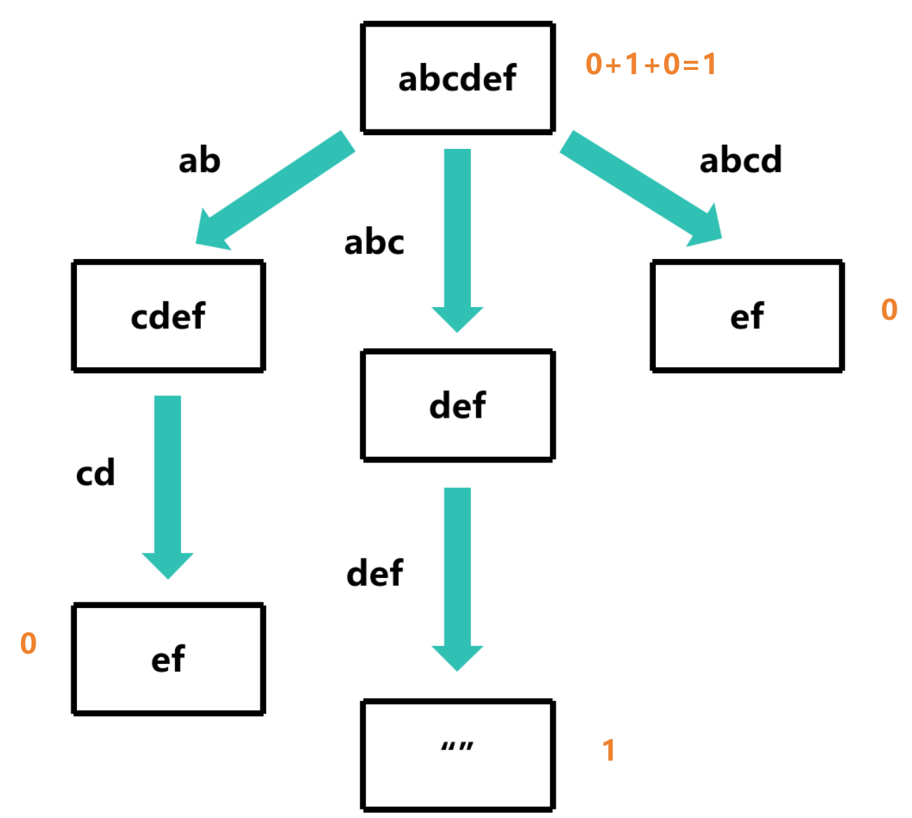

# countConstruct

## 题目描述

给定一个字符串和一个字符串数组，求字符串数组中能够拼接成字符串的个数

条件:
- 字符串数组中的字符串可以重复使用

示例: 
- countConstruct("abcdef", ["ab", "abc", "cd", "def", "abcd"]) => 1
- countConstruct("purple", ["purp", "p", "ur", "le", "purpl"]) => 2
- countConstruct("skateboard", ["bo", "rd", "ate", "t", "ska", "sk", "boar"]) => 0
- countConstruct("", ["cat", "dog", "mouse"]) => 1

## 解题思路

可以使用之前[canConstruct](../6.canConstruct/README.md#解题思路)的思路，只不过需要记录下能够拼接成字符串的个数




```c
int countConstruct(char *target, char **words, int wordsSize)
{
    if (target[0] == '\0') return 1; // 空字符串可以拼接成空字符串

    int total = 0; // 记录能够拼接成字符串的个数

    for (int i = 0; i < wordsSize; i++)
    {
        if (strncmp(target, words[i], strlen(words[i])) == 0)
        {
            // 去掉前缀
            char *suffix = target + strlen(words[i]);
            int count = countConstruct(suffix, words, wordsSize); // 递归
            total += count; // 累加
        }
    }
    return total;
}
```

此时的时间复杂度为O(n<sup>m</sup>*m)，空间复杂度为O(m<sup>2</sup>)

## 过程图分析

以 `countConstruct("enterapotentpot", ["a", "p", "ent", "enter", "ot", "o", "t"])` 为例

根据前面的[canConstruct](../6.canConstruct/README.md#过程图分析)，可以发现 `entpot` 这个分支会重复计算多次

所以我们可以用一个数组来记录已经计算过的分支，避免重复计算

## 使用动态规划实现

- `iscounted` 记录已经计算过的分支
- `memo` 记录已经计算过的分支的结果
- `strlen(s)` 是 s 的长度，当作哈希的索引

```c
bool iscounted[1024]; // 记录已经计算过的分支
int memo[1024]; // 记录已经计算过的分支的结果

int countConstruct(char *s, char **words, int wordsSize)
{
    if (iscounted[strlen(s)]) return memo[strlen(s)]; // 如果已经计算过，直接返回结果
    if (s[0] == '\0') return 1; // 空字符串可以拼接成空字符串
    
    int total = 0; // 记录能够拼接成字符串的个数

    for (int i = 0; i < wordsSize; i++)
    {
        if (strncmp(s, words[i], strlen(words[i])) == 0)
        {
            // 去掉前缀
            char *suffix = s + strlen(words[i]);
            int count = countConstruct(suffix, words, wordsSize); // 递归
            total += count; // 累加
        }
    }
    iscounted[strlen(s)] = true; // 标记已经计算过
    memo[strlen(s)] = total; // 记录结果
    return total;
}
```

此时的时间复杂度为O(n*m<sup>2</sup>)，空间复杂度为O(m<sup>2</sup>)