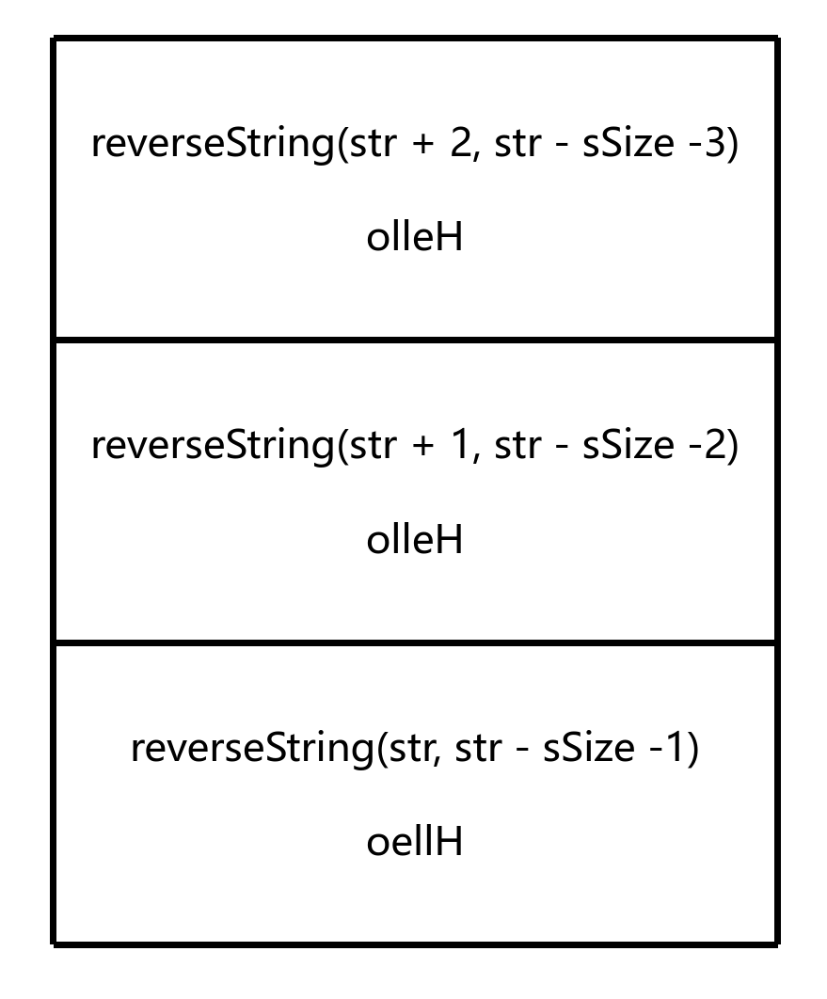
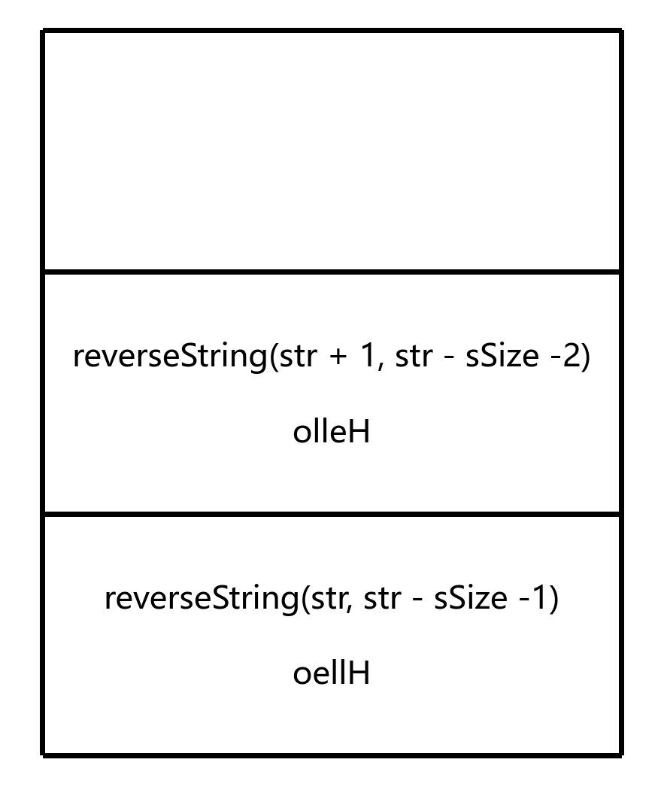
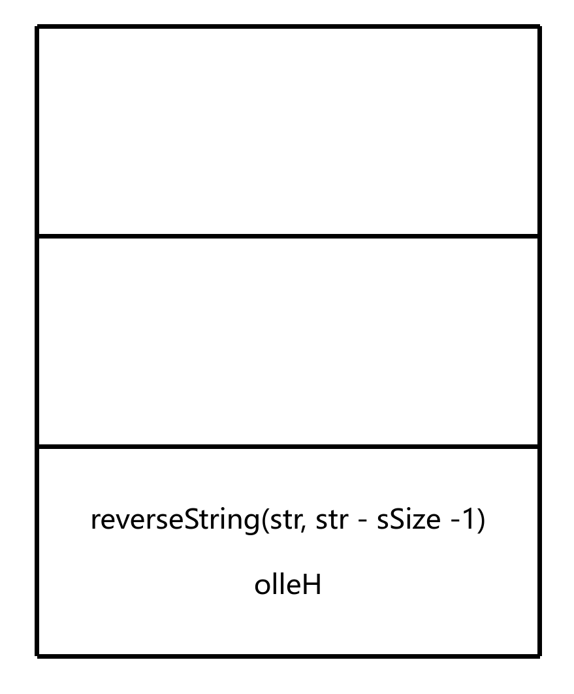
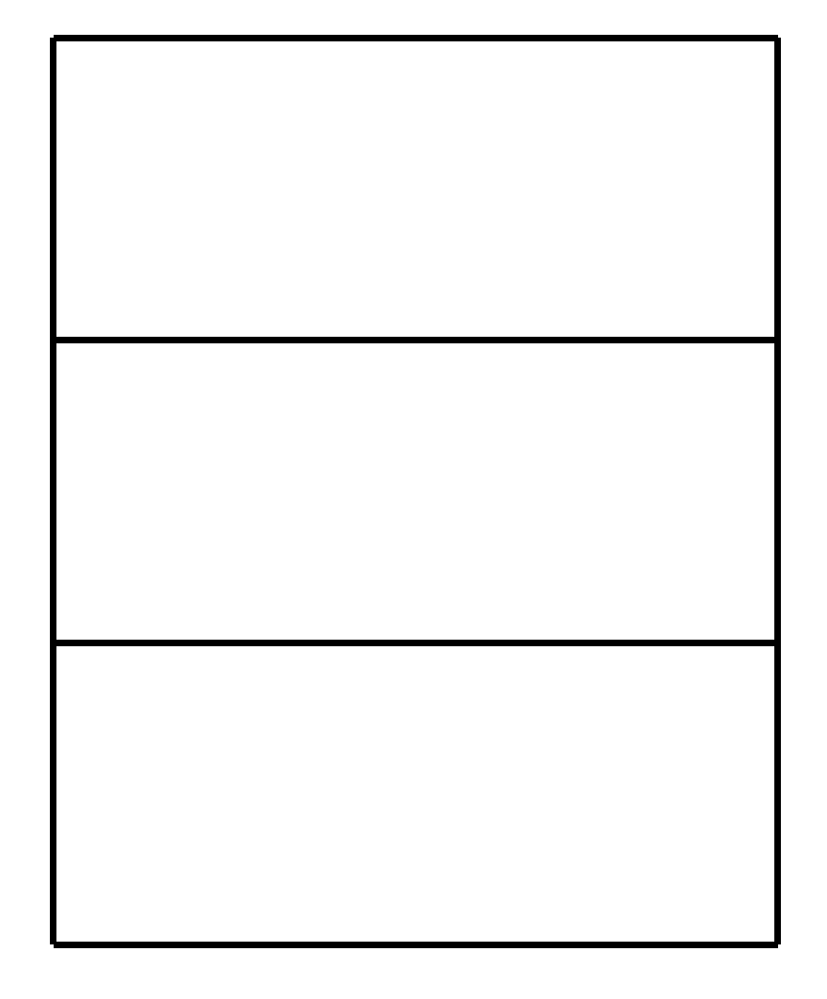

# 字符串反转

## 题目描述

给定一个字符串，你需要反转字符串中的所有字符

示例:

- reverse("Hello World") => "olleH dlroW"

- reverse("I love Rust") => "tsuR evol I"

- reverse("") => ""

- reverse("a") => "a"

- reverse("Hello") => "olleH"

## 解题思路

```c
void reverseString(char *left, char *right);
```

首先，确定基准条件

基准条件就是问**什么时候不再需要递归**

这里如果字符串为空或者只有一个字符，即 `left >= right`，则不需要递归

```c
void reverseString(char *left, char *right)
{
    if (left >= right) return;
}
```

- `left` 是字符串的左边界
- `right` 是字符串的右边界

接着交换字符串的第一个字符和最后一个字符

```c
void reverseString(char *left, char *right)
{
    if (left >= right) return;
    // 交换
    char tmp = *left;
    *left = *right;
    *right = tmp;
}
```

最后，确定递归条件

递归条件就是问**哪个最小单元可以向目标前进**

这里将左边界向右移动一位，右边界向左移动一位

```c
void reverseString(char *left, char *right)
{
    if (left >= right) return;
    // 交换
    char tmp = *left;
    *left = *right;
    *right = tmp;
    // 向目标前进，递归调用
    reverseString(left + 1, right - 1);
}
```

## 图解

这里我们以字符串 `Hello` 为例

首先从 `main` 调用 `reverseString` 函数

反转了 `Hello` 中的 `H` 和 `o`


接着，从 `reverseString` 函数调用 `reverseString` 函数，直到基准条件成立



最后，从最后一个 `reverseString` 函数返回，直到回到 `main` 函数



