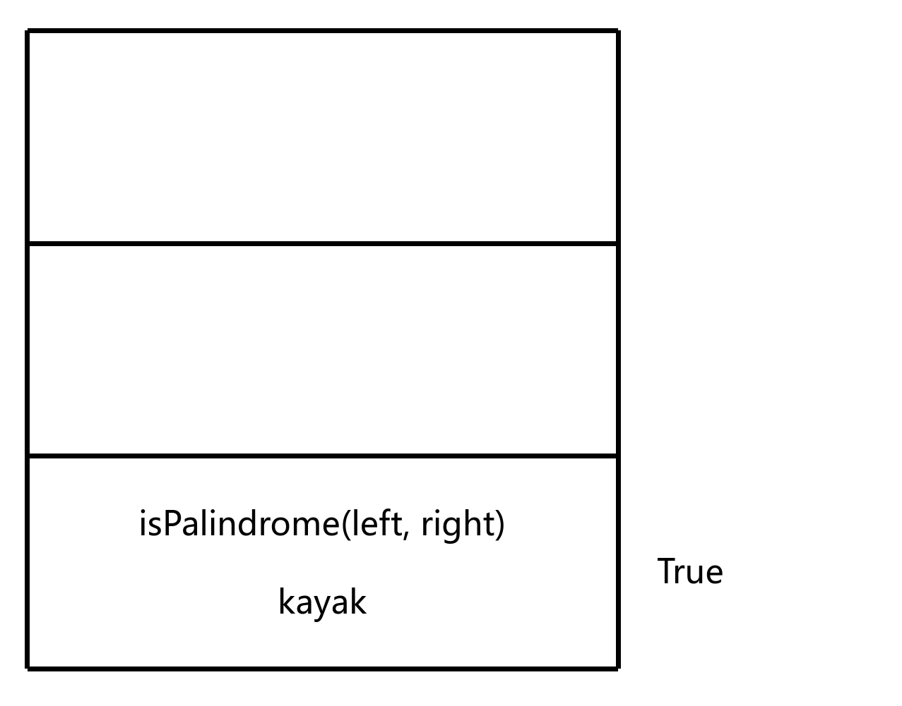

# 回文串

## 题目描述

编写一个函数，其作用是判断一个字符串是否是回文串
回文串是指正序（从左向右）和倒序（从右向左）读都是一样的字符串

条件:

- 区分大小写

示例:

- palindrome("kayak") => true
- palindrome("hello") => false

```c
bool isPalindrome(char *left, char *right);
```

## 解题思路

首先，确定基准条件

即如果字符串为空或者只有一个字符，即 `left >= right`，则不需要递归

如果存在不同字符，则不是回文串，返回 `false`，这是额外的基准条件

```c
bool isPalindrome(char *left, char *right)
{
    if (left >= right) return true; // 基准条件

    return false; // 额外的基准条件，用于不是回文串的情况
}
```

- `left` 是字符串的左边界
- `right` 是字符串的右边界

接着比较字符串的第一个字符和最后一个字符

```c
bool isPalindrome(char *left, char *right)
{
    if (left >= right) return true; // 基准条件

    if (*left == *right) {   }

    return false; // 额外的基准条件，用于不是回文串的情况
}
```

最后，确定递归条件

即哪个最小单元可以向目标前进

这里将左边界向右移动一位，右边界向左移动一位

```c
bool isPalindrome(char *left, char *right)
{
    if (left >= right) return true; // 基准条件

    if (*left == *right)
    {
        return isPalindrome(left + 1, right - 1);
    }

    return false; // 额外的基准条件，用于不是回文串的情况
}
```

## 图解
这里我们以字符串 `kayak` 为例

首先从 `main` 调用 `isPalindrome` 函数

然后判断字符串的第一个字符和最后一个字符是否相同


如果相同，则继续递归调用 `isPalindrome` 函数，直到基准条件满足


最后向每一次递归返回结果，直到向 `main` 函数返回结果


