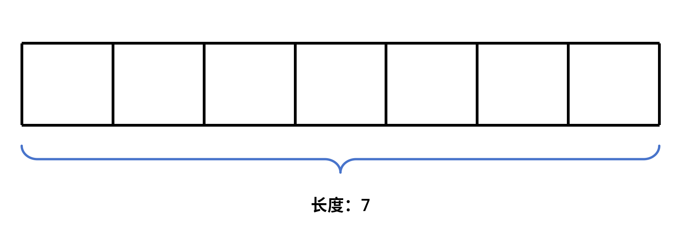
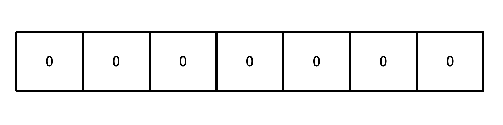
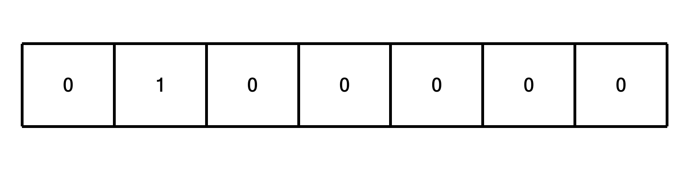
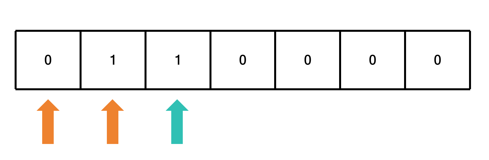
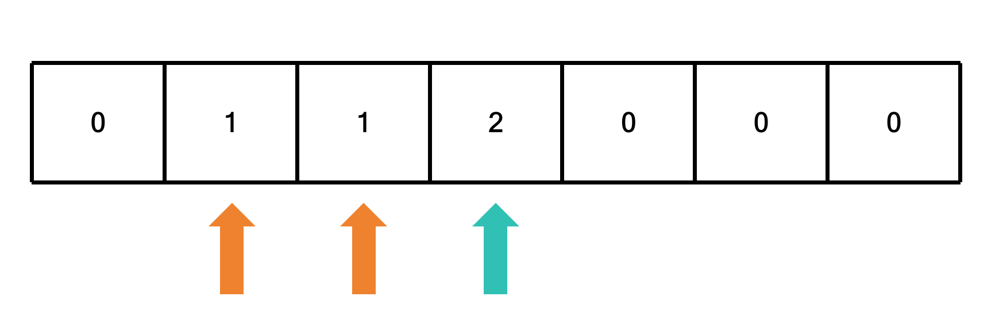
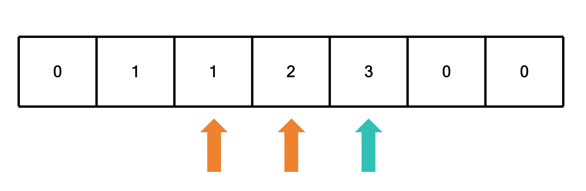
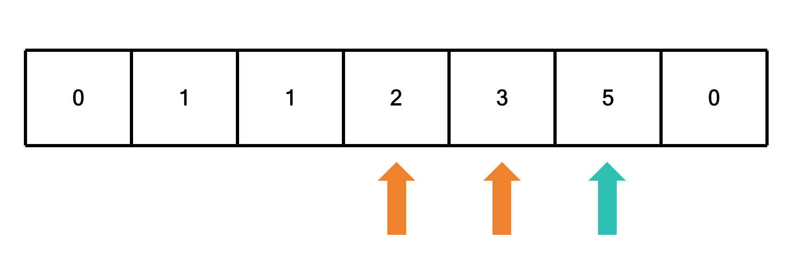
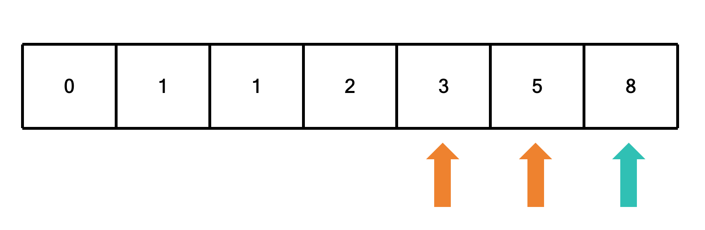
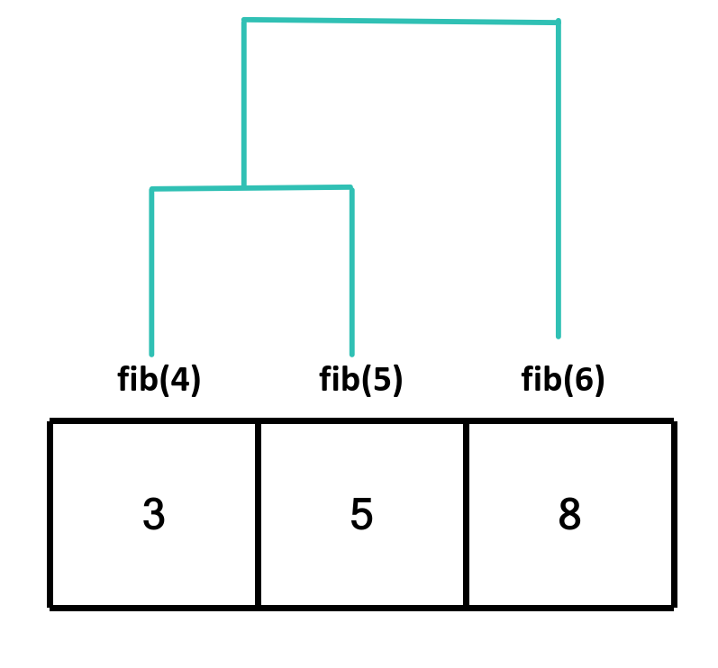

# 斐波那契数列

## 题目描述

要求输入一个整数n，请你输出斐波那契数列的第n项

例如 `fib(6)` 输出 `8`

## 解题思路

我们依旧可以把大问题分解成小问题，例如 `fib(6)` 可以分解成 `fib(5) + fib(4)`，只不过我们把递归的过程变成生成一个数组，然后返回数组的第n项即可

这就是动态规划的思想之一：**制表法**

这里以 `fib(6)` 为例

生成一个长度为7 (`n + 1`) 的数组



因为斐波那契数列要求是求和，那可以先将数组全部初始化为0



然后将数组的第1项设置为1



然后从第2项开始，将数组的第 `i` 项设置为数组的第 `i - 1` 项和第 `i - 2` 项的和







最后返回数组的第n项即可，也就是8

相比之前的记忆化搜索，**这个使用的不是递归，而是迭代**



如果我们这样子看示意图的话，会发现这也是一个树状结构，只是从递归树变成了迭代树

```c

int fib(int n)
{
    if (n == 0) return 0; // 边界条件
    if (n < 2) return 1; // 边界条件

    int arr[n + 1] = {0}; // 初始化数组

    arr[1] = 1; // 边界条件
    for (int i = 2; i <= n; i++) // 从第2项开始，将数组的第i项设置为数组的第i-1项和第i-2项的和
    {
        arr[i] = arr[i - 1] + arr[i - 2];
    }
    return arr[n]; // 返回数组的第n项
}
```

此时的时间复杂度为O(n)，空间复杂度为O(n)