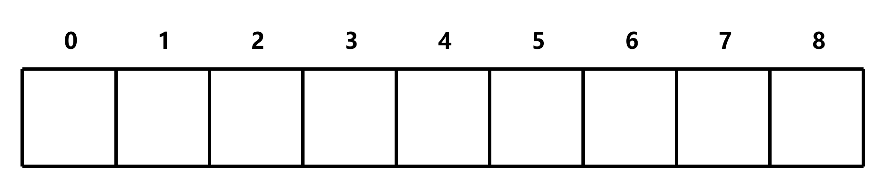
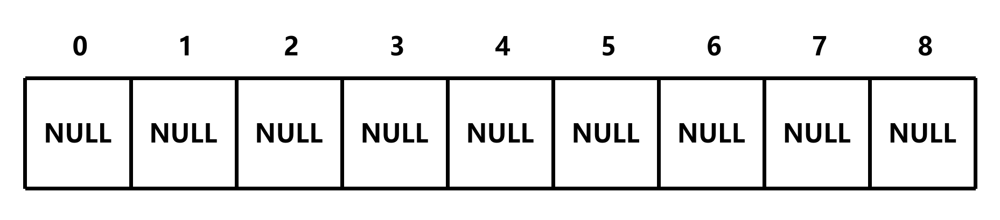
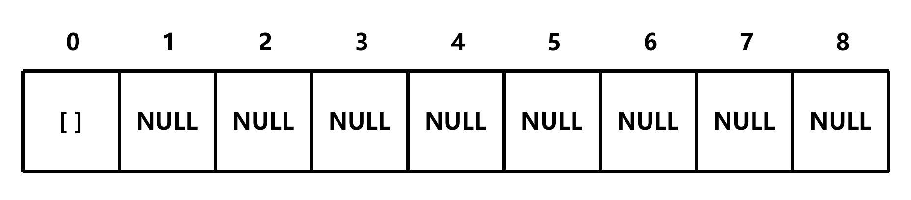
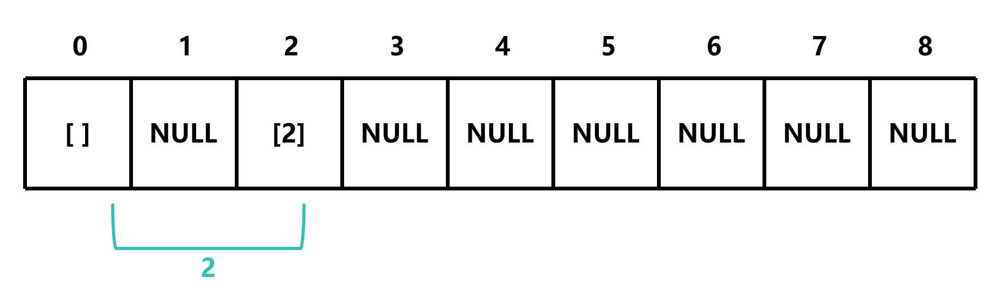
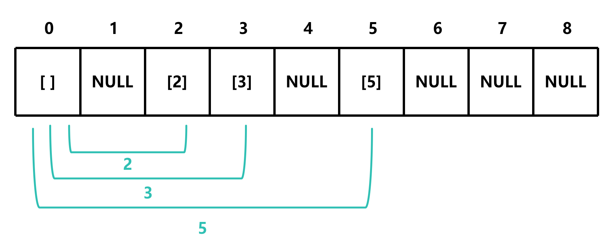
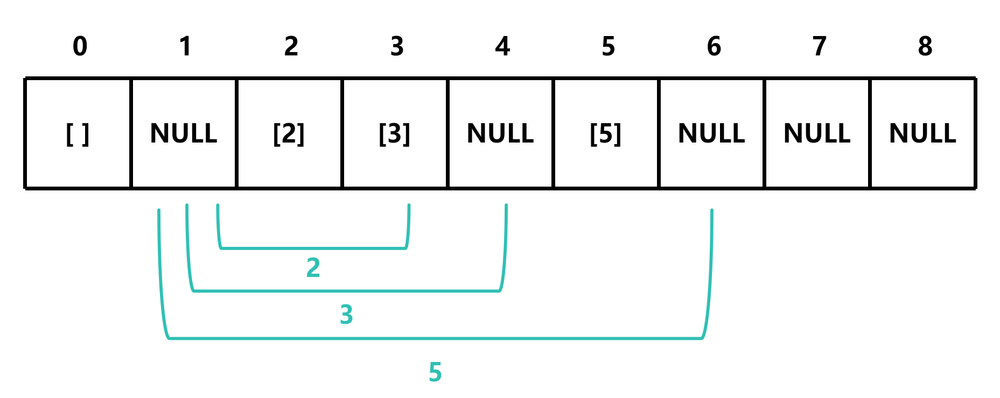
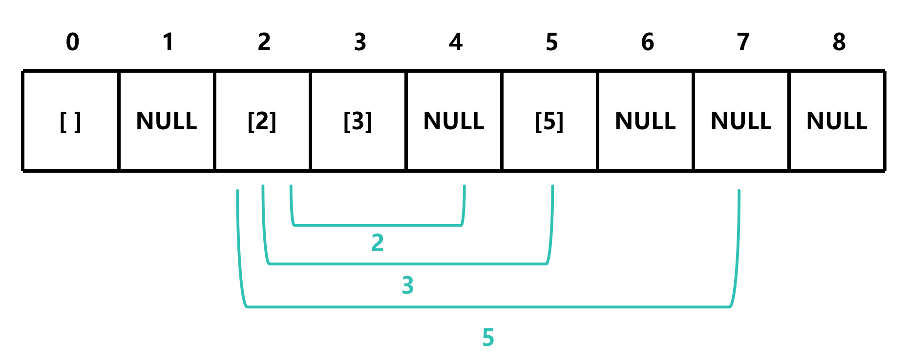
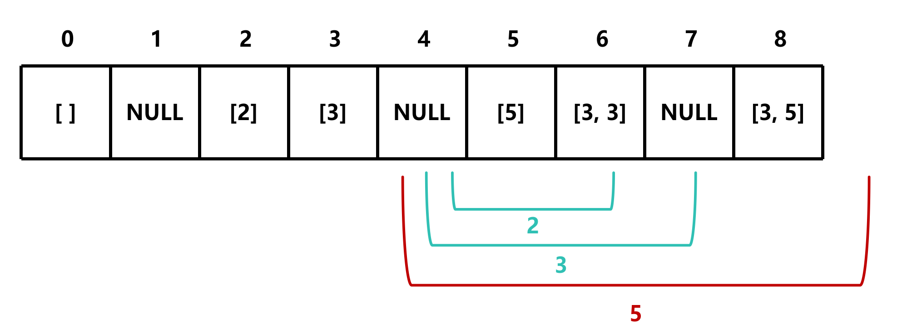

# bestSum

## 题目描述

给定一个整数数组和一个目标值，返回一个数组，该数组包含和为目标值的元素。如果存在多个解，则返回最短的解

示例:

- bestSum(7, [5, 3, 4, 7]) -> [7]
- bestSum(8, [2, 3, 5]) -> [3, 5]
- bestSum(8, [1, 4, 5]) -> [4, 4]

## 解题思路

**这里以 `bestSum(8, [2, 3, 5])` 为例**

先创建一个长度为 `targetSum + 1` 的表格



然后将整个表格初始化为 `NULL`



由于 `bestSum(0, [..])` 无论如何都可以得到空数组，所以将 `table[0]` 初始化为 `[]`



然后遍历数组，将给定的数组中的元素作为偏移量

由于数组包含2，那么可以 0+2=2，所以 `table[2]` 的值为 `[2]`



同样的，由于数组包含3、5，那么可以 0+3=3，0+5=5，所以 `table[3]` 和 `table[5]` 的值为 `[3]` 和 `[5]`



然后，将指针向后移一位



由于1的位置为 `NULL`，所以指针继续向后移，然后重复上面的步骤



可以看到，[2, 3] 也是一个可以组成5的组合，但是它的长度比 [5] 要长，所以我们不更新 `table[5]` 的值

同样的，[2, 3, 3] 也是一个可以组成8的组合，但是它的长度比 [3, 5] 要长，所以我们不更新 `table[8]` 的值

如果指针加上偏移量等于或大于表格的长度，那么舍弃该偏移量



同时，终止循环，返回 `table[targetSum]`，即 `[3, 5]`

```c
int *bestSum(int targetSum, int *nums, int numsSize)
{
    int *table[targetSum + 1]; // 创建一个基于 targetSum 的数组

    for (int i = 0; i <= targetSum; i++)
    {
        table[i] = NULL; // 初始化数组
    }

    table[0] = malloc(sizeof(int)); // 初始化 table[0]
    table[0][0] = 0;

    for (int i = 0; i <= targetSum; i++)
    {
        if (table[i] != NULL)
        {
            int temp_new_size = table[i][0] + 1; // 临时变量，用于存储新数组的长度
            for (int j = 0; j < numsSize; j++)
            {
                int sum = i + nums[j]; // 索引加上偏移量
                if (table[sum] == NULL || table[sum][0] > temp_new_size && sum <= targetSum) // 如果新数组的长度小于旧数组的长度或数组为空
                {
                    table[sum] = malloc(sizeof(int) * (temp_new_size + 1)); // 分配内存
                    table[sum][0] = temp_new_size; // 存储新数组的长度
                    memcpy(table[sum] + 1, table[i] + 1, sizeof(int) * table[i][0]); // 复制数组
                    table[sum][temp_new_size] = nums[j]; // 存储新元素
                    if (sum == targetSum) // 如果索引等于目标值
                    {
                        return table[sum]; // 返回数组
                    }
                }
            }
        }
    }
    return table[targetSum]; // 返回数组
}
```

**注意：`table[target][0]` 记录的是数组的大小，从 `table[target][1]` 开始记录的是数组的内容**

此时的时间复杂度为 O(m<sup>2</sup>n)，空间复杂度为 O(m<sup>2</sup>)