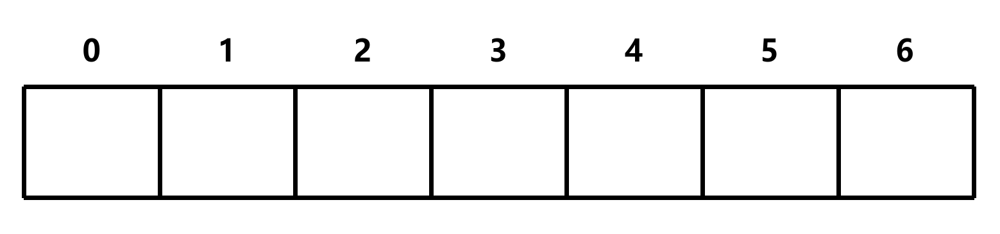
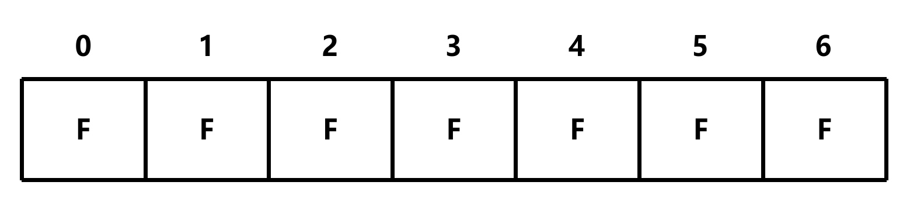
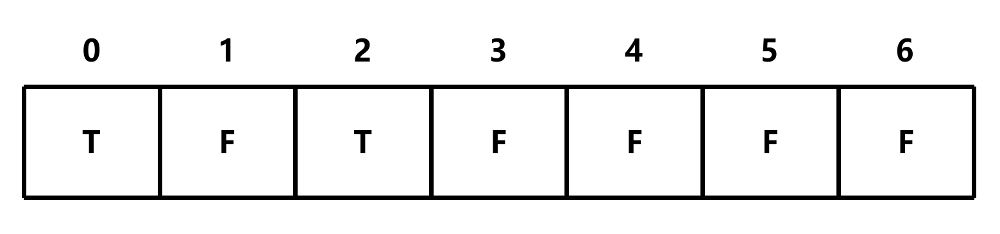
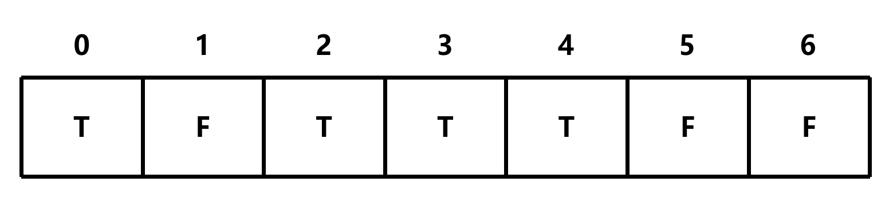
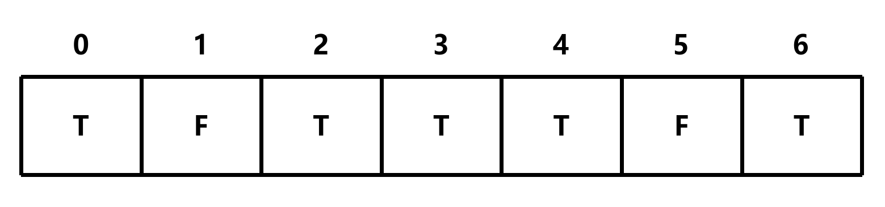

# canConstruct

## 题目描述

给定一个字符串数组，判断是否可以通过拼接数组中的字符串来构造出目标字符串

示例:

- canConstruct(abcdef, [ab, abc, cd, def, abcd]) => true
- canConstruct(skateboard, [bo, rd, ate, t, ska, sk, boar]) => false
- canConstruct('', [cat, dog, mouse]) => true

## 解题思路

**这里以 `canConstruct(abcdef, [ab, abc, cd, def, abcd]) => true` 为例**

首先确定表格的大小，由于 `target` 长度为 6，因此表格的大小为 7 (1+6)



由于返回值类型为布尔值，因此表格的初始值为 `false`



由于 `canConstruct('', [...])` 无论如何都为 `true`，因此表格的第 0 位为 `true`


接下来遍历表格，将给定的数组中的元素与 `target` 进行比较

`abcdef` 中第 0 位存在 `ab`，因此表格的第 2 位为 `true`



同样，`abcdef` 中第 0 位存在 `abc`、`abcd`，因此表格的第 3、4 位为 `true`



然后，将指针向后移一位

由于1的位置为 `false`，所以指针继续向后移，然后重复上面的步骤

由于 `abcdef` 中第 2 位存在 `cd`，因此表格的第 4 位为 `true`


继续向后移，由于 `abcdef` 中第 4 位存在 `def`，因此表格的第 6 位为 `true`



由于指针已经到达表格的末尾，因此返回 `table[target]`，即 `true`

```c
bool canConstruct(char *target, char **wordBank, int wordBankSize)
{
    bool table[strlen(target) + 1]; // 创建一个基于 target 的数组

    memset(table, false, sizeof(table)); // 初始化数组
    table[0] = true; // 由于 canConstruct('', [...]) 无论如何都为 true，因此表格的第 0 位为 true

    for (int i = 0; i <= strlen(target); i++)
    {
        if (table[i] == true) // 如果当前位置为 true，那么开始比较
        {
            for (int j = 0; j < wordBankSize; j++) // 遍历给定的数组
            {
                int wordLength = strlen(wordBank[j]); // 获取数组中的元素的长度
                if (strncmp(target + i, wordBank[j], wordLength) == 0) // 如果当前位置加上偏移量等于给定的数组中的元素，那么将当前位置加上偏移量的位置设置为 true
                {
                    table[i + wordLength] = true;
                }
                if (table[strlen(target)] == true) // 如果已经组合成了 target，那么返回 true
                {
                    return true;
                }
            }
        }
    }
    return table[strlen(target)]; // 返回 table[target]
}
```

此时的时间复杂度为 O(m<sup>2</sup>n)，空间复杂度为 O(m)