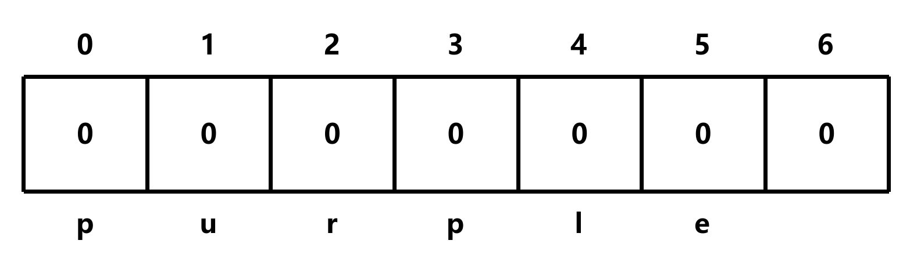

# countConstruct

## 题目描述

给定一个字符串 target 和一个字符串数组 wordBank，返回 target 可以由 wordBank 中的单词拼接而成的次数

示例:

- countConstruct('abcdef', ['ab', 'abc', 'cd', 'def', 'abcd']) => 1
- countConstruct('purple', ['purp', 'p', 'ur', 'le', 'purpl']) => 2
- countConstruct('skateboard', ['bo', 'rd', 'ate', 't', 'ska', 'sk', 'boar']) => 0

## 解题思路

**这里以 `countConstruct("purple", ["purp", "p", "ur", "le", "purpl"])` 为例**

首先确定表格大小

由于 `purple` 长度为 6，所以表格大小为 7 (6 + 1)


由于返回值类型为数字，所以表格初始值为 0



由于 `countConstruct("", [...])` 无论如何都可以拼接成空字符串，所以表格第 0 行初始值为 1


接下来遍历表格，wordBank 中的每个字符串长度作为偏移量

由于 `purple` 包含 `purp`，所以表格第 4 个索引的值为 1 (将当前位置的值加到下一个位置的值上)


同样的，由于 `purple` 包含 `p`、`purpl`，所以表格第 1、5 个索引的值为 1


然后，将指针向后移一位

由于 `urple` 包含 `ur`，所以表格第 3 个索引的值为 1


继续向后移，由于此处为 0，所以指针继续向后移，然后重复上面的步骤


- 这里 2 是因为 `purp` 有两个可能的组合，即 `purp` 和 `p + ur + p`

- 而 `le` 只是追加到 `purp` 后面，所以组合数为 2

由于指针已经到达表格的末尾，因此返回 `table[target]`，即 2

```c
int countConstruct(char *target, char **wordBank, int wordBankSize)
{
    int table[strlen(target) + 1]; // 创建一个基于 target 的数组
    memset(table, 0, sizeof(table)); // 初始化数组

    table[0] = 1; // 由于 countConstruct("", [...]) 无论如何都可以拼接成空字符串，所以表格第 0 行初始值为 1

    for (int i = 0; i <= strlen(target); i++)
    {
        if (table[i] > 0) // 如果当前位置的值大于 0
        {
            for (int j = 0; j < wordBankSize; j++)
            {
                int wordLength = strlen(wordBank[j]);
                if (strncmp(target + i, wordBank[j], wordLength) == 0) // 如果当前位置的字符串与 wordBank 中的字符串匹配
                {
                    table[i + wordLength] += table[i]; // 将当前位置的值加到下一个位置的值上
                }
            }
        }
    }
    return table[strlen(target)]; // 返回表格的最后一个值
}
```

此时时间复杂度为 O(m<sup>2</sup>n)，空间复杂度为 O(m)