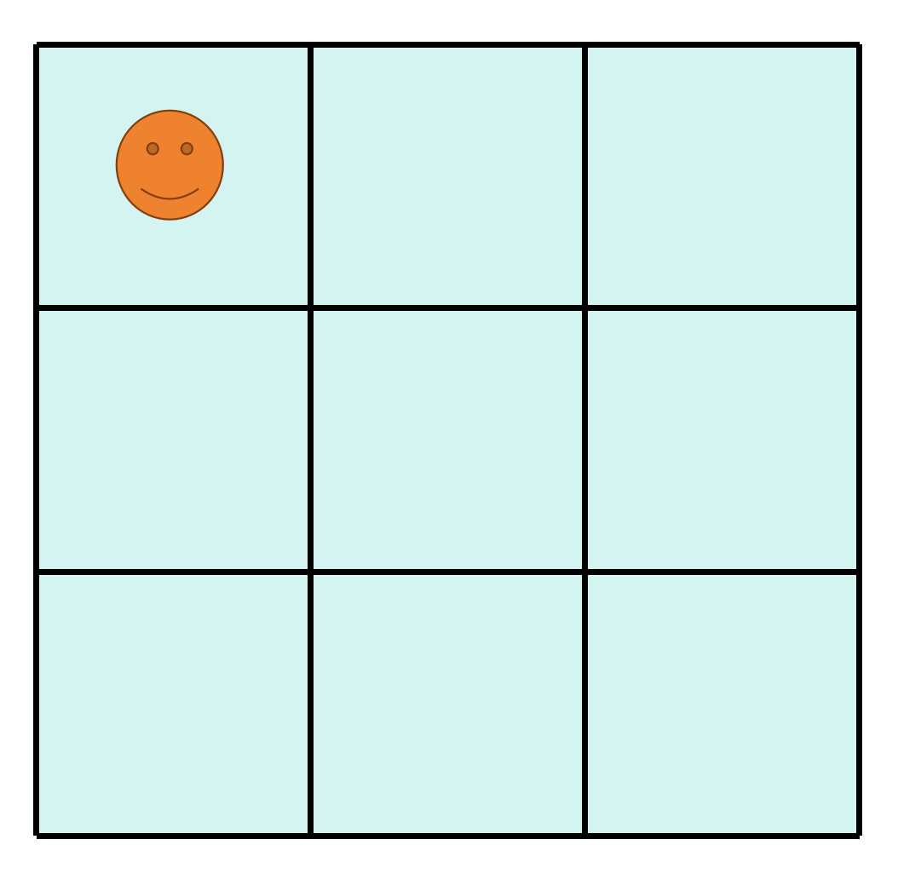
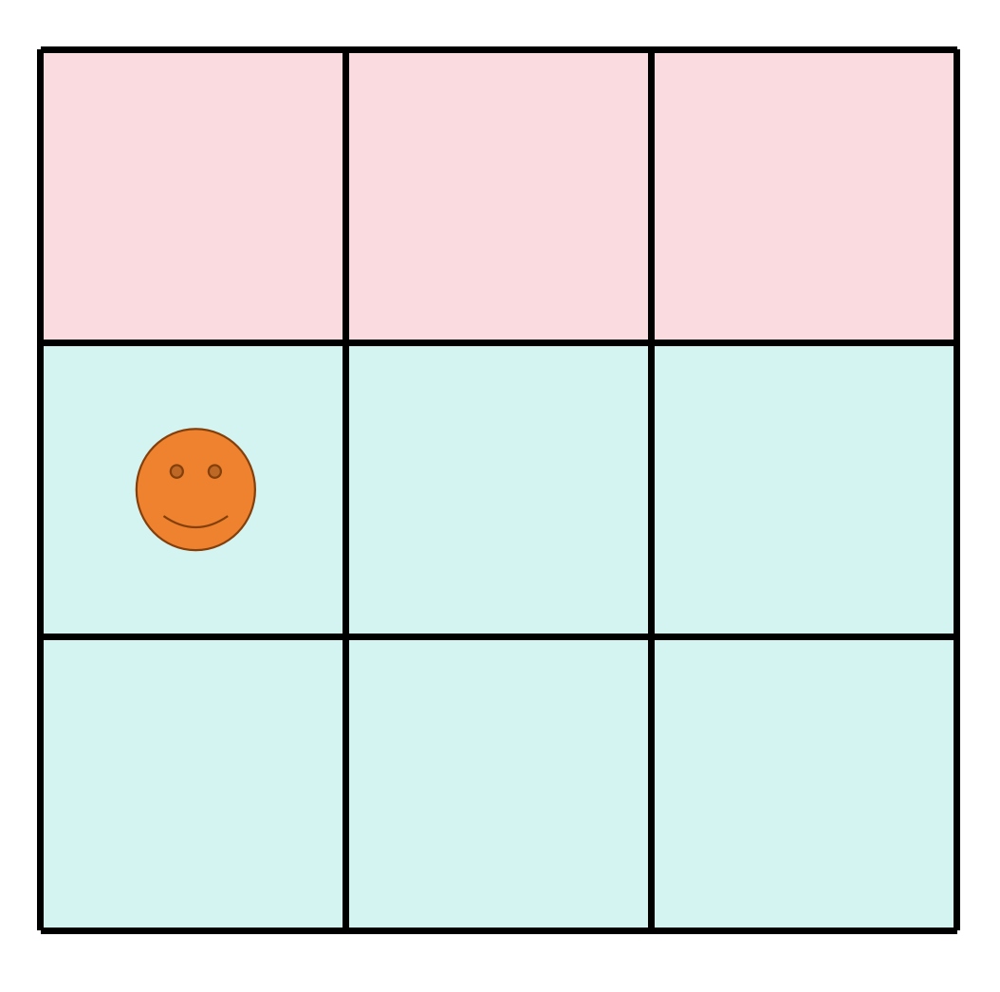
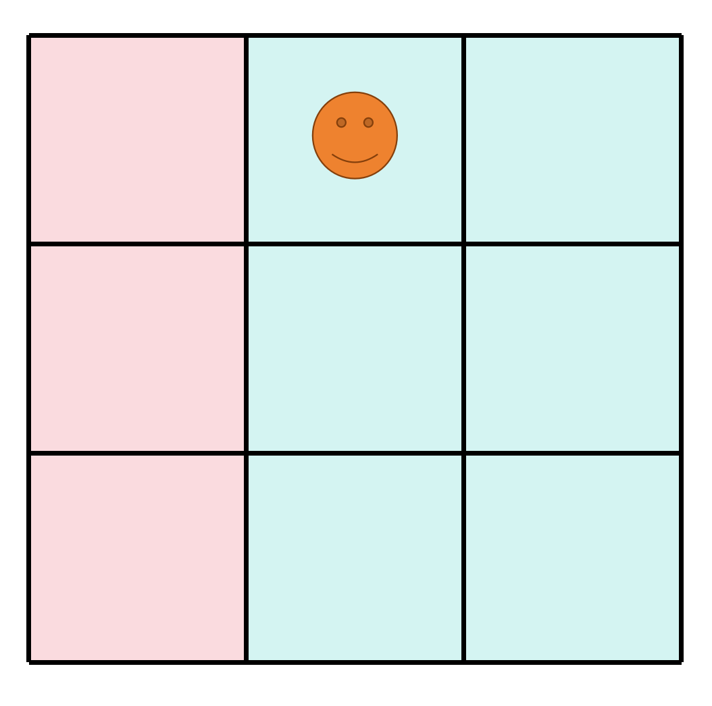
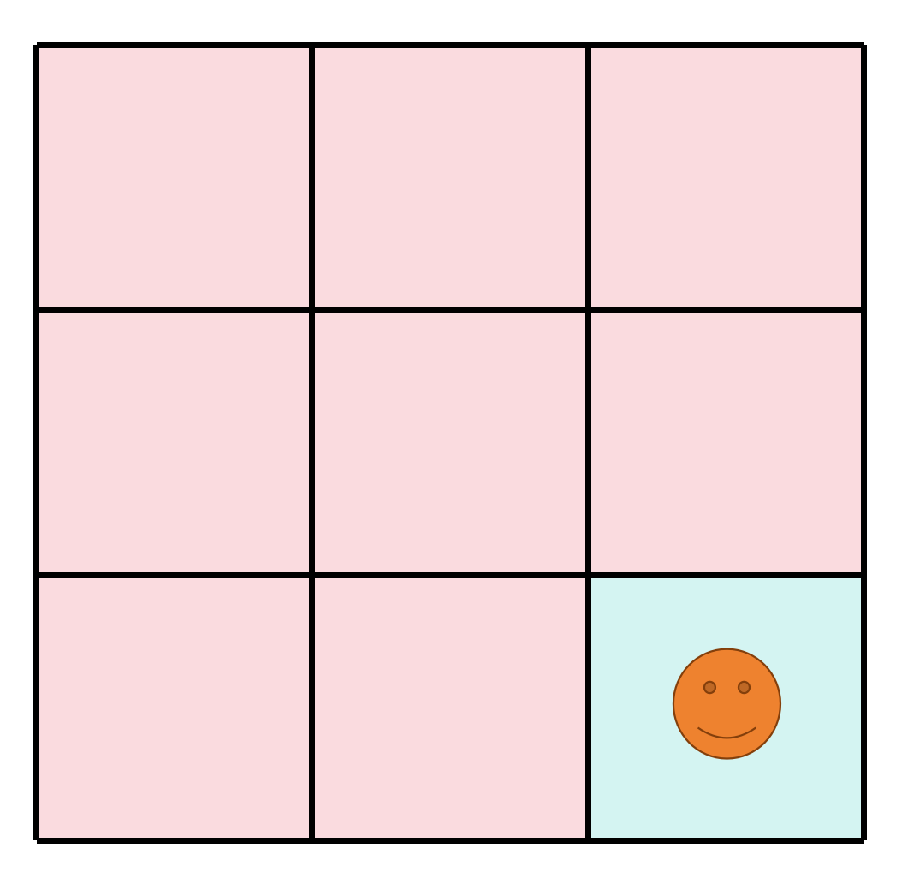
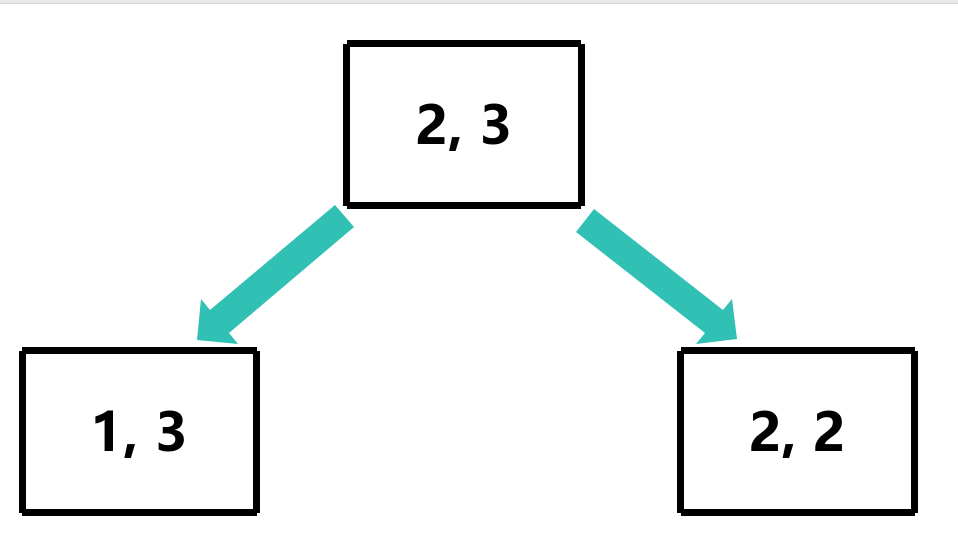
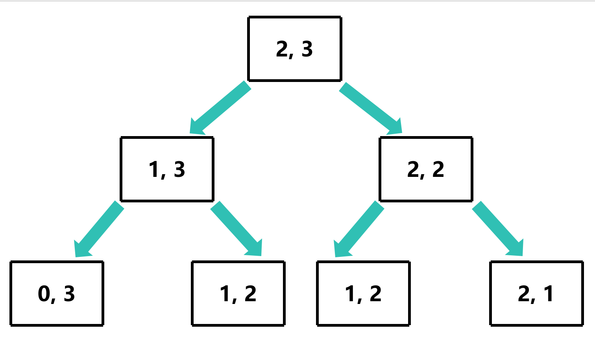
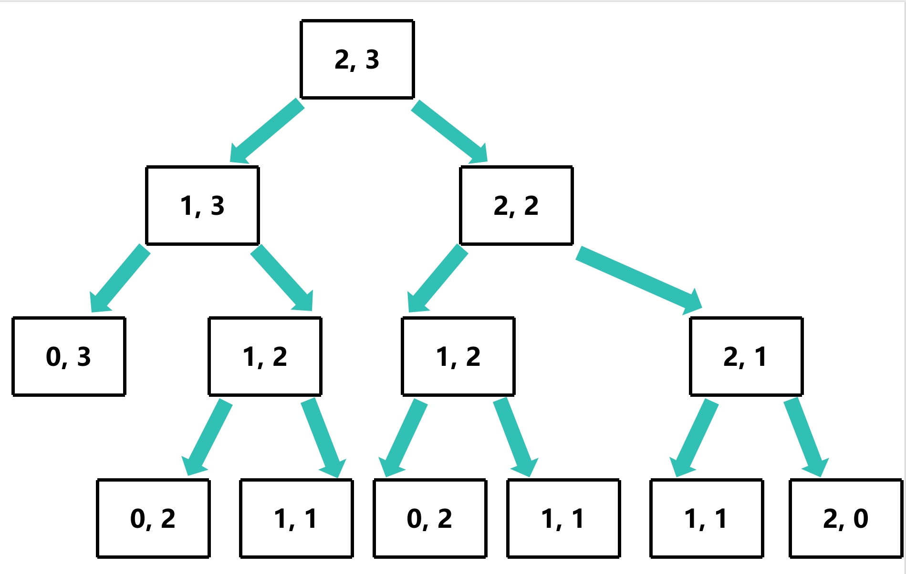
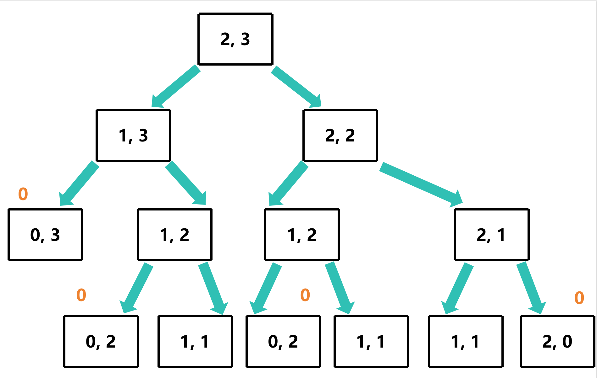
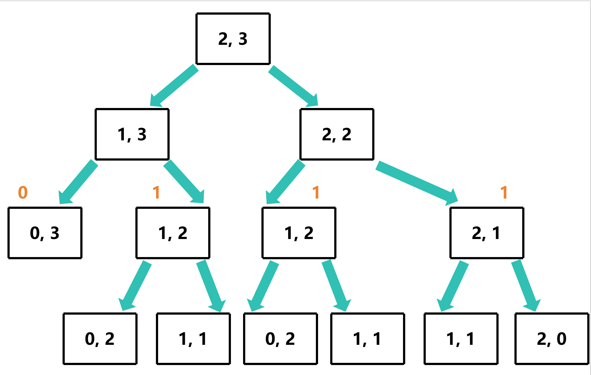
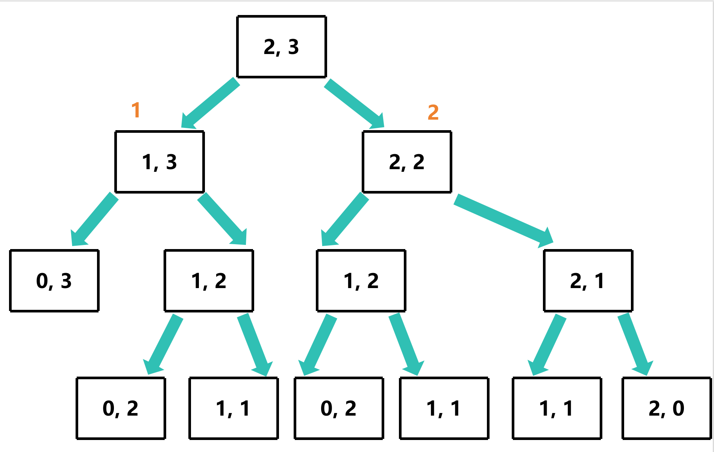

# Grid Traveler

## 题目描述

你在一个二维的网格上，你要从左上角走到右下角。每次你只能向下或者向右走一步。请问有多少种不同的走法？

## 解题思路

**这里以3x3的网格为例**

人最先在左上角



**人可以向下或者向右走一步**

如果向下走一步，那么可以想象成**人现在在2x3的网格上**



如果向右走一步，那么可以想象成**人现在在3x2的网格上**



那么可以想象成**人每走一步，网格缩小一行或一列**

直到网格缩小到1x1，那就说明人已经走到右下角了



### 图解

**以2x3的网格为例**

我们把人走的每一种情况想象成一个树，参数有行数和列数




当**行数和列数都等于1时，说明人已经走到右下角，终止**

当**行数或者列数为0时，说明人已经走到了边界，终止**



### 计算

当**行数或者列数为0时 (走到了边界)，返回0**


当**行数和列数都等于1时 (走到右下角)，返回1**


剩下的父节点，返回**向下走的步数 + 向右走的步数**





## 使用递归实现

```c
size_t gridTraveler(size_t m, size_t n)
{
    if (m == 1 && n == 1) return 1;
    if (m == 0 || n == 0) return 0;
    return gridTraveler(m - 1, n) + gridTraveler(m, n - 1);
}
```

但是这个算法的时间复杂度是O(2<sup>m+n</sup>)，空间复杂度是O(m+n)

## 分析过程图


可以看到，在 [1, 2] 处一共计算了两次

于此同时，[2, 1] 处的结果等于[1, 2] 处的结果，可以说明 **[m, n] 处的结果等于 [n, m] 处的结果**

那我们需要将 [m, n] 处的结果记忆化，当再次遇到 [m, n] 或 [n, m] 时，直接返回结果

## 使用动态规划实现

```c
size_t gridTraveler_memo(size_t m, size_t n, size_t (*memo)[n+1])
{
    if (m == 1 && n == 1) return 1;
    if (m == 0 || n == 0) return 0;
    if (memo[m][n] != 0) return memo[m][n];
    if (memo[n][m] != 0) return memo[n][m];
    memo[m][n] = gridTraveler_memo(m - 1, n, memo) + gridTraveler_memo(m, n - 1, memo);
    return memo[m][n];
}

size_t gridTraveler(size_t m, size_t n)
{
    size_t memo[m+1][n+1];
    memset(memo, 0, sizeof(size_t) * (m+1) * (n+1));
    return gridTraveler_memo(m, n, memo);
}
```

此时，时间复杂度是O(m\*n)，空间复杂度是O(m+n)

## 使用循环代替递归

```c
size_t gridTraveler_loop(size_t m, size_t n)
{
    size_t table[m+1][n+1];
    memset(table, 0, sizeof(size_t) * (m+1) * (n+1));
    table[1][1] = 1;
    for (size_t i = 0; i <= m; i++)
    {
        for (size_t j = 0; j <= n; j++)
        {
            size_t current = table[i][j];
            if (j + 1 <= n) table[i][j+1] += current;
            if (i + 1 <= m) table[i+1][j] += current;
        }
    }
    return table[m][n];
}
```