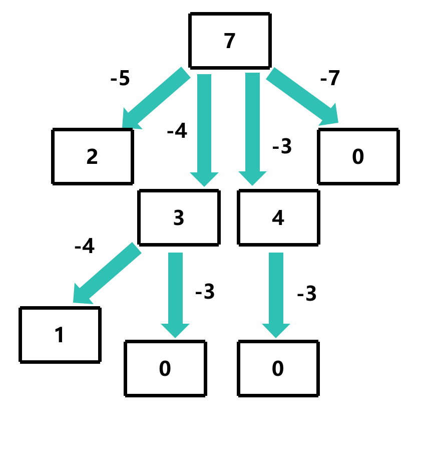

# canSum

## 问题描述

给定一个整数数组和一个目标值，判断数组中是否存在两个数之和等于目标值，返回布尔值表示是否可以找到

条件：
- 每个元素可以使用多次
- 所有元素都是正整数

示例：
canSum(7, [5, 3, 4, 7]) -> true
canSum(7, [2, 4]) -> false

## 解题思路

可以使用递归的方式解决，每次递归时，将目标值减去数组中的一个元素，然后递归调用canSum函数，直到目标值为0或者小于0，等于0时返回true，小于0时返回false



**每个子节点其中一个结果为true，那么父节点也为true，否则为false**

```c
bool canSum(int target, int *nums, int numsSize)
{
    if (target == 0) return true; // 目标值为0，返回true
    if (target < 0) return false; // 目标值小于0，返回false

    for (int i = 0; i < numsSize; i++)
    {
        int remainder = target - nums[i]; // 计算剩余的目标值
        if (canSum(remainder, nums, numsSize)) // 递归调用canSum函数
        {
            return true; // 找到一个组合，返回true
        }
    }
    return false; // 没有找到任何组合，返回false
}
```

但是这种解法的时间复杂度为O(n<sup>m</sup>)，空间复杂度为O(m)

- m为目标值
- n为数组长度

## 过程图分析

这里以 canSum(8, [2, 3, 5]) 为例


我们可以看到，所有 `3` 的分支都是相同的


那么我们可以使用记忆化的方式来优化这个问题

## 使用动态规划实现

`memo[1024][2]` 表示键值对，键为目标值，值为布尔值，表示是否可以找到

`memo[1024][0]` 表示是否已经计算过，`memo[1024][1]` 表示结果数组

```c
bool memo[1024][2]; // 记忆化数组
bool canSum(int target, int *nums, int numsSize)
{
    if (memo[target][0]) return memo[target][1]; // 如果已经计算过，直接返回结果

    if (target == 0) return true; // 目标值为0，返回true
    if (target < 0) return false; // 目标值小于0，返回false

    for (int i = 0; i < numsSize; i++)
    {
        int remainder = target - nums[i]; // 计算剩余的目标值
        if (canSum(remainder, nums, numsSize, memo)) // 递归调用canSum函数
        {
            memo[target][0] = true; // 此键值对已经计算过
            memo[target][1] = true; // 记录计算结果
            return true; // 找到一个组合，返回true
        }
    }

    memo[target][0] = true; // 此键值对已经计算过
    memo[target][1] = false; // 记录计算结果
    return false; // 没有找到任何组合，返回false
}
```