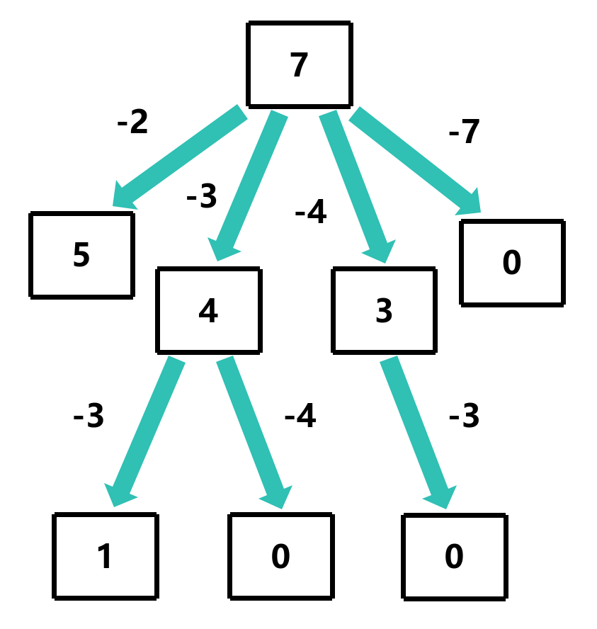
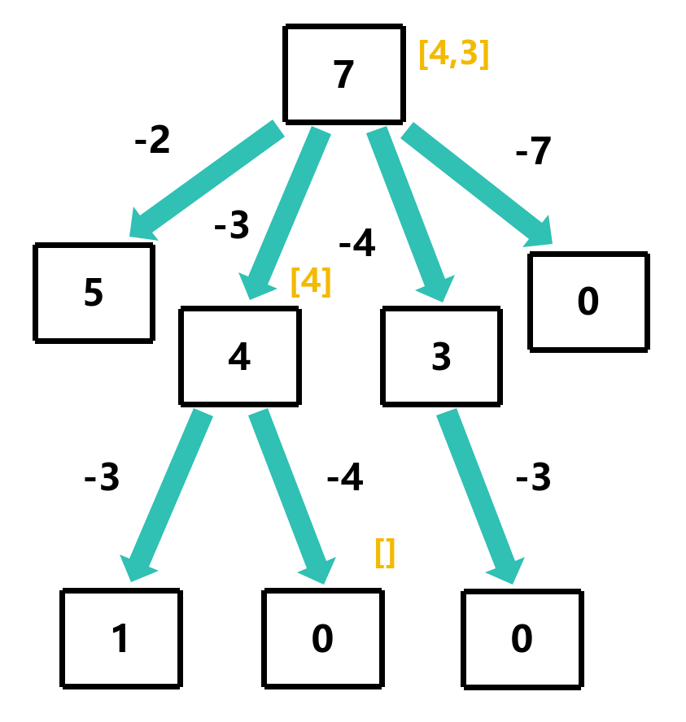

# howSum

## 问题描述

给定一个数组和一个目标数，求数组中是否存在一个子数组，使得子数组的和等于目标数

条件:
- 数组中的元素都是正整数
- 数组中的元素可以重复使用
- 如果有多个子数组，返回任意一个
- 如果没有子数组，返回空数组

示例:
- 输入: 7, [5, 3, 4, 7] —— 输出: [3, 4]
- 输入: 7, [2, 4] —— 输出: []
- 输入: 8, [2, 3, 5] —— 输出: [2, 2, 2, 2]

## 解题思路

使用递归的方式解决，每次递归时，将目标值减去数组中的一个元素，然后将此元素加入到结果数组中，然后递归调用canSum函数，直到目标值为0或者小于0，等于0时返回结果数组，小于0时返回空数组




这里以 howSum(7, [5, 3, 4, 7]) 为例

```c
int *howSum(int target, int *nums, int numsSize, int *returnSize)
{
    if(target == 0) // 目标值为0，返回空数组
    {
        *returnSize = 0; // 返回空数组的大小
        return malloc(0); // 返回空数组
    }
    if(target < 0) // 目标值小于0，返回空指针
    {
        *returnSize = 0; // 返回空数组的大小
        return NULL; // 返回空指针
    }

    for (int i = 0; i < numsSize; i++)
    {
        int remainder = target - nums[i]; // 计算剩余的目标值
        int reminderSize = 0; // 结果数组的大小
        int *reminderResult = howSum(remainder, nums, numsSize, &reminderSize); // 递归调用canSum函数
        if (reminderResult != NULL) // 找到一个组合，返回结果数组
        {
            reminderResult[reminderSize++] = nums[i]; // 将此元素加入到结果数组中
            *returnSize = reminderSize; // 更新结果数组的大小
            return reminderResult; // 返回结果数组
        }
    }
    return NULL; // 没有找到一个组合，返回空数组
}
```

但是这种解法的时间复杂度为O(n<sup>m</sup>)，空间复杂度为O(m)

## 过程图分析

这里以 howSum(8, [2, 3, 5]) 为例


我们可以看到，所有 `3` 的分支都是相同的


那么我们可以使用记忆化的方式来优化这个问题

## 使用动态规划实现

`memo[1024]` 用于存储已经计算过的结果

`memo_size[1024]` 用于存储已经计算过的结果的数组大小


```c
int *memo[1024]; // 记忆化数组
int memo_size[1024]; // 记忆化数组的大小

int *howSum(int target, int *nums, int numsSize, int *returnSize)
{
    if (memo[target] != NULL)
    {
        *returnSize = memo_size[target]; // 如果已经计算过，直接返回结果
        return memo[target]; // 如果已经计算过，直接返回结果
    }

    if(target == 0) // 目标值为0，返回空数组
    {
        *returnSize = 0; // 返回空数组的大小
        return malloc(0); // 返回空数组
    }
    if(target < 0) // 目标值小于0，返回空指针
    {
        *returnSize = 0; // 返回空数组的大小
        return NULL; // 返回空指针
    }

    for (int i = 0; i < numsSize; i++)
    {
        int remainder = target - nums[i]; // 计算剩余的目标值
        int reminderSize = 0; // 结果数组的大小
        int *reminderResult = howSum(remainder, nums, numsSize, &reminderSize); // 递归调用canSum函数
        if (reminderResult != NULL) // 找到一个组合，返回结果数组
        {
            if (memo[target] == NULL) // 如果记忆化数组中没有此元素，分配内存
            {
                memo[target] = malloc((reminderSize + 1) * sizeof(int)); // 分配内存
                memcpy(memo[target], reminderResult, reminderSize * sizeof(int)); // 复制结果数组到记忆化数组中
                memo[target][reminderSize] = nums[i]; // 添加当前元素
                memo_size[target] = reminderSize + 1; // 更新记忆化数组的大小
            }
            *returnSize = memo_size[target]; // 返回结果数组的大小
            return memo[target]; // 返回结果数组
        }
    }
    memo[target] = NULL; // 没有找到一个组合，返回空数组
    memo_size[target] = 0; // 没有找到一个组合，返回空数组
    return NULL; // 没有找到一个组合，返回空数组
}
```

此时的时间复杂度为O(n*m<sup>2</sup>)，空间复杂度为O(m<sup>2</sup>)