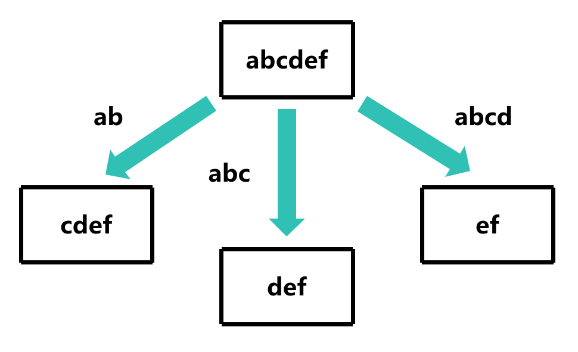
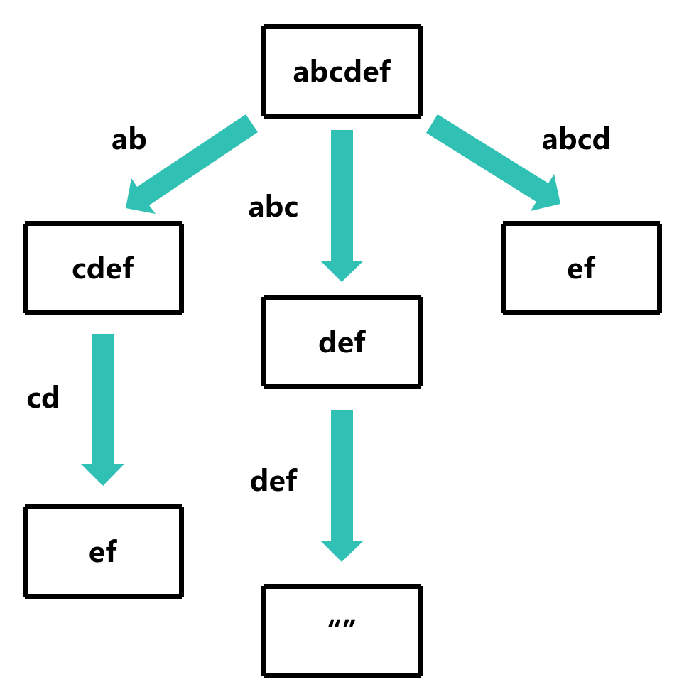
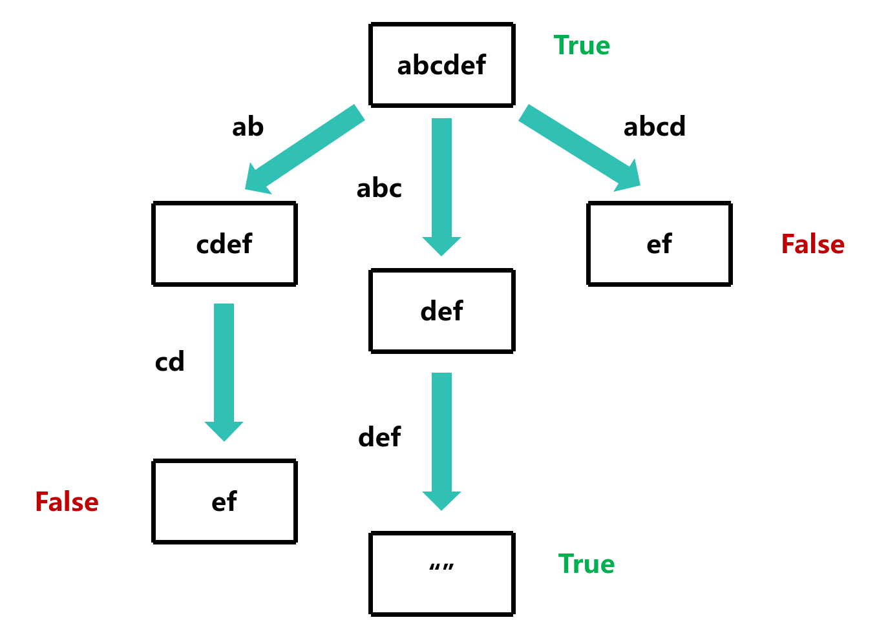
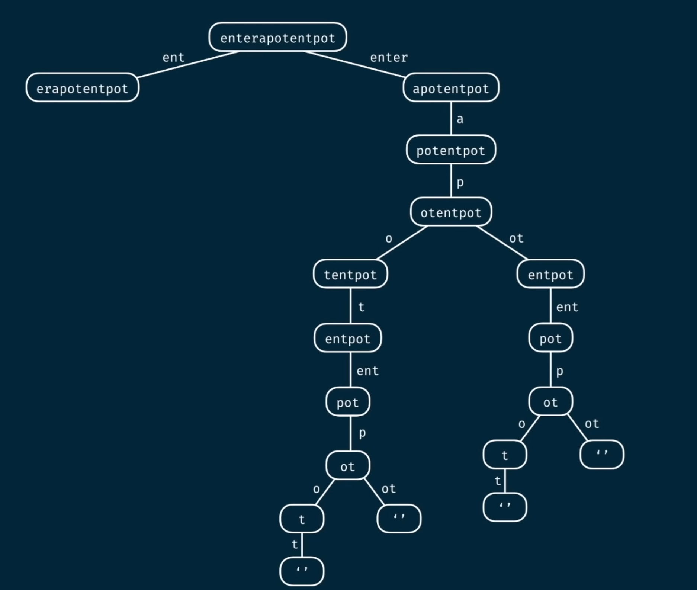
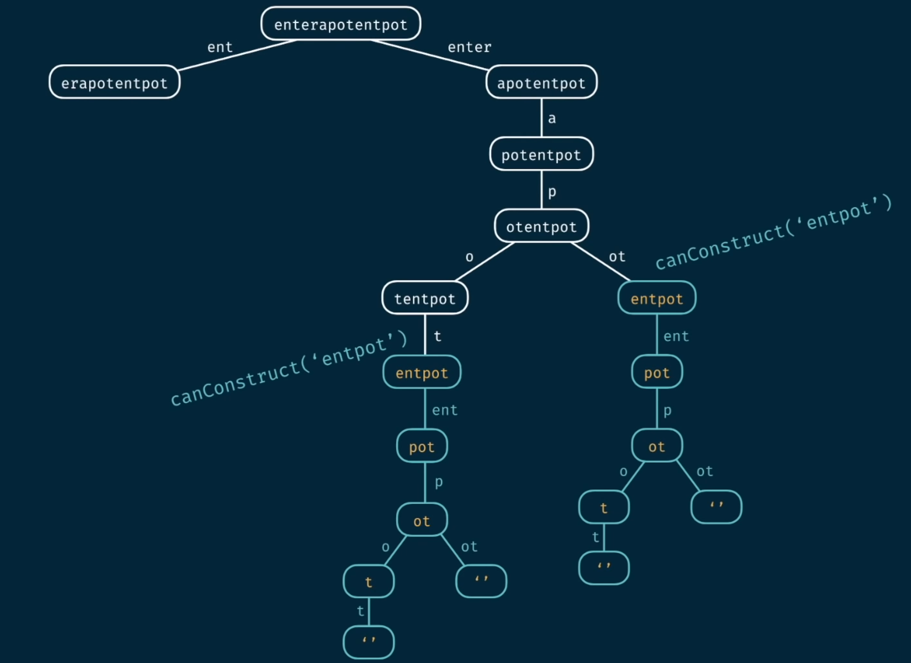

# canConstruct

## 题目描述

给定一个字符串 s 和一个字符串数组 words。如果 s 可以由 words 中的单词串联形成，返回 true ；否则，返回 false

条件:
- words 中的单词可以重复使用

示例:

- canConstruct("abcdef", ["ab", "abc", "cd", "def", "abcd"]) => true
- canConstruct("skateboard", ["bo", "rd", "ate", "t", "ska", "sk", "boar"]) => false
- canConstruct("", ["cat", "dog", "mouse"]) => true

## 解题思路

每次递归都从 words 中找到一个单词能匹配 s 的前缀 (例如 `abcdef` 匹配 `abc`， `abcdef` 不匹配 `cd`)，如果找到，从s的前缀移除这个单词，继续递归，直到 s 为空，返回 true；如果 s 不为空且没有匹配的单词，返回 false





这里以 `canConstruct("abcdef", ["ab", "abc", "cd", "def", "abcd"])` 为例

```c
bool canConstruct(char *s, char **words, int wordsSize) {
    if (s[0] == '\0') return true; // s 为空，返回 true

    for (int i = 0; i < wordsSize; i++) // 遍历 words，查找匹配的单词
    {
        if (strncmp(s, words[i], strlen(words[i])) == 0) // 找到匹配的单词
        {
            char *suffix = s + strlen(words[i]); // 移除已经匹配的单词
            if (canConstruct(suffix, words, wordsSize)) return true; // 递归
        }
    }
    return false; // s 不为空且没有匹配的单词，返回 false
}
```

但是这个解法的时间复杂度是 O(n<sup>m</sup>*m)，n 是 words 的长度，m 是 s 的长度

## 过程图分析

**图片来源: Coderbyte**

这里以 `canConstruct("enterapotentpot", ["a", "p", "ent", "enter", "ot", "o", "t"])` 为例



可以看到，`entpot` 这个分支会重复计算多次



所以我们可以用一个数组来记录已经计算过的分支，避免重复计算

## 使用动态规划实现

- `iscounted` 记录已经计算过的分支
- `memo` 记录已经计算过的分支的结果
- `strlen(s)` 是 s 的长度，当作哈希的索引

```c
bool iscounted[1024]; // 记录已经计算过的分支
bool memo[1024]; // 记录已经计算过的分支

bool canConstruct(char *s, char **words, int wordsSize)
{
    if (s[0] == '\0') return true; // s 为空，返回 true
    if (iscounted[strlen(s)]) return memo[strlen(s)]; // 如果已经计算过，返回结果

    for (int i = 0; i < wordsSize; i++) // 遍历 words，查找匹配的单词
    {
        if (strncmp(s, words[i], strlen(words[i])) == 0) // 找到匹配的单词
        {
            char *suffix = s + strlen(words[i]); // 移除已经匹配的单词
            if (canConstruct(suffix, words, wordsSize))
            {
                iscounted[strlen(s)] = true; // 记录已经计算过的分支
                memo[strlen(s)] = true; // 记录结果
                return true; // 递归
            }
        }
    }
    iscounted[strlen(s)] = true; // 记录已经计算过的分支
    memo[strlen(s)] = false; // 记录结果
    return false; // s 不为空且没有匹配的单词，返回 false
}
```

此时的时间复杂度是 O(n*m<sup>2</sup>)，n 是 words 的长度，m 是 s 的长度