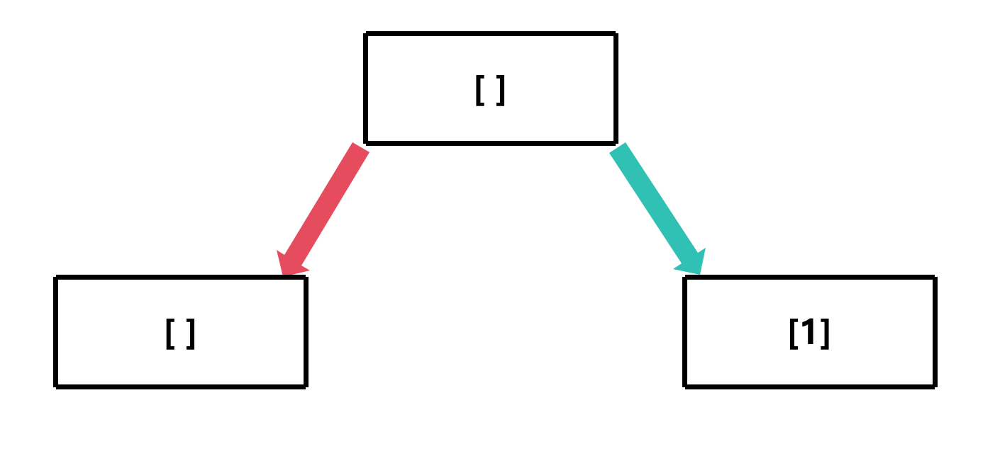
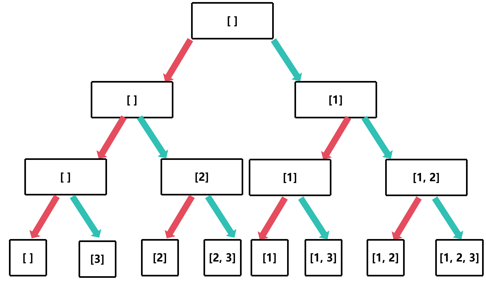

# 回溯算法

## 定义

回溯算法实际上一个类似枚举的搜索尝试过程，主要是在搜索尝试过程中寻找问题的解，当发现已不满足求解条件时，就“回溯”返回，尝试别的路径

## 步骤

1. 做选择
2. 递归执行
3. 设置基本条件
4. 撤销选择

## 例题 —— 子集问题

给定一组不含重复元素的整数数组 nums，返回该数组所有可能的子集（幂集）

说明：解集不能包含重复的子集

示例：
输入：nums = [1,2,3]
输出:
[[], [1], [2], [3], [1,2], [1,3], [2,3], [1,2,3]]

### 解题思路

**这里以 subset([1,2,3]) 为例**

假设现在我们考虑 1 这个数，我们可以选择将 1 加入到集合中，也可以选择不加入到集合中

那可以作两个分支

**一个分支是选择加入 1，另一个分支是选择不加入 1**



以此类推，画出完整的递归树



这个递归流程跟深度优先遍历的流程是一样的

```c
void backtrack(int *nums, int numsSize, int start, int *path, int *pathSize, int **res, int *returnSize, int **returnColumnSizes)
{
    if (start == numsSize) // 如果已经遍历完所有元素
    {
        res[*returnSize] = malloc(sizeof(int) * (*pathSize)); // 分配内存
        memcpy(res[*returnSize], path, sizeof(int) * (*pathSize)); // 复制路径
        (*returnColumnSizes)[*returnSize] = *pathSize; // 记录路径大小
        (*returnSize)++; // 子集数量加一
        return;
    }

    // 不选择当前元素
    backtrack(nums, numsSize, start + 1, path, pathSize, res, returnSize, returnColumnSizes);
    // 选择当前元素
    path[(*pathSize)++] = nums[start]; // 将当前元素加入路径
    backtrack(nums, numsSize, start + 1, path, pathSize, res, returnSize, returnColumnSizes);
    (*pathSize)--; // 回溯
}

int **subsets(int *nums, int numsSize, int *returnSize, int **returnColumnSizes)
{
    int **res = malloc(sizeof(int *) * 10000); // 这里假设最多有 10000 个子集
    *returnSize = 0;
    *returnColumnSizes = malloc(sizeof(int) * 10000); // 这里假设最多有 10000 个子集
    int *path = malloc(sizeof(int) * numsSize); // 用于存储当前路径
    int pathSize = 0; // 当前路径的大小
    
    // 递归
    backtrack(nums, numsSize, 0, path, &pathSize, res, returnSize, returnColumnSizes);
    return res;
}
```