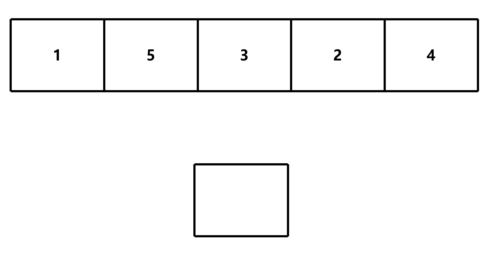
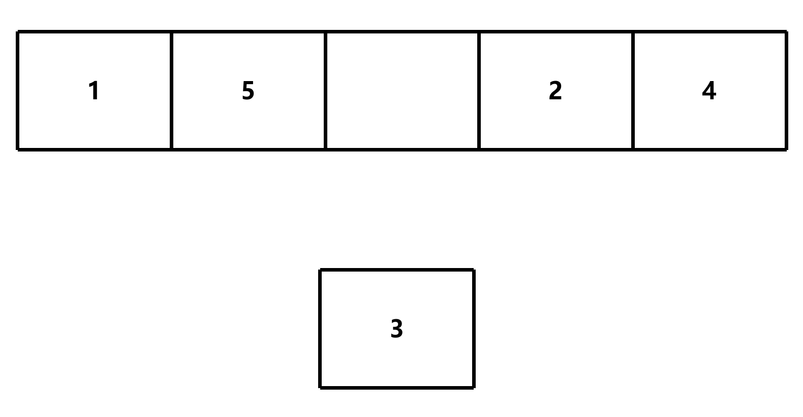
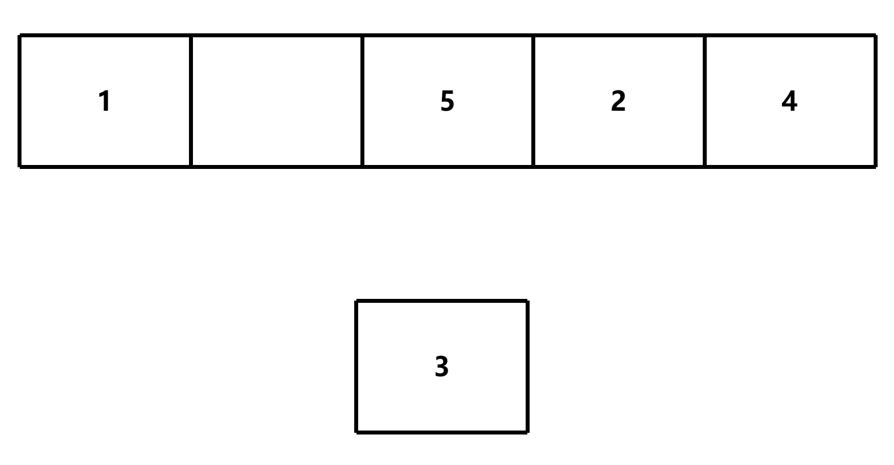
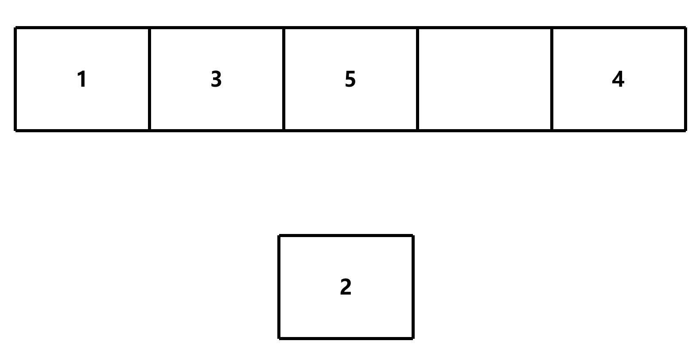
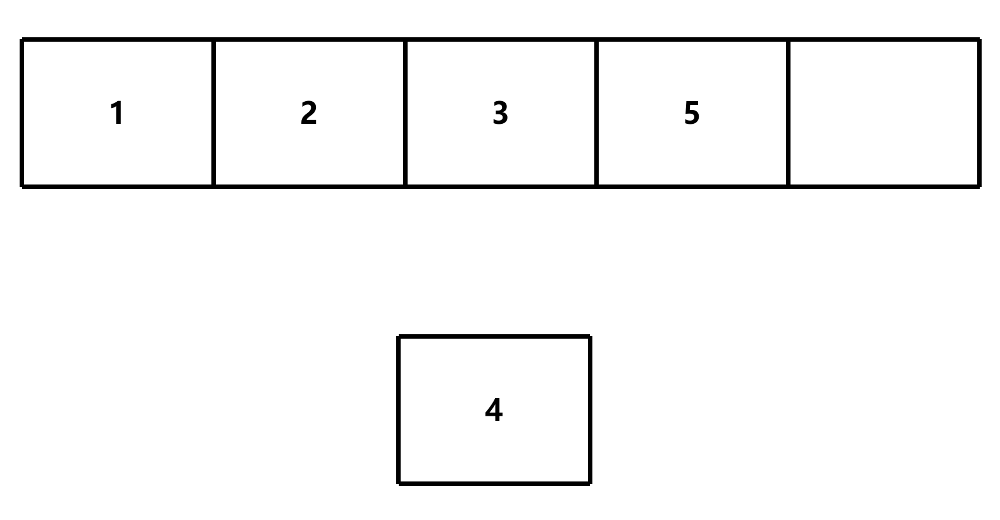
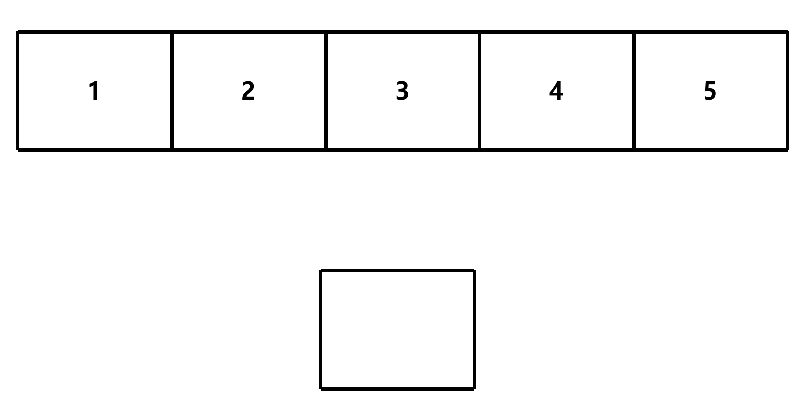

# 插入排序

## 简介

插入排序是一种简单直观的排序算法。它的工作原理是通过构建有序序列，对于未排序数据，在已排序序列中从后向前扫描，找到相应位置并插入

## 算法步骤

1. 从第一个元素开始，该元素可以认为已经被排序



2. 取出下一个元素，在已经排序的元素序列中从后向前扫描




3. 如果该元素（已排序）大于新元素，将该元素移到下一位置



4. 如果该元素（已排序）小于新元素，取出下一个元素，重复步骤 3



5. 重复步骤2~4，直到遍历完所有元素





其时间复杂度为 O(n<sup>2</sup>)

## 实现

```c
void insertion_sort(int *arr, int len);
```

- `arr`：待排序数组
- `len`：数组长度

### 变量临时变量

```c
void insertion_sort(int *arr, int len)
{
    int temp; // 临时变量，用于存储未排序序列的第一个元素
}
```

### 遍历未排序序列

```c
void insertion_sort(int *arr, int len)
{
    int temp; // 临时变量，用于存储未排序序列的第一个元素

    for (int i = 1; i < len; i++)
    {
        temp = arr[i]; // 取出未排序序列的第一个元素
    }
}
```

### 从后向前扫描已排序序列

```c
void insertion_sort(int *arr, int len)
{
    int temp; // 临时变量，用于存储未排序序列的第一个元素

    for (int i = 1; i < len; i++)
    {
        temp = arr[i]; // 取出未排序序列的第一个元素
        int j = i - 1;
        while (j >= 0 && arr[j] > temp) {    }
    }
}
```

### 移动已排序序列中的元素

将已排序序列中**大于新元素**的元素向后移动一位

```c
void insertion_sort(int *arr, int len)
{
    int temp; // 临时变量，用于存储未排序序列的第一个元素

    for (int i = 1; i < len; i++)
    {
        temp = arr[i]; // 取出未排序序列的第一个元素
        int j = i - 1;
        while (j >= 0 && arr[j] > temp)
        {
            arr[j + 1] = arr[j]; // 将已排序序列中大于新元素的元素向后移动一位
            j--;
        }
    }
}
```

### 插入新元素

将新元素插入到已排序序列中的正确位置

```c
void insertion_sort(int *arr, int len)
{
    int temp; // 临时变量，用于存储未排序序列的第一个元素

    for (int i = 1; i < len; i++)
    {
        temp = arr[i]; // 取出未排序序列的第一个元素
        int j = i - 1;
        while (j >= 0 && arr[j] > temp)
        {
            arr[j + 1] = arr[j]; // 将已排序序列中大于新元素的元素向后移动一位
            j--;
        }
        arr[j + 1] = temp; // 将新元素插入到已排序序列中的正确位置
    }
}
```