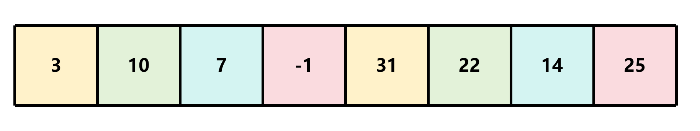
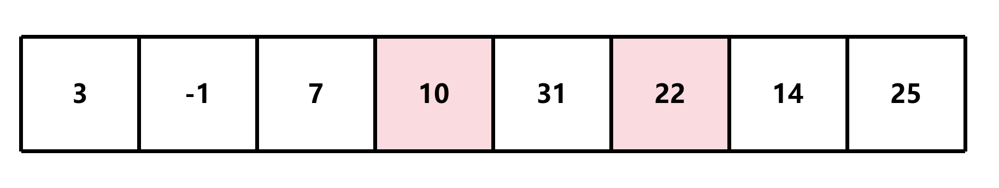

# 希尔排序

## 简介

希尔排序是插入排序的一种改进，也称为缩小增量排序。它通过将待排序的元素分组，然后对每组进行插入排序，从而减少了插入排序的比较次数和移动次数，从而提高了排序的效率

## 算法步骤

1. 选择一个增量序列，通常使用的是希尔增量序列，通常为 [n/2], [n/4], ..., [1]，然后将当前元素和增量序列中的元素分成一组


2. 对每组进行插入排序




3. 缩小增量序列 (这里为2)，重复步骤 2





4. 重复步骤 3，直到增量序列为 1


此算法的时间复杂度为 O(nlogn)

## 实现

```c
void shell_sort(int *arr, int len);
```

- `arr`: 待排序的数组
- `len`: 数组的长度

### 计算增量序列

希尔排序的增量序列通常为 [n/2], [n/4],..., [1]，其中 n 为数组的长度。这里我们使用的是希尔增量序列，即每次将增量除以 2，直到增量为 1

```c
void shell_sort(int *arr, int len)
{
    int gap = len / 2; // 计算增量序列
    while (gap > 0)
    {
        gap /= 2; // 缩小增量序列
    }
}
```

### 遍历数组

从 `gap` 开始遍历数组，从而无效的遍历

```c
void shell_sort(int *arr, int len)
{
    int gap = len / 2; // 计算增量序列
    while (gap > 0)
    {
        for (int i = gap; i < len; i++) {    }
        gap /= 2; // 缩小增量序列
    }
}
```

### 对每组进行插入排序

```c
void shell_sort(int *arr, int len)
{
    int gap = len / 2; // 计算增量序列
    while (gap > 0)
    {
        for (int i = gap; i < len; i++)
        {
            int j = i; // 记录当前元素的下标   
            while (j >= gap && arr[j] < arr[j - gap]) // 对每组进行插入排序
            {
                // 交换元素
                int temp = arr[j];
                arr[j] = arr[j - gap];
                arr[j - gap] = temp;
                j -= gap; // 继续向前遍历
            }
        }
        gap /= 2; // 缩小增量序列
    }
}
```

- `j >= gap`: 避免越界，例如当 `gap` 为 4 时，`j` 为 1 时，`j - gap` 为 -3，此时会越界
- `arr[j] < arr[j - gap]`: 对每组进行插入排序