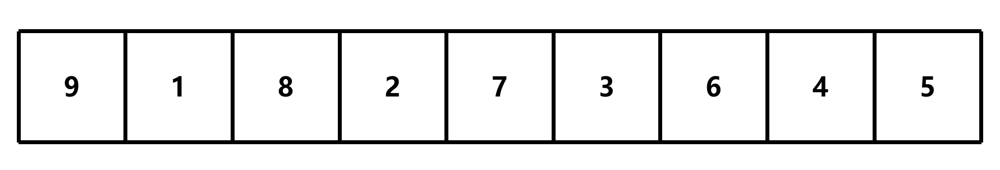
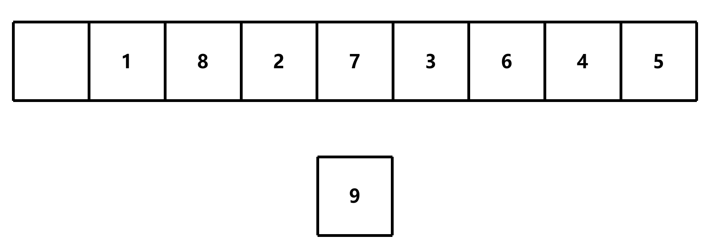
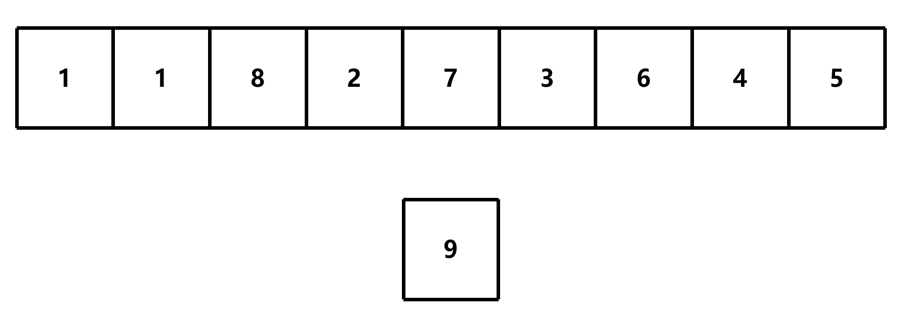
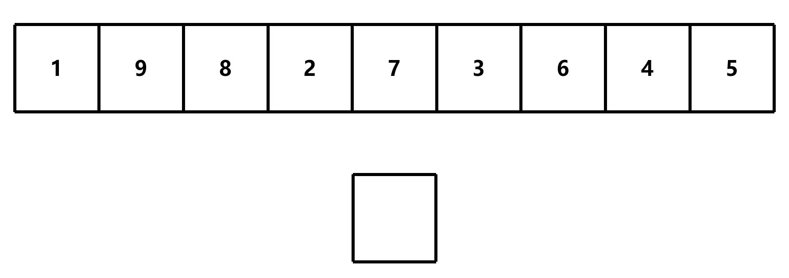
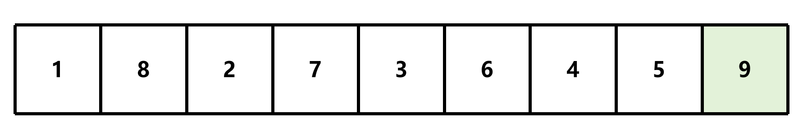
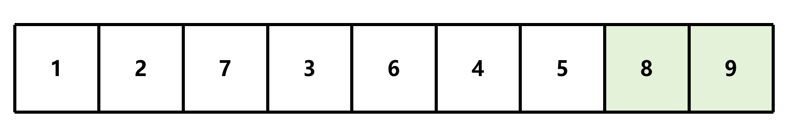
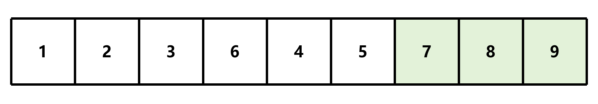
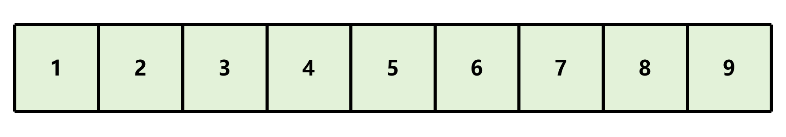

# 冒泡排序

## 简介

冒泡排序是一种简单的排序算法，它重复地走访过要排序的数列，一次比较两个元素，如果它们的顺序错误就把它们交换过来。走访数列的工作是重复地进行直到没有再需要交换，也就是说该数列已经排序完成

## 算法步骤



1. 比较相邻的元素。如果第一个比第二个大，就交换它们两个





2. 对每一对相邻元素作同样的工作，从开始第一对到结尾的最后一对。这步做完后，最后的元素会是最大的数



3. 针对所有的元素重复以上的步骤，除了最后一个



4. 持续每次对越来越少的元素重复上面的步骤，直到没有任何一对数字需要比较




此算法的时间复杂度为O(n<sup>2</sup>)

## 实现

```c
void bubble_sort(int *arr, int len);
```

### 遍历数组

```c
void bubble_sort(int *arr, int len)
{
    for (int i = 0; i < len - 1; i++) {    }
}
```

- `len - 1`：因为每次比较都会将最大的数放到最后，所以最后一个数不需要比较

### 遍历未排序的数组

要在遍历数组的基础上，遍历**未排序的数组**

```c
void bubble_sort(int *arr, int len)
{
    for (int i = 0; i < len - 1; i++) // 遍历整个数组
    {
        for (int j = 0; j < len - 1 - i; j++) {    }// 遍历未排序的数组
    }
}
```

### 比较相邻元素并交换

```c
void bubble_sort(int *arr, int len)
{
    for (int i = 0; i < len - 1; i++) // 遍历整个数组
    {
        for (int j = 0; j < len - 1 - i; j++) // 遍历未排序的数组
        {
            if (arr[j] > arr[j + 1]) // 如果前一个数大于后一个数
            {
                int temp = arr[j]; // 交换两个数
                arr[j] = arr[j + 1];
                arr[j + 1] = temp;
            }
        }
    }
}
```

## 优化

如果在排序过程中没有发生交换，说明数组已经有序，可以提前结束排序

```c
void bubble_sort(int *arr, int len)
{
    bool flag = false; // 标记是否发生交换
    for (int i = 0; i < len - 1; i++) // 遍历整个数组
    {
        flag = false; // 重置标记
        for (int j = 0; j < len - 1 - i; j++) // 遍历未排序的数组
        {
            if (arr[j] > arr[j + 1]) // 如果前一个数大于后一个数
            {
                int temp = arr[j]; // 交换两个数
                arr[j] = arr[j + 1];
                arr[j + 1] = temp;
                flag = true; // 发生交换
            }
        }
        if (!flag) break; // 如果没有发生交换，说明数组已经有序，可以提前结束排序
    }
}
```

例如[源代码](bubblesort.c#L25)中的数组

```
未优化：36次
优化后：30次
```