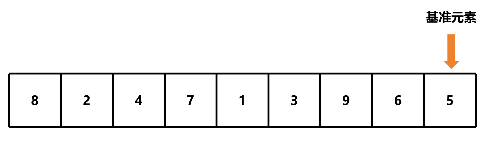

# 快速排序

## 简介

快速排序是一种分治的排序算法，它通过选择一个基准元素，将数组划分为两个子数组，然后递归地对子数组进行排序

## 算法步骤


1. 从数组中选择一个元素作为基准元素，通常选择数组的第一个元素或最后一个元素



2. 设置两个指针，一个指向数组的第一个元素 `j`，一个指向第一个元素的前一个元素 `i`


3. 移动指针 `j`，直到找到一个小于基准元素的元素


4. 指针 `i` 向后移动一位，然后交换指针 `i` 和指针 `j` 所指向的元素


5. 重复步骤 3 和步骤 4，直到指针 `j` 到达数组的末尾


6. 指针 `i` 向后移动一位，然后交换指针 `i` 和基准元素


7. 在基准元素的位置上，将数组划分为两个子数组


8. 递归地对子数组进行排序

这里只以左子数组为例，右子数组的排序过程与左子数组的排序过程相同


9. 当子数组的长度小于等于 1 时，停止递归


此算法的时间复杂度为 O(n log n)

## 代码实现

```c
void quick_sort(int *arr, int start, int end);
```

- `start`：数组的起始位置
- `end`：数组的结束位置

### 设置基准条件

基准条件是指停止递归的条件，当子数组的长度小于等于 1 时，停止递归

```c
void quick_sort(int *arr, int start, int end)
{
    if (start >= end) return; // 基准条件
}
```

### 选择基准元素

选择基准元素的方法有很多种，这里选择数组的最后一个元素作为基准元素

```c
void quick_sort(int *arr, int start, int end)
{
    if (start >= end) return; // 基准条件
    int pivot = arr[end]; // 选择基准元素
}
```

### 设置指针
设置两个指针，一个指向数组的第一个元素 `j`，一个指向第一个元素的前一个元素 `i`

```c
void quick_sort(int *arr, int start, int end)
{
    if (start >= end) return; // 基准条件
    int pivot = arr[end]; // 选择基准元素

    int i = start - 1; // 指针 i
    int j = start; // 指针 j
}
```

### 遍历数组

使用指针 `j` 遍历数组

```c
void quick_sort(int *arr, int start, int end)
{
    if (start >= end) return; // 基准条件
    int pivot = arr[end]; // 选择基准元素

    int i = start - 1; // 指针 i
    int j = start; // 指针 j

    while (j < end) // 遍历数组
    {
        j++; // 指针 j 向后移动一位
    }
}
```

- `j < end`：指针 `j` 不用遍历到基准元素

### 移动指针

移动指针 `j`，直到找到一个小于基准元素的元素

```c
void quick_sort(int *arr, int start, int end)
{
    if (start >= end) return; // 基准条件
    int pivot = arr[end]; // 选择基准元素

    int i = start - 1; // 指针 i
    int j = start; // 指针 j

    while (j < end) // 遍历数组
    {
        if (arr[j] < pivot) {    } // 找到一个小于基准元素的元素
        j++; // 指针 j 向后移动一位
    }
}
```

### 交换元素

指针 `i` 向后移动一位，然后交换指针 `i` 和指针 `j` 所指向的元素

```c
void quick_sort(int *arr, int start, int end)
{
    if (start >= end) return; // 基准条件
    int pivot = arr[end]; // 选择基准元素

    int i = start - 1; // 指针 i
    int j = start; // 指针 j

    while (j < end) // 遍历数组
    {
        if (arr[j] < pivot) // 找到一个小于基准元素的元素
        {
            i++; // 指针 i 向后移动一位
            // 交换指针 i 和指针 j 所指向的元素
            int temp = arr[i];
            arr[i] = arr[j];
            arr[j] = temp;
        }
        j++; // 指针 j 向后移动一位
    }

    // 交换指针 i 和基准元素
    i++;
    int temp = arr[i];
    arr[i] = arr[end];
    arr[end] = temp;
}
```

### 计算当前基准元素的位置

计算当前基准元素的位置，即当前指针 `i` 所指向的元素的位置

```c
void quick_sort(int *arr, int start, int end)
{
    if (start >= end) return; // 基准条件
    int pivot = arr[end]; // 选择基准元素

    int i = start - 1; // 指针 i
    int j = start; // 指针 j

    while (j < end) // 遍历数组
    {
        if (arr[j] < pivot) // 找到一个小于基准元素的元素
        {
            i++; // 指针 i 向后移动一位
            // 交换指针 i 和指针 j 所指向的元素
            int temp = arr[i];
            arr[i] = arr[j];
            arr[j] = temp;
        }
        j++; // 指针 j 向后移动一位
    }

    // 交换指针 i 和基准元素
    i++;
    int temp = arr[i];
    arr[i] = arr[end];
    arr[end] = temp;

    // 计算当前基准元素的位置
    int pivot_index = i;
}
```

### 递归排序

递归地对子数组进行排序

- 左子数组：`start` 到 `pivot_index - 1`
- 右子数组：`pivot_index + 1` 到 `end`

```c
void quick_sort(int *arr, int start, int end)
{
    if (start >= end) return; // 基准条件
    int pivot = arr[end]; // 选择基准元素

    int i = start - 1; // 指针 i
    int j = start; // 指针 j

    while (j < end) // 遍历数组
    {
        if (arr[j] < pivot) // 找到一个小于基准元素的元素
        {
            i++; // 指针 i 向后移动一位
            // 交换指针 i 和指针 j 所指向的元素
            int temp = arr[i];
            arr[i] = arr[j];
            arr[j] = temp;
        }
        j++; // 指针 j 向后移动一位
    }

    // 交换指针 i 和基准元素
    i++;
    int temp = arr[i];
    arr[i] = arr[end];
    arr[end] = temp;

    // 计算当前基准元素的位置
    int pivot_index = i;

    // 递归地对子数组进行排序
    quick_sort(arr, start, pivot_index - 1); // 左子数组
    quick_sort(arr, pivot_index + 1, end); // 右子数组
}
```
