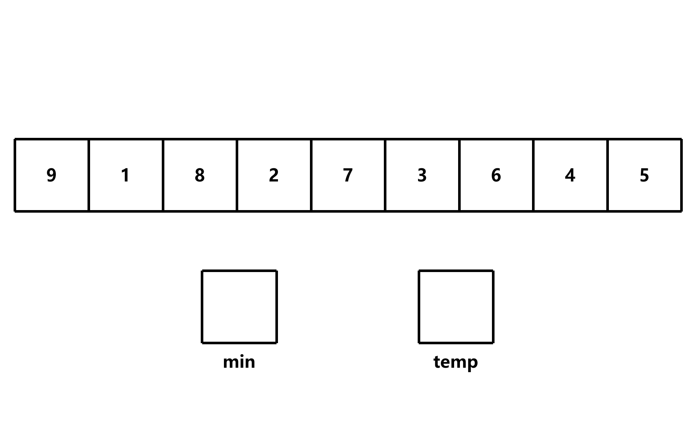
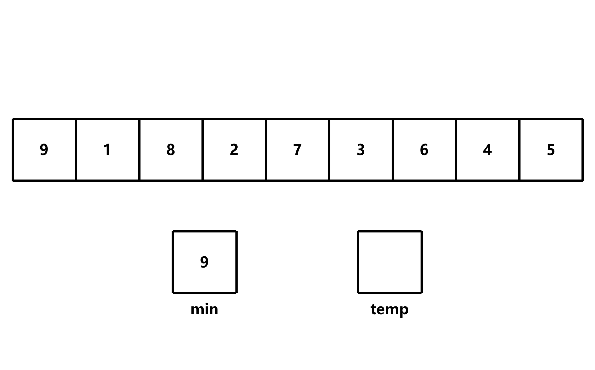
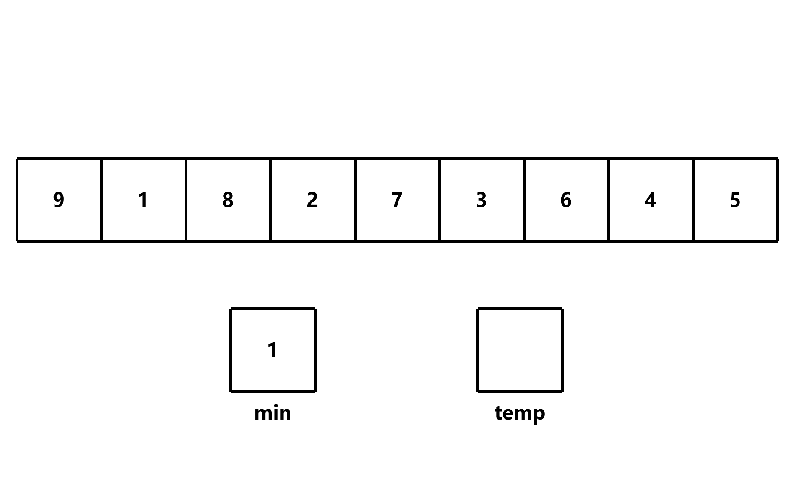
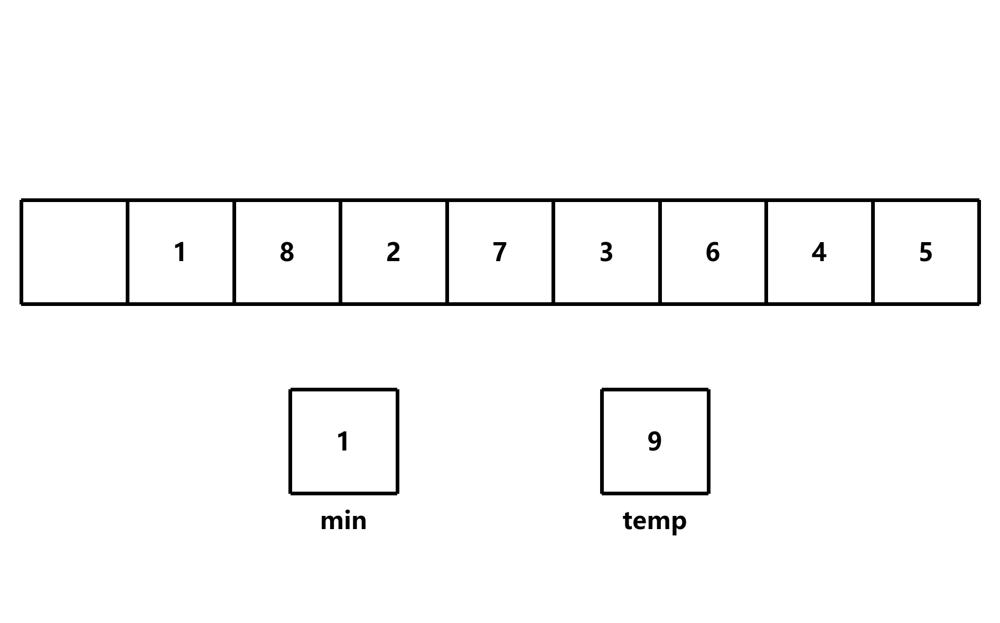
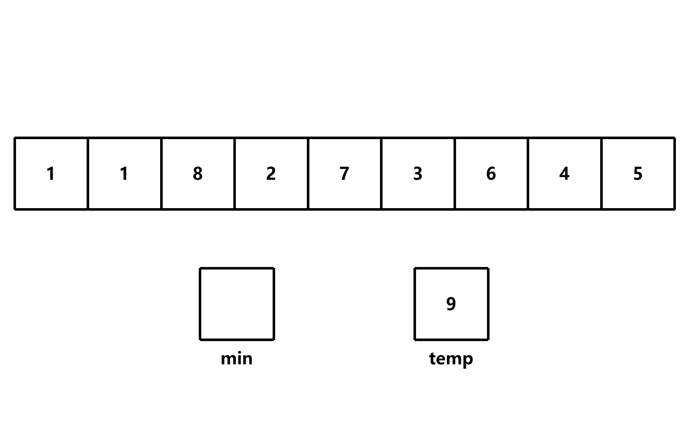
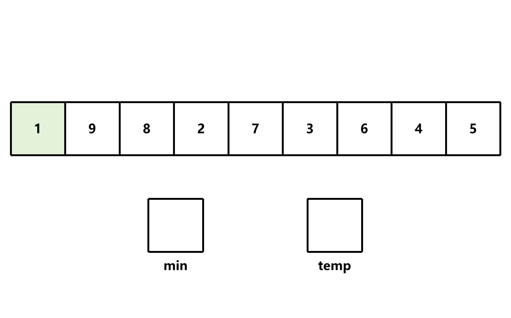
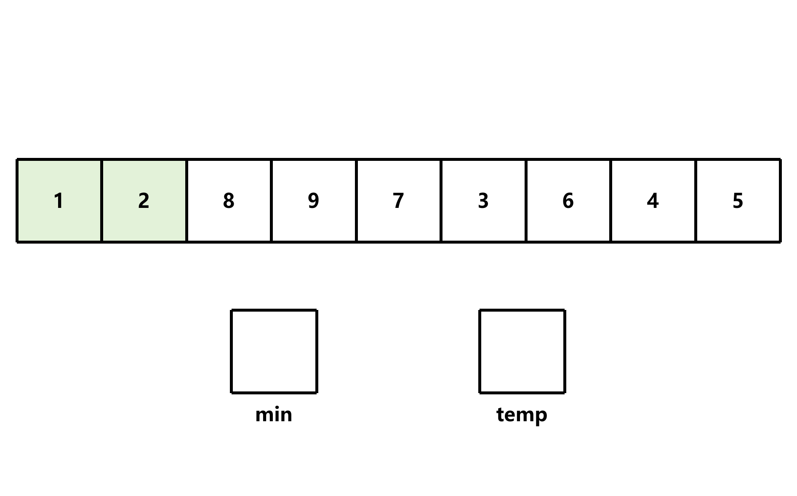
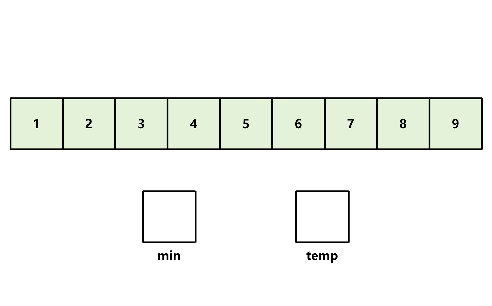

# 选择排序

## 简介

选择排序是一种简单直观的排序算法，它的工作原理是：第一次从待排序的数据元素中选出最小（或最大）的一个元素，存放在序列的起始位置，然后再从剩余的未排序元素中寻找到最小（大）元素，然后放到已排序的序列的末尾。以此类推，直到全部待排序的数据元素的个数为零。选择排序是不稳定的排序方法

## 算法步骤



1. 首先在未排序序列中找到最小（大）元素




2. 存放到排序序列的起始位置





3. 重复步骤 1~2，直到所有元素均排序完毕




此算法的时间复杂度为 O(n<sup>2</sup>)

## 实现

```c
void selection_sort(int *arr, int len);
```

### 遍历数组

```c
void selection_sort(int *arr, int len)
{
    for (int i = 0; i < len - 1; i++) {    } // 遍历数组
}
```

- `i < len - 1`：因为最后一个元素已经是最大的了，所以不需要再比较

### 遍历未排序的元素

```c
void selection_sort(int *arr, int len)
{
    for (int i = 0; i < len - 1; i++) // 遍历数组
    {
        for (int j = i + 1; j < len; j++) {    }    // 遍历未排序的元素
    }
}
```

- `j = i + 1`：第一个未排序的元素

### 比较元素并提取最小值

由于之后要交换元素，所以记录的是**最小值的索引**，而不是元素本身

```c
void selection_sort(int *arr, int len)
{
    for (int i = 0; i < len - 1; i++) // 遍历数组
    {
        int min = i; // 记录最小值的索引

        for (int j = i + 1; j < len; j++) // 遍历未排序的元素
        {
            if (arr[j] < arr[min]) min = j;
        }
    }
}
```

### 交换元素

```c
void selection_sort(int *arr, int len)
{
    for (int i = 0; i < len - 1; i++) // 遍历数组
    {
        int min = i; // 记录最小值的索引

        for (int j = i + 1; j < len; j++) // 遍历未排序的元素
        {
            if (arr[j] < arr[min]) min = j;
        }

        // 交换元素
        int temp = arr[i];
        arr[i] = arr[min];
        arr[min] = temp;
    }
}
```