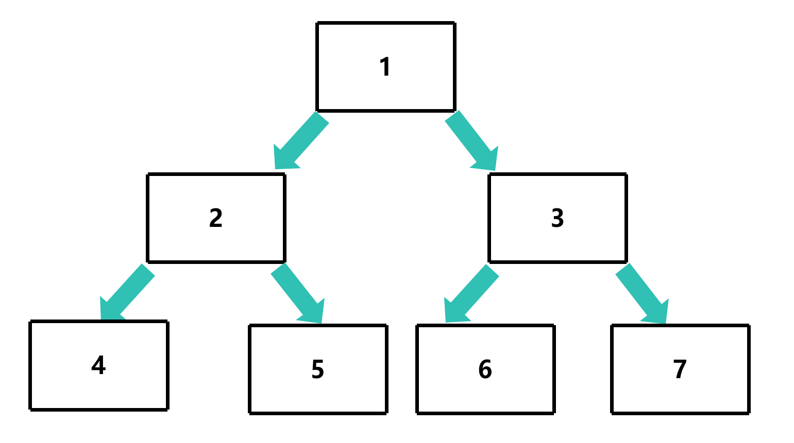
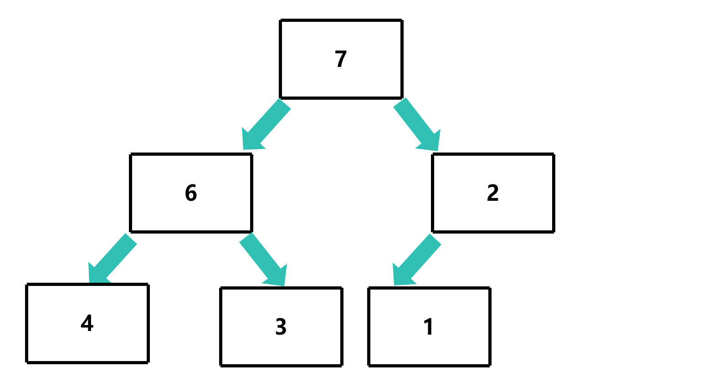
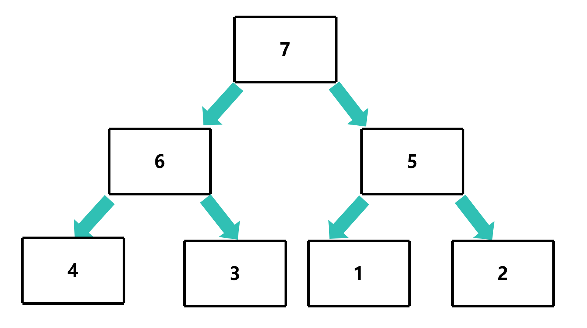
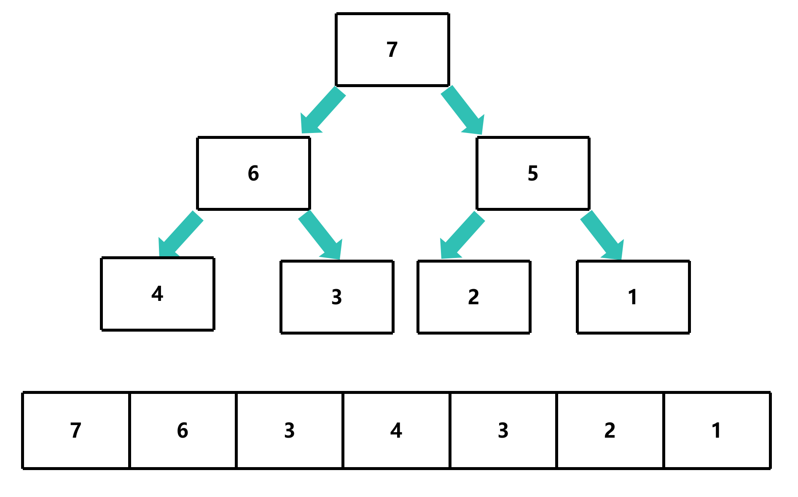
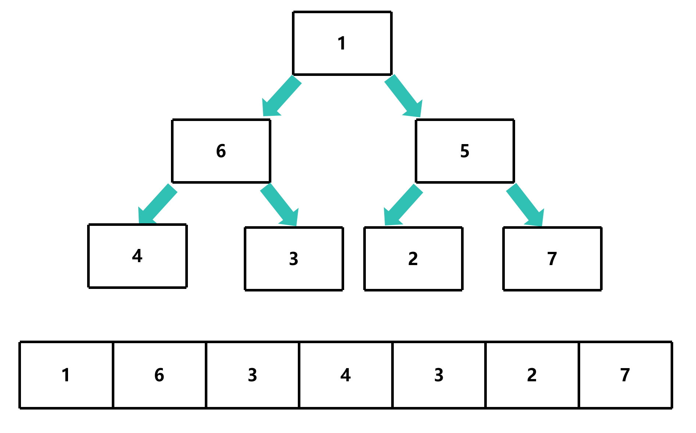
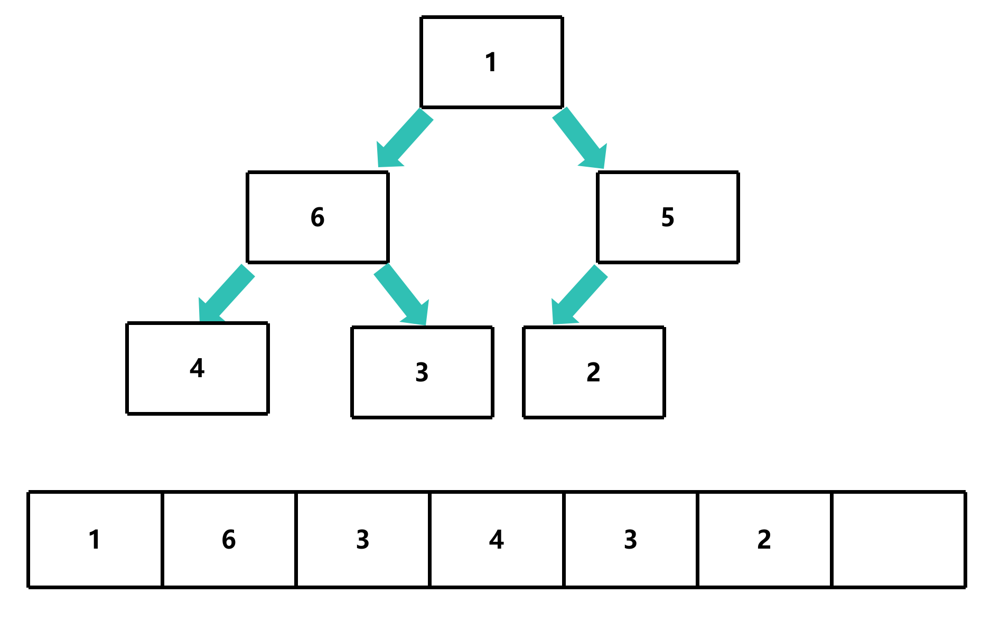
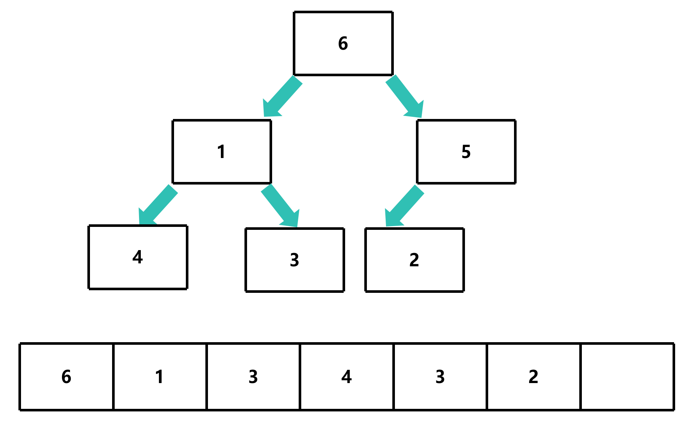
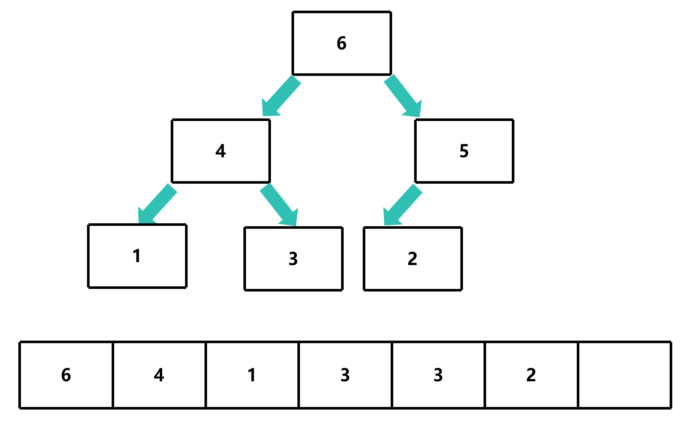

# 堆排序

## 算法思想

假设你现在有一组不同优先级的任务需要处理，而你需要按照优先级的高低来完成这些任务，使得每次都能优先找到优先级最高的任务进行处理

如果把这些任务用数组存储，那么需要遍历数组才能找到优先级最高的任务，这样的时间复杂度为 `O(n)`

即使将数组进行排序，但要先构造已排序的数组，再取出优先级最高的任务，这样的时间复杂度为 `O(n)`

因此，我们可以使用堆来解决这个问题，堆是一种特殊的二叉树，**每个节点的值都大于或小于其子节点的值**

堆有两种类型：

- 大根堆 (Max Heap)：
  - 每个节点的值都大于或等于其子节点的值


- 小根堆 (Min Heap)：
  - 每个节点的值都小于或等于其子节点的值



这样，我们就可以使用堆来存储任务，每次取出优先级最高的任务，这样的时间复杂度为 `O(1)` (使用大根堆的情况)

## 堆

堆有以下几个性质：

- 完全二叉树：堆是一棵完全二叉树，即除了最后一层外，其他层的节点都是满的，最后一层的节点都靠左排列

- 最大堆不允许插入值比父节点小的节点，最小堆不允许插入值比父节点大的节点

堆有以下几个操作：

- 插入节点
- 删除节点
- 构建堆
- 取出最大/最小节点
- 更新节点

## 堆的操作

**注意：这里只以大根堆为例**

```c
typedef struct Heap {
    int data[MAX_HEAP_SIZE]; // 存储堆的数组
    int size; // 堆的大小
} Heap;
```

### 堆的上浮/下沉

由于堆的性质，我们不能直接插入、删除节点，而是需要对堆进行上浮/下沉操作，来保证堆的性质

#### 上浮


如果子节点比父节点大，那么需要将节点上浮，直到节点比父节点小


```c
void sift_up(Heap *heap, int index);
```

- `heap`：堆
- `index`：节点的下标

##### 确定父节点

由于我们使用数组来存储堆，因此可以通过下标来确定父节点

假设当前节点的下标为 `i`，那么父节点的下标为 `(i - 1) / 2`

```c
void sift_up(Heap *heap, int index)
{
    int parent_index = (index - 1) / 2; // 父节点的下标
}
```

##### 确定结束条件

如果节点比父节点小，或者节点已经是根节点，那么就不需要继续上浮了

```c
void sift_up(Heap *heap, int index)
{
    int parent_index = (index - 1) / 2; // 父节点的下标

    while (index > 0 && heap->data[index] > heap->data[parent_index]) {    } // 节点不是根节点，且节点比父节点大
}
```

##### 交换节点

如果节点比父节点大，那么需要将节点上浮，直到节点比父节点小

```c
void sift_up(Heap *heap, int index)
{
    int parent_index = (index - 1) / 2; // 父节点的下标

    while (index > 0 && heap->data[index] > heap->data[parent_index]) // 节点不是根节点，且节点比父节点大
    {
        // 交换节点
        int temp = heap->data[index];
        heap->data[index] = heap->data[parent_index];
        heap->data[parent_index] = temp;
    }
}
```

##### 更新节点的下标

由于节点的下标发生了变化，因此需要更新当前节点和父节点的下标

```c
void sift_up(Heap *heap, int index)
{
    int parent_index = (index - 1) / 2; // 父节点的下标

    while (index > 0 && heap->data[index] > heap->data[parent_index]) // 节点不是根节点，且节点比父节点大
    {
        // 交换节点
        int temp = heap->data[index];
        heap->data[index] = heap->data[parent_index];
        heap->data[parent_index] = temp;

        // 更新节点的下标
        index = parent_index;
        parent_index = (index - 1) / 2;
    }
}
```

#### 下沉


如果父节点比子节点小，那么需要将节点下沉，直到节点比子节点大


```c
void sift_down(Heap *heap, int index);
```
- `heap`：堆
- `index`：节点的下标

##### 确定左右子节点

确定左右子节点的下标，用于比较

- 左子节点的下标为 `index * 2 + 1`
- 右子节点的下标为 `index * 2 + 2`

```c
void sift_down(Heap *heap, int index)
{
    int left_child_index = index * 2 + 1; // 左子节点的下标
    int right_child_index = index * 2 + 2; // 右子节点的下标
}
```

##### 确定结束条件

如果节点比子节点大，或者节点已经是叶子节点，那么就不需要继续下沉了

```c
void sift_down(Heap *heap, int index)
{
    int left_child_index = index * 2 + 1; // 左子节点的下标
    int right_child_index = index * 2 + 2; // 右子节点的下标

    while (left_child_index < heap->size && 
        heap->data[index] < heap->data[left_child_index] ||
        right_child_index < heap->size) // 节点不是叶子节点，且节点比子节点小
    {   }
}
```

##### 查找最大子节点

由于我们使用大根堆，因此需要找到左右子节点中最大的节点

```c
void sift_down(Heap *heap, int index)
{
    int left_child_index = index * 2 + 1; // 左子节点的下标
    int right_child_index = index * 2 + 2; // 右子节点的下标

    while (left_child_index < heap->size && 
        heap->data[index] < heap->data[left_child_index] ||
        right_child_index < heap->size) // 节点不是叶子节点，且节点比子节点小
    {
        // 查找最大子节点
        int max_child_index = 0;
        if (right_child_index < heap->size && heap->data[left_child_index] < heap->data[right_child_index]) // 右子节点存在，且右子节点比左子节点大
        {
            max_child_index = right_child_index;
        }
        else max_child_index = left_child_index; // 左子节点存在，且左子节点比右子节点大
    }
}
```

##### 交换节点

如果节点比子节点小，那么需要将节点下沉，直到节点比子节点大

```c
void sift_down(Heap *heap, int index)
{
    int left_child_index = index * 2 + 1; // 左子节点的下标
    int right_child_index = index * 2 + 2; // 右子节点的下标

    while (left_child_index < heap->size && 
        heap->data[index] < heap->data[left_child_index] ||
        right_child_index < heap->size) // 节点不是叶子节点，且节点比子节点小
    {
        // 查找最大子节点
        int max_child_index = 0;
        if (right_child_index < heap->size && heap->data[left_child_index] < heap->data[right_child_index]) // 右子节点存在，且右子节点比左子节点大
        {
            max_child_index = right_child_index;
        }
        else max_child_index = left_child_index; // 左子节点存在，且左子节点比右子节点大

        // 交换节点
        int temp = heap->data[index];
        heap->data[index] = heap->data[max_child_index];
        heap->data[max_child_index] = temp;
    }
}
```

##### 更新左右节点的下标

由于节点的下标发生了变化，因此需要更新左右节点的下标

```c
void sift_down(Heap *heap, int index)
{
    int left_child_index = index * 2 + 1; // 左子节点的下标
    int right_child_index = index * 2 + 2; // 右子节点的下标

    while (left_child_index < heap->size && 
        heap->data[index] < heap->data[left_child_index] ||
        right_child_index < heap->size) // 节点不是叶子节点，且节点比子节点小
    {
        // 查找最大子节点
        int max_child_index = 0;
        if (right_child_index < heap->size && heap->data[left_child_index] < heap->data[right_child_index]) // 右子节点存在，且右子节点比左子节点大
        {
            max_child_index = right_child_index;
        }
        else max_child_index = left_child_index; // 左子节点存在，且左子节点比右子节点大

        // 交换节点
        int temp = heap->data[index];
        heap->data[index] = heap->data[max_child_index];
        heap->data[max_child_index] = temp;

        // 更新节点的下标
        index = max_child_index;
        left_child_index = index * 2 + 1;
        right_child_index = index * 2 + 2;
    }
}
```

### 插入节点



由于堆是一棵完全二叉树，因此我们可以直接将节点插入到最后一个位置


由于堆的性质，我们可能需要对节点进行上浮操作，来保证堆的性质



```c
void insert(Heap *heap, int value);
```

- `heap`：堆
- `value`：要插入的节点的值

#### 插入节点

由于堆是一棵完全二叉树，因此我们可以直接将节点插入到最后一个位置

```c
void insert(Heap *heap, int value)
{
    heap->data[heap->size] = value; // 将节点插入到最后一个位置
    heap->size++; // 堆的大小加一
}
```

#### 上浮节点

对于新插入的节点，我们可能需要对节点进行上浮操作，来保证堆的性质

```c
void insert(Heap *heap, int value)
{
    heap->data[heap->size] = value; // 将节点插入到最后一个位置
    heap->size++; // 堆的大小加一
    sift_up(heap, heap->size); // 上浮节点
}
```

### 移除最大/最小节点



由于直接移除会丢失根节点，因此我们可以将根节点和最后一个节点交换




由于堆的性质，我们可能需要对根节点进行下沉操作，来保证堆的性质




```c
int remove_max(Heap *heap);
```

#### 移除根节点

1. 将根节点和最后一个节点交换
2. 堆的大小减一

```c
int remove_max(Heap *heap)
{
    // 将根节点和最后一个节点交换
    int temp = heap->data[0];
    heap->data[0] = heap->data[heap->size - 1];

    heap->size--; // 堆的大小减一
}
```

#### 下沉根节点

由于堆的性质，我们可能需要对根节点进行下沉操作，来保证堆的性质

```c
int remove_max(Heap *heap)
{
    // 将根节点和最后一个节点交换
    int temp = heap->data[0];
    heap->data[0] = heap->data[heap->size - 1];

    heap->size--; // 堆的大小减一

    sift_down(heap, 0); // 下沉根节点

    return temp; // 返回根节点的值
}
```

### 更新节点

如果节点的值发生了变化，那么我们可能需要对节点进行上浮/下沉操作，来保证堆的性质

```c
void update(Heap *heap, int index, int value)
{
    int prev_value = heap->data[index]; // 记录节点的旧值
    heap->data[index] = value; // 更新节点的值
    
    if (value > prev_value) sift_up(heap, index); // 如果节点的值比旧值大，那么需要对节点进行上浮操作
    else sift_down(heap, index); // 如果节点的值比旧值小，那么需要对节点进行下沉操作
}
```

### 构建堆

由于堆是一棵完全二叉树，因此我们可以直接将数组转换为堆

```c
void build_heap(Heap *heap, int *data, int size);
```

#### 初始化堆

```c
void build_heap(Heap *heap, int *data, int size)
{
    heap->size = size; // 堆的大小
    memcpy(heap->data, data, size *sizeof(int)); // 复制数组到堆中
}
```

#### 下沉节点

由于堆的性质，我们可能需要对节点进行下沉操作，来保证堆的性质

```c
void build_heap(Heap *heap, int *data, int size)
{
    heap->size = size; // 堆的大小
    memcpy(heap->data, data, size *sizeof(int)); // 复制数组到堆中
    for (int i = size / 2 - 1; i >= 0; i--) // 从最后一个非叶子节点开始，依次上浮节点
    {
        sift_down(heap, i); // 下沉节点
    }
}
```

## 堆排序

堆排序是一种基于堆的排序算法，它的时间复杂度为 `O(nlogn)`

堆排序的步骤如下：

1. 构建堆
2. 取出最大/最小节点
3. 重复步骤 2，直到堆为空

```c
void heap_sort(int *data, int size);
```

- `data`：要排序的数组
- `size`：数组的大小

### 构建堆

```c
void heap_sort(int *data, int size)
{
    Heap heap; // 堆
    build_heap(&heap, data, size); // 构建堆
}
```

### 取出最大/最小节点

```c
void heap_sort(int *data, int size)
{
    Heap heap; // 堆
    build_heap(&heap, data, size); // 构建堆
    for (int i = size - 1; i >= 0; i--) // 从最后一个节点开始，依次取出最大/最小节点
    {
        data[i] = remove_max(&heap); // 取出最大节点
    }
}
```