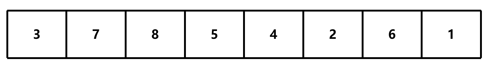
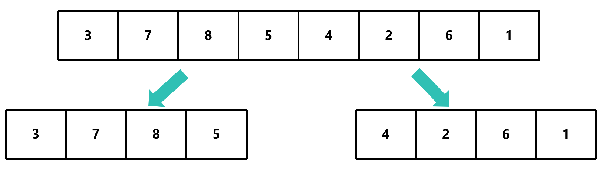
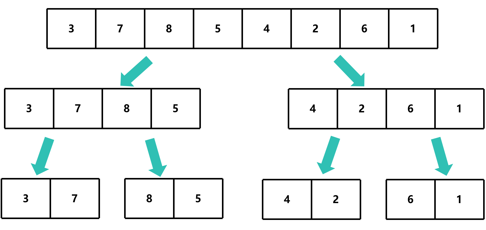
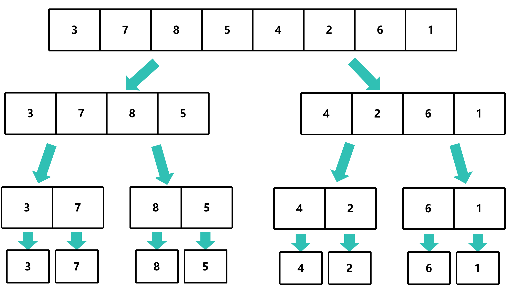
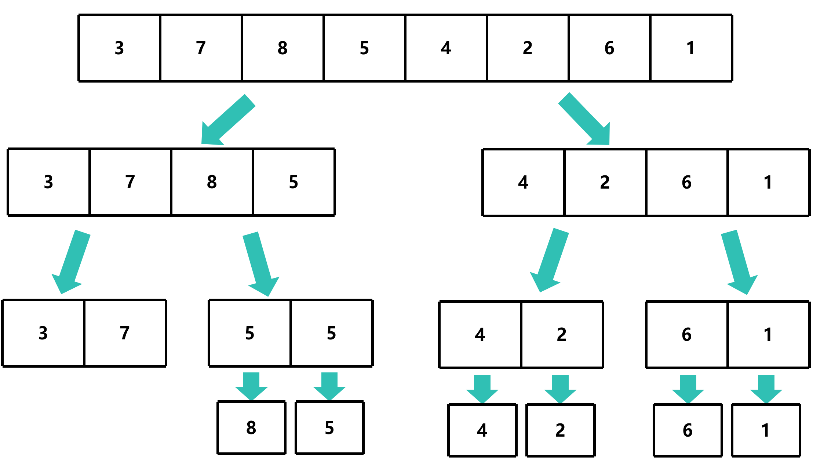
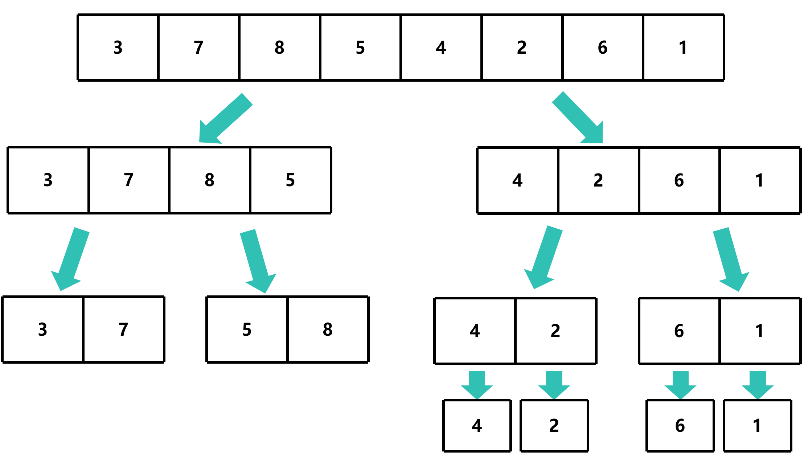
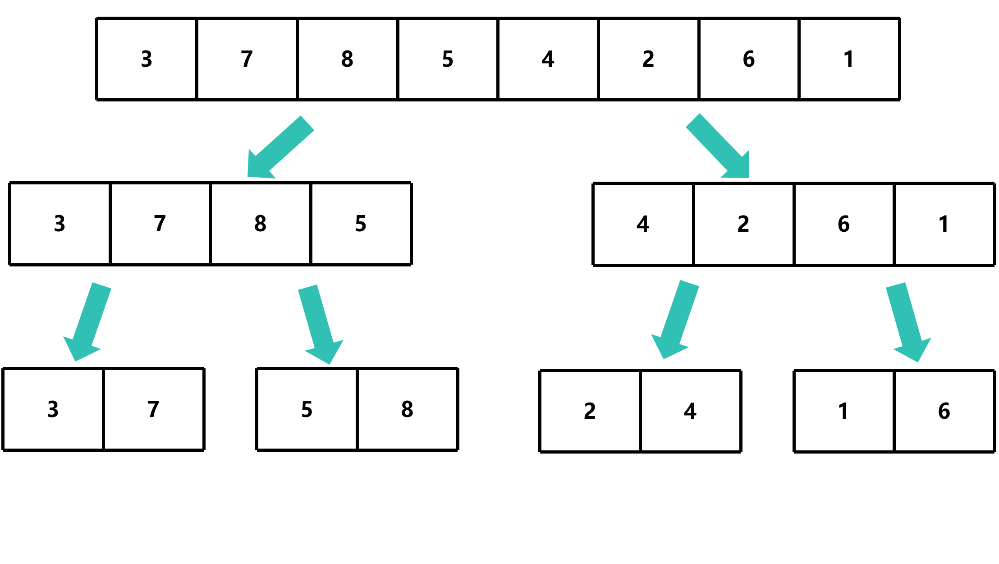
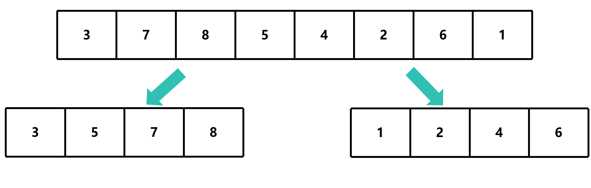
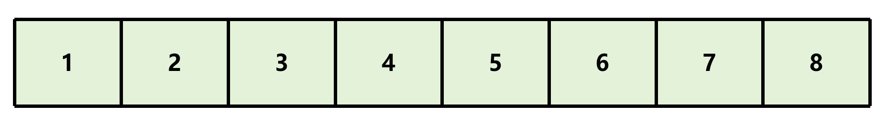

# 归并排序

## 简介

归并排序（Merge Sort）是一种基于分治思想的排序算法，其核心思想是将待排序的数组分成若干个子数组，然后对每个子数组进行排序，最后将排序后的子数组合并成一个有序数组

## 算法步骤



1. 将待排序数组分成两个子数组



2. 继续将每个子数组分成两个子数组，直到每个子数组只有一个元素




3. 对每个子数组进行排序，然后将排序后的子数组合并成一个有序数组






4. 重复步骤3，直到所有子数组都被合并成一个有序数组




归并排序的时间复杂度为O(n log n)，其中n为待排序数组的长度

## 实现

```c
void merge_sort(int *arr, int left, int right);
void merge(int *arr, int left1, int right1, int left2, int right2);
```

- `merge_sort`：递归函数，用于将数组分成两个子数组，并对每个子数组进行排序
    - `arr`：待排序数组
    - `left`：左边界
    - `right`：右边界
    - 左边界和右边界表示待排序数组的范围

- `merge`：用于将两个有序数组合并成一个有序数组
    - `arr`：待排序数组
    - `left1`：**左**子数组的左边界
    - `right1`：**左**子数组的右边界
    - `left2`：**右**子数组的左边界
    - `right2`：**右**子数组的右边界
    - 左边界和右边界表示待排序数组的范围
    - 中间位置表示左右两个子数组的分界点

### 计算数组长度

数组的长度为 `right - left + 1`

```c
void merge_sort(int *arr, int left, int right)
{
    int len = right - left + 1; // 计算数组长度
}
```

### 设置基准条件

基准条件是指递归的终止条件，当数组长度小于等于1时 (即 `len <= 1`)，直接返回

```c
void merge_sort(int *arr, int left, int right)
{
    int len = right - left + 1; // 计算数组长度
    if (len <= 1) return; // 基准条件
}
```

### 计算中间位置

中间位置为 `(left + right) / 2`，用于**拆分数组**

```c
void merge_sort(int *arr, int left, int right)
{
    int len = right - left + 1; // 计算数组长度
    if (len <= 1) return; // 基准条件

    int mid = (left + right) / 2; // 计算中间位置
}
```

### 递归调用

- 左子数组：`left` 到 `mid`
- 右子数组：`mid + 1` 到 `right`

```c
void merge_sort(int *arr, int left, int right)
{
    int len = right - left + 1; // 计算数组长度
    if (len <= 1) return; // 基准条件

    int mid = (left + right) / 2; // 计算中间位置

    // 递归调用
    merge_sort(arr, left, mid); // 左子数组
    merge_sort(arr, mid + 1, right); // 右子数组
}
```

### 合并数组

#### 计算左右子数组的长度

```c
void merge(int *arr, int left1, int right1, int left2, int right2)
{
    int len1 = right1 - left1 + 1; // 左子数组长度
    int len2 = right2 - left2 + 1; // 右子数组长度
}
```

- `len1`：左子数组长度
- `len2`：右子数组长度

#### 分配内存

```c
void merge(int *arr, int left1, int right1, int left2, int right2)
{
    int len1 = right1 - left1 + 1; // 左子数组长度
    int len2 = right2 - left2 + 1; // 右子数组长度

    int *left_arr = malloc(len1 * sizeof(int)); // 分配内存
    int *right_arr = malloc(len2 * sizeof(int)); // 分配内存

    memcpy(left_arr, arr + left1, len1 * sizeof(int)); // 复制左子数组
    memcpy(right_arr, arr + left2, len2 * sizeof(int)); // 复制右子数组
}
```

- `left_arr`：左子数组
- `right_arr`：右子数组

#### 设置三个指针

- `i`：左子数组指针
- `j`：右子数组指针
- `k`：合并数组指针

```c
void merge(int *arr, int left1, int right1, int left2, int right2)
{
    int len1 = right1 - left1 + 1; // 左子数组长度
    int len2 = right2 - left2 + 1; // 右子数组长度

    int *left_arr = malloc(len1 * sizeof(int)); // 分配内存
    int *right_arr = malloc(len2 * sizeof(int)); // 分配内存

    memcpy(left_arr, arr + left1, len1 * sizeof(int)); // 复制左子数组
    memcpy(right_arr, arr + left2, len2 * sizeof(int)); // 复制右子数组

    int i = 0, j = 0, k = left1; // 初始化指针
}
```

#### 合并两个有序数组

##### 遍历两个子数组

```c
void merge(int *arr, int left1, int right1, int left2, int right2)
{
    int len1 = right1 - left1 + 1; // 左子数组长度
    int len2 = right2 - left2 + 1; // 右子数组长度

    int *left_arr = malloc(len1 * sizeof(int)); // 分配内存
    int *right_arr = malloc(len2 * sizeof(int)); // 分配内存

    memcpy(left_arr, arr + left1, len1 * sizeof(int)); // 复制左子数组
    memcpy(right_arr, arr + left2, len2 * sizeof(int)); // 复制右子数组

    int i = 0, j = 0, k = left1; // 初始化指针

    while (i < len1 && j < len2) {    } // 遍历两个子数组
}
```

##### 比较两个子数组的元素

```c
void merge(int *arr, int left1, int right1, int left2, int right2)
{
    int len1 = right1 - left1 + 1; // 左子数组长度
    int len2 = right2 - left2 + 1; // 右子数组长度

    int *left_arr = malloc(len1 * sizeof(int)); // 分配内存
    int *right_arr = malloc(len2 * sizeof(int)); // 分配内存

    memcpy(left_arr, arr + left1, len1 * sizeof(int)); // 复制左子数组
    memcpy(right_arr, arr + left2, len2 * sizeof(int)); // 复制右子数组

    int i = 0, j = 0, k = left1; // 初始化指针

    while (i < len1 && j < len2) // 遍历两个子数组
    {
        if (left_arr[i] <= right_arr[j]) // 比较两个子数组的元素
        {
            arr[k++] = left_arr[i++]; // 将较小的元素复制到合并数组
        }
        else
        {
            arr[k++] = right_arr[j++]; // 将较小的元素复制到合并数组
        }
    }
}
```

##### 复制剩余的元素

如果有一个子数组的元素已经全部复制到合并数组中，那么另一个子数组的剩余元素也需要复制到合并数组中

```c
void merge(int *arr, int left1, int right1, int left2, int right2)
{
    int len1 = right1 - left1 + 1; // 左子数组长度
    int len2 = right2 - left2 + 1; // 右子数组长度

    int *left_arr = malloc(len1 * sizeof(int)); // 分配内存
    int *right_arr = malloc(len2 * sizeof(int)); // 分配内存

    memcpy(left_arr, arr + left1, len1 * sizeof(int)); // 复制左子数组
    memcpy(right_arr, arr + left2, len2 * sizeof(int)); // 复制右子数组

    int i = 0, j = 0, k = left1; // 初始化指针

    while (i < len1 && j < len2) // 遍历两个子数组
    {
        if (left_arr[i] <= right_arr[j]) // 比较两个子数组的元素
        {
            arr[k++] = left_arr[i++]; // 将较小的元素复制到合并数组
        }
        else
        {
            arr[k++] = right_arr[j++]; // 将较小的元素复制到合并数组
        }
    }

    while (i < len1) // 复制剩余的元素
    {
        arr[k++] = left_arr[i++]; // 将剩余的元素复制到合并数组
    }
    while (j < len2) // 复制剩余的元素
    {
        arr[k++] = right_arr[j++]; // 将剩余的元素复制到合并数组
    }

    // 释放内存
    free(left_arr);
    free(right_arr);
}
```

#### 调用函数

```c
void merge_sort(int *arr, int left, int right)
{
    int len = right - left + 1; // 计算数组长度
    if (len <= 1) return; // 基准条件

    int mid = (left + right) / 2; // 计算中间位置

    // 递归调用
    merge_sort(arr, left, mid); // 左子数组
    merge_sort(arr, mid + 1, right); // 右子数组

    // 合并数组
    merge(arr, left, mid, mid + 1, right); // 合并数组
}
```