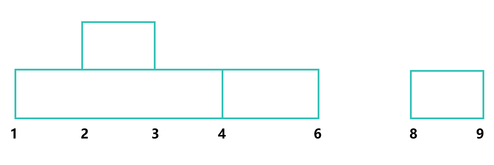
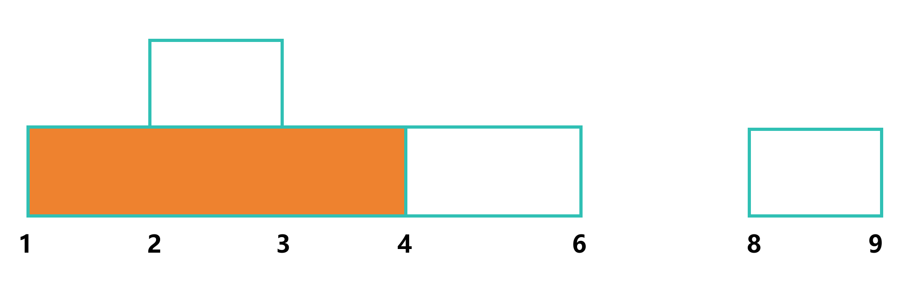
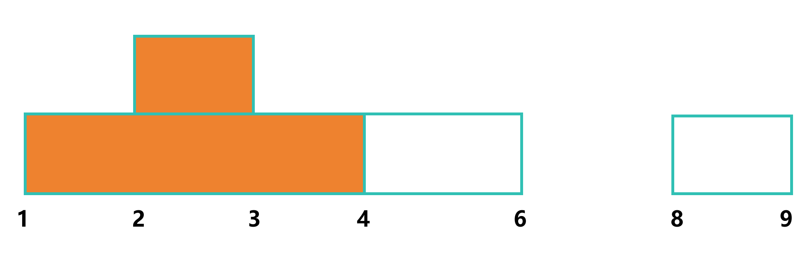
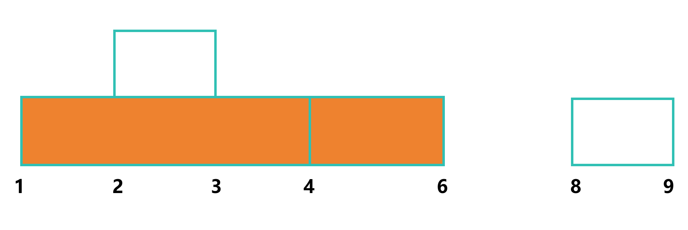
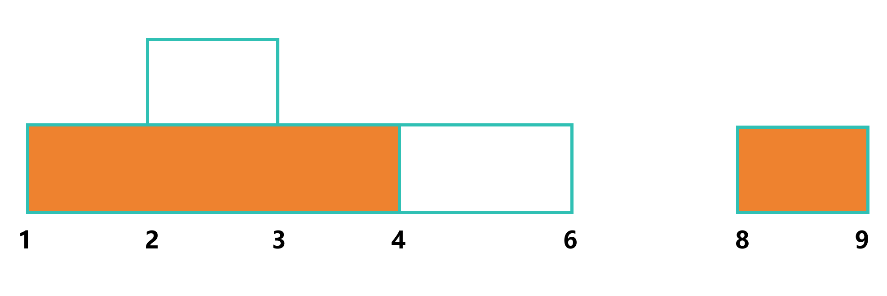
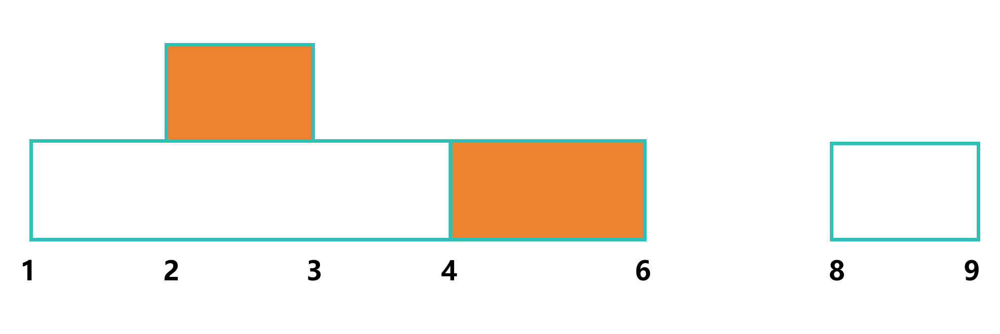
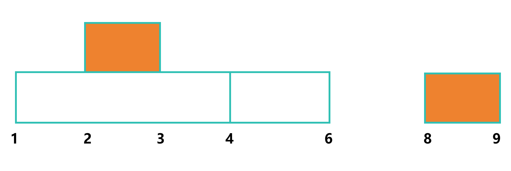

# 不相交区间

## 问题描述

给定一个拥有 n 个区间的列表，找出最大不连续子集的区间数量

区间定义

```c
typedef struct {
    int start;
    int end;
} Interval;
```

## 模拟

假设列表为 `[[1, 4], [2, 3], [4, 6], [8, 9]]`



我们先选择 `[1, 4]` 这个区间



尝试选择 `[2, 3]` 这个区间，发现它和 `[1, 4]` 有交集，因此无法选择



尝试选择 `[4, 6]` 这个区间，发现它和 `[1, 4]` 有交集，因此无法选择



尝试选择 `[8, 9]` 这个区间，发现它和 `[1, 4]` 无交集，因此可以选择



以此类推，我们可以得到所有不相交的区间，如 `[2, 3], [4, 6]`, `[2, 3], [8, 9]`




## 规则总结

从上面的例子可以看出，如果区间的右端点越小或者左端点越大，则该区间的不连续的可能性越大

但如果左右端点都大的话，也可能会有相交的情况如 `[4, 6], [2, 10]`, 所以我们只考虑右端点越小的情况

因此我们可以按照右端点从小到大排序，然后依次选择不相交的区间，直到所有区间都被选择完。

## 代码实现

```c
static int cmp(const void *a, const void *b) // qsort 的比较函数
{
    Interval *interval_a = (Interval *)a;
    Interval *interval_b = (Interval *)b;
    if (interval_a->end == interval_b->end)
        return interval_a->start - interval_b->start; // 右端点相同则按照左端点排序

    return interval_a->end - interval_b->end; // 右端点不同则按照右端点排序
}

int maxNonOverlapping(Interval *intervals, int n)
{
    qsort(intervals, n, sizeof(Interval), cmp); // 按照右端点排序

    int count = 1; // 至少有一个区间
    int end = intervals[0].end; // 记录当前选择的区间的右端点

    for (int i = 0; i < n; i++)
    {
        if (intervals[i].start > end) // 选择的区间和当前选择的区间无交集
        {
            count++; // 计数加一
            end = intervals[i].end; // 更新当前选择的区间的右端点
        }
    }

    return count; // 返回不相交的区间数量
}
```

[完整代码](intervals.c)