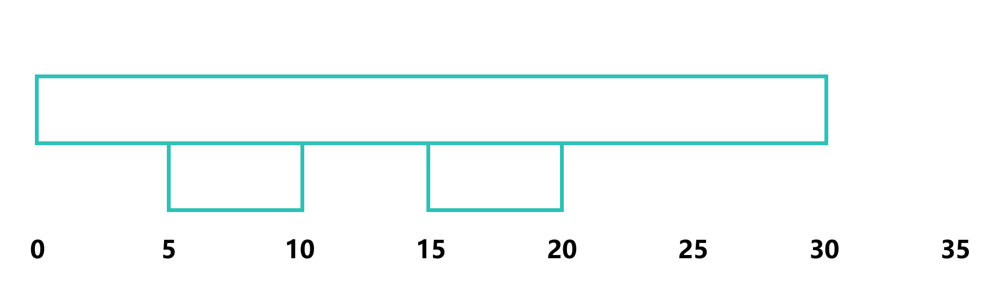
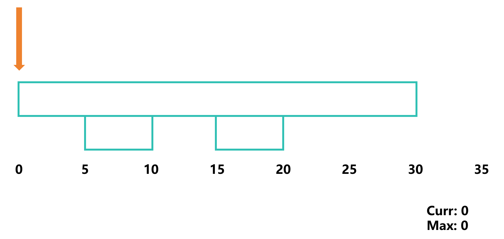
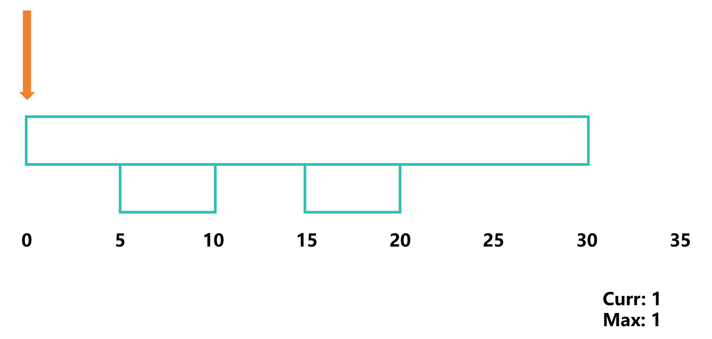
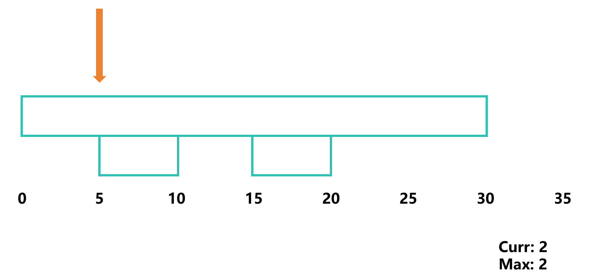
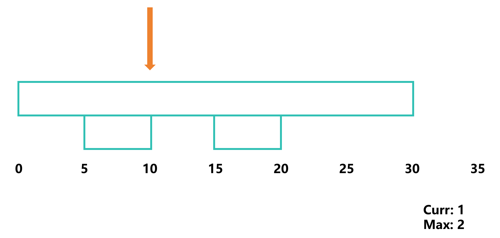
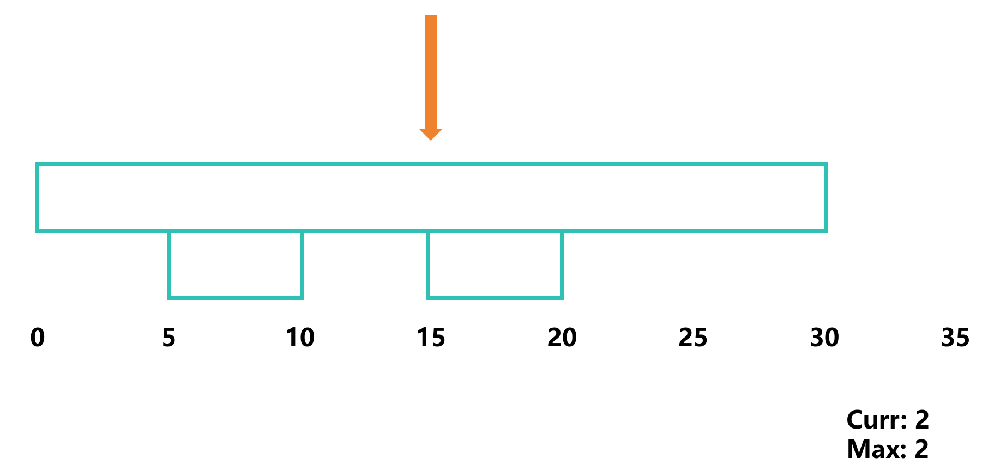
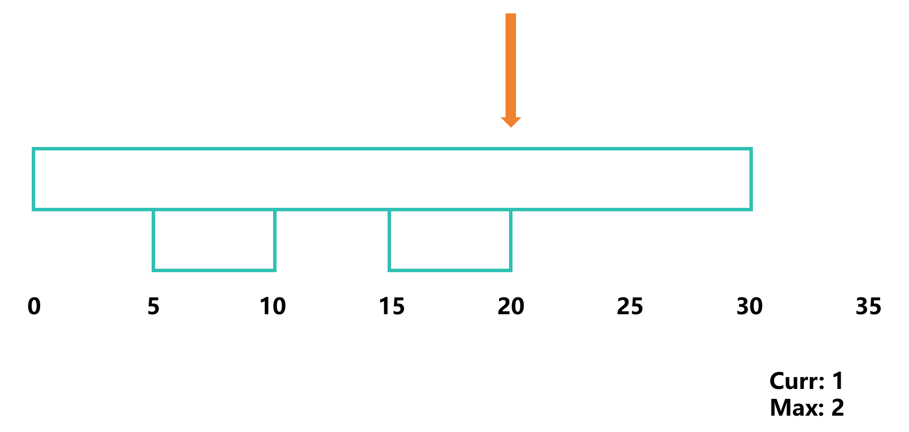

# 最少会议室数量

## 题目描述

给定一系列会议时间区间，求所需的最少会议室数量，使得所有会议都能顺利进行，即找出同一时刻最多有多少个会议重叠

### 输入输出

- `[[5, 10], [15, 20], [0, 30]]`：输出`2`

## 模拟

假设给定 `[[5, 10], [15, 20], [0, 30]]`



初始一个指针指向 0



此时只有一个会议，所以最少需要一个会议室



指针指向 5，此时有两个会议，所以最少需要两个会议室



指针指向 10，此时有一个会议，所以最少需要两个会议室



指针指向 15，此时有两个会议，所以最少需要两个会议室



指针指向 20，此时有一个会议，所以最少需要两个会议室



## 规则总结

通过上面的例子可以发现，我们只注意哪个时间点会议室数目发生变化即可 (即 `0, 5, 10, 15, 20, 30`)，然后根据这个变化取最大值即可

## 代码实现

我们可以设计一个元组，开始时间与 `1` 组成，结束时间与 `-1` 组成，然后排序

```c
static int cmp(const void *a, const void *b)
{
    int *x = (int *)a;
    int *y = (int *)b;
    if (x[0] != y[0]) return x[0] - y[0]; // 如果时间不同，则按照时间排序
    return x[1] - y[1]; // 如果时间相同，则按照类型排序，结束时间在前面
}

int minMeetingRooms(int (*intervals)[2], int n)
{
    int curr = 0;
    int res = 0;
    int list[n * 2][2];

    /* 开始时间 */
    for (int i = 0; i < n; i++)
    {
        list[i][0] = intervals[i][0];
        list[i][1] = 1; // 需要额外一个会议室
    }

    /* 结束时间 */
    for (int i = 0; i < n; i++)
    {
        list[i + n][0] = intervals[i][1];
        list[i + n][1] = -1; // 可以减少一个会议室
    }
    
    qsort(list, n * 2, sizeof(list[0]), cmp);

    for (int i = 0; i < n * 2; i++)
    {
        curr += list[i][1];
        if (curr > res)
            res = curr;
    }

    return res;
}
```

[完整代码](meeting_rooms.c)