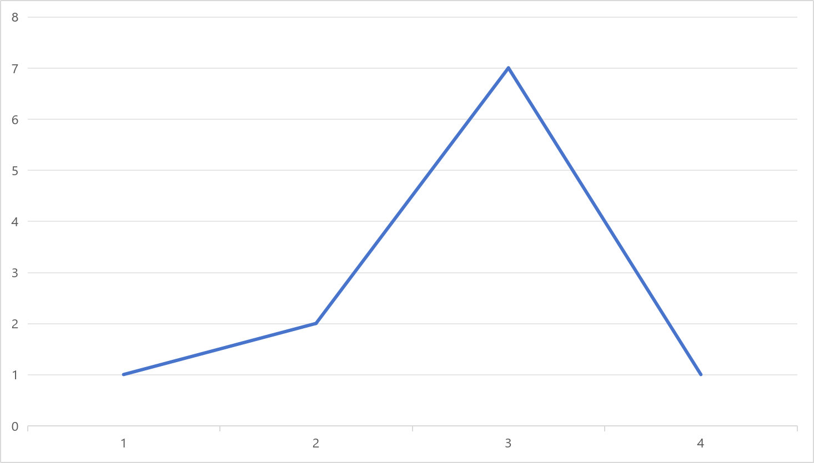
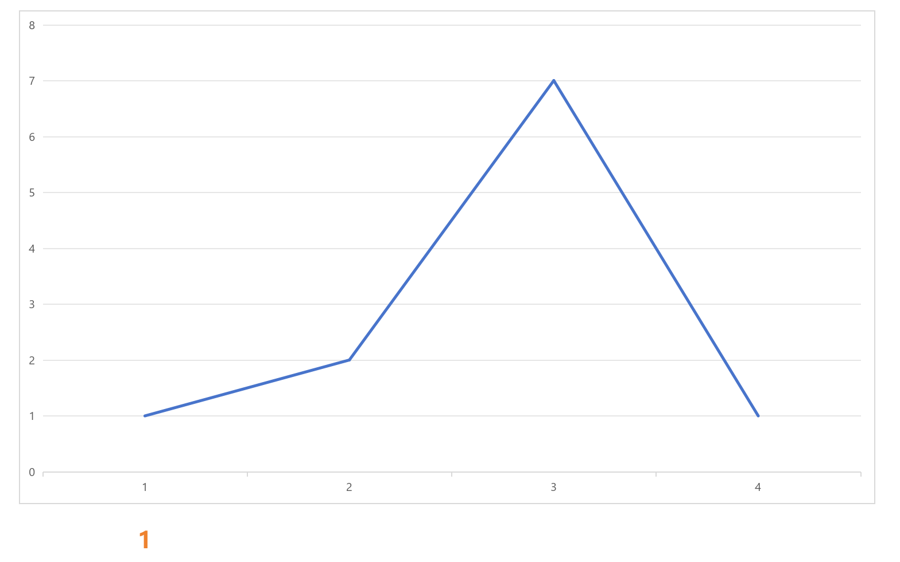
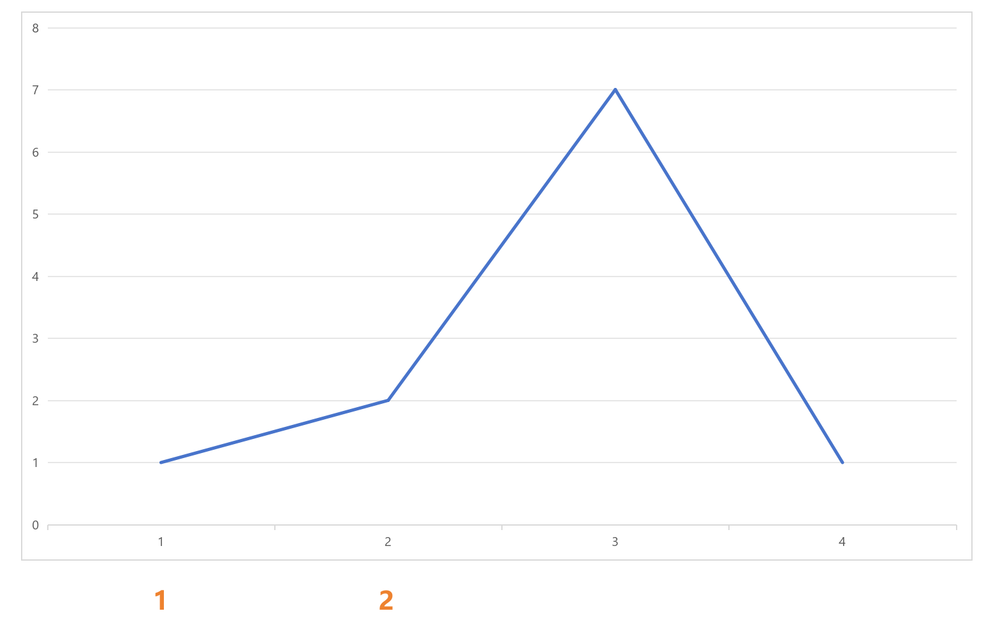
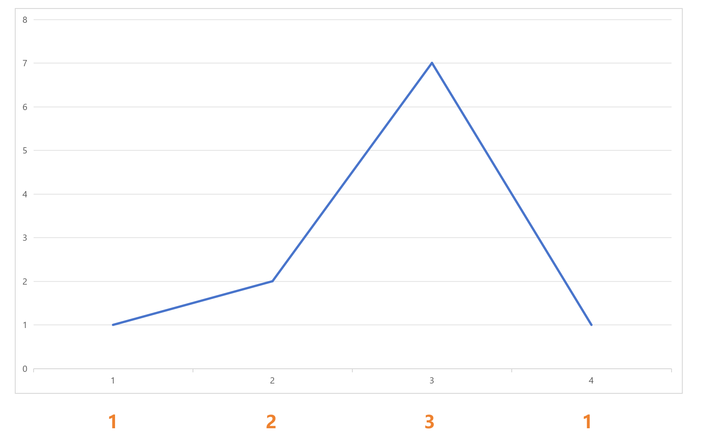

# 分发糖果

## 题目描述

给定每个孩子的评分，要求每个孩子至少一颗糖，且评分高的孩子比相邻评分低的孩子得到更多糖果，求最少需要的糖果总数

### 输入输出

- `[1, 2, 7, 1]`，输出 `7`
    - 解释：`[1, 2, 3, 1]`

## 模拟

假设给定 `[1, 2, 7, 1]`



我们首先给第一个孩子一个糖果



由于第二个孩子的评分比第一个孩子高

我们可以给第二个孩子三个甚至四个糖果，但为了取最小值，这里只给两个糖果



由于第三个孩子的评分比第二个和第四个孩子高

且第二个孩子获得两个糖果

所以我们给第三个孩子三个糖果


由于第四个孩子评分最低

所以我们给第四个孩子一个糖果



但是，这样单向遍历会导致问题，假设给定 `[1, 7, 4, 3, 1]`，得出的结果是 `[1, 2, 1, 1, 1]`，这显然是错误的

所以我们需要考虑到每个孩子的相邻评分，以及每个孩子的糖果数量

## 算法

1. 初始化一个糖果数组 `candies`，全部设为 `1`
2. 从左到右遍历，如果当前孩子评分比左边高，则 `candies[i] = candies[i-1] + 1`
3. 从右到左遍历，如果当前孩子评分比右边高，则 `candies[i] = max(candies[i], candies[i+1] + 1)`
4. 最后返回 `sum(candies)`

## 代码实现

```c
#define max(a, b) ((a) > (b) ? (a) : (b))
int distributeCandies(int *ratings, int ratingsSize)
{
    int candies[ratingsSize];
    for (int i = 0; i < ratingsSize; i++) candies[i] = 1;

    for (int i = 1; i < ratingsSize; i++) // 从左到右遍历
    {
        if (ratings[i] > ratings[i-1]) // 如果当前孩子评分比左边高
            candies[i] = candies[i-1] + 1;
    }

    for (int i = ratingsSize - 2; i >= 0; i--) // 从右到左遍历
    {
        if (ratings[i] > ratings[i+1]) // 如果当前孩子评分比右边高
            candies[i] = max(candies[i], candies[i+1] + 1);
    }

    int sum = 0;
    for (int i = 0; i < ratingsSize; i++) sum += candies[i];
    return sum;
}
```

[完整代码](distribute_candies.c)