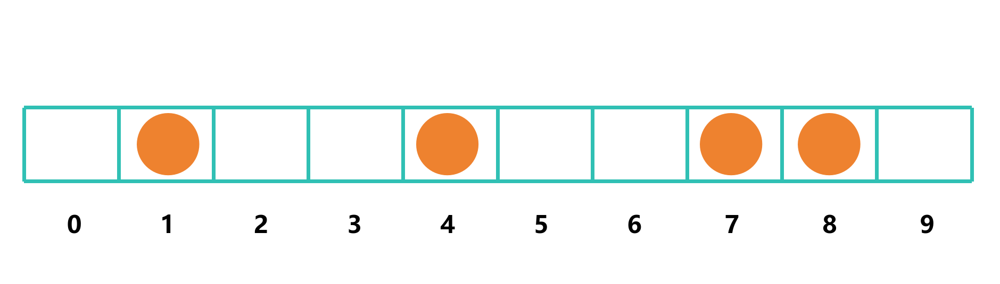
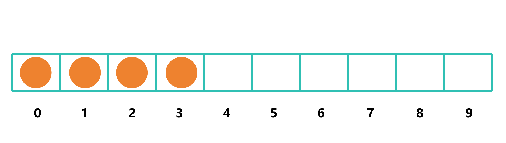
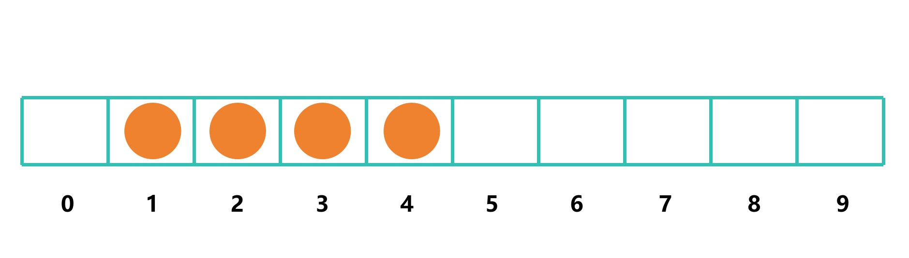
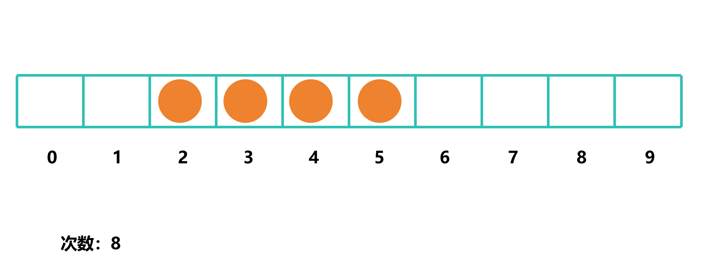
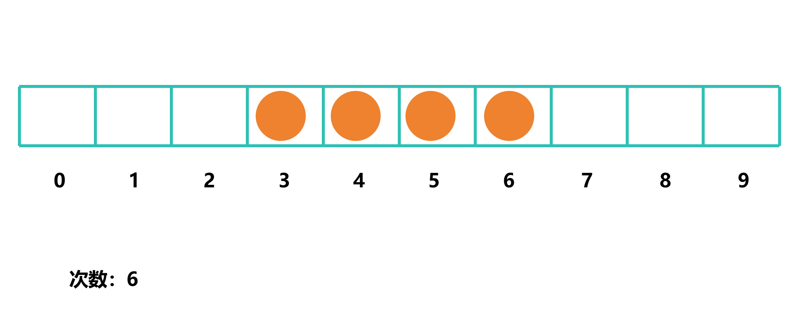
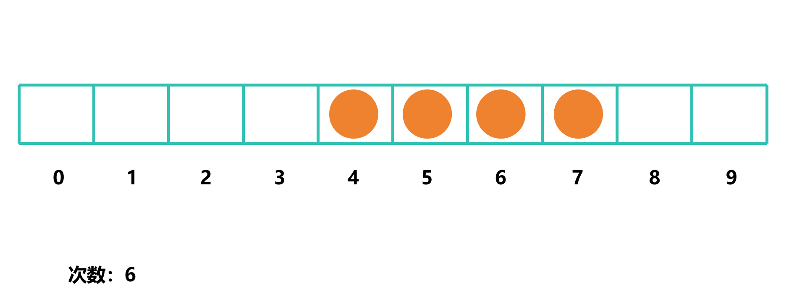
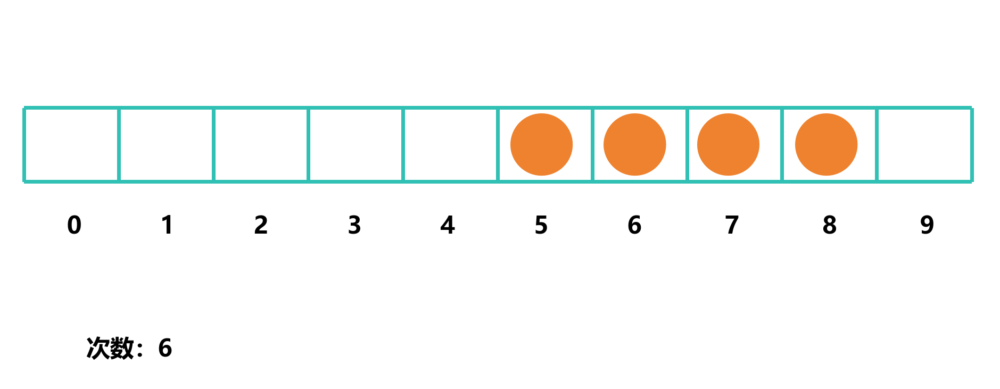
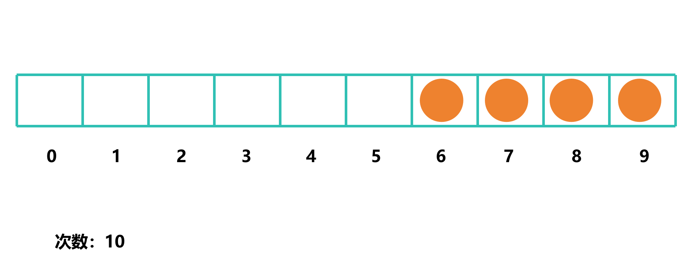

# 最小移动次数

## 题目描述

给定一个由 '.' 和 'x' 组成的字符串，每次可以将一个 'x' 移动到相邻的空位（相当于相邻交换），求使所有 'x' 连续（即连成一段）所需的最少移动次数

## 示例

- 输入：`...x..x.`
- 输出：`2`
- 原因：可以是 `...xx...` 或 `....xx.`，移动次数均为 `2`

## 模拟

假设给定 `.x..x..xx.`



由于题目要求我们移动所有 'x' 连续，我们可以把所有 `x` 移到最左边，这样可以使得 `x` 连续



这里移动了 14 次

但这样并不能保证得到最优解，因为我们并没有考虑到 `x` 之间的距离

那我们可以考虑从某个的索引开始，例如 1



这里移动了 10 次

可以发现，移动次数减少了 4

我们继续尝试，直到最右边







## 发现

通过上面的例子可以发现，当连续 `x` 的位置越靠中间，移动次数越少

### 那么究竟是取什么值才是最优解呢？

假设给定 `xx..xx....xxx`

我们尝试取 `x` 索引的平均数，即 `6`

那么移动次数为 `17`

我们尝试取 `x` 索引的中位数，即 `5`

那么移动次数为 `16`

可以发现，取 `x` 索引的中位数比取平均数的移动次数少 `1`

因此，我们可以取 `x` 索引的中位数作为最优解

这样就可以使得 `x` 连续，且移动次数最少

## 代码实现

```c
#define abs(x)((x) < 0 ? (x) * -1 : (x)) // 绝对值

int minMoves(char *s)
{
    int size = strlen(s);
    int x_count = 0;
    int x_index[size];

    for (int i = 0; i < size; i++)
    {
        if (s[i] == 'x' || s[i] == 'X') // 不区分大小写
            x_index[x_count++] = i;
    }

    int mid = x_index[x_count / 2]; // 中位数

    int moves = 0;
    int start_pos = mid - x_count / 2; // 计算连续x的起始位置
    for (int i = 0; i < x_count; i++)
    {
        int x_pos = x_index[i];
        moves += abs(x_pos - start_pos); // 计算移动次数
        start_pos++; // 移动到下一个位置
    }

    return moves;
}
```

[完整代码](min_moves.c)