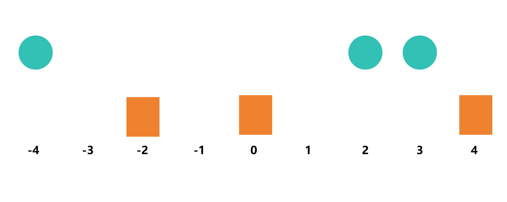
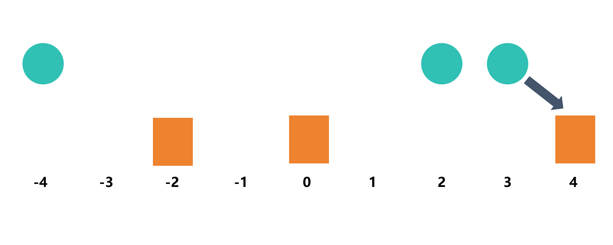
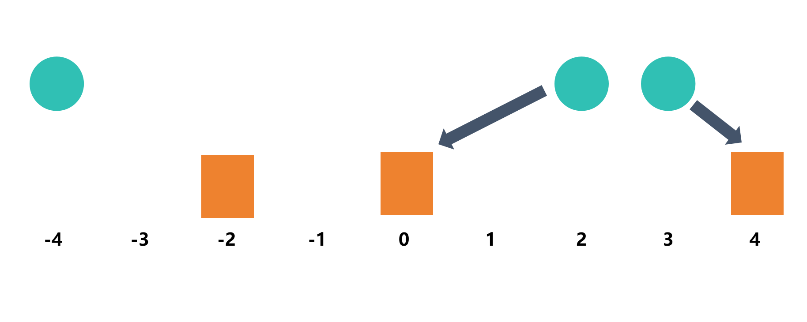
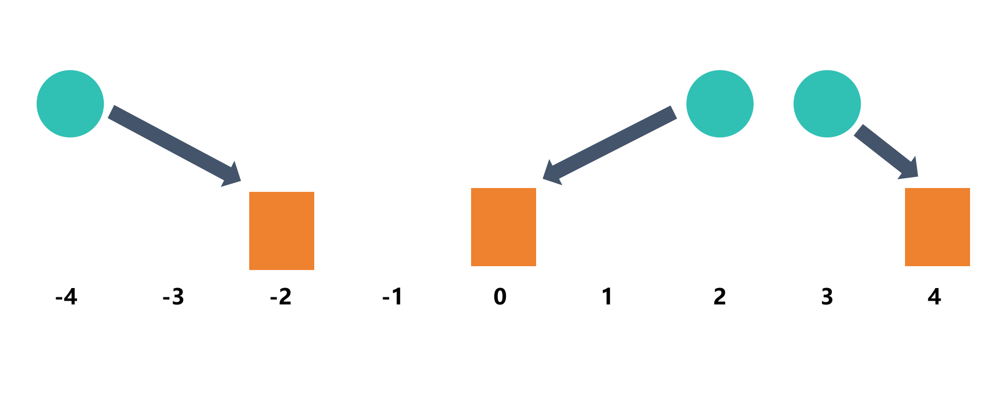
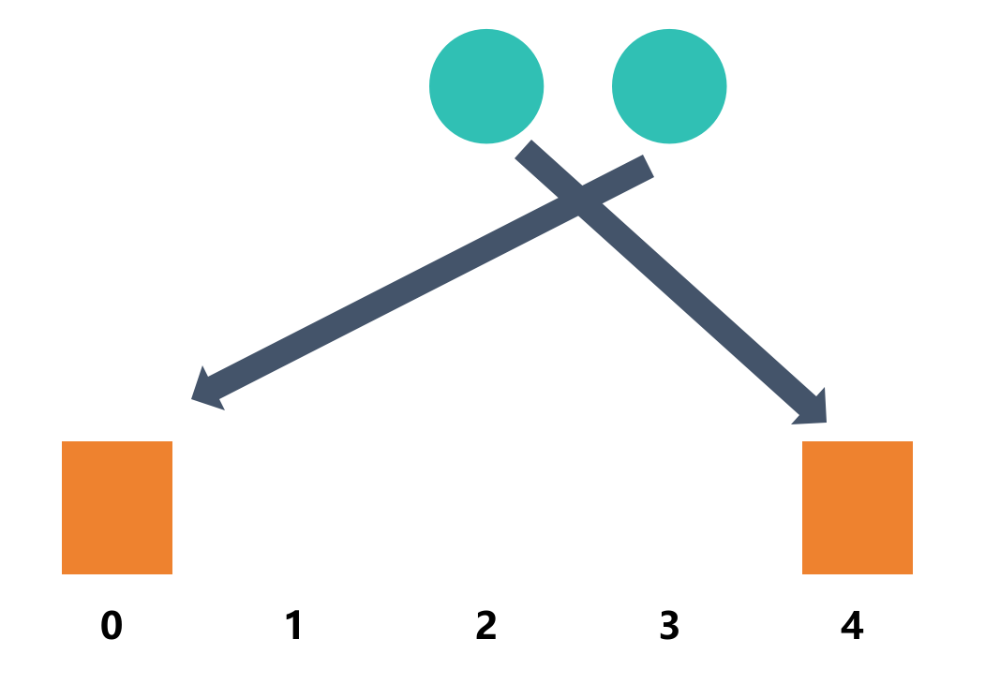
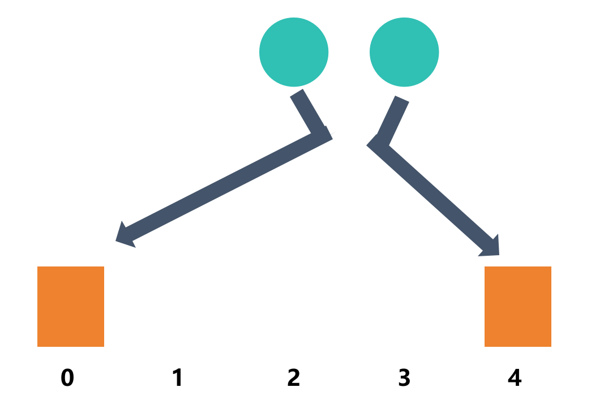

# 老鼠与洞

## 问题描述

有N只老鼠和N个洞，老鼠每分钟移到1单位，求所有老鼠进入洞的最小时间

输入是两个数组，分别是老鼠位置和洞位置

### 示例

- 老鼠：`[3, 2, -4]`
- 洞：`[0, -2, 4]`
- 输出：`2

## 模拟

假设给定老鼠 `[3, 2, -4]` 和洞 `[0, -2, 4]`



为了能让时间尽可能的小，我们应该让每只老鼠去**离它最近的洞**

离第1只老鼠最近的洞是第3个洞，让它去第3个洞



离第2只老鼠最近的洞是第1个洞，让它去第1个洞



离第3只老鼠最近的洞是第2个洞，让它去第2个洞



这样是不是最优解呢？我们可以证明：老鼠之间是否可以交叉入洞呢？

这里假设第1只和第2只交叉



我们可以这样看，从中间拆分



可以发现，这样会让老鼠走更多的路，所以不可以交叉入洞

## 算法

我们可以使用贪心算法来解决这个问题

即将老鼠和洞进行升序排序，然后依次遍历算出老鼠与洞的距离，并记录最大距离的洞的位置，这样就可以得到所有老鼠进入洞的最小时间

## 代码实现

```c
#define abs(x) ((x) > 0 ? (x) : (-(x)))

static int cmp(const void* a, const void* b)
{
    return (*(int*)a - *(int*)b);
}

int minTime(int* mice, int* holes, int n)
{
    /* 对数组进行排序 */ 
    qsort(mice, n, sizeof(int), cmp);
    qsort(holes, n, sizeof(int), cmp);

    int max_distance = 0;

    for (int i = 0; i < n; i++)
    {
        int distance = abs(mice[i] - holes[i]); // 计算老鼠与洞的距离
        if (distance > max_distance)
            max_distance = distance;
    }

    return max_distance;
}
```